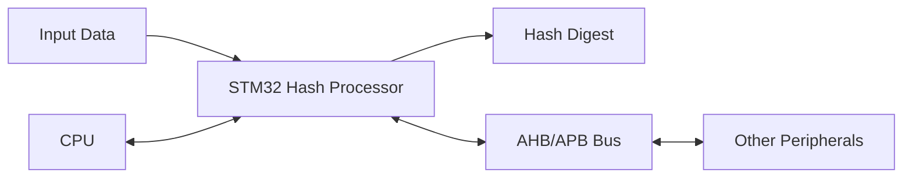

# STM32 Hash Processor

## Introduction

The STM32 Hash Processor is a dedicated hardware peripheral found in many advanced STM32 microcontrollers that performs cryptographic hash functions without burdening the main CPU. Hash functions are essential cryptographic algorithms that transform input data of arbitrary length into fixed-size output values (hash digests). These functions play a crucial role in data integrity verification, digital signatures, and secure communications.

In resource-constrained embedded systems, performing complex cryptographic operations in software can be prohibitively slow and energy-intensive. The STM32's hardware Hash Processor solves this problem by offering hardware acceleration for popular hash algorithms, enabling secure applications even on microcontrollers with limited computational resources.

## Hash Algorithms Supported

Depending on the specific STM32 family, the Hash Processor typically supports:

- MD5 (Message Digest 5) - 128-bit output
- SHA-1 (Secure Hash Algorithm 1) - 160-bit output
- SHA-2 family:
  - SHA-224 - 224-bit output
  - SHA-256 - 256-bit output

Some advanced STM32 models also support:
- SHA-384 - 384-bit output
- SHA-512 - 512-bit output

## How the STM32 Hash Processor Works

The Hash Processor operates as a peripheral that:

1. Accepts input data in blocks
2. Processes this data using the selected hash algorithm
3. Produces a fixed-length hash digest
4. Can generate interrupts upon completion



## Key Features

- Hardware acceleration for cryptographic hash algorithms
- DMA support for efficient data transfer
- Interrupt generation capability
- Support for HMAC (Hash-based Message Authentication Code)
- Low power consumption compared to software implementations
- High throughput for security-critical applications

## Setting Up the Hash Processor

### Prerequisites

Before using the Hash Processor, you'll need:

1. An STM32 microcontroller with the Hash Processor peripheral (common in F2, F4, F7, H7, and L4+ series)
2. STM32CubeMX or equivalent tool for configuration
3. HAL (Hardware Abstraction Layer) libraries for your STM32 device

### Enabling the Hash Processor

First, you need to enable the Hash Processor and its clock:

```c
// Enable HASH peripheral clock
__HAL_RCC_HASH_CLK_ENABLE();
```

## Basic Usage with HAL Library

The STM32 HAL library provides functions to work with the Hash Processor. Here's how to calculate a SHA-256 hash of a message:

```c
#include "stm32f4xx_hal.h"

HASH_HandleTypeDef hhash;
uint8_t data[] = "Hello, STM32 Hash Processor!";
uint8_t digest[32]; // SHA-256 produces a 32-byte (256-bit) digest

void Hash_Init(void) {
  // Initialize HASH peripheral
  hhash.Init.DataType = HASH_DATATYPE_8B;
  HAL_HASH_Init(&hhash);
}

void Calculate_SHA256(void) {
  // Reset the HASH processor core
  HAL_HASH_DeInit(&hhash);
  
  // Initialize for SHA-256
  hhash.Init.DataType = HASH_DATATYPE_8B;
  hhash.Init.pKey = NULL;
  HAL_HASH_Init(&hhash);
  
  // Configure algorithm
  HAL_HASH_ConfigDigest(&hhash, HASH_ALGOSELECTION_SHA256);
  
  // Start hash computation
  HAL_HASH_Start(&hhash, (uint8_t*)data, sizeof(data) - 1, digest, HAL_MAX_DELAY);
  
  // Digest now contains the SHA-256 hash of the input data
}
```

### Expected Output

If you were to print the `digest` array as hexadecimal, you'd get something like:
```
0xA3, 0x28, 0xAC, 0xEC, 0x38, 0x84, 0x89, 0x04, 0x83, 0xC5, 0xD5, 0xF9, 0x86, 0x6B, 0x65, 0x38,
0x76, 0xCF, 0x05, 0x16, 0x91, 0xCF, 0xF9, 0x9F, 0x19, 0xB4, 0x70, 0x3A, 0x64, 0xBF, 0x30, 0xEF
```

## Processing Large Data Buffers

For data that doesn't fit in memory at once, you can use the multi-step approach:

```c
void Hash_Large_Buffer(uint8_t* buffer, uint32_t size) {
  // Initialize hash processor
  HAL_HASH_DeInit(&hhash);
  hhash.Init.DataType = HASH_DATATYPE_8B;
  HAL_HASH_Init(&hhash);
  HAL_HASH_ConfigDigest(&hhash, HASH_ALGOSELECTION_SHA256);
  
  // Start accumulating hash in multi-buffer mode
  HAL_HASH_Start_IT(&hhash, buffer, size, NULL, 0);
  
  // Wait for completion
  while (HAL_HASH_GetState(&hhash) != HAL_HASH_STATE_READY) {
    // You can implement timeout or yield to RTOS here
  }
  
  // Get the digest
  uint8_t digest[32];
  HAL_HASH_GetDigest(&hhash, digest, HAL_MAX_DELAY);
}
```

## Using DMA for Efficient Data Transfer

For optimal performance, especially with large datasets, you can use DMA:

```c
void Hash_With_DMA(uint8_t* buffer, uint32_t size) {
  // Initialize hash processor
  HAL_HASH_DeInit(&hhash);
  hhash.Init.DataType = HASH_DATATYPE_8B;
  HAL_HASH_Init(&hhash);
  HAL_HASH_ConfigDigest(&hhash, HASH_ALGOSELECTION_SHA256);
  
  // Start hash computation with DMA
  HAL_HASHEx_SHA256_Start_DMA(&hhash, buffer, size);
  
  // The function will return immediately, and an interrupt will be generated when done
  // You'll need to implement the HAL_HASH_DMAXferCpltCallback() function
}

// Callback function
void HAL_HASH_DMAXferCpltCallback(HASH_HandleTypeDef *hhash) {
  uint8_t digest[32];
  HAL_HASH_GetDigest(hhash, digest, HAL_MAX_DELAY);
  
  // Now you can use the digest
  // Process_Digest(digest);
}
```

## Implementing HMAC (Hash-based Message Authentication Code)

HMAC provides authentication along with integrity. Here's how to use HMAC-SHA256:

```c
void HMAC_SHA256_Example(void) {
  uint8_t key[] = "MySecretKey12345678";
  uint8_t data[] = "Message to authenticate";
  uint8_t hmac[32];
  
  // Initialize HMAC
  HAL_HASH_DeInit(&hhash);
  hhash.Init.DataType = HASH_DATATYPE_8B;
  hhash.Init.pKey = key;
  hhash.Init.KeySize = sizeof(key) - 1;
  HAL_HASH_Init(&hhash);
  
  // Configure for HMAC-SHA256
  HAL_HASH_ConfigDigest(&hhash, HASH_ALGOSELECTION_SHA256);
  
  // Start HMAC computation
  HAL_HASHEx_HMAC_Start(&hhash, (uint8_t*)data, sizeof(data) - 1, hmac, HAL_MAX_DELAY);
  
  // hmac now contains the HMAC-SHA256 of the data with the given key
}
```

## Real-World Applications

### 1. Firmware Integrity Verification

The Hash Processor can be used to verify the integrity of firmware updates before applying them:

```c
bool Verify_Firmware(uint8_t* firmware, uint32_t size, const uint8_t* expected_hash) {
  uint8_t calculated_hash[32];
  
  // Calculate hash of the firmware
  HAL_HASH_DeInit(&hhash);
  hhash.Init.DataType = HASH_DATATYPE_8B;
  HAL_HASH_Init(&hhash);
  HAL_HASH_ConfigDigest(&hhash, HASH_ALGOSELECTION_SHA256);
  HAL_HASH_Start(&hhash, firmware, size, calculated_hash, HAL_MAX_DELAY);
  
  // Compare with expected hash
  for (int i = 0; i < 32; i++) {
    if (calculated_hash[i] != expected_hash[i]) {
      return false; // Hash mismatch, firmware corrupted
    }
  }
  
  return true; // Hash matches, firmware is valid
}
```

### 2. Secure Communication Protocol

Implement a simple challenge-response authentication protocol:

```c
bool Authenticate_Device(uint8_t* shared_secret, uint8_t* challenge, uint8_t* response) {
  uint8_t expected_response[32];
  
  // Calculate HMAC of challenge using shared secret
  HAL_HASH_DeInit(&hhash);
  hhash.Init.DataType = HASH_DATATYPE_8B;
  hhash.Init.pKey = shared_secret;
  hhash.Init.KeySize = 16; // Assuming 16-byte secret
  HAL_HASH_Init(&hhash);
  HAL_HASH_ConfigDigest(&hhash, HASH_ALGOSELECTION_SHA256);
  HAL_HASHEx_HMAC_Start(&hhash, challenge, 32, expected_response, HAL_MAX_DELAY);
  
  // Compare with received response
  for (int i = 0; i < 32; i++) {
    if (expected_response[i] != response[i]) {
      return false; // Authentication failed
    }
  }
  
  return true; // Authentication successful
}
```

### 3. Password Storage

Secure way to store passwords using hashing:

```c
void Store_Password_Hash(const char* username, const char* password, uint8_t* salt) {
  uint8_t hash[32];
  char salted_password[100];
  
  // Combine password with salt
  sprintf(salted_password, "%s%s", password, salt);
  
  // Hash the salted password
  HAL_HASH_DeInit(&hhash);
  hhash.Init.DataType = HASH_DATATYPE_8B;
  HAL_HASH_Init(&hhash);
  HAL_HASH_ConfigDigest(&hhash, HASH_ALGOSELECTION_SHA256);
  HAL_HASH_Start(&hhash, (uint8_t*)salted_password, strlen(salted_password), hash, HAL_MAX_DELAY);
  
  // Store username, salt, and hash in secure storage
  // Store_User_Credentials(username, salt, hash);
}

bool Verify_Password(const char* username, const char* password) {
  uint8_t stored_salt[16];
  uint8_t stored_hash[32];
  
  // Retrieve stored salt and hash for this username
  // Get_User_Credentials(username, stored_salt, stored_hash);
  
  // Compute hash of provided password with the same salt
  char salted_password[100];
  sprintf(salted_password, "%s%s", password, stored_salt);
  
  uint8_t calculated_hash[32];
  HAL_HASH_DeInit(&hhash);
  hhash.Init.DataType = HASH_DATATYPE_8B;
  HAL_HASH_Init(&hhash);
  HAL_HASH_ConfigDigest(&hhash, HASH_ALGOSELECTION_SHA256);
  HAL_HASH_Start(&hhash, (uint8_t*)salted_password, strlen(salted_password), calculated_hash, HAL_MAX_DELAY);
  
  // Compare hashes
  for (int i = 0; i < 32; i++) {
    if (calculated_hash[i] != stored_hash[i]) {
      return false; // Password incorrect
    }
  }
  
  return true; // Password correct
}
```

## Common Pitfalls and Troubleshooting

### 1. Clock Configuration

If the Hash Processor doesn't seem to work, check that the clock is properly enabled:

```c
if (!(RCC->AHB2ENR & RCC_AHB2ENR_HASHEN)) {
  // Hash clock is not enabled
  printf("Hash clock not enabled!
");
  __HAL_RCC_HASH_CLK_ENABLE();
}
```

### 2. Handling Timeouts

When using the blocking API with `HAL_MAX_DELAY`, your application might appear to hang if there's an issue. Add timeout handling:

```c
uint32_t start_time = HAL_GetTick();
HAL_StatusTypeDef status;

status = HAL_HASH_Start(&hhash, data, data_size, digest, 1000); // 1 second timeout

if (status != HAL_OK) {
  // Handle timeout or error
  if (status == HAL_TIMEOUT) {
    printf("Hash operation timed out!
");
  } else {
    printf("Hash error: %d
", status);
  }
}
```

### 3. Data Alignment Issues

Some STM32 models require properly aligned data:

```c
// Ensure 32-bit alignment for optimal performance
uint32_t aligned_buffer[64]; // 256 bytes
memcpy(aligned_buffer, unaligned_data, data_size);

HAL_HASH_Start(&hhash, (uint8_t*)aligned_buffer, data_size, digest, HAL_MAX_DELAY);
```

## Performance Considerations

The hardware Hash Processor offers significant performance advantages over software implementations:

```c
// Benchmark function
void Benchmark_Hash(void) {
  #define TEST_SIZE 10240 // 10KB of data
  uint8_t large_buffer[TEST_SIZE];
  uint8_t digest[32];
  
  // Fill with test data
  for (int i = 0; i < TEST_SIZE; i++) {
    large_buffer[i] = i & 0xFF;
  }
  
  uint32_t start_time = HAL_GetTick();
  
  // Compute hash using hardware
  HAL_HASH_DeInit(&hhash);
  hhash.Init.DataType = HASH_DATATYPE_8B;
  HAL_HASH_Init(&hhash);
  HAL_HASH_ConfigDigest(&hhash, HASH_ALGOSELECTION_SHA256);
  HAL_HASH_Start(&hhash, large_buffer, TEST_SIZE, digest, HAL_MAX_DELAY);
  
  uint32_t time_taken = HAL_GetTick() - start_time;
  
  printf("Hardware SHA-256 of 10KB: %lu ms
", time_taken);
  // For comparison, a software implementation would take much longer
}
```

Typical results might show:
- Hardware implementation: ~1-5 ms for 10KB
- Software implementation: ~50-100 ms for the same data

## Summary

The STM32 Hash Processor is a powerful peripheral that provides hardware-accelerated cryptographic hash functions. It enables secure applications on resource-constrained embedded systems by offloading computationally intensive operations from the CPU.

Key points to remember:
1. The Hash Processor supports multiple algorithms including MD5, SHA-1, and SHA-256
2. It can be used in blocking, interrupt, or DMA modes
3. HMAC functionality provides both authentication and integrity
4. Hardware acceleration offers significant performance benefits over software implementations
5. It's particularly useful for firmware verification, secure communications, and password storage

By leveraging this peripheral, you can implement robust security features in your STM32-based applications without sacrificing performance or battery life.

## Exercises

1. **Basic Hash Computation**:
   Write a program that computes the SHA-256 hash of your name and prints it as a hexadecimal string.

2. **File Integrity**:
   Implement a function that calculates the hash of a file stored in flash memory to verify its integrity.

3. **Challenge-Response Authentication**:
   Create a simple protocol where two STM32 devices authenticate each other using a shared secret and the Hash Processor.

4. **Password Manager**:
   Design a secure password storage system that uses salted hashes to protect user credentials.

5. **Performance Comparison**:
   Benchmark the hardware Hash Processor against a software implementation (such as a library like tiny-SHA256) and compare the results.

## Additional Resources

- [STM32 HAL HASH Driver Documentation](https://www.st.com/resource/en/user_manual/dm00105879-description-of-stm32f4-hal-and-ll-drivers-stmicroelectronics.pdf)
- [FIPS 180-4 (Secure Hash Standard)](https://nvlpubs.nist.gov/nistpubs/FIPS/NIST.FIPS.180-4.pdf)
- [FIPS 198-1 (The Keyed-Hash Message Authentication Code)](https://nvlpubs.nist.gov/nistpubs/FIPS/NIST.FIPS.198-1.pdf)
- [STM32 Crypto Library](https://www.st.com/en/embedded-software/x-cube-cryptolib.html)