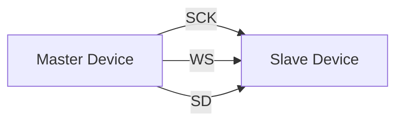
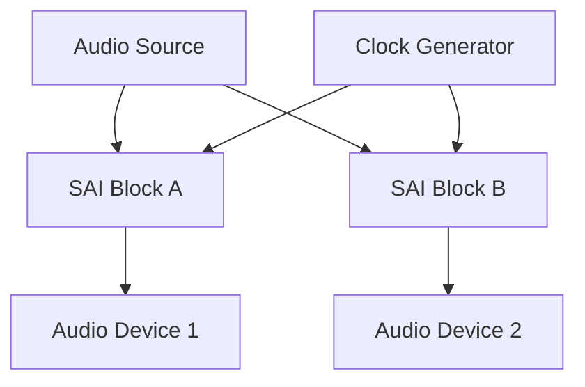
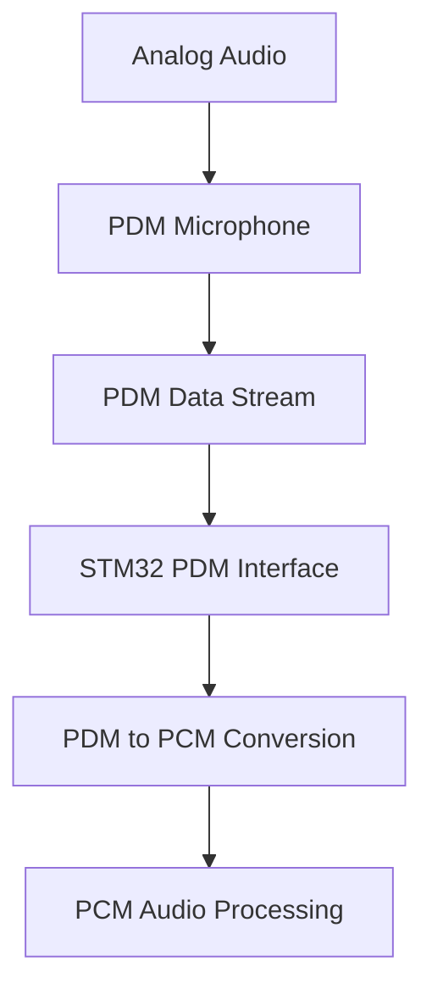

# STM32 Audio Interfaces

## Introduction

Audio processing is a common requirement in many embedded applications, from simple audio playback devices to complex voice recognition systems. STM32 microcontrollers offer several specialized interfaces for handling digital audio data efficiently. This guide will explore the various audio interfaces available in STM32 microcontrollers, how they work, and how to implement them in your projects.

Unlike general-purpose communication protocols, audio interfaces are designed specifically to handle the continuous streaming nature of audio data with precise timing requirements. Understanding these interfaces is crucial for building reliable audio applications with STM32 microcontrollers.

## Audio Interface Basics

Before diving into specific STM32 interfaces, let's understand some basic audio concepts:

- **Sampling Rate**: The number of audio samples captured per second (measured in Hz)
- **Bit Depth**: The number of bits used to represent each audio sample (common values: 16, 24, 32 bits)
- **Channels**: Mono (1 channel) or stereo (2 channels) audio streams
- **Audio Formats**: PCM (Pulse Code Modulation), PDM (Pulse Density Modulation), etc.

Audio interfaces must handle continuous data streams without interruptions (which would cause audible glitches), making them different from general data communication protocols.

## STM32 Audio Interface Options

STM32 microcontrollers provide three main interfaces for audio applications:

1. **I2S** (Inter-IC Sound): Standard digital audio interface
2. **SAI** (Serial Audio Interface): Advanced audio interface with more features
3. **PDM** (Pulse Density Modulation): For direct interfacing with digital microphones

Let's explore each of these interfaces in detail.

## I2S Interface

### What is I2S?

I2S (Inter-IC Sound) is a serial bus interface standard used for connecting digital audio devices. It was created by Philips Semiconductors (now NXP) and has become the de-facto standard for digital audio transmission in embedded systems.

### I2S Protocol Basics

The I2S protocol uses three main signal lines:

- **SCK** (Serial Clock): Bit clock for data synchronization
- **WS** (Word Select): Indicates left/right channel data (also called LRCLK)
- **SD** (Serial Data): The actual audio data bits

Here's how the signals work together:



The WS signal toggles between low (left channel) and high (right channel), while data bits are transmitted on the SD line in sync with the SCK clock.

### I2S Configuration on STM32

STM32 microcontrollers implement I2S through their SPI peripherals with I2S mode. Here's how to configure I2S on an STM32:

```c
void I2S_Init(void)
{
  // Enable peripheral clocks
  RCC->APB1ENR |= RCC_APB1ENR_SPI2EN;  // Enable SPI2 clock
  RCC->AHB1ENR |= RCC_AHB1ENR_GPIOBEN; // Enable GPIOB clock
  
  // Configure GPIO pins for I2S
  // PB12 -> I2S2_WS, PB13 -> I2S2_CK, PB15 -> I2S2_SD
  GPIOB->MODER &= ~(GPIO_MODER_MODER12_0 | GPIO_MODER_MODER13_0 | GPIO_MODER_MODER15_0);
  GPIOB->MODER |= (GPIO_MODER_MODER12_1 | GPIO_MODER_MODER13_1 | GPIO_MODER_MODER15_1);
  
  // Configure pins to AF5 (I2S function)
  GPIOB->AFR[1] &= ~(GPIO_AFRH_AFSEL12 | GPIO_AFRH_AFSEL13 | GPIO_AFRH_AFSEL15);
  GPIOB->AFR[1] |= (5 << GPIO_AFRH_AFSEL12_Pos) | (5 << GPIO_AFRH_AFSEL13_Pos) | (5 << GPIO_AFRH_AFSEL15_Pos);
  
  // Configure I2S (SPI2 in I2S mode)
  SPI2->I2SCFGR = 0;  // Reset configuration
  
  // Configure as Master transmitter, Standard Philips I2S format, 16-bit data, 44.1 kHz
  SPI2->I2SCFGR |= SPI_I2SCFGR_I2SMOD |   // I2S mode (not SPI)
                   SPI_I2SCFGR_I2SCFG_1 | // Master transmitter
                   (0 << SPI_I2SCFGR_I2SSTD_Pos) | // Phillips standard
                   (0 << SPI_I2SCFGR_DATLEN_Pos) | // 16-bit data
                   (0 << SPI_I2SCFGR_CHLEN_Pos);   // 16-bit channel length
  
  // Configure I2S prescaler for 44.1 kHz sampling rate
  // Calculation depends on system clock and desired sampling rate
  RCC->PLLI2SCFGR = (2 << RCC_PLLI2SCFGR_PLLI2SN_Pos) | (2 << RCC_PLLI2SCFGR_PLLI2SR_Pos);
  RCC->CR |= RCC_CR_PLLI2SON;  // Enable PLLI2S
  
  // Wait for PLLI2S ready
  while (!(RCC->CR & RCC_CR_PLLI2SRDY)) {}
  
  // Set I2S clock source and prescaler
  SPI2->I2SPR = (2 << SPI_I2SPR_I2SDIV_Pos) | SPI_I2SPR_ODD;
  
  // Enable I2S
  SPI2->I2SCFGR |= SPI_I2SCFGR_I2SE;
}
```

### Transmitting Audio Data

To transmit audio data over I2S:

```c
void I2S_Transmit(uint16_t data)
{
  // Wait until transmit buffer is empty
  while (!(SPI2->SR & SPI_SR_TXE)) {}
  
  // Send data
  SPI2->DR = data;
}

// Example usage to play stereo audio
void PlayStereoSample(int16_t left_sample, int16_t right_sample)
{
  I2S_Transmit(left_sample);  // Left channel
  I2S_Transmit(right_sample); // Right channel
}
```

### Real-World Example: Audio Playback with I2S DAC

Here's a practical example of using I2S to send audio data to an external DAC (e.g., PCM5102):

```c
// DMA-based I2S audio playback
#define AUDIO_BUFFER_SIZE 512

uint16_t audioBuffer[AUDIO_BUFFER_SIZE];
volatile uint8_t bufferHalf = 0;

void setupAudioDMA(void)
{
  // Enable DMA1 clock
  RCC->AHB1ENR |= RCC_AHB1ENR_DMA1EN;
  
  // Configure DMA for I2S transmission
  DMA1_Stream4->CR = 0;  // Reset configuration
  DMA1_Stream4->PAR = (uint32_t)&SPI2->DR;      // Peripheral address
  DMA1_Stream4->M0AR = (uint32_t)audioBuffer;   // Memory address
  DMA1_Stream4->NDTR = AUDIO_BUFFER_SIZE;       // Number of data items
  
  // Configure stream: Memory-to-peripheral, increment memory, half-transfer interrupt
  DMA1_Stream4->CR |= DMA_SxCR_CHSEL_0 |        // Channel 1
                      DMA_SxCR_DIR_0 |          // Memory to peripheral
                      DMA_SxCR_MINC |           // Increment memory
                      DMA_SxCR_HTIE |           // Half-transfer interrupt
                      DMA_SxCR_TCIE |           // Transfer complete interrupt
                      DMA_SxCR_PL_1;            // High priority
  
  // Enable DMA
  DMA1_Stream4->CR |= DMA_SxCR_EN;
  
  // Enable I2S DMA request
  SPI2->CR2 |= SPI_CR2_TXDMAEN;
  
  // Enable DMA interrupts in NVIC
  NVIC_EnableIRQ(DMA1_Stream4_IRQn);
}

// DMA interrupt handler
void DMA1_Stream4_IRQHandler(void)
{
  if (DMA1->HISR & DMA_HISR_HTIF4) {
    // Half transfer - fill first half of buffer
    DMA1->HIFCR = DMA_HIFCR_CHTIF4;  // Clear flag
    fillAudioBuffer(0, AUDIO_BUFFER_SIZE/2);
  }
  
  if (DMA1->HISR & DMA_HISR_TCIF4) {
    // Transfer complete - fill second half of buffer
    DMA1->HIFCR = DMA_HIFCR_CTCIF4;  // Clear flag
    fillAudioBuffer(AUDIO_BUFFER_SIZE/2, AUDIO_BUFFER_SIZE);
  }
}

// Function to fill buffer with audio data
void fillAudioBuffer(uint16_t start, uint16_t end)
{
  // In a real application, you would get audio data from a file or another source
  for (uint16_t i = start; i < end; i++) {
    // Demo: Generate sine wave
    audioBuffer[i] = (uint16_t)(32767 * sin(2 * M_PI * 440 * i / 44100));
  }
}
```

## SAI Interface (Serial Audio Interface)

### What is SAI?

The Serial Audio Interface (SAI) is an advanced audio peripheral found in many modern STM32 microcontrollers. It offers more flexibility and features compared to I2S, making it suitable for more complex audio applications.

### Key Features of SAI

- Support for multiple audio protocols (I2S, PCM, TDM, AC'97)
- Multiple independent audio blocks (block A and block B)
- Flexible clock configuration
- Advanced synchronization capabilities
- DMA support for efficient data transfer
- Higher performance for professional audio applications

### SAI Block Diagram



### SAI Configuration Example

Here's how to configure the SAI interface for I2S-compatible mode:

```c
void SAI_Init(void)
{
  // Enable peripheral clocks
  RCC->APB2ENR |= RCC_APB2ENR_SAI1EN;  // Enable SAI1 clock
  RCC->AHB1ENR |= RCC_AHB1ENR_GPIOEEN; // Enable GPIOE clock
  
  // Configure GPIO pins for SAI1
  // PE2 -> SAI1_MCK_A, PE4 -> SAI1_FS_A, PE5 -> SAI1_SCK_A, PE6 -> SAI1_SD_A
  GPIOE->MODER &= ~(GPIO_MODER_MODER2_0 | GPIO_MODER_MODER4_0 | 
                   GPIO_MODER_MODER5_0 | GPIO_MODER_MODER6_0);
  GPIOE->MODER |= (GPIO_MODER_MODER2_1 | GPIO_MODER_MODER4_1 | 
                  GPIO_MODER_MODER5_1 | GPIO_MODER_MODER6_1);
  
  // Configure pins to AF6 (SAI1 function)
  GPIOE->AFR[0] &= ~(GPIO_AFRL_AFSEL2 | GPIO_AFRL_AFSEL4 | 
                    GPIO_AFRL_AFSEL5 | GPIO_AFRL_AFSEL6);
  GPIOE->AFR[0] |= (6 << GPIO_AFRL_AFSEL2_Pos) | (6 << GPIO_AFRL_AFSEL4_Pos) | 
                   (6 << GPIO_AFRL_AFSEL5_Pos) | (6 << GPIO_AFRL_AFSEL6_Pos);
  
  // Configure SAI clock source in RCC
  RCC->DCKCFGR1 &= ~RCC_DCKCFGR1_SAI1SEL;
  RCC->DCKCFGR1 |= (0 << RCC_DCKCFGR1_SAI1SEL_Pos); // PLLI2S as clock source
  
  // Disable SAI for configuration
  SAI1_Block_A->CR1 &= ~SAI_xCR1_SAIEN;
  
  // Configure SAI1 Block A in Master Transmitter mode
  SAI1_Block_A->CR1 = 0;  // Reset configuration
  SAI1_Block_A->CR1 |= (0 << SAI_xCR1_MODE_Pos) |    // Master transmitter
                       SAI_xCR1_OUTDRIV |             // Output drive enabled
                       (0 << SAI_xCR1_DS_Pos) |       // Data size 16 bits
                       (1 << SAI_xCR1_PRTCFG_Pos);    // Free protocol (similar to I2S)
                       
  // Configure SAI1 Block A Frame
  SAI1_Block_A->FRCR = 0;  // Reset configuration
  SAI1_Block_A->FRCR |= ((16-1) << SAI_xFRCR_FRL_Pos) |   // Frame length (16 bits)
                        ((8-1) << SAI_xFRCR_FSALL_Pos) |   // FS active length (8 bits)
                        SAI_xFRCR_FSDEF |                   // FS definition (start of frame)
                        SAI_xFRCR_FSOFF;                    // FS offset (first bit is one bit after FS)
                        
  // Configure SAI1 Block A Slot
  SAI1_Block_A->SLOTR = 0;  // Reset configuration
  SAI1_Block_A->SLOTR |= ((2-1) << SAI_xSLOTR_NBSLOT_Pos) | // 2 slots (stereo)
                        SAI_xSLOTR_SLOTEN_0 |               // Enable slot 0 (left channel)
                        SAI_xSLOTR_SLOTEN_1;                // Enable slot 1 (right channel)
                      
  // Configure SAI clock generation
  SAI1_Block_A->CR2 = 0;  // Reset configuration
  SAI1_Block_A->CR2 |= ((4-1) << SAI_xCR2_MCKDIV_Pos);  // Master clock divider
  
  // Enable SAI
  SAI1_Block_A->CR1 |= SAI_xCR1_SAIEN;
}
```

### SAI Data Transmission

To transmit audio data using SAI:

```c
void SAI_Transmit(uint16_t data)
{
  // Wait until FIFO has space
  while (!(SAI1_Block_A->SR & SAI_xSR_FREQ)) {}
  
  // Send data
  SAI1_Block_A->DR = data;
}

// Example usage for stereo audio
void PlayStereoSample(int16_t left_sample, int16_t right_sample)
{
  SAI_Transmit(left_sample);  // Left channel
  SAI_Transmit(right_sample); // Right channel
}
```

### Real-World Example: High-Quality Audio Player

Using SAI for a high-quality audio player:

```c
// DMA-based SAI audio playback
#define AUDIO_BUFFER_SIZE 1024

uint16_t audioBuffer[AUDIO_BUFFER_SIZE];
volatile uint8_t bufferHalf = 0;

void setupSAI_DMA(void)
{
  // Enable DMA2 clock
  RCC->AHB1ENR |= RCC_AHB1ENR_DMA2EN;
  
  // Configure DMA for SAI transmission
  DMA2_Stream3->CR = 0;  // Reset configuration
  DMA2_Stream3->PAR = (uint32_t)&SAI1_Block_A->DR;  // Peripheral address
  DMA2_Stream3->M0AR = (uint32_t)audioBuffer;       // Memory address
  DMA2_Stream3->NDTR = AUDIO_BUFFER_SIZE;           // Number of data items
  
  // Configure stream: Memory-to-peripheral, increment memory, circular mode
  DMA2_Stream3->CR |= DMA_SxCR_CHSEL_0 |        // Channel 1
                      DMA_SxCR_DIR_0 |          // Memory to peripheral
                      DMA_SxCR_MINC |           // Increment memory
                      DMA_SxCR_CIRC |           // Circular mode
                      DMA_SxCR_HTIE |           // Half-transfer interrupt
                      DMA_SxCR_TCIE |           // Transfer complete interrupt
                      DMA_SxCR_PL_1;            // High priority
  
  // Enable DMA interrupts in NVIC
  NVIC_EnableIRQ(DMA2_Stream3_IRQn);
  
  // Enable DMA
  DMA2_Stream3->CR |= DMA_SxCR_EN;
  
  // Enable SAI DMA request
  SAI1_Block_A->CR1 |= SAI_xCR1_DMAEN;
}

// DMA interrupt handler
void DMA2_Stream3_IRQHandler(void)
{
  if (DMA2->LISR & DMA_LISR_HTIF3) {
    // Half transfer - fill first half of buffer
    DMA2->LIFCR = DMA_LIFCR_CHTIF3;  // Clear flag
    fillAudioBuffer(0, AUDIO_BUFFER_SIZE/2);
  }
  
  if (DMA2->LISR & DMA_LISR_TCIF3) {
    // Transfer complete - fill second half of buffer
    DMA2->LIFCR = DMA_LIFCR_CTCIF3;  // Clear flag
    fillAudioBuffer(AUDIO_BUFFER_SIZE/2, AUDIO_BUFFER_SIZE);
  }
}

// Fill buffer with high-quality audio data (24-bit, 96kHz)
void fillAudioBuffer(uint16_t start, uint16_t end)
{
  // In a real application, you would get high-quality audio data from a file
  for (uint16_t i = start; i < end; i++) {
    // Example: generate sine wave at 1kHz
    audioBuffer[i] = (uint16_t)(32767 * sin(2 * M_PI * 1000 * i / 96000));
  }
}
```

## PDM Interface (Pulse Density Modulation)

### What is PDM?

PDM (Pulse Density Modulation) is a digital representation of an analog signal where the relative density of pulses corresponds to the analog signal amplitude. It's commonly used in digital MEMS microphones.

### PDM vs PCM



PDM uses a 1-bit stream with a very high sampling rate, while PCM (used in I2S and SAI) uses multi-bit samples at a lower rate.

### STM32 PDM Interface

Some STM32 microcontrollers provide a dedicated PDM interface, often integrated with the SAI peripheral. Here's how to set up PDM for a digital microphone:

```c
void PDM_Init(void)
{
  // Enable peripheral clocks
  RCC->APB2ENR |= RCC_APB2ENR_SAI1EN;  // Enable SAI1 clock
  RCC->AHB1ENR |= RCC_AHB1ENR_GPIOBEN; // Enable GPIOB clock
  
  // Configure GPIO pins for PDM
  // PB3 -> PDM_CK, PB4 -> PDM_D1
  GPIOB->MODER &= ~(GPIO_MODER_MODER3_0 | GPIO_MODER_MODER4_0);
  GPIOB->MODER |= (GPIO_MODER_MODER3_1 | GPIO_MODER_MODER4_1);
  
  // Configure pins to AF6 (SAI1 function)
  GPIOB->AFR[0] &= ~(GPIO_AFRL_AFSEL3 | GPIO_AFRL_AFSEL4);
  GPIOB->AFR[0] |= (6 << GPIO_AFRL_AFSEL3_Pos) | (6 << GPIO_AFRL_AFSEL4_Pos);
  
  // Disable SAI for configuration
  SAI1_Block_B->CR1 &= ~SAI_xCR1_SAIEN;
  
  // Configure SAI1 Block B for PDM reception
  SAI1_Block_B->CR1 = 0;  // Reset configuration
  SAI1_Block_B->CR1 |= (1 << SAI_xCR1_MODE_Pos) |     // Master receiver
                       (2 << SAI_xCR1_DS_Pos) |        // Data size 8 bits (for PDM)
                       (2 << SAI_xCR1_PRTCFG_Pos);     // PDM protocol
                       
  // Configure SAI1 Block B Frame for PDM
  SAI1_Block_B->FRCR = 0;  // Reset configuration
  SAI1_Block_B->FRCR |= ((16-1) << SAI_xFRCR_FRL_Pos); // Frame length
                       
  // Configure SAI1 Block B Slot for PDM
  SAI1_Block_B->SLOTR = 0;  // Reset configuration
  SAI1_Block_B->SLOTR |= ((2-1) << SAI_xSLOTR_NBSLOT_Pos) | // Single slot
                        SAI_xSLOTR_SLOTEN_0;                // Enable slot 0
                        
  // Configure clock for PDM (typically 1-3 MHz)
  SAI1_Block_B->CR2 = 0;  // Reset configuration
  SAI1_Block_B->CR2 |= ((24-1) << SAI_xCR2_MCKDIV_Pos);  // Master clock divider
  
  // Enable SAI
  SAI1_Block_B->CR1 |= SAI_xCR1_SAIEN;
}
```

### PDM to PCM Conversion

STM32 microcontrollers often include hardware or firmware libraries for PDM to PCM conversion. Here's an example using the STM32 HAL library:

```c
#include "stm32f4xx_hal.h"
#include "pdm2pcm.h"

// PDM filter configuration
PDM_Filter_Handler_t PDM_FilterHandler;
PDM_Filter_Config_t PDM_FilterConfig;

#define PDM_BUFFER_SIZE 128
#define PCM_BUFFER_SIZE 64

uint16_t PDM_Buffer[PDM_BUFFER_SIZE];
uint16_t PCM_Buffer[PCM_BUFFER_SIZE];

void setupPDM2PCM(void)
{
  // Configure PDM filter for voice
  PDM_FilterConfig.Fs = 16000;          // Output sampling rate (Hz)
  PDM_FilterConfig.HighPassFilterEnable = 1;  // Enable HPF to remove DC component
  PDM_FilterConfig.InputGain = 30;      // Input gain
  
  // Initialize PDM filter
  PDM_Filter_Init(&PDM_FilterHandler, &PDM_FilterConfig);
}

// Process PDM data to get PCM
void convertPDM2PCM(void)
{
  // Perform PDM to PCM conversion
  PDM_Filter(PDM_Buffer, PCM_Buffer, &PDM_FilterHandler);
  
  // PCM_Buffer now contains audio samples ready for processing
}
```

### Real-World Example: Voice Recognition with MEMS Microphone

Here's a practical example of using PDM for voice activity detection:

```c
#define PDM_BUFFER_SIZE 256
#define PCM_BUFFER_SIZE 128
#define THRESHOLD 1000  // Voice activity detection threshold

uint16_t PDM_Buffer[PDM_BUFFER_SIZE];
int16_t PCM_Buffer[PCM_BUFFER_SIZE];
volatile uint8_t dataReady = 0;

// Setup DMA for PDM reception
void setupPDM_DMA(void)
{
  // Enable DMA2 clock
  RCC->AHB1ENR |= RCC_AHB1ENR_DMA2EN;
  
  // Configure DMA for SAI reception
  DMA2_Stream5->CR = 0;  // Reset configuration
  DMA2_Stream5->PAR = (uint32_t)&SAI1_Block_B->DR;  // Peripheral address
  DMA2_Stream5->M0AR = (uint32_t)PDM_Buffer;        // Memory address
  DMA2_Stream5->NDTR = PDM_BUFFER_SIZE;             // Number of data items
  
  // Configure stream: Peripheral-to-memory, increment memory, circular mode
  DMA2_Stream5->CR |= DMA_SxCR_CHSEL_0 |        // Channel 1
                      (0 << DMA_SxCR_DIR_Pos) | // Peripheral to memory
                      DMA_SxCR_MINC |           // Increment memory
                      DMA_SxCR_CIRC |           // Circular mode
                      DMA_SxCR_TCIE |           // Transfer complete interrupt
                      DMA_SxCR_PL_1;            // High priority
  
  // Enable DMA interrupts in NVIC
  NVIC_EnableIRQ(DMA2_Stream5_IRQn);
  
  // Enable DMA
  DMA2_Stream5->CR |= DMA_SxCR_EN;
  
  // Enable SAI DMA request
  SAI1_Block_B->CR1 |= SAI_xCR1_DMAEN;
}

// DMA interrupt handler
void DMA2_Stream5_IRQHandler(void)
{
  if (DMA2->LISR & DMA_LISR_TCIF5) {
    // Transfer complete - process PDM data
    DMA2->LIFCR = DMA_LIFCR_CTCIF5;  // Clear flag
    dataReady = 1;
  }
}

// Voice activity detection
uint8_t detectVoiceActivity(void)
{
  uint32_t energy = 0;
  
  // Calculate signal energy
  for (int i = 0; i < PCM_BUFFER_SIZE; i++) {
    energy += abs(PCM_Buffer[i]);
  }
  energy /= PCM_BUFFER_SIZE;
  
  // Return 1 if voice detected
  return (energy > THRESHOLD) ? 1 : 0;
}

void processMicrophoneData(void)
{
  while (1) {
    if (dataReady) {
      // Convert PDM to PCM
      PDM_Filter(PDM_Buffer, PCM_Buffer, &PDM_FilterHandler);
      
      // Check for voice activity
      if (detectVoiceActivity()) {
        // Voice detected, take action
        LED_On();
        
        // In a real application, you might start recording or
        // send the audio data for further processing
      } else {
        LED_Off();
      }
      
      dataReady = 0;
    }
  }
}
```

## Common Audio Peripherals and Development Boards

STM32 development boards often come with audio peripherals or have extension boards available:

1. **STM32F4-Discovery**: Includes an on-board MEMS microphone and audio DAC
2. **STM32F7-Discovery**: Features audio codec with line in/out and microphone
3. **STM32 Audio Expansion Board (X-NUCLEO-CCA02M1)**: Digital MEMS microphones with PDM interface

When working with these boards, you can leverage ST's audio software libraries:

```c
// Example of using ST's Audio library with discovery board
#include "stm32f4_discovery_audio.h"

// Initialize audio output with 44.1kHz sampling rate
BSP_AUDIO_OUT_Init(OUTPUT_DEVICE_HEADPHONE, 70, 44100);

// Start audio playback with DMA
BSP_AUDIO_OUT_Play(audioBuffer, AUDIO_BUFFER_SIZE);

// Audio transfer complete callback
void BSP_AUDIO_OUT_TransferComplete_CallBack(void)
{
  // Fill the second half of the buffer
  fillAudioBuffer(AUDIO_BUFFER_SIZE/2, AUDIO_BUFFER_SIZE);
}

// Audio half transfer callback
void BSP_AUDIO_OUT_HalfTransfer_CallBack(void)
{
  // Fill the first half of the buffer
  fillAudioBuffer(0, AUDIO_BUFFER_SIZE/2);
}
```

## Comparing Audio Interfaces

Here's a comparison of the three audio interfaces:

| Feature | I2S | SAI | PDM |
|---------|-----|-----|-----|
| Typical Use | DACs, ADCs, Codecs | Professional audio, Multiple devices | Digital MEMS microphones |
| Data Format | PCM | PCM, TDM, others | PDM (1-bit stream) |
| Implementation | Via SPI | Dedicated peripheral | Via SAI or dedicated |
| Flexibility | Limited | High | Limited |
| Multiple Channels | Stereo | Many (TDM mode) | Single or dual |
| Sample Resolution | 16/24/32-bit | 8 to 32-bit | N/A (bit stream) |

## Troubleshooting Audio Interfaces

Common issues when working with STM32 audio interfaces:

1. **Clock Configuration**: Audio requires precise clock settings to avoid distortion
   - Solution: Double-check clock source