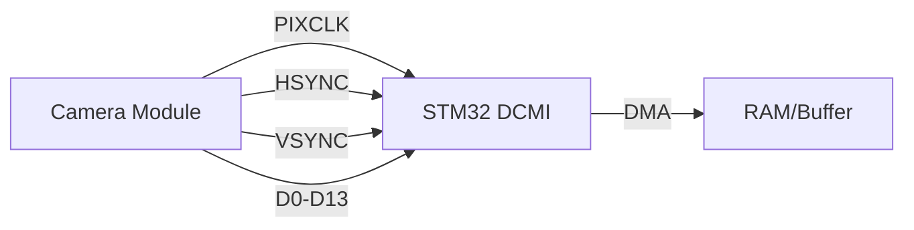
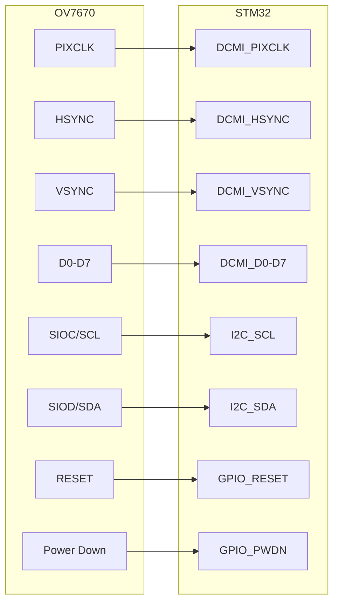

# STM32 Camera Interface

## Introduction

Camera interfaces allow STM32 microcontrollers to capture, process, and analyze visual data. This capability opens up possibilities for various applications, from simple image capture to complex computer vision systems. In this tutorial, we'll explore how to interface cameras with STM32 microcontrollers using the Digital Camera Interface (DCMI) peripheral.

The DCMI peripheral is available on many mid-to-high-end STM32 microcontrollers and provides a dedicated hardware interface for connecting digital cameras. It supports various image formats and resolutions, making it versatile for different applications.

## Understanding the DCMI Peripheral

The Digital Camera Interface (DCMI) is a specialized peripheral designed to handle the high-speed data transfer required for camera applications. It supports industry-standard interfaces like CMOS camera sensors or digital camera modules.

### Key Features of the DCMI Peripheral

- Supports 8-bit, 10-bit, 12-bit, and 14-bit parallel data interfaces
- Compatible with CMOS sensors and other digital camera devices
- Hardware synchronization with HSYNC, VSYNC, and PIXCLK signals
- Direct Memory Access (DMA) capability for efficient data transfer
- Support for various data formats: RGB, YCbCr, monochrome
- Cropping capability for region-of-interest processing
- JPEG hardware support on some STM32 models

### DCMI Signal Pins

The DCMI peripheral uses the following pins:

- **PIXCLK**: Pixel clock provided by the camera
- **HSYNC**: Horizontal synchronization signal
- **VSYNC**: Vertical synchronization signal
- **D0-D13**: Data lines (number of lines used depends on the data format)



## Hardware Setup

### Compatible Cameras

Several camera modules work well with the STM32 DCMI interface:

- OV7670: An inexpensive VGA camera module
- OV2640: A 2-megapixel camera with JPEG compression
- OV5640: A 5-megapixel camera with advanced features
- MT9V034: A global shutter camera suitable for machine vision

### Basic Connection Diagram

For this tutorial, we'll use the OV7670 camera as an example:



## Software Implementation

Let's walk through setting up a camera interface step by step:

### Step 1: Configure GPIO Pins

First, configure the required GPIO pins for the DCMI interface:

```c
void DCMI_GPIO_Init(void)
{
  GPIO_InitTypeDef GPIO_InitStruct = {0};
  
  /* Enable GPIOs clock */
  __HAL_RCC_GPIOA_CLK_ENABLE();
  __HAL_RCC_GPIOB_CLK_ENABLE();
  __HAL_RCC_GPIOC_CLK_ENABLE();
  __HAL_RCC_GPIOD_CLK_ENABLE();
  
  /* DCMI GPIO Configuration */
  /* D0 -> PA9, D1 -> PA10, D2 -> PC8, D3 -> PC9, D4 -> PC11, D5 -> PD3, D6 -> PB8, D7 -> PB9 */
  /* VSYNC -> PB7, HSYNC -> PA4, PIXCLK -> PA6 */
  
  /* Configure D0 - D7 pins */
  GPIO_InitStruct.Pin = GPIO_PIN_9 | GPIO_PIN_10;
  GPIO_InitStruct.Mode = GPIO_MODE_AF_PP;
  GPIO_InitStruct.Pull = GPIO_NOPULL;
  GPIO_InitStruct.Speed = GPIO_SPEED_FREQ_VERY_HIGH;
  GPIO_InitStruct.Alternate = GPIO_AF13_DCMI;
  HAL_GPIO_Init(GPIOA, &GPIO_InitStruct);
  
  GPIO_InitStruct.Pin = GPIO_PIN_8 | GPIO_PIN_9;
  HAL_GPIO_Init(GPIOB, &GPIO_InitStruct);
  
  GPIO_InitStruct.Pin = GPIO_PIN_8 | GPIO_PIN_9 | GPIO_PIN_11;
  HAL_GPIO_Init(GPIOC, &GPIO_InitStruct);
  
  GPIO_InitStruct.Pin = GPIO_PIN_3;
  HAL_GPIO_Init(GPIOD, &GPIO_InitStruct);
  
  /* Configure VSYNC, HSYNC, PIXCLK pins */
  GPIO_InitStruct.Pin = GPIO_PIN_4 | GPIO_PIN_6;
  HAL_GPIO_Init(GPIOA, &GPIO_InitStruct);
  
  GPIO_InitStruct.Pin = GPIO_PIN_7;
  HAL_GPIO_Init(GPIOB, &GPIO_InitStruct);
}
```

### Step 2: Configure the Camera over I2C

Most camera modules require configuration via I2C. Here's an example for the OV7670:

```c
#define OV7670_ADDRESS            0x42  // 7-bit I2C address (0x21 << 1)
#define OV7670_REG_COM7           0x12  // Control register 7
#define OV7670_REG_COM10          0x15  // Control register 10
#define OV7670_REG_COM3           0x0C  // Control register 3
#define OV7670_REG_COM14          0x3E  // Control register 14

bool OV7670_Init(void)
{
  /* Reset camera */
  HAL_GPIO_WritePin(CAMERA_RESET_GPIO_Port, CAMERA_RESET_Pin, GPIO_PIN_RESET);
  HAL_Delay(10);
  HAL_GPIO_WritePin(CAMERA_RESET_GPIO_Port, CAMERA_RESET_Pin, GPIO_PIN_SET);
  HAL_Delay(100);  // Wait for camera to initialize
  
  /* Configure camera registers via I2C */
  /* Reset all registers */
  if (Camera_WriteReg(OV7670_REG_COM7, 0x80) != HAL_OK) {
    return false;
  }
  HAL_Delay(100);  // Wait for reset
  
  /* Configure format: RGB565 */
  if (Camera_WriteReg(OV7670_REG_COM7, 0x04) != HAL_OK) {
    return false;
  }
  
  /* Configure VSYNC as negative */
  if (Camera_WriteReg(OV7670_REG_COM10, 0x02) != HAL_OK) {
    return false;
  }
  
  /* Configure PCLK to be valid on rising edge */
  if (Camera_WriteReg(OV7670_REG_COM10, 0x00) != HAL_OK) {
    return false;
  }
  
  /* More camera-specific configuration would go here */
  
  return true;
}

HAL_StatusTypeDef Camera_WriteReg(uint8_t reg, uint8_t data)
{
  uint8_t buffer[2];
  buffer[0] = reg;
  buffer[1] = data;
  
  return HAL_I2C_Master_Transmit(&hi2c1, OV7670_ADDRESS, buffer, 2, 100);
}

HAL_StatusTypeDef Camera_ReadReg(uint8_t reg, uint8_t *data)
{
  HAL_StatusTypeDef status;
  
  status = HAL_I2C_Master_Transmit(&hi2c1, OV7670_ADDRESS, &reg, 1, 100);
  if (status != HAL_OK) {
    return status;
  }
  
  return HAL_I2C_Master_Receive(&hi2c1, OV7670_ADDRESS, data, 1, 100);
}
```

### Step 3: Initialize DCMI Peripheral and DMA

Now let's configure the DCMI peripheral and DMA for efficient image capture:

```c
#define IMAGE_WIDTH               320
#define IMAGE_HEIGHT              240
#define FRAME_BUFFER_SIZE         (IMAGE_WIDTH * IMAGE_HEIGHT * 2)  // RGB565 = 2 bytes per pixel

/* Create a buffer to store image data */
uint8_t frameBuffer[FRAME_BUFFER_SIZE];

DCMI_HandleTypeDef hdcmi;
DMA_HandleTypeDef hdma_dcmi;

void DCMI_Init(void)
{
  /* Enable DCMI clock */
  __HAL_RCC_DCMI_CLK_ENABLE();
  
  /* Configure DCMI peripheral */
  hdcmi.Instance = DCMI;
  hdcmi.Init.SynchroMode = DCMI_SYNCHRO_HARDWARE;
  hdcmi.Init.PCKPolarity = DCMI_PCKPOLARITY_RISING;
  hdcmi.Init.VSPolarity = DCMI_VSPOLARITY_HIGH;    // Adjust based on camera (OV7670 typically uses HIGH)
  hdcmi.Init.HSPolarity = DCMI_HSPOLARITY_LOW;     // Adjust based on camera
  hdcmi.Init.CaptureRate = DCMI_CR_ALL_FRAME;
  hdcmi.Init.ExtendedDataMode = DCMI_EXTEND_DATA_8B;
  hdcmi.Init.JPEGMode = DCMI_JPEG_DISABLE;
  
  if (HAL_DCMI_Init(&hdcmi) != HAL_OK) {
    Error_Handler();
  }
  
  /* Configure and enable DMA for DCMI */
  __HAL_RCC_DMA2_CLK_ENABLE();
  
  hdma_dcmi.Instance = DMA2_Stream1;
  hdma_dcmi.Init.Channel = DMA_CHANNEL_1;
  hdma_dcmi.Init.Direction = DMA_PERIPH_TO_MEMORY;
  hdma_dcmi.Init.PeriphInc = DMA_PINC_DISABLE;
  hdma_dcmi.Init.MemInc = DMA_MINC_ENABLE;
  hdma_dcmi.Init.PeriphDataAlignment = DMA_PDATAALIGN_WORD;
  hdma_dcmi.Init.MemDataAlignment = DMA_MDATAALIGN_WORD;
  hdma_dcmi.Init.Mode = DMA_CIRCULAR;
  hdma_dcmi.Init.Priority = DMA_PRIORITY_HIGH;
  hdma_dcmi.Init.FIFOMode = DMA_FIFOMODE_ENABLE;
  hdma_dcmi.Init.FIFOThreshold = DMA_FIFO_THRESHOLD_FULL;
  hdma_dcmi.Init.MemBurst = DMA_MBURST_SINGLE;
  hdma_dcmi.Init.PeriphBurst = DMA_PBURST_SINGLE;
  
  if (HAL_DMA_Init(&hdma_dcmi) != HAL_OK) {
    Error_Handler();
  }
  
  /* Associate DMA handle with DCMI handle */
  __HAL_LINKDMA(&hdcmi, DMA_Handle, hdma_dcmi);
  
  /* Configure NVIC for DMA interrupts */
  HAL_NVIC_SetPriority(DMA2_Stream1_IRQn, 5, 0);
  HAL_NVIC_EnableIRQ(DMA2_Stream1_IRQn);
}
```

### Step 4: Capture Images

Now we can start capturing images:

```c
void StartCameraCapture(void)
{
  /* Start continuous capture */
  if (HAL_DCMI_Start_DMA(&hdcmi, DCMI_MODE_CONTINUOUS, (uint32_t)frameBuffer, FRAME_BUFFER_SIZE/4) != HAL_OK) {
    Error_Handler();
  }
}

void StopCameraCapture(void)
{
  /* Stop capture */
  HAL_DCMI_Stop(&hdcmi);
}
```

### Step 5: Process the Captured Image

Once the image is captured, we can process it:

```c
void ProcessImage(void)
{
  /* This is a simple example that inverts the colors */
  for (uint32_t i = 0; i < FRAME_BUFFER_SIZE; i++) {
    frameBuffer[i] = ~frameBuffer[i];
  }
  
  /* At this point, you can perform more complex image processing or 
     transmit the image to another device via UART, USB, or display it on an LCD */
}
```

### Step 6: Handle Interrupts

Set up interrupt handlers for frame-complete notifications:

```c
void DMA2_Stream1_IRQHandler(void)
{
  HAL_DMA_IRQHandler(&hdma_dcmi);
}

void HAL_DCMI_FrameEventCallback(DCMI_HandleTypeDef *hdcmi)
{
  /* This function is called when a complete frame has been captured */
  /* Set a flag or semaphore to indicate a new frame is ready for processing */
  newFrameReady = true;
}

void HAL_DCMI_ErrorCallback(DCMI_HandleTypeDef *hdcmi)
{
  /* Handle DCMI errors */
  Error_Handler();
}
```

## Complete Example: Capturing and Processing Images

Here's a complete example that captures images and performs a simple image processing task:

```c
/* Include necessary headers */
#include "stm32f4xx_hal.h"

/* Define camera and buffer parameters */
#define IMAGE_WIDTH               320
#define IMAGE_HEIGHT              240
#define FRAME_BUFFER_SIZE         (IMAGE_WIDTH * IMAGE_HEIGHT * 2)  // RGB565 = 2 bytes per pixel

/* Global variables */
DCMI_HandleTypeDef hdcmi;
DMA_HandleTypeDef hdma_dcmi;
I2C_HandleTypeDef hi2c1;
uint8_t frameBuffer[FRAME_BUFFER_SIZE];
volatile bool newFrameReady = false;

/* Function prototypes */
void SystemClock_Config(void);
void GPIO_Init(void);
void DCMI_Init(void);
void I2C_Init(void);
bool OV7670_Init(void);
void StartCameraCapture(void);
void ProcessImage(void);

int main(void)
{
  /* Initialize HAL library */
  HAL_Init();
  
  /* Configure system clock */
  SystemClock_Config();
  
  /* Initialize peripherals */
  GPIO_Init();
  I2C_Init();
  DCMI_Init();
  
  /* Initialize camera */
  if (!OV7670_Init()) {
    Error_Handler();  // Camera initialization failed
  }
  
  /* Start capturing images */
  StartCameraCapture();
  
  /* Main loop */
  while (1) {
    if (newFrameReady) {
      newFrameReady = false;
      ProcessImage();
      
      /* Example: Send processed image to display or another device */
    }
  }
}

void ProcessImage(void)
{
  /* Example: Calculate average brightness */
  uint32_t totalBrightness = 0;
  
  for (uint32_t i = 0; i < FRAME_BUFFER_SIZE; i += 2) {
    /* Extract RGB565 components */
    uint16_t pixel = (frameBuffer[i+1] << 8) | frameBuffer[i];
    uint8_t red = (pixel >> 11) & 0x1F;
    uint8_t green = (pixel >> 5) & 0x3F;
    uint8_t blue = pixel & 0x1F;
    
    /* Convert to brightness using simple average */
    uint8_t brightness = (red + green + blue) / 3;
    totalBrightness += brightness;
  }
  
  uint32_t avgBrightness = totalBrightness / (FRAME_BUFFER_SIZE / 2);
  
  /* Example: Simple thresholding (binarization) */
  for (uint32_t i = 0; i < FRAME_BUFFER_SIZE; i += 2) {
    uint16_t pixel = (frameBuffer[i+1] << 8) | frameBuffer[i];
    uint8_t red = (pixel >> 11) & 0x1F;
    uint8_t green = (pixel >> 5) & 0x3F;
    uint8_t blue = pixel & 0x1F;
    
    uint8_t brightness = (red + green + blue) / 3;
    
    if (brightness > avgBrightness) {
      /* Set to white */
      frameBuffer[i] = 0xFF;
      frameBuffer[i+1] = 0xFF;
    } else {
      /* Set to black */
      frameBuffer[i] = 0x00;
      frameBuffer[i+1] = 0x00;
    }
  }
}
```

## Real-World Applications

### QR Code / Barcode Scanner

A camera interface can be used to build a barcode scanner:

```c
/* Include a QR code/barcode decoding library */
#include "barcode_decoder.h"

void ScanBarcode(void)
{
  /* Capture an image */
  while (!newFrameReady) {
    /* Wait for a new frame */
  }
  newFrameReady = false;
  
  /* Preprocess the image for barcode detection */
  PreprocessForBarcode();
  
  /* Decode barcode */
  char barcodeResult[64];
  if (DecodeBarcode(frameBuffer, IMAGE_WIDTH, IMAGE_HEIGHT, barcodeResult)) {
    /* Barcode detected, process the result */
    printf("Barcode detected: %s\r
", barcodeResult);
  } else {
    /* No barcode found */
    printf("No barcode found\r
");
  }
}

void PreprocessForBarcode(void)
{
  /* Convert to grayscale and enhance contrast */
  for (uint32_t i = 0; i < FRAME_BUFFER_SIZE; i += 2) {
    uint16_t pixel = (frameBuffer[i+1] << 8) | frameBuffer[i];
    uint8_t red = (pixel >> 11) & 0x1F;
    uint8_t green = (pixel >> 5) & 0x3F;
    uint8_t blue = pixel & 0x1F;
    
    /* Convert RGB565 to grayscale */
    uint8_t gray = (red * 3 + green * 6 + blue) / 10;
    
    /* Store grayscale value in RGB565 format */
    uint16_t grayPixel = ((gray >> 3) << 11) | ((gray >> 2) << 5) | (gray >> 3);
    frameBuffer[i] = grayPixel & 0xFF;
    frameBuffer[i+1] = (grayPixel >> 8) & 0xFF;
  }
}
```

### Motion Detection

Cameras can be used for simple motion detection:

```c
#define MOTION_THRESHOLD          20    // Adjust based on sensitivity needed
uint8_t previousFrame[FRAME_BUFFER_SIZE];
bool isFirstFrame = true;

void DetectMotion(void)
{
  /* Wait for a new frame */
  while (!newFrameReady) {
    /* Wait */
  }
  newFrameReady = false;
  
  if (isFirstFrame) {
    /* First frame, just store it as reference */
    memcpy(previousFrame, frameBuffer, FRAME_BUFFER_SIZE);
    isFirstFrame = false;
    return;
  }
  
  /* Compare with previous frame to detect motion */
  uint32_t changedPixels = 0;
  
  for (uint32_t i = 0; i < FRAME_BUFFER_SIZE; i += 2) {
    uint16_t currentPixel = (frameBuffer[i+1] << 8) | frameBuffer[i];
    uint16_t previousPixel = (previousFrame[i+1] << 8) | previousFrame[i];
    
    /* Extract RGB components */
    uint8_t currentRed = (currentPixel >> 11) & 0x1F;
    uint8_t currentGreen = (currentPixel >> 5) & 0x3F;
    uint8_t currentBlue = currentPixel & 0x1F;
    
    uint8_t previousRed = (previousPixel >> 11) & 0x1F;
    uint8_t previousGreen = (previousPixel >> 5) & 0x3F;
    uint8_t previousBlue = previousPixel & 0x1F;
    
    /* Calculate difference */
    int16_t diffRed = abs(currentRed - previousRed);
    int16_t diffGreen = abs(currentGreen - previousGreen);
    int16_t diffBlue = abs(currentBlue - previousBlue);
    
    /* If any color component changed significantly, count as changed pixel */
    if (diffRed > MOTION_THRESHOLD || diffGreen > MOTION_THRESHOLD || diffBlue > MOTION_THRESHOLD) {
      changedPixels++;
    }
  }
  
  /* Store current frame as previous for next comparison */
  memcpy(previousFrame, frameBuffer, FRAME_BUFFER_SIZE);
  
  /* Check if motion detected */
  if (changedPixels > (IMAGE_WIDTH * IMAGE_HEIGHT * 0.05)) {  // 5% change threshold
    /* Motion detected */
    printf("Motion detected: %lu changed pixels\r
", changedPixels);
    /* Trigger alarm or other action */
  }
}
```

### Face Detection

For more advanced applications, you can implement simple face detection:

```c
/* Note: This is a simplified example. Real face detection would require a more complex algorithm */

void DetectFaces(void)
{
  /* Convert to grayscale */
  uint8_t grayscaleImage[IMAGE_WIDTH * IMAGE_HEIGHT];
  
  for (uint32_t i = 0, j = 0; i < FRAME_BUFFER_SIZE; i += 2, j++) {
    uint16_t pixel = (frameBuffer[i+1] << 8) | frameBuffer[i];
    uint8_t red = (pixel >> 11) & 0x1F;
    uint8_t green = (pixel >> 5) & 0x3F;
    uint8_t blue = pixel & 0x1F;
    
    /* Convert RGB565 to grayscale */
    grayscaleImage[j] = (red * 3 + green * 6 + blue) / 10;
  }
  
  /* Apply a simple skin color detection (this is very simplified) */
  uint32_t skinPixelCount = 0;
  
  for (uint32_t i = 0; i < FRAME_BUFFER_SIZE; i += 2) {
    uint16_t pixel = (frameBuffer[i+1] << 8) | frameBuffer[i];
    uint8_t red = (pixel >> 11) & 0x1F;
    uint8_t green = (pixel >> 5) & 0x3F;
    uint8_t blue = pixel & 0x1F;
    
    /* Normalize to 0-255 range */
    red = (red * 255) / 31;
    green = (green * 255) / 63;
    blue = (blue * 255) / 31;
    
    /* Simple skin detection rule */
    if (red > 95 && green > 40 && blue > 20 && 
        red > green && red > blue && 
        abs(red - green) > 15) {
      skinPixelCount++;
    }
  }
  
  /* If enough skin-colored pixels are found, it might be a face */
  if (skinPixelCount > (IMAGE_WIDTH * IMAGE_HEIGHT * 0.1)) {
    printf("Possible face detected\r
");
  }
}
```

## Optimizing Camera Performance

### DMA Double Buffering

To avoid missing frames, you can use double buffering:

```c
uint8_t frameBuffer1[FRAME_BUFFER_SIZE];
uint8_t frameBuffer2[FRAME_BUFFER_SIZE];
volatile uint8_t* activeFrameBuffer = frameBuffer1;
volatile uint8_t* processingFrameBuffer = frameBuffer2;
volatile bool bufferSwapPending = false;

void StartDoubleBufferedCapture(void)
{
  /* Start capture with first buffer */
  HAL_DCMI_Start_DMA(&hdcmi, DCMI_MODE_CONTINUOUS, (uint32_t)activeFrameBuffer, FRAME_BUFFER_SIZE/4);
}

void HAL_DCMI_FrameEventCallback(DCMI_HandleTypeDef *hdcmi)
{
  /* Swap buffers */
  volatile uint8_t* temp = activeFrameBuffer;
  activeFrameBuffer = processingFrameBuffer;
  processingFrameBuffer = temp;
  
  /* Reconfigure DMA to use new active buffer */
  HAL_DCMI_Stop(hdcmi);
  HAL_DCMI_Start_DMA(hdcmi, DCMI_MODE_CONTINUOUS, (uint32_t)activeFrameBuffer, FRAME_BUFFER_SIZE/4);
  
  /* Set flag for main loop */
  bufferSwapPending = true;
}

void MainLoop(void)
{
  while (1) {
    if (bufferSwapPending) {
      bufferSwapPending = false;
      /* Process the frame in processingFrameBuffer */
      ProcessImage((uint8_t*)processingFrameBuffer);
    }
  }
}
```

### Using SDRAM for Frame Buffers

For higher resolutions, you may need to use external SDRAM:

```c
/* Assuming SDRAM is already initialized */
#define SDRAM_BASE_ADDRESS        0xD0000000  // Specific to your STM32 model and configuration

uint8_t* frameBuffer = (uint8_t*)SDRAM_BASE_ADDRESS;

void StartCaptureToSDRAM(void)
{
  /* Start capture with SDRAM buffer */
  HAL_DCMI_Start_DMA(&hdcmi, DCMI_MODE_CONTINUOUS, (uint32_t)frameBuffer, FRAME_BUFFER_SIZE/4);
}
```

## Troubleshooting Camera Interfaces

### Common Issues and Solutions

1. **No data being captured**
   - Check power supply to the camera
   - Verify correct pin connections
   - Validate I2C communication by reading camera ID register
   - Check PCLK, HSYNC, and VSYNC signal polarities

2. **Corrupted images**
   - Verify clock speeds and timing
   - Check for signal integrity issues (use shorter cables)
   - Ensure DMA is configured correctly
   - Check for memory overruns in buffer

3. **Dark or low-quality images**
   - Adjust camera exposure and gain settings
   - Check lighting conditions
   - Verify camera module quality and focus

4. **Debugging DCMI signals**
   - Use an oscilloscope to check PCLK, HSYNC, and VSYNC signals
   - Monitor data lines for proper transitions
   - Verify timing parameters match the camera datasheet

### Debugging Code

```c
void DebugCameraConnection(void)
{
  uint8_t cameraID[2];
  
  /* Read camera ID registers (specific to OV7670) */
  Camera_ReadReg(0x0A, &cameraID[0]);  // Should return 0x76 for OV7670
  Camera_ReadReg(0x0B, &cameraID[1]);  // Should return 0x73 for OV7670
  
  printf("Camera ID: 0x%02X%02X\r
", cameraID[0], cameraID[1]);
  
  if (cameraID[0] != 0x76 || cameraID[1] != 0x73) {
    printf("Error: Camera not detected or incorrect ID\r
");
  } else {
    printf("Camera detected successfully\r
");
  }
}
```

## Summary

In this tutorial, we've explored how to:

1. Understand the STM32 DCMI peripheral and its capabilities
2. Connect camera modules to STM32 microcontrollers
3. Configure the DCMI peripheral and DMA for image capture
4. Process captured images for various applications
5. Implement real-world camera applications
6. Optimize performance with techniques like double buffering
7. Troubleshoot common camera interface issues

The STM32 camera interface opens up possibilities for embedded vision applications, from simple image capture to more complex tasks like motion detection, barcode scanning, and even basic face detection.

## Further Resources and Exercises

### Resources

- ST Microelectronics [AN5020 Application Note](https://www.st.com/resource/en/application_note/an5020-digital-camera-interface-dcmi-on-stm32-mcus-stmicroelectronics.pdf): Digital Camera Interface on STM32 MCUs
- Camera module datasheets (OV7670, OV2640, etc.)
- STM32CubeF4 examples for DCMI

### Exercises

1. **Basic Exercise**: Capture an image from a camera and transmit it to a PC via UART or USB.

2. **Intermediate Exercise**: Implement a simple edge detection algorithm on captured images:
   ```c
   void DetectEdges(uint8_t* image, uint8_t* output)
   {
     /* Simple Sobel edge detection */
     for (int y = 1; y < IMAGE_HEIGHT - 1; y++) {
       for (int x = 1; x < IMAGE_WIDTH - 1; x++) {
         /* Calculate horizontal and vertical gradients */
         int gx = image[(y-1)*IMAGE_WIDTH + (x+1)] - image[(y-1)*IMAGE_WIDTH + (x-1)] +
                  2 * image[y*IMAGE_WIDTH + (x+1)] - 2 * image[y*IMAGE_WIDTH + (x-1)] +
                  image[(y+1)*IMAGE_WIDTH + (x+1)] - image[(y+1)*IMAGE_WIDTH + (x-1)];
                  
         int gy = image[(y-1)*IMAGE_WIDTH + (x-1)] - image[(y+1)*IMAGE_WIDTH + (x-1)] +
                  2 * image[(y-1)*IMAGE_WIDTH + x] - 2 * image[(y+1)*IMAGE_WIDTH + x]