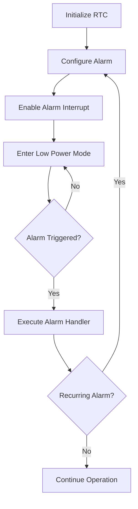

# STM32 RTC Alarms

## Introduction

The Real-Time Clock (RTC) is a crucial peripheral in many embedded applications that require accurate timekeeping, especially in low-power scenarios. One of the most useful features of the STM32's RTC is its alarm functionality, which allows your application to trigger events at specific times, even when the microcontroller is in a low-power mode.

This tutorial covers how to configure and use RTC alarms on STM32 microcontrollers. We'll explore how to set up single and periodic alarms, handle alarm interrupts, and implement practical applications like scheduled wake-ups and time-based triggers.

## RTC Alarm Basics

The STM32 RTC peripheral typically offers multiple alarm units (Alarm A and Alarm B in most models). Each alarm can be configured to trigger when the RTC time/date matches specific values.

### Key Features of STM32 RTC Alarms:

- Can match on seconds, minutes, hours, day of week, day of month, month, and year
- Support for mask bits to create periodic alarms (e.g., trigger every minute)
- Can wake the MCU from low-power modes
- Generate interrupts for event handling

## RTC Initialization

Before using alarms, we need to properly initialize the RTC. Here's a basic initialization sequence:

```c
/* Enable PWR and Backup access clocks */
__HAL_RCC_PWR_CLK_ENABLE();
HAL_PWR_EnableBkUpAccess();

/* Configure RTC clock source */
RCC_OscInitTypeDef RCC_OscInitStruct = {0};
RCC_OscInitStruct.OscillatorType = RCC_OSCILLATORTYPE_LSE;
RCC_OscInitStruct.LSEState = RCC_LSE_ON;
RCC_OscInitStruct.PLL.PLLState = RCC_PLL_NONE;
HAL_RCC_OscConfig(&RCC_OscInitStruct);

/* Select LSE as RTC clock source */
RCC_PeriphCLKInitTypeDef PeriphClkInitStruct = {0};
PeriphClkInitStruct.PeriphClockSelection = RCC_PERIPHCLK_RTC;
PeriphClkInitStruct.RTCClockSelection = RCC_RTCCLKSOURCE_LSE;
HAL_RCCEx_PeriphCLKConfig(&PeriphClkInitStruct);

/* Enable RTC Clock */
__HAL_RCC_RTC_ENABLE();

/* Initialize RTC */
RTC_HandleTypeDef hrtc = {0};
hrtc.Instance = RTC;
hrtc.Init.HourFormat = RTC_HOURFORMAT_24;
hrtc.Init.AsynchPrediv = 127;
hrtc.Init.SynchPrediv = 255;
hrtc.Init.OutPut = RTC_OUTPUT_DISABLE;
HAL_RTC_Init(&hrtc);

/* Set initial time and date if needed */
RTC_TimeTypeDef sTime = {0};
RTC_DateTypeDef sDate = {0};

sTime.Hours = 12;
sTime.Minutes = 30;
sTime.Seconds = 0;

sDate.WeekDay = RTC_WEEKDAY_MONDAY;
sDate.Month = RTC_MONTH_JANUARY;
sDate.Date = 1;
sDate.Year = 23;  // 2023

HAL_RTC_SetTime(&hrtc, &sTime, RTC_FORMAT_BIN);
HAL_RTC_SetDate(&hrtc, &sDate, RTC_FORMAT_BIN);
```

## Configuring a Simple Alarm

Let's set up a basic alarm that triggers at a specific time:

```c
void SetRTCAlarm(uint8_t hours, uint8_t minutes, uint8_t seconds)
{
    RTC_AlarmTypeDef sAlarm = {0};
    
    /* Configure the alarm A */
    sAlarm.AlarmTime.Hours = hours;
    sAlarm.AlarmTime.Minutes = minutes;
    sAlarm.AlarmTime.Seconds = seconds;
    sAlarm.AlarmTime.SubSeconds = 0;
    sAlarm.AlarmTime.DayLightSaving = RTC_DAYLIGHTSAVING_NONE;
    sAlarm.AlarmTime.StoreOperation = RTC_STOREOPERATION_RESET;
    
    /* Set Alarm to trigger when hours, minutes and seconds match */
    sAlarm.AlarmMask = RTC_ALARMMASK_DATEWEEKDAY;
    sAlarm.AlarmSubSecondMask = RTC_ALARMSUBSECONDMASK_ALL;
    sAlarm.AlarmDateWeekDaySel = RTC_ALARMDATEWEEKDAYSEL_DATE;
    sAlarm.AlarmDateWeekDay = 1;
    sAlarm.Alarm = RTC_ALARM_A;
    
    /* Enable Alarm A interrupt */
    HAL_NVIC_SetPriority(RTC_Alarm_IRQn, 0, 0);
    HAL_NVIC_EnableIRQ(RTC_Alarm_IRQn);
    
    /* Set and enable the alarm */
    HAL_RTC_SetAlarm_IT(&hrtc, &sAlarm, RTC_FORMAT_BIN);
}
```

## Understanding Alarm Masks

The alarm mask settings are crucial for creating different types of alarms:

```c
/* Different masking options */

// Trigger once at exactly 12:30:45
sAlarm.AlarmMask = RTC_ALARMMASK_DATEWEEKDAY;  // Only date/weekday is masked

// Trigger every day at 12:30:45
sAlarm.AlarmMask = RTC_ALARMMASK_DATEWEEKDAY;  // Date/weekday is masked

// Trigger every hour at minute 30 and second 45
sAlarm.AlarmMask = RTC_ALARMMASK_DATEWEEKDAY | RTC_ALARMMASK_HOURS;

// Trigger every minute at second 45
sAlarm.AlarmMask = RTC_ALARMMASK_DATEWEEKDAY | RTC_ALARMMASK_HOURS | RTC_ALARMMASK_MINUTES;

// Trigger every second
sAlarm.AlarmMask = RTC_ALARMMASK_DATEWEEKDAY | RTC_ALARMMASK_HOURS | 
                   RTC_ALARMMASK_MINUTES | RTC_ALARMMASK_SECONDS;
```

When a bit is masked, that field is ignored during comparison. This allows for creating periodic alarms.

## Handling Alarm Interrupts

To respond to an alarm event, implement the RTC alarm interrupt handler:

```c
void HAL_RTC_AlarmAEventCallback(RTC_HandleTypeDef *hrtc)
{
    /* Handle alarm event */
    
    /* Toggle an LED to indicate alarm triggered */
    HAL_GPIO_TogglePin(GPIOA, GPIO_PIN_5);
    
    /* Perform other alarm actions here */
    // e.g., start a measurement, send data, etc.
}
```

And make sure to implement the IRQ handler in your main code:

```c
void RTC_Alarm_IRQHandler(void)
{
    HAL_RTC_AlarmIRQHandler(&hrtc);
}
```

## Wake-Up from Low-Power Modes

One of the most common uses of RTC alarms is to wake up the MCU from a low-power state:

```c
void EnterLowPowerMode(void)
{
    /* Configure RTC alarm to wake up the system */
    SetRTCAlarm(12, 30, 0);  // Wake up at 12:30:00
    
    /* Enter Stop mode */
    HAL_PWR_EnterSTOPMode(PWR_LOWPOWERREGULATOR_ON, PWR_STOPENTRY_WFI);
    
    /* After wakeup, reconfigure the system clock */
    SystemClock_Config();
}
```

## Practical Example: Temperature Logger with Timed Measurements

Let's create a complete example of a temperature logger that takes measurements at regular intervals:

```c
#include "stm32f4xx_hal.h"
#include <stdio.h>

RTC_HandleTypeDef hrtc;
I2C_HandleTypeDef hi2c1;
UART_HandleTypeDef huart2;

/* Function prototypes */
void SystemClock_Config(void);
void RTC_Init(void);
void I2C1_Init(void);
void UART2_Init(void);
float ReadTemperature(void);
void LogTemperature(void);
void SetRTCAlarm(void);

int main(void)
{
    /* Initialize HAL */
    HAL_Init();
    
    /* Configure system clock */
    SystemClock_Config();
    
    /* Initialize peripherals */
    RTC_Init();
    I2C1_Init();  // For temperature sensor
    UART2_Init(); // For logging data
    
    /* Initial message */
    char msg[] = "Temperature Logger Started\r
";
    HAL_UART_Transmit(&huart2, (uint8_t*)msg, sizeof(msg)-1, HAL_MAX_DELAY);
    
    /* Set initial alarm for 10 seconds from now */
    SetRTCAlarm();
    
    /* Main loop */
    while (1)
    {
        /* Enter low power mode */
        HAL_PWR_EnterSLEEPMode(PWR_MAINREGULATOR_ON, PWR_SLEEPENTRY_WFI);
    }
}

void RTC_Init(void)
{
    /* RTC initialization code (as shown above) */
    /* ... */
}

void SetRTCAlarm(void)
{
    RTC_AlarmTypeDef sAlarm = {0};
    RTC_TimeTypeDef sTime = {0};
    RTC_DateTypeDef sDate = {0};
    
    /* Get current time */
    HAL_RTC_GetTime(&hrtc, &sTime, RTC_FORMAT_BIN);
    HAL_RTC_GetDate(&hrtc, &sDate, RTC_FORMAT_BIN);
    
    /* Set alarm for every 10 minutes */
    sAlarm.AlarmTime.Hours = sTime.Hours;
    sAlarm.AlarmTime.Minutes = (sTime.Minutes + 10) % 60;
    sAlarm.AlarmTime.Seconds = 0;
    
    /* Handle hour rollover */
    if (sAlarm.AlarmTime.Minutes < sTime.Minutes) {
        sAlarm.AlarmTime.Hours = (sTime.Hours + 1) % 24;
    }
    
    /* Configure alarm settings */
    sAlarm.AlarmMask = RTC_ALARMMASK_DATEWEEKDAY;
    sAlarm.AlarmSubSecondMask = RTC_ALARMSUBSECONDMASK_ALL;
    sAlarm.AlarmDateWeekDaySel = RTC_ALARMDATEWEEKDAYSEL_DATE;
    sAlarm.AlarmDateWeekDay = 1;
    sAlarm.Alarm = RTC_ALARM_A;
    
    /* Set and enable the alarm */
    HAL_RTC_DeactivateAlarm(&hrtc, RTC_ALARM_A);
    HAL_RTC_SetAlarm_IT(&hrtc, &sAlarm, RTC_FORMAT_BIN);
}

void HAL_RTC_AlarmAEventCallback(RTC_HandleTypeDef *hrtc)
{
    /* Log temperature when alarm triggers */
    LogTemperature();
    
    /* Set next alarm */
    SetRTCAlarm();
}

float ReadTemperature(void)
{
    /* Code to read temperature from I2C sensor */
    /* This is simplified and would need to be adapted to your specific sensor */
    uint8_t data[2];
    HAL_I2C_Mem_Read(&hi2c1, 0x48 << 1, 0x00, 1, data, 2, HAL_MAX_DELAY);
    
    /* Convert raw data to temperature */
    int16_t raw = (data[0] << 8) | data[1];
    float temperature = raw * 0.0625f; // Assuming 12-bit resolution
    
    return temperature;
}

void LogTemperature(void)
{
    /* Read current temperature */
    float temperature = ReadTemperature();
    
    /* Get current time and date */
    RTC_TimeTypeDef sTime;
    RTC_DateTypeDef sDate;
    HAL_RTC_GetTime(&hrtc, &sTime, RTC_FORMAT_BIN);
    HAL_RTC_GetDate(&hrtc, &sDate, RTC_FORMAT_BIN);
    
    /* Format log message */
    char msg[64];
    sprintf(msg, "[%02d/%02d/20%02d %02d:%02d:%02d] Temp: %.2f C\r
",
            sDate.Date, sDate.Month, sDate.Year,
            sTime.Hours, sTime.Minutes, sTime.Seconds,
            temperature);
    
    /* Send log via UART */
    HAL_UART_Transmit(&huart2, (uint8_t*)msg, strlen(msg), HAL_MAX_DELAY);
}
```

## Alarm Selection: Alarm A vs Alarm B

Most STM32 devices provide multiple alarm units (typically Alarm A and Alarm B). This allows you to configure different types of alarms simultaneously:

```c
/* Setting up both Alarm A and Alarm B */

// Alarm A for hourly tasks
RTC_AlarmTypeDef sAlarmA = {0};
sAlarmA.Alarm = RTC_ALARM_A;
sAlarmA.AlarmMask = RTC_ALARMMASK_DATEWEEKDAY | RTC_ALARMMASK_HOURS;
sAlarmA.AlarmTime.Minutes = 0;  // Trigger at the top of each hour
sAlarmA.AlarmTime.Seconds = 0;
HAL_RTC_SetAlarm_IT(&hrtc, &sAlarmA, RTC_FORMAT_BIN);

// Alarm B for daily backup at midnight
RTC_AlarmTypeDef sAlarmB = {0};
sAlarmB.Alarm = RTC_ALARM_B;
sAlarmB.AlarmMask = RTC_ALARMMASK_DATEWEEKDAY;
sAlarmB.AlarmTime.Hours = 0;    // At midnight
sAlarmB.AlarmTime.Minutes = 0;
sAlarmB.AlarmTime.Seconds = 0;
HAL_RTC_SetAlarm_IT(&hrtc, &sAlarmB, RTC_FORMAT_BIN);
```

In the interrupt handler, you'll need to determine which alarm triggered:

```c
void HAL_RTCEx_AlarmBEventCallback(RTC_HandleTypeDef *hrtc)
{
    /* Handle Alarm B event (daily backup) */
    PerformBackup();
}

void HAL_RTC_AlarmAEventCallback(RTC_HandleTypeDef *hrtc)
{
    /* Handle Alarm A event (hourly task) */
    PerformHourlyTask();
}
```

## RTC Alarm Operation Flow

Here's a diagram showing the typical flow of RTC alarm operations:



## Common Pitfalls and Tips

### 1. Calendar Initialization

Always initialize the RTC calendar before setting up alarms. Uninitialized RTC can cause unpredictable alarm behavior.

### 2. Backup Domain Reset

Be aware that any reset of the backup domain will reset the RTC configuration. You can check if RTC was previously configured:

```c
if (__HAL_RCC_GET_FLAG(RCC_FLAG_BORRST) != RESET)
{
    /* Backup domain was reset, need full RTC initialization */
    InitializeRTC();
}
else
{
    /* RTC already configured, just initialize the handle */
    hrtc.Instance = RTC;
    HAL_RTC_Init(&hrtc);
}
```

### 3. Clock Source Selection

For accurate timekeeping, use an external 32.768 kHz crystal (LSE) when possible. LSI (internal RC oscillator) is less accurate but can be used if LSE is not available.

### 4. Alarm Flags

Always clear alarm flags after handling them:

```c
/* This is handled by the HAL, but if you're using lower-level code: */
__HAL_RTC_ALARM_CLEAR_FLAG(hrtc, RTC_FLAG_ALRAF);
```

### 5. Power Considerations

The RTC domain can remain powered even when the rest of the MCU is powered down (with battery backup). This allows the RTC to maintain time and trigger alarms even when main power is lost.

## Summary

STM32 RTC alarms provide a powerful way to schedule events and manage time-based operations in embedded systems. They're especially valuable for low-power applications where the MCU needs to sleep most of the time and wake up only when needed.

Key points covered in this tutorial:
- RTC initialization and configuration
- Setting up single and periodic alarms
- Using alarm masks for different triggering patterns
- Handling RTC alarm interrupts
- Waking up from low-power modes using RTC alarms
- Practical implementation in a temperature logging application

By mastering RTC alarms, you can create more energy-efficient designs and implement sophisticated time-based functionality in your STM32 applications.

## Exercise Ideas

1. **Basic Alarm Clock**: Create a simple digital alarm clock with a display that triggers an action (LED or buzzer) at a set time.

2. **Power-Efficient Data Logger**: Implement a system that wakes up at regular intervals, takes sensor readings, and returns to sleep.

3. **Scheduled Operations**: Build a system that performs different tasks at different times of day (e.g., morning, afternoon, evening tasks).

4. **Calendar Events**: Implement date-based alarms that trigger on specific days of the month or specific weekdays.

5. **Cascading Timers**: Use both Alarm A and Alarm B together to implement complex timing schemes.

## Further Reading

- STM32 Reference Manual sections on RTC
- STM32 HAL RTC driver documentation
- Application notes on low-power design with STM32
- ST's documentation on backup domain and RTC continuity