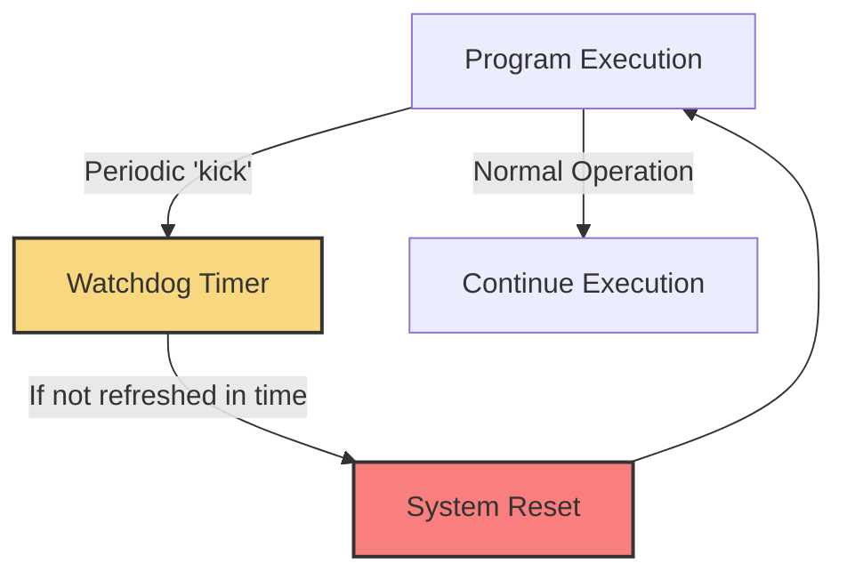

# STM32 Watchdog Timers

## Introduction

Watchdog timers are critical components in embedded systems that help ensure your application can recover from software malfunctions. They act as safety mechanisms that monitor whether your program is operating correctly. If the program hangs or enters an infinite loop, the watchdog timer will reset the system automatically, allowing your device to recover without human intervention.

STM32 microcontrollers feature two distinct watchdog timers:

1. **Independent Watchdog (IWDG)**: A simple, reliable timer powered by an independent clock source
2. **Window Watchdog (WWDG)**: A more sophisticated timer with a configurable time window for resets

In this tutorial, we'll explore both watchdog types, their configurations, and show you practical examples of how to implement them in your STM32 projects to create more robust embedded applications.

## Understanding Watchdog Timers

Before diving into the specific implementations, let's understand what watchdog timers do and why they're essential for reliable embedded systems.



A watchdog timer is essentially a countdown that, when it reaches zero, triggers a system reset. Your application must periodically "feed" or "kick" the watchdog (reset the countdown) to prevent this reset. If your software crashes, hangs, or enters an infinite loop, it will fail to reset the timer, causing a system restart.

This simple mechanism provides a powerful safety net for embedded systems, especially those operating in remote or critical environments where manual resets aren't practical.

## The Independent Watchdog (IWDG)

The Independent Watchdog (IWDG) is driven by its dedicated low-speed internal RC oscillator (LSI, typically around 40 kHz) and operates independently of the main system clock. This independence is crucial as it ensures the watchdog continues functioning even if the main clock fails.

### Key IWDG Features

- Continues operating even in most low-power modes
- Powered by a separate clock source (LSI)
- Simple to configure with prescaler values from 4 to 256
- Counter range from 0 to 4095
- Reset timeout period from ~0.1ms to ~26s

### Configuring the IWDG

Let's walk through setting up the Independent Watchdog using the STM32 HAL library:

```c
/* IWDG handle declaration */
IWDG_HandleTypeDef hiwdg;

void ConfigureIWDG(uint32_t timeoutMs)
{
  /* Calculate prescaler and reload values for desired timeout */
  uint32_t prescaler = IWDG_PRESCALER_4;
  uint32_t reloadValue = 0;
  uint32_t lsiFrequency = 40000; /* Typical LSI frequency is 40 kHz */

  /* Find suitable prescaler */
  if (timeoutMs > 409) {
    prescaler = IWDG_PRESCALER_8;
    lsiFrequency = lsiFrequency / 8;
  } else if (timeoutMs > 819) {
    prescaler = IWDG_PRESCALER_16;
    lsiFrequency = lsiFrequency / 16;
  } else if (timeoutMs > 1638) {
    prescaler = IWDG_PRESCALER_32;
    lsiFrequency = lsiFrequency / 32;
  } else if (timeoutMs > 3276) {
    prescaler = IWDG_PRESCALER_64;
    lsiFrequency = lsiFrequency / 64;
  } else if (timeoutMs > 6553) {
    prescaler = IWDG_PRESCALER_128;
    lsiFrequency = lsiFrequency / 128;
  } else if (timeoutMs > 13107) {
    prescaler = IWDG_PRESCALER_256;
    lsiFrequency = lsiFrequency / 256;
  } else {
    lsiFrequency = lsiFrequency / 4;
  }

  /* Calculate reload value */
  reloadValue = (timeoutMs * lsiFrequency) / 1000;

  /* Ensure reload value is within limits */
  if (reloadValue > 0xFFF) {
    reloadValue = 0xFFF;
  }

  /* Configure IWDG */
  hiwdg.Instance = IWDG;
  hiwdg.Init.Prescaler = prescaler;
  hiwdg.Init.Reload = reloadValue;
  hiwdg.Init.Window = IWDG_WINDOW_DISABLE; /* Not used for IWDG */

  if (HAL_IWDG_Init(&hiwdg) != HAL_OK)
  {
    /* Initialization Error */
    Error_Handler();
  }
}
```

### Refreshing (Feeding) the IWDG

Once the IWDG is running, you must refresh it periodically to prevent a system reset:

```c
void RefreshIWDG(void)
{
  /* Reset the watchdog timer */
  HAL_IWDG_Refresh(&hiwdg);
}
```

### Practical IWDG Usage Example

Here's a simple but practical example showing how to use the IWDG in a real application:

```c
int main(void)
{
  /* Initialize system */
  HAL_Init();
  SystemClock_Config();

  /* Initialize LED and button */
  BSP_LED_Init(LED2);
  BSP_PB_Init(BUTTON_USER, BUTTON_MODE_GPIO);

  /* Configure Independent Watchdog for 2 second timeout */
  ConfigureIWDG(2000);

  /* Main program loop */
  while (1)
  {
    /* Toggle LED to indicate system is alive */
    BSP_LED_Toggle(LED2);

    /* Normally we would refresh the watchdog here */
    RefreshIWDG();

    /* Wait for 500ms */
    HAL_Delay(500);

    /* Check if button is pressed - if pressed, simulate system hang */
    if (BSP_PB_GetState(BUTTON_USER) == GPIO_PIN_SET)
    {
      /* Enter infinite loop without refreshing watchdog */
      /* This will cause a watchdog reset after 2 seconds */
      while (1) {
        /* Do nothing - simulate system hang */
      }
    }
  }
}
```

In this example, the system normally refreshes the watchdog every 500ms, well before the 2-second timeout. However, when the user button is pressed, it simulates a system hang by entering an infinite loop without refreshing the watchdog. After approximately 2 seconds, the IWDG will reset the system.

## The Window Watchdog (WWDG)

The Window Watchdog (WWDG) offers more sophisticated monitoring by defining a time window within which the refresh must occur. If the refresh happens too early (before the window opens) or too late (after the window closes), a reset is triggered.

This feature is particularly useful for detecting timing errors in your application or unauthorized code execution.

### Key WWDG Features

- Uses the APB1 clock (system clock dependent)
- Configurable time window for refresh operations
- Early Wakeup Interrupt (EWI) capability
- 7-bit counter with a range from 0x40 to 0x7F
- Timeout period from a few microseconds to several milliseconds

### Configuring the WWDG

Let's set up the Window Watchdog:

```c
/* WWDG handle declaration */
WWDG_HandleTypeDef hwwdg;

void ConfigureWWDG(uint32_t timeoutMs, uint32_t windowMs)
{
  uint32_t pclk1 = HAL_RCC_GetPCLK1Freq();
  uint32_t prescaler = WWDG_PRESCALER_1;
  uint32_t prescalerDiv = 1;

  /* Find suitable prescaler */
  if (timeoutMs > 6) {
    prescaler = WWDG_PRESCALER_2;
    prescalerDiv = 2;
  } else if (timeoutMs > 12) {
    prescaler = WWDG_PRESCALER_4;
    prescalerDiv = 4;
  } else if (timeoutMs > 24) {
    prescaler = WWDG_PRESCALER_8;
    prescalerDiv = 8;
  }

  /* Calculate counter value */
  uint32_t counterValue = 0x7F; /* Maximum counter value */
  uint32_t windowValue = 0x7F;  /* Maximum window value */

  /* Calculate window and counter values */
  counterValue = (timeoutMs * pclk1) / (4096 * prescalerDiv * 1000);
  counterValue += 0x40; /* Add minimum counter value */

  if (counterValue > 0x7F) {
    counterValue = 0x7F;
  }

  windowValue = (windowMs * pclk1) / (4096 * prescalerDiv * 1000);
  windowValue += 0x40; /* Add minimum counter value */

  if (windowValue > counterValue) {
    windowValue = counterValue;
  }

  /* Configure WWDG */
  hwwdg.Instance = WWDG;
  hwwdg.Init.Prescaler = prescaler;
  hwwdg.Init.Window = windowValue;
  hwwdg.Init.Counter = counterValue;
  hwwdg.Init.EWIMode = WWDG_EWI_DISABLE; /* Initially disable EWI */

  if (HAL_WWDG_Init(&hwwdg) != HAL_OK)
  {
    /* Initialization Error */
    Error_Handler();
  }
}
```

In this initialization, we set up both a counter value (which determines when the window closes) and a window value (which determines when the window opens).

### Refreshing the WWDG

The refresh operation for the WWDG must happen within the specified time window:

```c
void RefreshWWDG(void)
{
  /* Reset the watchdog timer - must be called in the correct time window */
  HAL_WWDG_Refresh(&hwwdg);
}
```

### Using the Early Wakeup Interrupt

One unique feature of the WWDG is the Early Wakeup Interrupt (EWI). This interrupt occurs when the counter reaches 0x40, giving your application a chance to perform critical operations before the reset:

```c
void EnableWWDGEarlyWakeup(void)
{
  /* Re-initialize WWDG with EWI enabled */
  hwwdg.Init.EWIMode = WWDG_EWI_ENABLE;

  if (HAL_WWDG_Init(&hwwdg) != HAL_OK)
  {
    /* Initialization Error */
    Error_Handler();
  }
}

/* WWDG early wakeup callback */
void HAL_WWDG_EarlyWakeupCallback(WWDG_HandleTypeDef *hwwdg)
{
  /* Perform critical operations before reset */
  /* For example: save important data to flash */
  SaveImportantData();

  /* Note: You can refresh the WWDG here to prevent reset,
     but typically this is used for cleanup before reset */
}
```

### Practical WWDG Usage Example

Here's a more practical example using the Window Watchdog with the Early Wakeup Interrupt:

```c
/* Important system data structure */
typedef struct {
  uint32_t operationCounter;
  uint8_t lastStatus;
  uint16_t errorFlags;
} SystemData_t;

SystemData_t systemData = {0};

/* Save data to flash */
void SaveImportantData(void)
{
  /* In a real application, this would save to flash or EEPROM */
  /* This is simplified for the example */
  HAL_GPIO_WritePin(GPIOA, GPIO_PIN_5, GPIO_PIN_SET); /* Indicate saving */
  /* Flash write operations would be here */
  HAL_Delay(10); /* Simulate write time */
  HAL_GPIO_WritePin(GPIOA, GPIO_PIN_5, GPIO_PIN_RESET);
}

int main(void)
{
  /* Initialize system */
  HAL_Init();
  SystemClock_Config();

  /* Initialize GPIO */
  MX_GPIO_Init();

  /* Configure Window Watchdog for 30ms timeout with 15ms window */
  /* This means refresh must happen between 15ms and 30ms */
  ConfigureWWDG(30, 15);

  /* Enable early wakeup interrupt */
  EnableWWDGEarlyWakeup();

  uint32_t lastRefreshTime = HAL_GetTick();
  uint32_t correctRefreshInterval = 20; /* 20ms - within the window */

  /* Main program loop */
  while (1)
  {
    /* Perform regular operations */
    systemData.operationCounter++;

    /* Process any pending work */
    ProcessWork();

    /* Check if it's time to refresh the watchdog */
    uint32_t currentTime = HAL_GetTick();
    if ((currentTime - lastRefreshTime) >= correctRefreshInterval)
    {
      /* Refresh the watchdog */
      RefreshWWDG();
      lastRefreshTime = currentTime;
    }

    /* Check if button is pressed - if pressed, change refresh timing */
    if (HAL_GPIO_ReadPin(BUTTON_GPIO_PORT, BUTTON_PIN) == GPIO_PIN_SET)
    {
      /* Change refresh interval to be too early (10ms) */
      /* This will cause a watchdog reset */
      correctRefreshInterval = 10;
    }
  }
}

/* WWDG initialization function - HAL needs this */
void MX_WWDG_Init(void)
{
  /* This is called by HAL_WWDG_Init - can be empty if we call ConfigureWWDG */
}

/* Process work - simulated function */
void ProcessWork(void)
{
  /* Simulate processing time */
  HAL_Delay(5);
}
```

In this example:
1. We configure the WWDG with a 30ms timeout and 15ms window
2. The system normally refreshes the watchdog every 20ms (within the window)
3. When the button is pressed, we change the refresh interval to 10ms (too early)
4. This triggers a reset because refreshing too early violates the window constraint
5. Before reset, the early wakeup interrupt saves important system data

## Choosing Between IWDG and WWDG

The choice between using the Independent Watchdog or the Window Watchdog depends on your application requirements.

| Feature | IWDG | WWDG |
|---------|------|------|
| Clock Source | Independent LSI (~40 kHz) | System clock (APB1) |
| Timeout Range | ~0.1ms to ~26s | µs to ms range |
| Window Function | No | Yes |
| Operation in Low Power Mode | Most modes | No |
| Early Warning Interrupt | No | Yes |
| Typical Use Case | System hang detection | Timing verification |

**Use IWDG when:**
- You need a reliable watchdog that works in low-power modes
- Your system might experience clock failures
- You need longer timeout periods
- You want maximum reliability

**Use WWDG when:**
- You need to verify timing constraints
- You need an early warning interrupt before reset
- Your application requires detecting both "too early" and "too late" conditions
- You need faster timeout periods

## Best Practices for Using Watchdog Timers

To effectively use watchdog timers in your STM32 projects, follow these best practices:

1. **Don't refresh too frequently**: Place watchdog refreshes strategically in your main loop, not in interrupt handlers.

2. **Use appropriate timeout values**: Set the timeout long enough to avoid false resets during normal operation, but short enough to detect problems quickly.

3. **Implement a reset cause detection**: Add code to identify when a watchdog reset occurs:

```c
void CheckResetSource(void)
{
  if (__HAL_RCC_GET_FLAG(RCC_FLAG_IWDGRST))
  {
    /* IWDG reset occurred */
    /* Take appropriate action */
    LogEvent(EVENT_IWDG_RESET);

    /* Clear reset flags */
    __HAL_RCC_CLEAR_RESET_FLAGS();
  }
  else if (__HAL_RCC_GET_FLAG(RCC_FLAG_WWDGRST))
  {
    /* WWDG reset occurred */
    /* Take appropriate action */
    LogEvent(EVENT_WWDG_RESET);

    /* Clear reset flags */
    __HAL_RCC_CLEAR_RESET_FLAGS();
  }
}
```

4. **Consider a startup delay**: Allow your system to fully initialize before enabling the watchdog:

```c
void DelayedWatchdogStart(void)
{
  /* Perform system initialization */
  SystemInitialization();

  /* Wait for everything to stabilize */
  HAL_Delay(1000);

  /* Now it's safe to start the watchdog */
  ConfigureIWDG(2000);
}
```

5. **Test watchdog functionality**: Deliberately trigger watchdog resets during testing to verify correct operation.

## Real-World Application Example: Remote Sensor Node

Let's examine a complete real-world example of using watchdogs in a remote sensor node that collects environmental data and transmits it periodically:

```c
/* Includes */
#include "main.h"
#include "stm32f4xx_hal.h"

/* Handles */
IWDG_HandleTypeDef hiwdg;
I2C_HandleTypeDef hi2c1;
UART_HandleTypeDef huart2;

/* Sensor data structure */
typedef struct {
  float temperature;
  float humidity;
  float pressure;
  uint8_t batteryLevel;
} SensorData_t;

/* System state */
typedef enum {
  STATE_INIT,
  STATE_IDLE,
  STATE_MEASURE,
  STATE_TRANSMIT,
  STATE_SLEEP
} SystemState_t;

/* Global variables */
SensorData_t sensorData = {0};
SystemState_t currentState = STATE_INIT;
uint32_t lastTransmissionTime = 0;
uint32_t transmissionInterval = 60000; /* 1 minute */
uint32_t watchdogTimeout = 10000; /* 10 seconds */

/* Function prototypes */
void SystemClock_Config(void);
void InitWatchdog(uint32_t timeoutMs);
void MeasureSensorData(void);
void TransmitData(void);
void EnterLowPowerMode(void);
void CheckResetSource(void);
void Error_Handler(void);

int main(void)
{
  /* Reset flag checking - Must be done early */
  CheckResetSource();

  /* MCU Configuration */
  HAL_Init();
  SystemClock_Config();

  /* Initialize all configured peripherals */
  MX_GPIO_Init();
  MX_I2C1_Init();
  MX_USART2_UART_Init();

  /* Initialize LED */
  HAL_GPIO_WritePin(LED_GPIO_Port, LED_Pin, GPIO_PIN_RESET);

  /* Allow system to fully initialize before enabling watchdog */
  HAL_Delay(1000);

  /* Configure Independent Watchdog for 10 second timeout */
  InitWatchdog(watchdogTimeout);

  /* Main program loop */
  while (1)
  {
    /* State machine */
    switch (currentState)
    {
      case STATE_INIT:
        /* Initialization complete, move to idle state */
        currentState = STATE_IDLE;
        break;

      case STATE_IDLE:
        /* Check if it's time to measure and transmit */
        if (HAL_GetTick() - lastTransmissionTime >= transmissionInterval)
        {
          currentState = STATE_MEASURE;
        }
        else
        {
          /* Nothing to do, refresh watchdog and sleep */
          HAL_IWDG_Refresh(&hiwdg);
          EnterLowPowerMode();
        }
        break;

      case STATE_MEASURE:
        /* Collect sensor data */
        MeasureSensorData();

        /* Refresh watchdog after potentially time-consuming operation */
        HAL_IWDG_Refresh(&hiwdg);

        /* Move to transmit state */
        currentState = STATE_TRANSMIT;
        break;

      case STATE_TRANSMIT:
        /* Transmit the collected data */
        TransmitData();

        /* Update last transmission time */
        lastTransmissionTime = HAL_GetTick();

        /* Refresh watchdog after another potentially time-consuming operation */
        HAL_IWDG_Refresh(&hiwdg);

        /* Move to sleep state */
        currentState = STATE_SLEEP;
        break;

      case STATE_SLEEP:
        /* Enter low-power mode until next cycle */
        EnterLowPowerMode();

        /* After waking up, refresh watchdog and return to idle */
        HAL_IWDG_Refresh(&hiwdg);
        currentState = STATE_IDLE;
        break;

      default:
        /* Should never get here, but reset state if it happens */
        currentState = STATE_INIT;
        break;
    }

    /* Toggle LED to indicate system activity */
    HAL_GPIO_TogglePin(LED_GPIO_Port, LED_Pin);
  }
}

/* Initialize watchdog with specified timeout in milliseconds */
void InitWatchdog(uint32_t timeoutMs)
{
  /* Calculate prescaler value */
  uint32_t prescaler = IWDG_PRESCALER_4;
  uint32_t reloadValue = 0;
  uint32_t lsiFrequency = 32000; /* Typical LSI frequency */

  /* Find suitable prescaler */
  if (timeoutMs > 400) {
    prescaler = IWDG_PRESCALER_8;
    lsiFrequency = lsiFrequency / 8;
  } else if (timeoutMs > 800) {
    prescaler = IWDG_PRESCALER_16;
    lsiFrequency = lsiFrequency / 16;
  } else if (timeoutMs > 1600) {
    prescaler = IWDG_PRESCALER_32;
    lsiFrequency = lsiFrequency / 32;
  } else if (timeoutMs > 3200) {
    prescaler = IWDG_PRESCALER_64;
    lsiFrequency = lsiFrequency / 64;
  } else if (timeoutMs > 6400) {
    prescaler = IWDG_PRESCALER_128;
    lsiFrequency = lsiFrequency / 128;
  } else if (timeoutMs > 12800) {
    prescaler = IWDG_PRESCALER_256;
    lsiFrequency = lsiFrequency / 256;
  } else {
    lsiFrequency = lsiFrequency / 4;
  }

  /* Calculate reload value */
  reloadValue = (timeoutMs * lsiFrequency) / 1000;

  /* Ensure reload value is within limits */
  if (reloadValue > 0xFFF) {
    reloadValue = 0xFFF;
  }

  /* Configure IWDG */
  hiwdg.Instance = IWDG;
  hiwdg.Init.Prescaler = prescaler;
  hiwdg.Init.Reload = reloadValue;

  if (HAL_IWDG_Init(&hiwdg) != HAL_OK)
  {
    Error_Handler();
  }
}

/* Function to measure sensor data (simplified for example) */
void MeasureSensorData(void)
{
  /* In a real application, this would read from actual sensors */
  /* Simulated readings for this example */
  sensorData.temperature = 25.5f;
  sensorData.humidity = 65.0f;
  sensorData.pressure = 1013.25f;
  sensorData.batteryLevel = 87;

  /* Simulate sensor reading time */
  HAL_Delay(500);
}

/* Function to transmit data (simplified for example) */
void TransmitData(void)
{
  /* Format data as a string */
  char dataBuffer[100];
  sprintf(dataBuffer, "T:%.1f,H:%.1f,P:%.2f,B:%d\r\n",
          sensorData.temperature,
          sensorData.humidity,
          sensorData.pressure,
          sensorData.batteryLevel);

  /* Transmit data via UART */
  HAL_UART_Transmit(&huart2, (uint8_t*)dataBuffer, strlen(dataBuffer), 1000);

  /* Simulate transmission time */
  HAL_Delay(1000);
}

/* Function to enter low-power mode */
void EnterLowPowerMode(void)
{
  /* Enter sleep mode */
  HAL_PWR_EnterSLEEPMode(PWR_MAINREGULATOR_ON, PWR_SLEEPENTRY_WFI);
}

/* Check and handle reset source */
void CheckResetSource(void)
{
  if (__HAL_RCC_GET_FLAG(RCC_FLAG_IWDGRST))
  {
    /* IWDG reset occurred - log this event */
    /* In a real application, you'd save this to non-volatile memory */

    /* Clear reset flags */
    __HAL_RCC_CLEAR_RESET_FLAGS();
  }

  /* Check other reset sources if needed */
}

/* Error handler */
void Error_Handler(void)
{
  /* Turn on error LED */
  HAL_GPIO_WritePin(LED_GPIO_Port, LED_Pin, GPIO_PIN_SET);

  /* In a production system, you might log the error */

  /* Enter infinite loop */
  while (1)
  {
    /* Toggle LED to indicate error state */
    HAL_GPIO_TogglePin(LED_GPIO_Port, LED_Pin);
    HAL_Delay(200);
  }
}
```

This example demonstrates a complete sensor node application that:

1. Checks reset source during initialization
2. Uses a state machine architecture for clear program flow
3. Implements the IWDG with a 10-second timeout
4. Refreshes the watchdog after potentially time-consuming operations
5. Properly enters and exits low-power modes
6. Handles error conditions

## Debugging Applications with Watchdogs

When debugging applications with active watchdog timers, you might encounter constant resets that make debugging difficult. Here are some strategies to handle this:

### Option 1: Conditional Compilation

```c
#ifdef DEBUG
  /* Skip watchdog initialization in debug builds */
  #define INIT_WATCHDOG(x)
#else
  /* Initialize watchdog in release builds */
  #define INIT_WATCHDOG(x) InitWatchdog(x)
#endif

/* Then in your code */
INIT_WATCHDOG(10000);
```

### Option 2: Debug Detection

Some STM32 models can detect when a debugger is connected:

```c
void ConfigureWatchdogForDebugging(void)
{
  if ((CoreDebug->DHCSR & CoreDebug_DHCSR_C_DEBUGEN_Msk) != 0)
  {
    /* Debugger is connected, use a very long timeout */
    InitWatchdog(60000); /* 60 seconds */
  }
  else
  {
    /* Normal operation, use standard timeout */
    InitWatchdog(10000); /* 10 seconds */
  }
}
```

### Option 3: Hardware Freeze

In some STM32 models, you can configure the watchdog to freeze during debugging:

```c
/* For WWDG, this is configured in the debug MCU (DBGMCU) registers */
void FreezeWWDGDuringDebug(void)
{
  /* Enable the APB1 freeze during debug */
  __HAL_DBGMCU_FREEZE_WWDG();
}
```

Note that the IWDG cannot be frozen during debugging on most STM32 devices, as it's designed to be truly independent.

## Summary

Watchdog timers are essential components for creating reliable embedded systems. The STM32 microcontrollers offer two complementary watchdog options:

1. **Independent Watchdog (IWDG)**: A simple, reliable timer that operates independently of the main system clock, ideal for detecting system hangs and clock failures.

2. **Window Watchdog (WWDG)**: A more sophisticated timer with a configurable time window, useful for detecting timing errors and providing early warning interrupts.

By implementing watchdog timers in your STM32 projects, you can:
- Ensure your system can recover from software failures
- Detect timing violations in critical code paths
- Add a layer of safety for systems operating in remote or inaccessible locations
- Improve overall system robustness

Remember to follow best practices such as strategic refresh placement, appropriate timeout values, and testing your watchdog implementation under various failure conditions.

## Additional Resources

- [STM32 Reference Manuals](https://www.st.com/en/microcontrollers-microprocessors/stm32-32-bit-arm-cortex-mcus.html) for detailed peripheral specifications
- [STM32CubeF4 HAL Driver Documentation](https://www.st.com/en/embedded-software/stm32cubef4.html) for API references
- [Application Note AN4745: Using the Hardware Real-Time Clock (RTC) and the Tamper Management Unit](https://www.st.com/resource/en/application_note/an4745-using-the-hardware-realtime-clock-rtc-and-the-tamper-management-unit-stmicroelectronics.pdf)

## Exercises

1. Implement an IWDG configuration that triggers a reset after 5 seconds. Add a user button that simulates a system hang by entering an infinite loop.

2. Create a WWDG implementation with a 50ms timeout and a 25ms window. Add code to detect if the reset was caused by a watchdog and increment a counter in EEPROM or flash memory each time.

3. Build a state machine that uses both IWDG and WWDG: IWDG for overall system protection and WWDG to monitor timing of a critical section of code.

4. Extend the remote sensor example to include error logging in flash memory when a watchdog reset occurs, creating a simple "black box" recorder.

5. Implement a "safe mode" that activates after multiple consecutive watchdog resets, allowing the system to operate with reduced functionality while communicating the error condition.