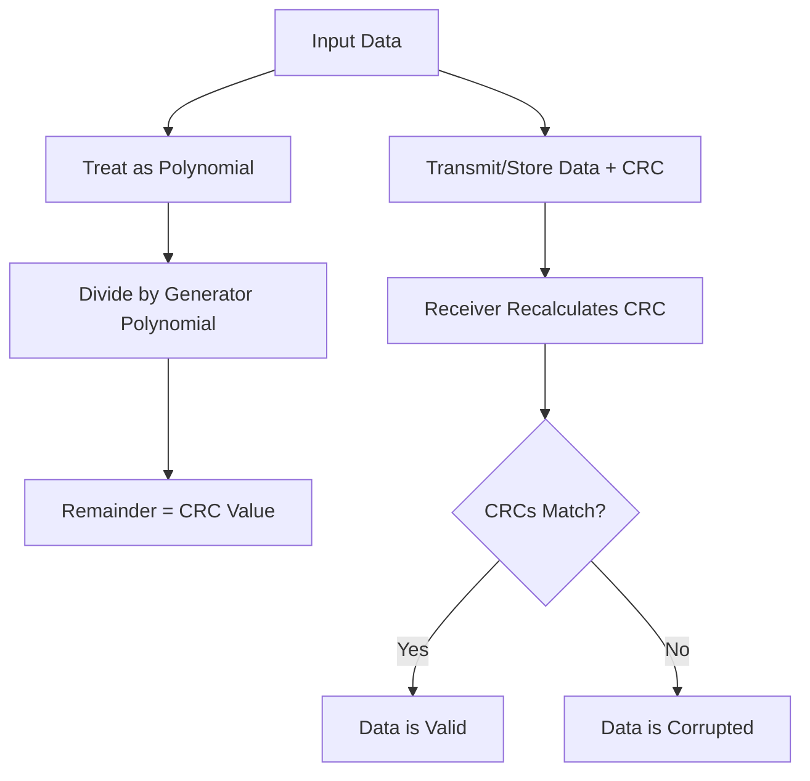

# STM32 CRC Calculation

## Introduction

Cyclic Redundancy Check (CRC) is a critical error-detecting technique used in digital networks and storage devices to detect accidental changes to raw data. STM32 microcontrollers include a dedicated hardware peripheral specifically designed to calculate CRC values quickly and efficiently.

In this tutorial, we'll explore the STM32 CRC peripheral, understand how it works, and learn how to implement it in your embedded applications. Whether you're validating firmware updates, checking data transmission integrity, or ensuring memory hasn't been corrupted, the CRC peripheral provides a hardware-accelerated solution.

## Understanding CRC Basics

### What is CRC?

CRC (Cyclic Redundancy Check) is an error-detection algorithm that generates a fixed-size checksum value from a block of data. This checksum can later be recalculated and compared to verify data integrity.

Think of CRC as a digital fingerprint for your data. If even a single bit changes in your data, the resulting CRC value will be different.

### How CRC Works

At its core, CRC treats a data stream as a large binary polynomial and performs polynomial division with a predefined generator polynomial. The remainder of this division becomes the CRC value.



## The STM32 CRC Peripheral

STM32 microcontrollers include a dedicated hardware CRC calculation unit that implements a 32-bit CRC using the standard polynomial: x^32 + x^26 + x^23 + x^22 + x^16 + x^12 + x^11 + x^10 + x^8 + x^7 + x^5 + x^4 + x^2 + x + 1 (0x4C11DB7).

This hardware implementation is much faster than software-based approaches, making it ideal for processing large amounts of data.

### Key Features of the STM32 CRC Unit:

- Hardware-accelerated 32-bit CRC computation
- Configurable polynomial on newer STM32 families
- Input/output data inversion options
- Byte-wise and word-wise data input
- Programmable initial value
- DMA compatibility for automated calculations

## Setting Up the CRC Peripheral

### Enabling the CRC Clock

Before using the CRC peripheral, we need to enable its clock:

```c
// Enable CRC clock
RCC->AHB1ENR |= RCC_AHB1ENR_CRCEN;
// or with HAL
__HAL_RCC_CRC_CLK_ENABLE();
```

### Basic CRC Calculation

Here's a simple example of calculating a CRC value for an array of data:

```c
#include "stm32f4xx_hal.h"

void calculate_crc_example(void) {
    uint32_t data[] = {0x12345678, 0xAABBCCDD, 0x87654321, 0xDEADBEEF};
    uint32_t crc_value;
    
    // Reset CRC calculation unit
    CRC->CR |= CRC_CR_RESET;
    
    // Calculate CRC for each word in the array
    for (int i = 0; i < 4; i++) {
        CRC->DR = data[i];
    }
    
    // Read the calculated CRC value
    crc_value = CRC->DR;
    
    // Now crc_value contains the CRC of the data array
    printf("CRC value: 0x%08lX
", crc_value);
}
```

### Using STM32 HAL Functions

The STM32 HAL library provides convenient functions for CRC calculation:

```c
#include "stm32f4xx_hal.h"

void hal_crc_example(void) {
    CRC_HandleTypeDef hcrc;
    uint32_t data[] = {0x12345678, 0xAABBCCDD, 0x87654321, 0xDEADBEEF};
    uint32_t crc_value;
    
    // Initialize CRC peripheral
    hcrc.Instance = CRC;
    HAL_CRC_Init(&hcrc);
    
    // Calculate CRC (HAL takes care of resetting the CRC unit)
    crc_value = HAL_CRC_Calculate(&hcrc, data, 4);
    
    printf("CRC value: 0x%08lX
", crc_value);
}
```

## Advanced CRC Features in STM32

Modern STM32 microcontrollers (F0, F3, F7, G0, G4, H7, L0, L4, etc.) offer enhanced CRC features:

### Configurable Polynomial

On newer STM32 families, you can configure the polynomial:

```c
// Example: Set 7-bit polynomial (0x89)
CRC->POL = 0x89;

// Enable 7-bit polynomial mode
CRC->CR |= CRC_CR_POLYSIZE_1 | CRC_CR_POLYSIZE_0;  // POLYSIZE = 11 for 7-bit
```

### Input/Output Data Inversion

You can configure input and output data inversion:

```c
// Configure input data inversion by byte
CRC->CR |= CRC_CR_REV_IN_0;  // 01: Byte-wise inversion

// Configure output data inversion
CRC->CR |= CRC_CR_REV_OUT;   // Enable output data inversion
```

### Initial Value Configuration

By default, the CRC unit uses 0xFFFFFFFF as the initial value. You can change this:

```c
// Set initial CRC value to 0x12345678
CRC->INIT = 0x12345678;
```

## Practical Applications of CRC

### Example 1: Verifying Firmware Integrity

Here's how you might use CRC to verify firmware integrity:

```c
bool verify_firmware_integrity(uint32_t *firmware_data, size_t data_len, uint32_t expected_crc) {
    CRC_HandleTypeDef hcrc;
    uint32_t calculated_crc;
    
    // Initialize CRC peripheral
    hcrc.Instance = CRC;
    HAL_CRC_Init(&hcrc);
    
    // Calculate CRC of firmware data
    calculated_crc = HAL_CRC_Calculate(&hcrc, firmware_data, data_len);
    
    // Compare calculated CRC with expected CRC
    return (calculated_crc == expected_crc);
}
```

### Example 2: Communication Protocol with CRC

Here's a simple implementation of a communication protocol with CRC verification:

```c
typedef struct {
    uint8_t header;
    uint8_t command;
    uint16_t data_length;
    uint8_t data[MAX_DATA_SIZE];
    uint32_t crc;
} CommPacket;

bool send_data_with_crc(UART_HandleTypeDef *huart, CommPacket *packet) {
    CRC_HandleTypeDef hcrc;
    uint32_t *data_ptr;
    uint32_t word_count;
    
    // Initialize CRC peripheral
    hcrc.Instance = CRC;
    HAL_CRC_Init(&hcrc);
    
    // Calculate CRC of packet (excluding the CRC field itself)
    data_ptr = (uint32_t*)packet;
    word_count = (sizeof(CommPacket) - sizeof(uint32_t)) / 4;
    packet->crc = HAL_CRC_Calculate(&hcrc, data_ptr, word_count);
    
    // Send packet over UART
    return (HAL_UART_Transmit(huart, (uint8_t*)packet, sizeof(CommPacket), 1000) == HAL_OK);
}

bool receive_and_verify(UART_HandleTypeDef *huart, CommPacket *packet) {
    CRC_HandleTypeDef hcrc;
    uint32_t *data_ptr;
    uint32_t word_count;
    uint32_t received_crc;
    uint32_t calculated_crc;
    
    // Receive packet
    if (HAL_UART_Receive(huart, (uint8_t*)packet, sizeof(CommPacket), 5000) != HAL_OK) {
        return false;
    }
    
    // Save received CRC
    received_crc = packet->crc;
    
    // Initialize CRC peripheral
    hcrc.Instance = CRC;
    HAL_CRC_Init(&hcrc);
    
    // Calculate CRC of received data
    data_ptr = (uint32_t*)packet;
    word_count = (sizeof(CommPacket) - sizeof(uint32_t)) / 4;
    calculated_crc = HAL_CRC_Calculate(&hcrc, data_ptr, word_count);
    
    // Verify CRC
    return (calculated_crc == received_crc);
}
```

### Example 3: Memory Integrity Check

You can use CRC to periodically verify critical memory hasn't been corrupted:

```c
void monitor_critical_memory(void) {
    static uint32_t last_crc = 0;
    uint32_t current_crc;
    CRC_HandleTypeDef hcrc;
    
    // Critical configuration data
    extern uint32_t critical_config[CONFIG_SIZE_WORDS];
    
    // Initialize CRC peripheral
    hcrc.Instance = CRC;
    HAL_CRC_Init(&hcrc);
    
    // Calculate CRC of critical memory
    current_crc = HAL_CRC_Calculate(&hcrc, critical_config, CONFIG_SIZE_WORDS);
    
    // First run, just store the CRC
    if (last_crc == 0) {
        last_crc = current_crc;
        return;
    }
    
    // Check if CRC has changed
    if (current_crc != last_crc) {
        // Memory corruption detected!
        handle_memory_corruption();
    }
}
```

## Performance Considerations

The hardware CRC peripheral is significantly faster than software implementations. Here's a comparison:

```c
void performance_comparison(void) {
    #define TEST_SIZE 10000
    uint32_t test_data[TEST_SIZE];
    uint32_t hw_crc, sw_crc;
    uint32_t start_time, hw_time, sw_time;
    
    // Fill test data
    for (int i = 0; i < TEST_SIZE; i++) {
        test_data[i] = i;
    }
    
    // Hardware CRC calculation
    CRC_HandleTypeDef hcrc;
    hcrc.Instance = CRC;
    HAL_CRC_Init(&hcrc);
    
    start_time = HAL_GetTick();
    hw_crc = HAL_CRC_Calculate(&hcrc, test_data, TEST_SIZE);
    hw_time = HAL_GetTick() - start_time;
    
    // Software CRC calculation
    start_time = HAL_GetTick();
    sw_crc = calculate_crc32_software(test_data, TEST_SIZE);
    sw_time = HAL_GetTick() - start_time;
    
    printf("Hardware CRC: %lu ms
", hw_time);
    printf("Software CRC: %lu ms
", sw_time);
    printf("Speedup factor: %.2f
", (float)sw_time / hw_time);
}
```

On a typical STM32F4, you might see the hardware implementation run 10-20 times faster than a good software implementation.

## Common Pitfalls and Troubleshooting

### Forgetting to Reset the CRC Unit

The CRC unit accumulates data, so forgetting to reset it between calculations will give incorrect results:

```c
// INCORRECT - Missing reset
CRC->DR = data1;  // First calculation ok
CRC->DR = data2;  // This will accumulate with previous result!

// CORRECT
CRC->CR |= CRC_CR_RESET;  // Reset before first calculation
CRC->DR = data1;
CRC->CR |= CRC_CR_RESET;  // Reset again before second calculation
CRC->DR = data2;
```

### Endianness Issues

Be aware of endianness when calculating CRC values that need to match other systems:

```c
// If you need to match a big-endian system but your STM32 is little-endian:
uint32_t swap_endianness(uint32_t value) {
    return ((value & 0xFF) << 24) |
           ((value & 0xFF00) << 8) |
           ((value & 0xFF0000) >> 8) |
           ((value & 0xFF000000) >> 24);
}

// Then use with CRC:
CRC->DR = swap_endianness(data);
```

### Byte vs. Word Access

The CRC unit is optimized for 32-bit word access, but sometimes you need to calculate CRC for a number of bytes that isn't a multiple of 4:

```c
uint32_t calculate_crc_for_bytes(uint8_t* data, size_t length) {
    CRC_HandleTypeDef hcrc;
    hcrc.Instance = CRC;
    HAL_CRC_Init(&hcrc);
    
    // Process complete words
    uint32_t word_count = length / 4;
    uint32_t crc = HAL_CRC_Calculate(&hcrc, (uint32_t*)data, word_count);
    
    // Process remaining bytes using the accumulate function
    uint32_t remaining_bytes = length % 4;
    if (remaining_bytes > 0) {
        uint8_t* remaining_data = data + (word_count * 4);
        crc = HAL_CRC_Accumulate(&hcrc, (uint32_t*)remaining_data, 1);
    }
    
    return crc;
}
```

## Summary

The STM32 CRC peripheral provides a hardware-accelerated solution for calculating CRC values, which is essential for ensuring data integrity in embedded systems. Key points to remember:

1. CRC is used to detect accidental changes to data
2. STM32 includes a dedicated hardware peripheral for CRC calculation
3. The default polynomial is 0x4C11DB7 (standard 32-bit CRC)
4. Newer STM32 families offer configurable polynomials and additional features
5. Hardware CRC calculation is significantly faster than software implementations
6. Common applications include firmware verification, communication protocol integrity, and memory monitoring

## Exercises

1. Implement a function that calculates the CRC of a string using the STM32 hardware CRC unit
2. Modify the communication protocol example to work with UART DMA for more efficient data handling
3. Create a bootloader that verifies firmware integrity using CRC before executing it
4. Experiment with different polynomial settings on newer STM32 devices and compare the results
5. Implement a file system integrity checker using the CRC peripheral

## Additional Resources

- ST's application note AN4187: "Using the STM32 CRC peripheral"
- "Cyclic Redundancy Check (CRC): PSoC Creator™ Component Datasheet" - for general CRC understanding
- "A Painless Guide to CRC Error Detection Algorithms" by Ross Williams
- "Error Correction Coding: Mathematical Methods and Algorithms" by Todd K. Moon