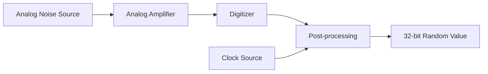

# STM32 Random Number Generator

## Introduction

Random numbers are essential in many applications, from cryptography and security to games and simulations. While software-based pseudo-random number generators (PRNGs) can provide seemingly random sequences, they are deterministic by nature and may not be suitable for applications requiring true randomness.

The STM32 family of microcontrollers includes a hardware Random Number Generator (RNG) peripheral that generates true random numbers by measuring unpredictable physical phenomena. This tutorial will guide you through understanding, configuring, and using the STM32 RNG peripheral in your embedded applications.

## How the STM32 RNG Works

The STM32 RNG peripheral generates random numbers based on an analog circuit that produces electronic noise, which is then processed to create random 32-bit values. This approach provides true random numbers rather than the deterministic sequences generated by software algorithms.



The RNG peripheral includes built-in health checks to ensure the quality of the random numbers:

1. **Seed Error**: Detects issues with the seed values used in the generation process
2. **Clock Error**: Monitors for problems with the RNG clock

When properly configured, the STM32 RNG provides cryptographically secure random numbers suitable for encryption keys, secure communications, and other sensitive applications.

## Hardware Compatibility

The RNG peripheral is available on many, but not all, STM32 microcontrollers. It's typically found on:

- STM32F2 series
- STM32F4 series
- STM32F7 series
- STM32H7 series
- STM32L4+ series
- STM32WB series

Check your specific microcontroller's datasheet to confirm the availability of the RNG peripheral.

## Configuring the RNG Peripheral

### Step 1: Enable the RNG Clock

First, we need to enable the clock for the RNG peripheral:

```c
// Enable RNG clock
__HAL_RCC_RNG_CLK_ENABLE();
```

### Step 2: Initialize the RNG

We'll use the HAL library to initialize the RNG:

```c
RNG_HandleTypeDef RngHandle;

// Configure RNG
RngHandle.Instance = RNG;
if (HAL_RNG_Init(&RngHandle) != HAL_OK) {
    // Error handling
    Error_Handler();
}
```

### Step 3: Generate Random Numbers

Now, we can generate random numbers using the configured RNG:

```c
uint32_t random_number;
if (HAL_RNG_GenerateRandomNumber(&RngHandle, &random_number) != HAL_OK) {
    // Error handling
    Error_Handler();
}
// Now random_number contains a 32-bit random value
```

### Step 4: Error Handling

It's important to check for RNG errors:

```c
void HAL_RNG_ErrorCallback(RNG_HandleTypeDef *hrng) {
    // Handle errors (seed error, clock error)
    if (hrng->ErrorCode & RNG_ERROR_SEED) {
        printf("RNG Seed Error\r
");
    }
    if (hrng->ErrorCode & RNG_ERROR_CLOCK) {
        printf("RNG Clock Error\r
");
    }
}
```

## Complete Example: Generating Random Numbers

Here's a complete example of using the STM32 RNG to generate and print random numbers:

```c
#include "main.h"
#include "stdio.h"

RNG_HandleTypeDef RngHandle;
UART_HandleTypeDef huart2;

void SystemClock_Config(void);
static void MX_GPIO_Init(void);
static void MX_USART2_UART_Init(void);
static void MX_RNG_Init(void);

int main(void) {
    /* MCU Configuration */
    HAL_Init();
    SystemClock_Config();
    
    /* Initialize peripherals */
    MX_GPIO_Init();
    MX_USART2_UART_Init();
    MX_RNG_Init();
    
    char msg[50];
    uint32_t random_number;
    
    printf("STM32 Hardware RNG Demo\r
");
    
    while (1) {
        if (HAL_RNG_GenerateRandomNumber(&RngHandle, &random_number) == HAL_OK) {
            sprintf(msg, "Random Number: %u\r
", random_number);
            HAL_UART_Transmit(&huart2, (uint8_t*)msg, strlen(msg), HAL_MAX_DELAY);
        } else {
            printf("RNG Error\r
");
        }
        
        HAL_Delay(1000); // Generate a new random number every second
    }
}

static void MX_RNG_Init(void) {
    __HAL_RCC_RNG_CLK_ENABLE();
    
    RngHandle.Instance = RNG;
    if (HAL_RNG_Init(&RngHandle) != HAL_OK) {
        Error_Handler();
    }
}
```

## Example Output

When running the above code, you might see output like:

```
STM32 Hardware RNG Demo
Random Number: 3892756142
Random Number: 1267489354
Random Number: 2784513609
Random Number: 983265471
```

Each number is a true random 32-bit value generated by the hardware RNG.

## Practical Applications

### 1. Cryptographic Key Generation

Secure cryptographic operations require truly random keys that cannot be predicted:

```c
void generate_encryption_key(uint8_t* key, uint32_t key_length) {
    uint32_t random_word;
    uint32_t bytes_generated = 0;
    
    while (bytes_generated < key_length) {
        if (HAL_RNG_GenerateRandomNumber(&RngHandle, &random_word) != HAL_OK) {
            Error_Handler();
        }
        
        // Copy bytes from random_word to key buffer
        for (int i = 0; i < 4 && bytes_generated < key_length; i++) {
            key[bytes_generated++] = (random_word >> (i * 8)) & 0xFF;
        }
    }
}
```

Usage:

```c
uint8_t aes_key[16]; // 128-bit key
generate_encryption_key(aes_key, 16);
// Now aes_key contains a random 128-bit key for encryption
```

### 2. Random Delay for Security Applications

Random delays can help protect against timing attacks:

```c
void random_delay(void) {
    uint32_t delay_value;
    
    if (HAL_RNG_GenerateRandomNumber(&RngHandle, &delay_value) != HAL_OK) {
        Error_Handler();
    }
    
    // Generate a random delay between 1ms and 10ms
    delay_value = (delay_value % 10) + 1;
    HAL_Delay(delay_value);
}
```

### 3. Random LED Patterns

Create unpredictable visual patterns:

```c
void random_led_pattern(void) {
    uint32_t pattern;
    
    if (HAL_RNG_GenerateRandomNumber(&RngHandle, &pattern) != HAL_OK) {
        Error_Handler();
    }
    
    // Use the lower 4 bits to control 4 LEDs
    HAL_GPIO_WritePin(LED1_GPIO_Port, LED1_Pin, (pattern & 0x01) ? GPIO_PIN_SET : GPIO_PIN_RESET);
    HAL_GPIO_WritePin(LED2_GPIO_Port, LED2_Pin, (pattern & 0x02) ? GPIO_PIN_SET : GPIO_PIN_RESET);
    HAL_GPIO_WritePin(LED3_GPIO_Port, LED3_Pin, (pattern & 0x04) ? GPIO_PIN_SET : GPIO_PIN_RESET);
    HAL_GPIO_WritePin(LED4_GPIO_Port, LED4_Pin, (pattern & 0x08) ? GPIO_PIN_SET : GPIO_PIN_RESET);
}
```

## Using the RNG in CubeMX

If you're using STM32CubeMX to configure your project:

1. In the Pinout & Configuration tab, expand "Peripherals"
2. Find and enable "RNG"
3. Configure the RNG parameters if needed
4. Generate the code

CubeMX will create the initialization code for you, and you can then use the HAL functions to generate random numbers.

## Advanced Topics

### Using RNG in Interrupt Mode

For more efficient operation, you can use the RNG in interrupt mode:

```c
// Initialize RNG with interrupt
HAL_RNG_GenerateRandomNumber_IT(&RngHandle);

// Interrupt callback
void HAL_RNG_ReadyDataCallback(RNG_HandleTypeDef *hrng, uint32_t random32bit) {
    // Process the random number
    process_random_number(random32bit);
    
    // Request the next random number
    HAL_RNG_GenerateRandomNumber_IT(hrng);
}
```

### Generating Random Floating-Point Numbers

You can convert the 32-bit integer random values to floating-point numbers between 0 and 1:

```c
float generate_random_float(void) {
    uint32_t random_int;
    
    if (HAL_RNG_GenerateRandomNumber(&RngHandle, &random_int) != HAL_OK) {
        Error_Handler();
    }
    
    // Convert to float between 0 and 1
    return (float)random_int / (float)UINT32_MAX;
}
```

### Seed for Software PRNG

You can use the hardware RNG to seed a software PRNG when you need more random numbers than the hardware can efficiently provide:

```c
void seed_software_prng(void) {
    uint32_t seed;
    
    if (HAL_RNG_GenerateRandomNumber(&RngHandle, &seed) != HAL_OK) {
        Error_Handler();
    }
    
    srand(seed); // Seed the C standard library PRNG
}
```

## Troubleshooting

### Common Issues and Solutions

1. **RNG Clock Error**
   - Make sure the RNG clock is properly configured
   - Check that the PLL is stable

2. **Seed Error**
   - This may indicate a hardware issue with the entropy source
   - Try resetting the RNG peripheral

3. **Random Numbers Not Truly Random**
   - Ensure proper power supply to the microcontroller
   - Check for EMI interference that might affect the analog noise source

## Summary

The STM32 hardware Random Number Generator provides true random numbers for your embedded applications by utilizing physical entropy sources. This makes it superior to software-based random number generators for security-critical applications.

Key points to remember:
- Enable the RNG clock before using the peripheral
- Use the HAL library functions for easy initialization and operation
- Check for errors when generating random numbers
- The RNG provides 32-bit random values that can be used directly or transformed as needed

The hardware RNG is particularly valuable for cryptographic applications, security features, and any scenario where unpredictability is essential.

## Exercises

1. Create a program that generates 10 random numbers and calculates their average.
2. Implement a function that returns a random number within a specified range (min to max).
3. Build a simple random password generator that creates passwords of varying lengths.
4. Design a system that uses the RNG to create random delays for a stepper motor to reduce resonance.
5. Implement a simple encryption program that uses random keys generated by the RNG.

## Further Resources

- STM32 HAL RNG API documentation
- AN4230: STM32 microcontrollers random number generation validation
- RM0090: STM32F4 series reference manual (RNG section)
- RM0433: STM32H7 series reference manual (RNG section)