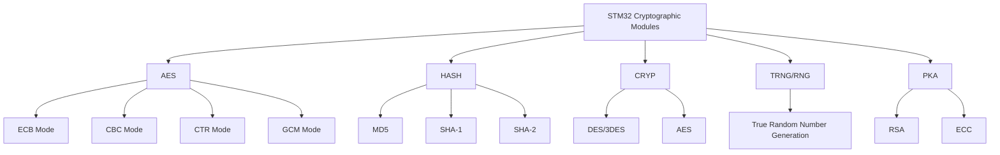

# STM32 Cryptographic Modules

## Introduction

Modern embedded applications frequently require strong security features to protect sensitive data, authenticate devices, and ensure secure communications. STM32 microcontrollers address these needs with dedicated hardware cryptographic modules that accelerate security operations while reducing CPU load and power consumption.

In this guide, we'll explore the cryptographic capabilities available in STM32 microcontrollers, understand how they work, and learn to implement them in your embedded projects. These hardware accelerators enable efficient encryption, hashing, and authentication with minimal overhead.

## STM32 Cryptographic Hardware Overview

STM32 microcontrollers offer various cryptographic modules depending on the specific family and model. The most common modules include:



Let's examine each module in detail:

1. **AES (Advanced Encryption Standard)**: Hardware accelerator for symmetric encryption
2. **HASH**: Dedicated module for computing hash values
3. **CRYP**: General-purpose cryptographic processor (legacy in some models)
4. **TRNG/RNG**: True Random Number Generator for secure key generation
5. **PKA**: Public Key Accelerator for asymmetric cryptography operations

## Getting Started with STM32 Cryptographic HAL

Before diving into specific algorithms, let's set up our environment. We'll be using the STM32 HAL (Hardware Abstraction Layer) libraries to interact with the cryptographic modules.

### Required Headers and Initialization

```c
#include "main.h"
#include "stm32f4xx_hal.h"

/* If using CubeMX, these will be initialized for you */
static void MX_CRYP_Init(void);
static void MX_HASH_Init(void);
static void MX_RNG_Init(void);

/* Global handles for crypto peripherals */
CRYP_HandleTypeDef hcryp;
HASH_HandleTypeDef hhash;
RNG_HandleTypeDef hrng;

int main(void)
{
  /* MCU Configuration */
  HAL_Init();
  SystemClock_Config();
  
  /* Initialize cryptographic peripherals */
  MX_CRYP_Init();
  MX_HASH_Init();
  MX_RNG_Init();
  
  /* Your application code */
  while (1)
  {
    /* Main loop */
  }
}
```

## AES Encryption/Decryption

AES (Advanced Encryption Standard) is one of the most widely used symmetric encryption algorithms. STM32 provides hardware acceleration for AES with various block cipher modes.

### Basic AES-128 Encryption Example

```c
void AES_Encrypt_Example(void)
{
  /* Key and initialization vector */
  uint8_t aes_key[16] = {0x2b, 0x7e, 0x15, 0x16, 0x28, 0xae, 0xd2, 0xa6,
                          0xab, 0xf7, 0x15, 0x88, 0x09, 0xcf, 0x4f, 0x3c};
  uint8_t iv[16] = {0x00, 0x01, 0x02, 0x03, 0x04, 0x05, 0x06, 0x07,
                    0x08, 0x09, 0x0a, 0x0b, 0x0c, 0x0d, 0x0e, 0x0f};
  
  /* Input data (must be multiple of 16 bytes for AES) */
  uint8_t plaintext[32] = "STM32 Crypto Module Example!";
  uint8_t ciphertext[32] = {0};
  
  /* Configure the AES module */
  hcryp.Instance = CRYP;
  hcryp.Init.DataType = CRYP_DATATYPE_8B;
  hcryp.Init.KeySize = CRYP_KEYSIZE_128B;
  hcryp.Init.pKey = aes_key;
  hcryp.Init.pInitVect = iv;
  hcryp.Init.Algorithm = CRYP_AES_CBC;
  hcryp.Init.DataWidthUnit = CRYP_DATAWIDTHUNIT_BYTE;
  hcryp.Init.KeyIVConfigSkip = CRYP_KEYIVCONFIG_ALWAYS;
  
  /* Initialize the AES */
  if (HAL_CRYP_Init(&hcryp) != HAL_OK)
  {
    Error_Handler();
  }
  
  /* Start encryption (blocking mode) */
  if (HAL_CRYP_Encrypt(&hcryp, plaintext, 32, ciphertext, HAL_MAX_DELAY) != HAL_OK)
  {
    Error_Handler();
  }
  
  /* Print results (in a real application you'd likely store or transmit this) */
  printf("Original data: %s
", plaintext);
  printf("Encrypted data (hex): ");
  for (int i = 0; i < 32; i++)
  {
    printf("%02x", ciphertext[i]);
  }
  printf("
");
}
```

### AES Decryption

Decryption works similarly, just use the `HAL_CRYP_Decrypt()` function instead:

```c
/* Decrypt the data */
if (HAL_CRYP_Decrypt(&hcryp, ciphertext, 32, decrypted_data, HAL_MAX_DELAY) != HAL_OK)
{
  Error_Handler();
}
```

### AES-GCM for Authenticated Encryption

For scenarios requiring both encryption and data authentication, AES-GCM (Galois/Counter Mode) provides an efficient solution:

```c
void AES_GCM_Example(void)
{
  uint8_t key[16] = {0x2b, 0x7e, 0x15, 0x16, 0x28, 0xae, 0xd2, 0xa6,
                      0xab, 0xf7, 0x15, 0x88, 0x09, 0xcf, 0x4f, 0x3c};
  uint8_t iv[12] = {0xca, 0xfe, 0xba, 0xbe, 0xfa, 0xce, 0xdb, 0xad,
                    0xde, 0xca, 0xf8, 0x88};
  
  uint8_t plaintext[32] = "STM32 Crypto Module Example!";
  uint8_t ciphertext[32] = {0};
  uint8_t tag[16] = {0}; /* Authentication tag */
  
  /* Additional authenticated data (AAD) - header that is authenticated but not encrypted */
  uint8_t aad[16] = "Header data";
  
  /* Configure AES-GCM */
  hcryp.Instance = CRYP;
  hcryp.Init.DataType = CRYP_DATATYPE_8B;
  hcryp.Init.KeySize = CRYP_KEYSIZE_128B;
  hcryp.Init.pKey = key;
  hcryp.Init.pInitVect = iv;
  hcryp.Init.Algorithm = CRYP_AES_GCM;
  hcryp.Init.DataWidthUnit = CRYP_DATAWIDTHUNIT_BYTE;
  hcryp.Init.KeyIVConfigSkip = CRYP_KEYIVCONFIG_ALWAYS;
  
  /* Initialize CRYP */
  if (HAL_CRYP_Init(&hcryp) != HAL_OK)
  {
    Error_Handler();
  }
  
  /* Set the AAD (additional authenticated data) */
  if (HAL_CRYPEx_AESGCM_SetHeaderPhase(&hcryp, aad, 16, HAL_MAX_DELAY) != HAL_OK)
  {
    Error_Handler();
  }
  
  /* Encrypt data */
  if (HAL_CRYPEx_AESGCM_Encrypt(&hcryp, plaintext, 32, ciphertext, HAL_MAX_DELAY) != HAL_OK)
  {
    Error_Handler();
  }
  
  /* Get the authentication tag */
  if (HAL_CRYPEx_AESGCM_Finish(&hcryp, 32, tag, HAL_MAX_DELAY) != HAL_OK)
  {
    Error_Handler();
  }
  
  /* Print results */
  printf("Encrypted data with authentication
");
  printf("Tag: ");
  for (int i = 0; i < 16; i++)
  {
    printf("%02x", tag[i]);
  }
  printf("
");
}
```

## Hashing with the HASH Module

Cryptographic hashing is essential for data integrity checks, password storage, and digital signatures. STM32's HASH module supports algorithms like MD5, SHA-1, and SHA-256.

### SHA-256 Hashing Example

```c
void SHA256_Hash_Example(void)
{
  uint8_t data[] = "This is the data to hash with SHA-256";
  uint8_t hash[32] = {0}; /* SHA-256 produces a 32-byte hash */
  
  /* Configure HASH module for SHA-256 */
  hhash.Init.DataType = HASH_DATATYPE_8B;
  hhash.Init.pKey = NULL;
  hhash.Init.KeySize = 0;
  hhash.Init.Algorithm = HASH_ALGOSELECTION_SHA256;
  
  /* Initialize HASH */
  if (HAL_HASH_Init(&hhash) != HAL_OK)
  {
    Error_Handler();
  }
  
  /* Compute hash (blocking mode) */
  if (HAL_HASH_Start(&hhash, data, strlen((char*)data), hash, HAL_MAX_DELAY) != HAL_OK)
  {
    Error_Handler();
  }
  
  /* Print the resulting hash */
  printf("SHA-256 hash: ");
  for (int i = 0; i < 32; i++)
  {
    printf("%02x", hash[i]);
  }
  printf("
");
}
```

### HMAC (Hash-based Message Authentication Code)

HMAC combines hashing with a secret key for authentication:

```c
void HMAC_Example(void)
{
  uint8_t key[16] = {0x0b, 0x0b, 0x0b, 0x0b, 0x0b, 0x0b, 0x0b, 0x0b,
                     0x0b, 0x0b, 0x0b, 0x0b, 0x0b, 0x0b, 0x0b, 0x0b};
  uint8_t data[] = "This is the data to authenticate";
  uint8_t hmac[32] = {0};
  
  /* Configure HMAC-SHA256 */
  hhash.Init.DataType = HASH_DATATYPE_8B;
  hhash.Init.pKey = key;
  hhash.Init.KeySize = 16;
  hhash.Init.Algorithm = HASH_ALGOSELECTION_SHA256;
  
  /* Initialize HMAC */
  if (HAL_HMAC_Init(&hhash) != HAL_OK)
  {
    Error_Handler();
  }
  
  /* Compute HMAC */
  if (HAL_HMAC_Start(&hhash, data, strlen((char*)data), hmac, HAL_MAX_DELAY) != HAL_OK)
  {
    Error_Handler();
  }
  
  /* Print the HMAC result */
  printf("HMAC-SHA256: ");
  for (int i = 0; i < 32; i++)
  {
    printf("%02x", hmac[i]);
  }
  printf("
");
}
```

## Random Number Generation

Secure random numbers are critical for key generation and other cryptographic operations. STM32's TRNG (True Random Number Generator) provides high-quality random data.

### Generating Random Numbers

```c
void Random_Number_Example(void)
{
  uint32_t random_number;
  
  /* Get a 32-bit random number */
  if (HAL_RNG_GenerateRandomNumber(&hrng, &random_number) != HAL_OK)
  {
    Error_Handler();
  }
  
  printf("Random number: 0x%08lX
", random_number);
  
  /* Generate multiple random bytes for a key */
  uint8_t random_key[16];
  for (int i = 0; i < 4; i++)
  {
    if (HAL_RNG_GenerateRandomNumber(&hrng, &random_number) != HAL_OK)
    {
      Error_Handler();
    }
    
    /* Fill 4 bytes at a time */
    random_key[i*4]     = (random_number >> 24) & 0xFF;
    random_key[i*4 + 1] = (random_number >> 16) & 0xFF;
    random_key[i*4 + 2] = (random_number >> 8)  & 0xFF;
    random_key[i*4 + 3] = random_number & 0xFF;
  }
  
  printf("Random key: ");
  for (int i = 0; i < 16; i++)
  {
    printf("%02x", random_key[i]);
  }
  printf("
");
}
```

## Public Key Cryptography (PKA)

Some advanced STM32 models include a PKA (Public Key Accelerator) for asymmetric cryptography operations like RSA and ECC. These are useful for digital signatures and key exchanges.

### ECC (Elliptic Curve Cryptography) Example

```c
void ECC_Example(void)
{
  /* Note: ECC implementation is more complex and requires additional setup */
  /* This is a simplified example showing the basic structure */
  
  PKA_HandleTypeDef hpka;
  
  /* Initialize PKA module */
  hpka.Instance = PKA;
  if (HAL_PKA_Init(&hpka) != HAL_OK)
  {
    Error_Handler();
  }
  
  /* ECC point multiplication example */
  /* In a real application, you would load your scalar k and point coordinates */
  uint8_t k[32] = {/* your private key scalar */};
  uint8_t x[32] = {/* x-coordinate of point */};
  uint8_t y[32] = {/* y-coordinate of point */};
  uint8_t result_x[32] = {0};
  uint8_t result_y[32] = {0};
  
  /* Set up ECC parameters for NIST P-256 curve */
  if (HAL_PKA_ECCMul(&hpka, k, x, y, /* other curve parameters */, HAL_MAX_DELAY) != HAL_OK)
  {
    Error_Handler();
  }
  
  /* Get the result coordinates */
  HAL_PKA_ECCMul_GetResult(&hpka, result_x, result_y);
  
  /* Clean up */
  HAL_PKA_DeInit(&hpka);
}
```

## Real-World Application: Secure Firmware Update

Let's build a practical example of a secure firmware update system using STM32 cryptographic modules.

```c
/* Simplified secure firmware update example */

/* Step 1: Verify firmware signature before updating */
bool Verify_Firmware_Signature(uint8_t *firmware, uint32_t size, uint8_t *signature)
{
  uint8_t hash[32];
  
  /* Configure HASH for SHA-256 */
  hhash.Init.DataType = HASH_DATATYPE_8B;
  hhash.Init.Algorithm = HASH_ALGOSELECTION_SHA256;
  HAL_HASH_Init(&hhash);
  
  /* Compute hash of firmware */
  HAL_HASH_Start(&hhash, firmware, size, hash, HAL_MAX_DELAY);
  
  /* In a real application, you would verify the signature using RSA or ECDSA */
  /* This is a simplified placeholder for signature verification logic */
  /* return Verify_RSA_Signature(hash, signature, public_key); */
  
  return true; /* Placeholder return value */
}

/* Step 2: Decrypt firmware if it's encrypted */
bool Decrypt_Firmware(uint8_t *encrypted_firmware, uint32_t size, uint8_t *decrypted_firmware)
{
  /* Key and IV would typically be derived from a device-specific key */
  uint8_t key[16] = {/* AES key */};
  uint8_t iv[16] = {/* Initialization vector */};
  
  /* Configure AES-CBC for decryption */
  hcryp.Instance = CRYP;
  hcryp.Init.DataType = CRYP_DATATYPE_8B;
  hcryp.Init.KeySize = CRYP_KEYSIZE_128B;
  hcryp.Init.pKey = key;
  hcryp.Init.pInitVect = iv;
  hcryp.Init.Algorithm = CRYP_AES_CBC;
  HAL_CRYP_Init(&hcryp);
  
  /* Decrypt the firmware */
  if (HAL_CRYP_Decrypt(&hcryp, encrypted_firmware, size, decrypted_firmware, HAL_MAX_DELAY) != HAL_OK)
  {
    return false;
  }
  
  return true;
}

/* Main firmware update procedure */
bool Secure_Firmware_Update(uint8_t *encrypted_firmware, uint32_t size, uint8_t *signature)
{
  uint8_t decrypted_firmware[MAX_FIRMWARE_SIZE];
  
  /* Step 1: Decrypt the firmware */
  if (!Decrypt_Firmware(encrypted_firmware, size, decrypted_firmware))
  {
    printf("Firmware decryption failed
");
    return false;
  }
  
  /* Step 2: Verify the signature */
  if (!Verify_Firmware_Signature(decrypted_firmware, size, signature))
  {
    printf("Firmware signature verification failed
");
    return false;
  }
  
  /* Step 3: Calculate and verify checksum */
  uint32_t calculated_crc = Calculate_CRC32(decrypted_firmware, size - 4);
  uint32_t embedded_crc = *(uint32_t*)&decrypted_firmware[size - 4];
  
  if (calculated_crc != embedded_crc)
  {
    printf("Firmware CRC check failed
");
    return false;
  }
  
  /* Step 4: Flash the new firmware */
  if (!Flash_New_Firmware(decrypted_firmware, size - 4))
  {
    printf("Firmware flashing failed
");
    return false;
  }
  
  printf("Firmware update successful
");
  return true;
}
```

## Security Best Practices

When working with cryptographic modules on STM32, consider these best practices:

1. **Key Management**:
   - Never hardcode keys in your firmware
   - Use secure storage like secure elements when available
   - Consider key derivation functions to generate keys from master keys

2. **Random Numbers**:
   - Always check the status of random number generation
   - Use true random numbers (TRNG) for cryptographic keys
   - Consider adding entropy mixing for additional security

3. **Side-Channel Protection**:
   - Be aware of timing attacks and power analysis
   - Consider implementing constant-time algorithms
   - Use hardware protection features when available

4. **Secure Boot**:
   - Implement secure boot with signature verification
   - Protect bootloader code from modification
   - Consider enabling read/write protection features

## Performance Considerations

Hardware cryptography modules provide significant performance advantages:

| Operation | Software Implementation | Hardware Accelerated |
|-----------|------------------------|---------------------|
| AES-128 Encryption (1KB) | ~5ms | ~0.1ms |
| SHA-256 Hash (1KB) | ~3ms | ~0.05ms |
| ECDSA Signature | ~300ms | ~10ms |

*Note: Performance varies by specific STM32 model and clock frequency*

## Summary

STM32 cryptographic modules provide powerful hardware acceleration for implementing secure embedded applications. We've covered:

- AES encryption/decryption in various modes (ECB, CBC, CTR, GCM)
- Hashing operations (SHA-256, HMAC)
- Random number generation
- Public key cryptography operations
- A practical secure firmware update example

These modules allow you to implement robust security with minimal CPU overhead and power consumption, making them ideal for IoT devices and other resource-constrained systems.

## Additional Resources and Exercises

### Further Reading
- ST's "AN4230: STM32 Cryptographic Library" application note
- ST's "AN5156: STM32 Hardware Security Module"
- "Guide to Cryptography on STM32 Microcontrollers" by ST

### Exercises

1. **Basic Exercise**: Implement a simple data encryption/decryption system using AES-CBC.

2. **Intermediate Exercise**: Create a secure communication protocol that uses:
   - AES-GCM for encrypted and authenticated messages
   - SHA-256 for data integrity
   - TRNG for nonce generation

3. **Advanced Exercise**: Implement a complete secure bootloader with:
   - Firmware authentication using digital signatures
   - Encrypted firmware updates
   - Version control and rollback protection

Start with the examples in this guide and gradually expand your implementation to meet your specific security requirements.