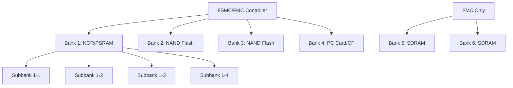
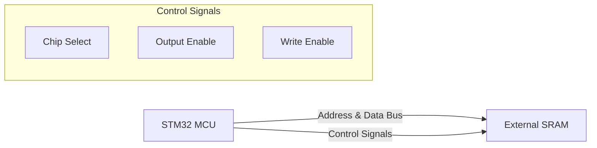

# STM32 FSMC/FMC

## Introduction

When working with STM32 microcontrollers, you might encounter situations where the internal memory is insufficient for your application. This is where the **Flexible Static Memory Controller (FSMC)** and its evolved version, the **Flexible Memory Controller (FMC)**, come into play. These peripherals enable STM32 microcontrollers to interface with external memory devices, expanding your system's capabilities significantly.

FSMC is featured in the older STM32 series (like STM32F1 and F2), while FMC is available in newer series (like STM32F4, F7, and H7). The FMC is an enhanced version with additional features but operates on similar principles.

In this tutorial, we'll explore:
- What FSMC/FMC is and why it's important
- How to configure and use these interfaces
- Practical applications with different external memories
- Code examples for common scenarios

## Understanding FSMC/FMC

### What is FSMC/FMC?

The FSMC/FMC is a peripheral that provides an interface between the STM32 microcontroller and various external memory devices, including:

- Static RAM (SRAM)
- NOR Flash memories
- NAND Flash memories
- PSRAM (Pseudo Static RAM)
- SDRAM (in FMC-equipped devices)
- LCD displays with parallel interfaces

The controller generates the appropriate control signals and timing to communicate with these external devices, abstracting away many hardware complexities.

### Memory Banks

FSMC/FMC divides the memory space into banks, each designed to interface with a specific type of memory:



The exact bank structure may vary depending on your specific STM32 model.

### Memory Mapping

One of the most powerful aspects of FSMC/FMC is memory mapping. When properly configured, external memory appears as part of the microcontroller's memory space, allowing you to read and write to it as easily as you would with internal memory.

For example, a common memory map might look like:

| Address Range           | Memory Type    |
|-------------------------|----------------|
| 0x60000000 - 0x6FFFFFFF | Bank 1 (NOR/PSRAM) |
| 0x70000000 - 0x7FFFFFFF | Bank 2 (NAND) |
| 0x80000000 - 0x8FFFFFFF | Bank 3 (NAND) |
| 0x90000000 - 0x9FFFFFFF | Bank 4 (PC Card) |
| 0xC0000000 - 0xCFFFFFFF | Bank 5 (SDRAM - FMC only) |
| 0xD0000000 - 0xDFFFFFFF | Bank 6 (SDRAM - FMC only) |

## Configuring FSMC/FMC

Let's look at the steps required to configure the FSMC/FMC:

### 1. Enable Clock for FSMC/FMC and GPIO Ports

```c
// Enable clocks for FSMC/FMC and required GPIO ports
RCC->AHB3ENR |= RCC_AHB3ENR_FMCEN;  // For FMC (or FSMC_EN for older devices)
RCC->AHB1ENR |= RCC_AHB1ENR_GPIOBEN | RCC_AHB1ENR_GPIODEN | RCC_AHB1ENR_GPIOEEN;
```

### 2. Configure GPIO Pins

The STM32 pins need to be configured for the FSMC/FMC alternate function:

```c
// Configure GPIO pins (example for STM32F4)
// Data lines
GPIOD->MODER |= 0x55555555;  // Set pins PD0-15 to alternate function mode
GPIOD->AFR[0] = 0x00000000 | (12 << 0) | (12 << 4) | (12 << 8) | (12 << 12) | (12 << 16) | (12 << 20) | (12 << 24) | (12 << 28);
GPIOD->AFR[1] = 0x00000000 | (12 << 0) | (12 << 4) | (12 << 8) | (12 << 12) | (12 << 16) | (12 << 20) | (12 << 24) | (12 << 28);

// Address lines
GPIOF->MODER |= 0x55555555;  // Set pins to alternate function mode
GPIOF->AFR[0] = 0x00000000 | (12 << 0) | (12 << 4) | (12 << 8) | (12 << 12) | (12 << 16) | (12 << 20) | (12 << 24) | (12 << 28);
GPIOF->AFR[1] = 0x00000000 | (12 << 0) | (12 << 4) | (12 << 8) | (12 << 12) | (12 << 16) | (12 << 20) | (12 << 24) | (12 << 28);

// Control signals
GPIOE->MODER |= 0x55555555;  // Set pins to alternate function mode
GPIOE->AFR[0] = 0x00000000 | (12 << 0) | (12 << 4) | (12 << 8) | (12 << 12) | (12 << 16) | (12 << 20) | (12 << 24) | (12 << 28);
```

A more readable approach using STM32 HAL:

```c
GPIO_InitTypeDef GPIO_InitStruct;

// Data pins
GPIO_InitStruct.Mode = GPIO_MODE_AF_PP;
GPIO_InitStruct.Pull = GPIO_NOPULL;
GPIO_InitStruct.Speed = GPIO_SPEED_FREQ_VERY_HIGH;
GPIO_InitStruct.Alternate = GPIO_AF12_FMC;

// Configure data pins (D0-D15)
GPIO_InitStruct.Pin = GPIO_PIN_0 | GPIO_PIN_1 | GPIO_PIN_8 | GPIO_PIN_9 |
                      GPIO_PIN_10 | GPIO_PIN_14 | GPIO_PIN_15;
HAL_GPIO_Init(GPIOD, &GPIO_InitStruct);

GPIO_InitStruct.Pin = GPIO_PIN_7 | GPIO_PIN_8 | GPIO_PIN_9 | GPIO_PIN_10 |
                      GPIO_PIN_11 | GPIO_PIN_12 | GPIO_PIN_13 | GPIO_PIN_14 | GPIO_PIN_15;
HAL_GPIO_Init(GPIOE, &GPIO_InitStruct);

// Address pins (A0-A17)
GPIO_InitStruct.Pin = GPIO_PIN_0 | GPIO_PIN_1 | GPIO_PIN_2 | GPIO_PIN_3 |
                      GPIO_PIN_4 | GPIO_PIN_5 | GPIO_PIN_12 | GPIO_PIN_13 |
                      GPIO_PIN_14 | GPIO_PIN_15;
HAL_GPIO_Init(GPIOF, &GPIO_InitStruct);

GPIO_InitStruct.Pin = GPIO_PIN_0 | GPIO_PIN_1 | GPIO_PIN_2 | GPIO_PIN_3 |
                      GPIO_PIN_4 | GPIO_PIN_5;
HAL_GPIO_Init(GPIOG, &GPIO_InitStruct);

// Control signals
GPIO_InitStruct.Pin = GPIO_PIN_0 | GPIO_PIN_1 | GPIO_PIN_4 | GPIO_PIN_5 | GPIO_PIN_7;
HAL_GPIO_Init(GPIOD, &GPIO_InitStruct);

GPIO_InitStruct.Pin = GPIO_PIN_0 | GPIO_PIN_1 | GPIO_PIN_7;
HAL_GPIO_Init(GPIOE, &GPIO_InitStruct);

GPIO_InitStruct.Pin = GPIO_PIN_9 | GPIO_PIN_10 | GPIO_PIN_11 | GPIO_PIN_12;
HAL_GPIO_Init(GPIOG, &GPIO_InitStruct);
```

### 3. Configure FSMC/FMC Timing and Control Parameters

The timing parameters are crucial for proper communication with external memory devices and vary based on the device's specifications:

```c
// For SRAM/NOR Flash
FSMC_Bank1->BTCR[0] = FSMC_BCR1_MWID_0 | FSMC_BCR1_WREN;  // 16-bit data bus, write enabled

// Timing configuration for Bank 1
FSMC_Bank1->BTCR[1] = (0 << 0) |   // Address setup time
                      (1 << 4) |   // Address hold time
                      (5 << 8) |   // Data setup time
                      (0 << 12) |  // Bus turnaround time
                      (0 << 16) |  // CLK division
                      (0 << 20) |  // Data latency
                      (0 << 24);   // Access mode

// Enable the FSMC Bank1
FSMC_Bank1->BTCR[0] |= FSMC_BCR1_MBKEN;
```

Using STM32 HAL:

```c
FMC_NORSRAM_InitTypeDef SRAM_InitStruct;
FMC_NORSRAM_TimingTypeDef SRAM_TimingStruct;

// Timing structure
SRAM_TimingStruct.AddressSetupTime = 0;
SRAM_TimingStruct.AddressHoldTime = 1;
SRAM_TimingStruct.DataSetupTime = 5;
SRAM_TimingStruct.BusTurnAroundDuration = 0;
SRAM_TimingStruct.CLKDivision = 0;
SRAM_TimingStruct.DataLatency = 0;
SRAM_TimingStruct.AccessMode = FMC_ACCESS_MODE_A;

// Init structure
SRAM_InitStruct.NSBank = FMC_NORSRAM_BANK1;
SRAM_InitStruct.DataAddressMux = FMC_DATA_ADDRESS_MUX_DISABLE;
SRAM_InitStruct.MemoryType = FMC_MEMORY_TYPE_SRAM;
SRAM_InitStruct.MemoryDataWidth = FMC_NORSRAM_MEM_BUS_WIDTH_16;
SRAM_InitStruct.BurstAccessMode = FMC_BURST_ACCESS_MODE_DISABLE;
SRAM_InitStruct.WaitSignalPolarity = FMC_WAIT_SIGNAL_POLARITY_LOW;
SRAM_InitStruct.WrapMode = FMC_WRAP_MODE_DISABLE;
SRAM_InitStruct.WaitSignalActive = FMC_WAIT_TIMING_BEFORE_WS;
SRAM_InitStruct.WriteOperation = FMC_WRITE_OPERATION_ENABLE;
SRAM_InitStruct.WaitSignal = FMC_WAIT_SIGNAL_DISABLE;
SRAM_InitStruct.ExtendedMode = FMC_EXTENDED_MODE_DISABLE;
SRAM_InitStruct.AsynchronousWait = FMC_ASYNCHRONOUS_WAIT_DISABLE;
SRAM_InitStruct.WriteBurst = FMC_WRITE_BURST_DISABLE;
SRAM_InitStruct.ContinuousClock = FMC_CONTINUOUS_CLOCK_SYNC_ONLY;

// Initialize FSMC/FMC
HAL_SRAM_Init(&hsram, &SRAM_TimingStruct, NULL);
```

## Practical Application: Interfacing with External SRAM

Let's look at a complete example of using FSMC/FMC to interface with an external SRAM chip.

### Hardware Setup



### Complete Example: Interfacing with IS61WV102416BLL SRAM (1Mbit)

```c
#include "stm32f4xx_hal.h"

// Define the base address for our SRAM (Bank 1, Region 1)
#define SRAM_BASE_ADDR         ((uint32_t)0x60000000)

SRAM_HandleTypeDef hsram1;
FMC_NORSRAM_TimingTypeDef SRAM_Timing;

void SRAM_Init(void) {
    /* GPIO Initialization */
    GPIO_InitTypeDef GPIO_InitStruct = {0};
    
    // Enable clocks
    __HAL_RCC_FMC_CLK_ENABLE();
    __HAL_RCC_GPIOD_CLK_ENABLE();
    __HAL_RCC_GPIOE_CLK_ENABLE();
    __HAL_RCC_GPIOF_CLK_ENABLE();
    __HAL_RCC_GPIOG_CLK_ENABLE();
    
    // Common GPIO configuration
    GPIO_InitStruct.Mode = GPIO_MODE_AF_PP;
    GPIO_InitStruct.Pull = GPIO_NOPULL;
    GPIO_InitStruct.Speed = GPIO_SPEED_FREQ_VERY_HIGH;
    GPIO_InitStruct.Alternate = GPIO_AF12_FMC;
    
    // GPIOD configuration
    GPIO_InitStruct.Pin = GPIO_PIN_0 | GPIO_PIN_1 | GPIO_PIN_4 | GPIO_PIN_5 |
                          GPIO_PIN_8 | GPIO_PIN_9 | GPIO_PIN_10 | GPIO_PIN_11 |
                          GPIO_PIN_12 | GPIO_PIN_13 | GPIO_PIN_14 | GPIO_PIN_15;
    HAL_GPIO_Init(GPIOD, &GPIO_InitStruct);
    
    // GPIOE configuration
    GPIO_InitStruct.Pin = GPIO_PIN_0 | GPIO_PIN_1 | GPIO_PIN_7 | GPIO_PIN_8 |
                          GPIO_PIN_9 | GPIO_PIN_10 | GPIO_PIN_11 | GPIO_PIN_12 |
                          GPIO_PIN_13 | GPIO_PIN_14 | GPIO_PIN_15;
    HAL_GPIO_Init(GPIOE, &GPIO_InitStruct);
    
    // GPIOF configuration
    GPIO_InitStruct.Pin = GPIO_PIN_0 | GPIO_PIN_1 | GPIO_PIN_2 | GPIO_PIN_3 |
                          GPIO_PIN_4 | GPIO_PIN_5 | GPIO_PIN_12 | GPIO_PIN_13 |
                          GPIO_PIN_14 | GPIO_PIN_15;
    HAL_GPIO_Init(GPIOF, &GPIO_InitStruct);
    
    // GPIOG configuration
    GPIO_InitStruct.Pin = GPIO_PIN_0 | GPIO_PIN_1 | GPIO_PIN_2 | GPIO_PIN_3 |
                          GPIO_PIN_4 | GPIO_PIN_5 | GPIO_PIN_10;
    HAL_GPIO_Init(GPIOG, &GPIO_InitStruct);
    
    /* FMC Configuration */
    // Timing configuration for read access
    SRAM_Timing.AddressSetupTime = 1;
    SRAM_Timing.AddressHoldTime = 1;
    SRAM_Timing.DataSetupTime = 2;
    SRAM_Timing.BusTurnAroundDuration = 0;
    SRAM_Timing.CLKDivision = 0;
    SRAM_Timing.DataLatency = 0;
    SRAM_Timing.AccessMode = FMC_ACCESS_MODE_A;

    // SRAM configuration
    hsram1.Instance = FMC_NORSRAM_DEVICE;
    hsram1.Extended = FMC_NORSRAM_EXTENDED_DEVICE;
    
    hsram1.Init.NSBank = FMC_NORSRAM_BANK1;
    hsram1.Init.DataAddressMux = FMC_DATA_ADDRESS_MUX_DISABLE;
    hsram1.Init.MemoryType = FMC_MEMORY_TYPE_SRAM;
    hsram1.Init.MemoryDataWidth = FMC_NORSRAM_MEM_BUS_WIDTH_16;
    hsram1.Init.BurstAccessMode = FMC_BURST_ACCESS_MODE_DISABLE;
    hsram1.Init.WaitSignalPolarity = FMC_WAIT_SIGNAL_POLARITY_LOW;
    hsram1.Init.WaitSignalActive = FMC_WAIT_TIMING_BEFORE_WS;
    hsram1.Init.WriteOperation = FMC_WRITE_OPERATION_ENABLE;
    hsram1.Init.WaitSignal = FMC_WAIT_SIGNAL_DISABLE;
    hsram1.Init.ExtendedMode = FMC_EXTENDED_MODE_DISABLE;
    hsram1.Init.AsynchronousWait = FMC_ASYNCHRONOUS_WAIT_DISABLE;
    hsram1.Init.WriteBurst = FMC_WRITE_BURST_DISABLE;
    hsram1.Init.ContinuousClock = FMC_CONTINUOUS_CLOCK_SYNC_ONLY;
    
    // Initialize the SRAM controller
    if (HAL_SRAM_Init(&hsram1, &SRAM_Timing, NULL) != HAL_OK) {
        Error_Handler();
    }
}

// Function to test SRAM
void SRAM_Test(void) {
    uint16_t *pSRAM = (uint16_t *)SRAM_BASE_ADDR;
    uint32_t sramSize = 0x20000; // 128 KBytes (1Mbit)
    uint32_t i;
    uint32_t errors = 0;
    
    // Write pattern
    for (i = 0; i < sramSize; i++) {
        pSRAM[i] = (uint16_t)i;
    }
    
    // Read and verify
    for (i = 0; i < sramSize; i++) {
        if (pSRAM[i] != (uint16_t)i) {
            errors++;
        }
    }
    
    if (errors == 0) {
        // Success - SRAM working correctly
        HAL_GPIO_WritePin(GPIOA, GPIO_PIN_5, GPIO_PIN_SET); // Turn on LED
    } else {
        // Failure - SRAM has errors
        HAL_GPIO_WritePin(GPIOA, GPIO_PIN_5, GPIO_PIN_RESET); // Turn off LED
    }
}

int main(void) {
    HAL_Init();
    SystemClock_Config();
    
    // Configure LED pin
    __HAL_RCC_GPIOA_CLK_ENABLE();
    GPIO_InitTypeDef GPIO_InitStruct = {0};
    GPIO_InitStruct.Pin = GPIO_PIN_5;
    GPIO_InitStruct.Mode = GPIO_MODE_OUTPUT_PP;
    GPIO_InitStruct.Pull = GPIO_NOPULL;
    GPIO_InitStruct.Speed = GPIO_SPEED_FREQ_LOW;
    HAL_GPIO_Init(GPIOA, &GPIO_InitStruct);
    
    // Initialize SRAM
    SRAM_Init();
    
    // Test SRAM
    SRAM_Test();
    
    while (1) {
        // Main application loop
    }
}
```

### Using the External SRAM

Once configured, you can access the external SRAM like regular memory:

```c
// To write data
*(uint16_t *)(SRAM_BASE_ADDR + offset) = data;

// To read data
uint16_t data = *(uint16_t *)(SRAM_BASE_ADDR + offset);
```

Or with arrays:

```c
uint16_t *sram_ptr = (uint16_t *)SRAM_BASE_ADDR;
sram_ptr[offset] = data;  // Write
data = sram_ptr[offset];  // Read
```

## Practical Application: Interfacing with LCD Display

Many graphic LCD modules use an interface similar to memory devices. Let's see how to connect an LCD using FSMC/FMC:

### Hardware Setup for an ILI9341 LCD Controller

```c
// This example assumes the LCD is connected to FMC Bank 1, region 1
// A0 pin of LCD is connected to A16 of FSMC/FMC (command/data selection)

#define LCD_COMMAND_REG ((uint32_t)0x60000000)  // Command register (A16=0)
#define LCD_DATA_REG    ((uint32_t)0x60020000)  // Data register (A16=1)

void LCD_Init(void) {
    // FSMC/FMC initialization (similar to SRAM example)
    
    // Reset the LCD
    HAL_GPIO_WritePin(GPIOB, GPIO_PIN_1, GPIO_PIN_RESET); // LCD_RST pin
    HAL_Delay(20);
    HAL_GPIO_WritePin(GPIOB, GPIO_PIN_1, GPIO_PIN_SET);
    HAL_Delay(50);
    
    // Send initialization commands to ILI9341
    LCD_WriteCommand(0x01); // Software Reset
    HAL_Delay(50);
    
    LCD_WriteCommand(0xCF);  // Power Control B
    LCD_WriteData(0x00);
    LCD_WriteData(0xC1);
    LCD_WriteData(0x30);
    
    LCD_WriteCommand(0xED);  // Power On Sequence Control
    LCD_WriteData(0x64);
    LCD_WriteData(0x03);
    LCD_WriteData(0x12);
    LCD_WriteData(0x81);
    
    // ... more initialization commands
    
    LCD_WriteCommand(0x29);  // Display ON
}

void LCD_WriteCommand(uint8_t command) {
    *(__IO uint16_t *)LCD_COMMAND_REG = command;
}

void LCD_WriteData(uint8_t data) {
    *(__IO uint16_t *)LCD_DATA_REG = data;
}

void LCD_DrawPixel(uint16_t x, uint16_t y, uint16_t color) {
    // Set X coordinate
    LCD_WriteCommand(0x2A);
    LCD_WriteData(x >> 8);
    LCD_WriteData(x & 0xFF);
    LCD_WriteData(x >> 8);
    LCD_WriteData(x & 0xFF);
    
    // Set Y coordinate
    LCD_WriteCommand(0x2B);
    LCD_WriteData(y >> 8);
    LCD_WriteData(y & 0xFF);
    LCD_WriteData(y >> 8);
    LCD_WriteData(y & 0xFF);
    
    // Write pixel color
    LCD_WriteCommand(0x2C);
    LCD_WriteData(color >> 8);
    LCD_WriteData(color & 0xFF);
}
```

## Interfacing with SDRAM (FMC Only)

The newer FMC peripheral supports SDRAM, which is different from static RAM and requires regular refresh operations. Here's how to configure it:

```c
#define SDRAM_BASE_ADDR ((uint32_t)0xC0000000)  // Bank 5

void SDRAM_Init(void) {
    // GPIO configuration similar to SRAM but with SDRAM specific pins
    
    FMC_SDRAM_TimingTypeDef SDRAM_Timing;
    FMC_SDRAM_CommandTypeDef command;
    
    // SDRAM timing parameters
    SDRAM_Timing.LoadToActiveDelay = 2;      // tMRD: 2 Clock cycles
    SDRAM_Timing.ExitSelfRefreshDelay = 7;   // tXSR: min 70ns
    SDRAM_Timing.SelfRefreshTime = 4;        // tRAS: min 42ns
    SDRAM_Timing.RowCycleDelay = 7;          // tRC:  min 63ns
    SDRAM_Timing.WriteRecoveryTime = 2;      // tWR:  2 Clock cycles
    SDRAM_Timing.RPDelay = 2;                // tRP:  min 15ns
    SDRAM_Timing.RCDDelay = 2;               // tRCD: min 15ns
    
    // SDRAM initialization sequence
    hsdram.Instance = FMC_SDRAM_DEVICE;
    hsdram.Init.SDBank = FMC_SDRAM_BANK1;
    hsdram.Init.ColumnBitsNumber = FMC_SDRAM_COLUMN_BITS_NUM_8;
    hsdram.Init.RowBitsNumber = FMC_SDRAM_ROW_BITS_NUM_12;
    hsdram.Init.MemoryDataWidth = FMC_SDRAM_MEM_BUS_WIDTH_16;
    hsdram.Init.InternalBankNumber = FMC_SDRAM_INTERN_BANKS_NUM_4;
    hsdram.Init.CASLatency = FMC_SDRAM_CAS_LATENCY_3;
    hsdram.Init.WriteProtection = FMC_SDRAM_WRITE_PROTECTION_DISABLE;
    hsdram.Init.SDClockPeriod = FMC_SDRAM_CLOCK_PERIOD_2;
    hsdram.Init.ReadBurst = FMC_SDRAM_RBURST_ENABLE;
    hsdram.Init.ReadPipeDelay = FMC_SDRAM_RPIPE_DELAY_0;
    
    // Initialize FMC for SDRAM
    HAL_SDRAM_Init(&hsdram, &SDRAM_Timing);
    
    // SDRAM initialization sequence
    
    // Clock enable command
    command.CommandMode = FMC_SDRAM_CMD_CLK_ENABLE;
    command.CommandTarget = FMC_SDRAM_CMD_TARGET_BANK1;
    command.AutoRefreshNumber = 1;
    command.ModeRegisterDefinition = 0;
    HAL_SDRAM_SendCommand(&hsdram, &command, 0x1000);
    HAL_Delay(1);
    
    // Precharge all command
    command.CommandMode = FMC_SDRAM_CMD_PALL;
    HAL_SDRAM_SendCommand(&hsdram, &command, 0x1000);
    
    // Auto-refresh command
    command.CommandMode = FMC_SDRAM_CMD_AUTOREFRESH_MODE;
    command.AutoRefreshNumber = 8;
    HAL_SDRAM_SendCommand(&hsdram, &command, 0x1000);
    
    // Load mode register
    command.CommandMode = FMC_SDRAM_CMD_LOAD_MODE;
    command.ModeRegisterDefinition = (3 << 0) |   // CAS Latency
                                    (0 << 3) |   // Burst Type
                                    (2 << 4) |   // Burst Length
                                    (1 << 9);    // Write Burst Mode
    HAL_SDRAM_SendCommand(&hsdram, &command, 0x1000);
    
    // Set refresh rate
    HAL_SDRAM_ProgramRefreshRate(&hsdram, 683); // Refresh rate ~7.81μs
}
```

### Using the SDRAM

```c
void SDRAM_Test(void) {
    uint32_t *pSDRAM = (uint32_t *)SDRAM_BASE_ADDR;
    uint32_t sdramSize = 0x800000; // 8MB
    uint32_t i;
    uint32_t errors = 0;
    
    // Write pattern
    for (i = 0; i < sdramSize / 4; i++) {
        pSDRAM[i] = i;
    }
    
    // Read and verify
    for (i = 0; i < sdramSize / 4; i++) {
        if (pSDRAM[i] != i) {
            errors++;
        }
    }
    
    if (errors == 0) {
        // SDRAM working correctly
    }
}
```

## Interfacing with NAND Flash (More Advanced)

NAND Flash has a different interface compared to SRAM/NOR. Here's a simplified example:

```c
void NAND_Init(void) {
    // GPIO configuration
    
    // NAND Flash configuration
    hNAND.Instance = FMC_NAND_DEVICE;
    hNAND.Init.NandBank = FMC_NAND_BANK3;
    hNAND.Init.Waitfeature = FMC_NAND_WAIT_FEATURE_ENABLE;
    hNAND.Init.MemoryDataWidth = FMC_NAND_MEM_BUS_WIDTH_8;
    hNAND.Init.EccComputation = FMC_NAND_ECC_ENABLE;
    hNAND.Init.ECCPageSize = FMC_NAND_ECC_PAGE_SIZE_512BYTE;
    hNAND.Init.TCLRSetupTime = 0;
    hNAND.Init.TARSetupTime = 0;
    
    // NAND Flash timing
    NAND_Timing.SetupTime = 1;
    NAND_Timing.WaitSetupTime = 3;
    NAND_Timing.HoldSetupTime = 2;
    NAND_Timing.HiZSetupTime = 1;
    
    HAL_NAND_Init(&hNAND, &NAND_Timing, &NAND_Timing);
}

// Reading a page from NAND Flash
void NAND_ReadPage(uint32_t page, uint8_t *buffer) {
    NAND_AddressTypeDef address;
    
    address.Page = page;
    address.Plane = 0;
    address.Block = page / PAGES_PER_BLOCK;