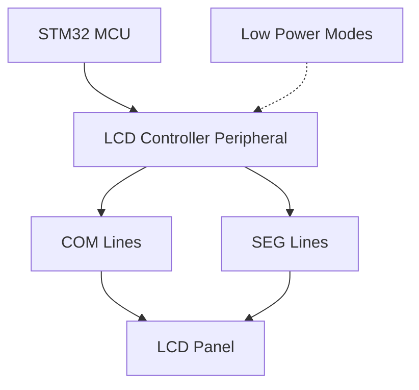

# STM32 LCD Controller

## Introduction

The STM32 microcontroller family includes a specialized LCD controller peripheral that allows you to drive LCD panels directly without the need for additional controller ICs. This feature is particularly valuable in low-power applications such as portable devices, medical equipment, and IoT sensors where energy efficiency is crucial.

In this tutorial, we'll explore how to use the STM32's built-in LCD controller while optimizing for low power consumption. You'll learn how to configure the controller, manage display updates efficiently, and implement power-saving techniques specific to LCD applications.

## Understanding the STM32 LCD Controller

The STM32 LCD controller is designed to interface with segment LCDs that are commonly found in applications requiring simple displays with low power requirements. These displays typically consist of:

- Multiple common (COM) lines
- Multiple segment (SEG) lines
- A matrix of pixels formed at the intersections

The controller supports various driving modes:

1. **Static**: A 1x4 multiplexing mode where each segment is directly controlled
2. **1/2 Duty**: A 2x8 multiplexing mode
3. **1/3 Duty**: A 3x12 multiplexing mode
4. **1/4 Duty**: A 4x16 multiplexing mode (most common)
5. **1/8 Duty**: An 8x28 multiplexing mode (supported on some STM32 models)



## Hardware Requirements

To follow this tutorial, you'll need:

- An STM32 microcontroller with an LCD controller (e.g., STM32L0, STM32L1, STM32L4 series)
- An LCD glass compatible with the STM32 (check your specific development board)
- STM32CubeIDE or another development environment
- Basic understanding of STM32 peripherals and the HAL library

## Basic LCD Controller Configuration

Let's start by configuring the LCD controller using the STM32 HAL library. First, we need to initialize the LCD controller with the appropriate parameters.

```c
/* LCD Controller Handle */
LCD_HandleTypeDef LcdHandle;

/* LCD Configuration */
void LCD_Config(void)
{
  /* Configure the LCD */
  LcdHandle.Instance = LCD;
  
  /* Set LCD duty to 1/4 (4 commons) */
  LcdHandle.Init.Duty = LCD_DUTY_1_4;
  
  /* Set LCD bias to 1/3 */
  LcdHandle.Init.Bias = LCD_BIAS_1_3;
  
  /* Configure voltage output for better contrast */
  LcdHandle.Init.VoltageSource = LCD_VOLTAGESOURCE_INTERNAL;
  
  /* Set contrast */
  LcdHandle.Init.Contrast = LCD_CONTRASTLEVEL_5;
  
  /* Set dead time (prevents crosstalk between frames) */
  LcdHandle.Init.DeadTime = LCD_DEADTIME_0;
  
  /* Set pulse on duration */
  LcdHandle.Init.PulseOnDuration = LCD_PULSEONDURATION_4;
  
  /* Set LCD prescaler to divide clock */
  LcdHandle.Init.MuxSegment = LCD_MUXSEGMENT_DISABLE;
  LcdHandle.Init.BlinkMode = LCD_BLINKMODE_OFF;
  LcdHandle.Init.BlinkFrequency = LCD_BLINKFREQUENCY_DIV32;
  
  /* Initialize the LCD */
  if (HAL_LCD_Init(&LcdHandle) != HAL_OK)
  {
    /* Initialization Error */
    Error_Handler();
  }
}
```

In the HAL_LCD_MspInit function, we need to configure the GPIO pins for the LCD controller:

```c
void HAL_LCD_MspInit(LCD_HandleTypeDef *hlcd)
{
  GPIO_InitTypeDef GPIO_InitStruct;
  
  /* Enable LCD clock */
  __HAL_RCC_LCD_CLK_ENABLE();
  
  /* Enable GPIO clocks */
  __HAL_RCC_GPIOA_CLK_ENABLE();
  __HAL_RCC_GPIOB_CLK_ENABLE();
  __HAL_RCC_GPIOC_CLK_ENABLE();
  
  /* Configure LCD COM pins */
  GPIO_InitStruct.Mode = GPIO_MODE_AF_PP;
  GPIO_InitStruct.Pull = GPIO_NOPULL;
  GPIO_InitStruct.Speed = GPIO_SPEED_FREQ_LOW;
  GPIO_InitStruct.Alternate = GPIO_AF11_LCD;
  
  /* COM0 */
  GPIO_InitStruct.Pin = LCD_COM0_PIN;
  HAL_GPIO_Init(LCD_COM0_PORT, &GPIO_InitStruct);
  
  /* COM1 */
  GPIO_InitStruct.Pin = LCD_COM1_PIN;
  HAL_GPIO_Init(LCD_COM1_PORT, &GPIO_InitStruct);
  
  /* COM2 */
  GPIO_InitStruct.Pin = LCD_COM2_PIN;
  HAL_GPIO_Init(LCD_COM2_PORT, &GPIO_InitStruct);
  
  /* COM3 */
  GPIO_InitStruct.Pin = LCD_COM3_PIN;
  HAL_GPIO_Init(LCD_COM3_PORT, &GPIO_InitStruct);
  
  /* Configure LCD SEG pins */
  /* ... Configure all segment pins similarly ... */
  
  /* Example for SEG0 */
  GPIO_InitStruct.Pin = LCD_SEG0_PIN;
  HAL_GPIO_Init(LCD_SEG0_PORT, &GPIO_InitStruct);
  
  /* ... Continue for all required segment pins ... */
}
```

## Writing to the LCD Display

Once the LCD controller is initialized, we can write data to the display. The STM32 LCD controller uses a RAM buffer where each bit represents a segment state (on/off). Let's create some utility functions to manage the display:

```c
/* Define positions for common display elements */
typedef enum {
  LCD_DIGIT_POSITION_1 = 0,
  LCD_DIGIT_POSITION_2,
  LCD_DIGIT_POSITION_3,
  LCD_DIGIT_POSITION_4,
  LCD_DIGIT_POSITION_5,
  LCD_DIGIT_POSITION_6,
  LCD_DIGIT_MAX
} LCD_DigitPosition_t;

/* Clear the LCD display */
void LCD_Clear(void)
{
  /* Clear all LCD registers */
  for(uint32_t i = 0; i < LCD_RAM_REGISTER_COUNT; i++)
  {
    HAL_LCD_Write(&LcdHandle, LCD_RAM_REGISTER0 + i, 0x00000000);
  }
  
  /* Update the LCD display */
  HAL_LCD_UpdateDisplayRequest(&LcdHandle);
}

/* Display a digit at a specified position */
void LCD_DisplayDigit(uint8_t digit, LCD_DigitPosition_t position)
{
  const uint32_t segments[10] = {
    0x3F, /* 0 */
    0x06, /* 1 */
    0x5B, /* 2 */
    0x4F, /* 3 */
    0x66, /* 4 */
    0x6D, /* 5 */
    0x7D, /* 6 */
    0x07, /* 7 */
    0x7F, /* 8 */
    0x6F  /* 9 */
  };
  
  uint32_t registerIndex = LCD_DIGIT_REGISTERS[position] / 4;
  uint32_t registerOffset = (LCD_DIGIT_REGISTERS[position] % 4) * 8;
  
  /* Clear old value */
  uint32_t oldValue;
  HAL_LCD_Read(&LcdHandle, LCD_RAM_REGISTER0 + registerIndex, &oldValue);
  oldValue &= ~(0xFF << registerOffset);
  
  /* Write new value */
  if (digit <= 9)
  {
    HAL_LCD_Write(&LcdHandle, LCD_RAM_REGISTER0 + registerIndex, 
                  oldValue | (segments[digit] << registerOffset));
  }
  
  /* Update the LCD display */
  HAL_LCD_UpdateDisplayRequest(&LcdHandle);
}

/* Display a number on the LCD */
void LCD_DisplayNumber(uint32_t number)
{
  uint8_t digit;
  uint8_t position = LCD_DIGIT_POSITION_1;
  
  /* Clear display first */
  LCD_Clear();
  
  /* Display each digit */
  do {
    digit = number % 10;
    LCD_DisplayDigit(digit, position);
    number /= 10;
    position++;
  } while ((number != 0) && (position < LCD_DIGIT_MAX));
}
```

## Low Power Optimization Techniques

Now, let's focus on optimizing the LCD controller for low power operation, which is crucial for battery-powered applications.

### 1. Using the LCD in Low Power Modes

The STM32 LCD controller can continue to operate in low-power modes, including Stop mode. This is one of its key advantages.

```c
void Enter_LowPower_Mode(void)
{
  /* Configure RTC for wake-up if needed */
  RTC_Config();
  
  /* Ensure LCD update is complete */
  while(LcdHandle.State == HAL_LCD_STATE_BUSY) { }
  
  /* Enter Stop mode */
  HAL_PWR_EnterSTOPMode(PWR_LOWPOWERREGULATOR_ON, PWR_STOPENTRY_WFI);
  
  /* System will wake up here when interrupted */
  
  /* Reconfigure system clock after waking up */
  SystemClock_Config();
}
```

### 2. LCD Update Optimization

To save power, minimize the frequency of LCD updates:

```c
/* Previous display values */
static uint32_t lastDisplayValue = 0xFFFFFFFF;

/* Display a number with power optimization */
void LCD_DisplayNumberOptimized(uint32_t number)
{
  /* Only update if the number has changed */
  if (number != lastDisplayValue)
  {
    uint8_t digit;
    uint8_t position = LCD_DIGIT_POSITION_1;
    uint32_t tempNumber = number;
    uint32_t tempLastValue = lastDisplayValue;
    
    /* Update only the digits that have changed */
    do {
      uint8_t newDigit = tempNumber % 10;
      uint8_t oldDigit = tempLastValue % 10;
      
      if (newDigit != oldDigit || lastDisplayValue == 0xFFFFFFFF)
      {
        LCD_DisplayDigit(newDigit, position);
      }
      
      tempNumber /= 10;
      tempLastValue /= 10;
      position++;
    } while ((tempNumber != 0 || tempLastValue != 0) && (position < LCD_DIGIT_MAX));
    
    /* Store current value for next comparison */
    lastDisplayValue = number;
    
    /* Update the LCD display */
    HAL_LCD_UpdateDisplayRequest(&LcdHandle);
  }
}
```

### 3. Frame Rate Control

Reducing the LCD refresh rate can significantly decrease power consumption:

```c
void LCD_ConfigureLowPowerFrameRate(void)
{
  /* Reduce prescaler for slower frame rate */
  __HAL_RCC_LCD_CONFIG(RCC_LCDCLKSOURCE_LSE);
  
  /* Configure LCD for low-frequency update */
  LcdHandle.Init.Prescaler = LCD_PRESCALER_32;
  LcdHandle.Init.ClockDivider = LCD_DIVIDER_16;
  
  /* Re-initialize LCD with new settings */
  if (HAL_LCD_Init(&LcdHandle) != HAL_OK)
  {
    /* Initialization Error */
    Error_Handler();
  }
}
```

### 4. Contrast Management

Dynamically adjusting the contrast based on ambient conditions can save power:

```c
void LCD_SetOptimizedContrast(uint8_t lightLevel)
{
  /* Map light level (0-255) to contrast level (0-7) */
  uint8_t contrastLevel = lightLevel / 36;
  if (contrastLevel > 7) contrastLevel = 7;
  
  /* Set new contrast level */
  __HAL_LCD_CONTRAST_CONFIG(&LcdHandle, contrastLevel);
}
```

## Complete Application Example

Let's put everything together in a complete low-power LCD application example that displays a temperature reading and updates at regular intervals:

```c
#include "main.h"
#include "stm32l0xx_hal.h"
#include "stm32l0xx_hal_lcd.h"

/* Private variables */
LCD_HandleTypeDef LcdHandle;
RTC_HandleTypeDef RtcHandle;
ADC_HandleTypeDef AdcHandle;

int main(void)
{
  /* MCU Configuration */
  HAL_Init();
  SystemClock_Config();
  
  /* Initialize all peripherals */
  MX_GPIO_Init();
  
  /* Configure the LCD */
  LCD_Config();
  
  /* Configure LCD for low power operation */
  LCD_ConfigureLowPowerFrameRate();
  
  /* Configure RTC for periodic wakeup */
  RTC_Config();
  
  /* Configure ADC for temperature reading */
  ADC_Config();
  
  /* Welcome message */
  LCD_DisplayText("HELLO");
  HAL_Delay(2000);
  
  /* Main application loop */
  while (1)
  {
    /* Read temperature */
    uint32_t temperature = ReadTemperature();
    
    /* Display temperature with power optimization */
    LCD_DisplayNumberOptimized(temperature);
    
    /* Enter low-power mode until next update */
    Enter_LowPower_Mode();
  }
}

/* Read temperature from internal sensor */
uint32_t ReadTemperature(void)
{
  uint32_t adcValue = 0;
  uint32_t temperature = 0;
  
  /* Enable ADC */
  HAL_ADC_Start(&AdcHandle);
  
  /* Wait for conversion to complete */
  if (HAL_ADC_PollForConversion(&AdcHandle, 100) == HAL_OK)
  {
    /* Get ADC value */
    adcValue = HAL_ADC_GetValue(&AdcHandle);
    
    /* Convert to temperature (simplified calculation) */
    temperature = ((adcValue * 3300 / 4096) - 760) / 25 + 25;
  }
  
  /* Disable ADC to save power */
  HAL_ADC_Stop(&AdcHandle);
  
  return temperature;
}

/* RTC configuration for periodic wakeup */
void RTC_Config(void)
{
  /* Configure RTC to wake up every 10 seconds */
  RtcHandle.Instance = RTC;
  RtcHandle.Init.HourFormat = RTC_HOURFORMAT_24;
  RtcHandle.Init.AsynchPrediv = 127;
  RtcHandle.Init.SynchPrediv = 255;
  RtcHandle.Init.OutPut = RTC_OUTPUT_DISABLE;
  RtcHandle.Init.OutPutPolarity = RTC_OUTPUT_POLARITY_HIGH;
  RtcHandle.Init.OutPutType = RTC_OUTPUT_TYPE_OPENDRAIN;
  
  if (HAL_RTC_Init(&RtcHandle) != HAL_OK)
  {
    Error_Handler();
  }
  
  /* Configure RTC wakeup timer */
  HAL_RTCEx_SetWakeUpTimer_IT(&RtcHandle, 10, RTC_WAKEUPCLOCK_CK_SPRE_16BITS);
}
```

## Power Consumption Analysis

When implemented correctly, the low-power techniques discussed above can dramatically reduce the power consumption of your STM32 application with an LCD display. Here's a comparison of power consumption in different scenarios:

| Mode | Conditions | Typical Current Consumption |
|------|------------|------------------------------|
| Normal Mode | LCD running, MCU active | 1.5 - 2.5 mA |
| Optimized | Lower refresh rate | 0.8 - 1.2 mA |
| Stop Mode | LCD on, MCU in Stop | 5 - 10 µA |
| Standby | LCD off | 1 - 3 µA |

## Troubleshooting Common Issues

### LCD Not Working or Showing Incorrect Segments

1. **Check GPIO Configuration**: Ensure all LCD pins are properly configured with the alternate function for LCD.
2. **Verify Clock Settings**: The LCD controller requires a low-speed clock, typically LSE (32.768 kHz).
3. **Check Contrast Settings**: If the display is too dim, adjust the contrast level.

### High Power Consumption

1. **Reduce Update Frequency**: Minimize how often you update the display.
2. **Check Stop Mode Configuration**: Ensure the MCU is properly entering low-power modes.
3. **Use Internal Voltage Source**: For lower power, configure the LCD to use the internal voltage source.

## Summary

In this tutorial, we've explored how to use the STM32's built-in LCD controller with a focus on low-power applications. We've covered:

1. Understanding the STM32 LCD controller architecture
2. Basic configuration of the LCD controller
3. Writing data to the LCD display
4. Low-power optimization techniques
5. A complete application example with temperature display

The STM32 LCD controller is a powerful peripheral that can drive segment LCD displays directly while maintaining ultra-low power consumption. By implementing the optimization techniques discussed in this tutorial, you can create LCD applications that operate for years on battery power.

## Additional Resources

- [STM32L0/L1/L4 Reference Manuals](https://www.st.com/en/microcontrollers-microprocessors/stm32-32-bit-arm-cortex-mcus.html)
- [STM32CubeL0/L1/L4 HAL Driver Documentation](https://www.st.com/en/embedded-software/stm32cubel0.html)
- [Application Note AN4061: LCD glass driver for STM32 microcontrollers](https://www.st.com/resource/en/application_note/an4061-lcd-glass-driver-for-stm32-microcontrollers-stmicroelectronics.pdf)

## Exercises

1. Modify the example to display both temperature and humidity readings, alternating between them every 5 seconds.
2. Implement a battery indicator using custom LCD segments.
3. Create a power-optimized clock application that displays time and date.
4. Add a light sensor to dynamically adjust the LCD contrast based on ambient light.
5. Implement an alarm feature that flashes specific segments when triggered.