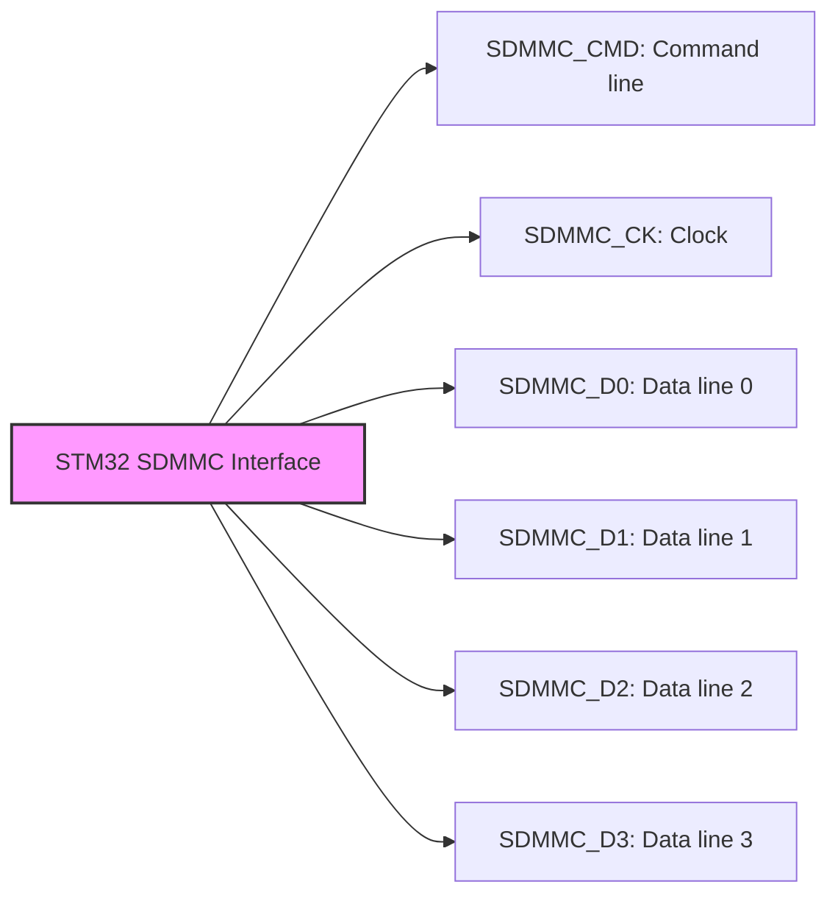

# STM32 SD/MMC Interface

## Introduction

The Secure Digital (SD) and MultiMediaCard (MMC) interface on STM32 microcontrollers provides a standardized way to communicate with SD/MMC memory cards and other compatible storage devices. This powerful peripheral allows your STM32 projects to read from and write to external storage, enabling applications like data logging, file systems, and multimedia projects.

In this tutorial, we'll explore how the SD/MMC interface works on STM32 microcontrollers, how to configure it properly, and implement practical examples for reading and writing data to SD cards.

## Understanding the SD/MMC Interface

### What is SD/MMC?

SD (Secure Digital) and MMC (MultiMediaCard) are popular flash memory card standards used in portable devices like cameras, smartphones, and embedded systems. The STM32's dedicated SDMMC peripheral allows direct communication with these storage devices using either:

1. **SD Bus Mode**: 1-bit or 4-bit data transfer
2. **SPI Mode**: Serial communication through the SPI interface

### Hardware Requirements

To work with the SDMMC interface, you'll need:

- An STM32 microcontroller with SDMMC peripheral (available on many STM32F4, F7, H7, and L4+ series)
- An SD card socket connected to the appropriate pins
- Pull-up resistors on command and data lines (typically 10kΩ)
- Proper power supply (3.3V for most applications)

### SDMMC Interface Pins

The STM32 SDMMC interface typically uses the following pins:



For 1-bit mode, only D0 is required for data transfer. For 4-bit mode, all data lines (D0-D3) are used.

## Setting Up the SD/MMC Interface

### Software Configuration

Let's walk through setting up the SDMMC peripheral using STM32CubeMX and the HAL library:

1. **Enable the SDMMC peripheral in CubeMX**:
   - Navigate to the Connectivity section
   - Select SDMMC with the desired mode (SD 4 bits is most common)
   - Configure the pins and clock settings

2. **Configure the SDMMC parameters**:
   - Set the appropriate clock divider (based on your system clock)
   - Choose data width (1-bit or 4-bit)
   - Configure hardware flow control if needed

Here's a screenshot of typical CubeMX settings:

```c
// Generated SDMMC configuration code
void MX_SDMMC1_SD_Init(void)
{
  hsd1.Instance = SDMMC1;
  hsd1.Init.ClockEdge = SDMMC_CLOCK_EDGE_RISING;
  hsd1.Init.ClockPowerSave = SDMMC_CLOCK_POWER_SAVE_DISABLE;
  hsd1.Init.BusWide = SDMMC_BUS_WIDE_4B;
  hsd1.Init.HardwareFlowControl = SDMMC_HARDWARE_FLOW_CONTROL_DISABLE;
  hsd1.Init.ClockDiv = 2;
}
```

### Initializing the SD Card

After configuring the hardware, we need to initialize communication with the SD card:

```c
/* SD card handler declaration */
SD_HandleTypeDef hsd1;

/* Buffer for reading/writing */
uint8_t buffer[512];

/* Initialize the SD card */
if (HAL_SD_Init(&hsd1) != HAL_OK)
{
  Error_Handler();
}

/* Configure the SD card in wide bus mode (4 bits) */
if (HAL_SD_ConfigWideBusOperation(&hsd1, SDMMC_BUS_WIDE_4B) != HAL_OK)
{
  Error_Handler();
}
```

## Basic SD Card Operations

### Reading from the SD Card

To read data from specific blocks on the SD card:

```c
/* Read a single block from the SD card */
HAL_StatusTypeDef read_block(uint32_t block_address)
{
  HAL_StatusTypeDef status;

  /* Read a block (512 bytes) */
  status = HAL_SD_ReadBlocks(&hsd1, buffer, block_address, 1, 1000);
  
  /* Wait for the operation to complete */
  if (status == HAL_OK)
  {
    status = HAL_SD_GetCardState(&hsd1);
    while (status != HAL_SD_CARD_TRANSFER)
    {
      status = HAL_SD_GetCardState(&hsd1);
    }
  }
  
  /* Process the data in the buffer */
  printf("Block data: %.32s...\r
", buffer);
  
  return status;
}
```

Example output:
```
Block data: FAT16   ...
```

### Writing to the SD Card

Similarly, writing data to the SD card:

```c
/* Write a single block to the SD card */
HAL_StatusTypeDef write_block(uint32_t block_address, uint8_t *data)
{
  HAL_StatusTypeDef status;
  
  /* Prepare the buffer with data */
  memcpy(buffer, data, 512);
  
  /* Write a block (512 bytes) */
  status = HAL_SD_WriteBlocks(&hsd1, buffer, block_address, 1, 1000);
  
  /* Wait for the operation to complete */
  if (status == HAL_OK)
  {
    status = HAL_SD_GetCardState(&hsd1);
    while (status != HAL_SD_CARD_TRANSFER)
    {
      status = HAL_SD_GetCardState(&hsd1);
    }
  }
  
  return status;
}
```

### Using DMA for Efficient Transfers

For better performance, you can configure the SDMMC peripheral to use DMA (Direct Memory Access):

```c
/* Read blocks using DMA for efficient transfer */
HAL_StatusTypeDef read_blocks_dma(uint32_t block_address, uint32_t num_blocks)
{
  HAL_StatusTypeDef status;
  
  /* Read multiple blocks using DMA */
  status = HAL_SD_ReadBlocks_DMA(&hsd1, buffer, block_address, num_blocks);
  
  return status;
}

/* Callback function called when DMA transfer completes */
void HAL_SD_RxCpltCallback(SD_HandleTypeDef *hsd)
{
  /* Transfer complete - process the data */
  printf("DMA read operation complete\r
");
}
```

## Implementing a File System

While direct block access is useful for some applications, most projects benefit from a proper file system. The FatFs library is commonly used with STM32 and SD cards.

### Setting Up FatFs

1. First, enable FatFs in CubeMX (Middleware -> FatFs)
2. Configure it for SD card usage
3. Implement the required interface functions

Here's a basic implementation of FATFS with the SDMMC interface:

```c
/* FatFs variables */
FATFS SDFatFS;  /* File system object for SD card logical drive */
FIL MyFile;     /* File object */
char SDPath[4]; /* SD card logical drive path */

/* Mount the file system */
void mount_filesystem(void)
{
  FRESULT res;
  
  /* Link the SD driver */
  FATFS_LinkDriver(&SD_Driver, SDPath);
  
  /* Mount the drive */
  res = f_mount(&SDFatFS, (TCHAR const*)SDPath, 0);
  
  if (res != FR_OK)
  {
    printf("f_mount error (%d)\r
", res);
    Error_Handler();
  }
  else
  {
    printf("SD card mounted successfully!\r
");
  }
}

/* Create and write to a file */
void write_file(void)
{
  FRESULT res;
  uint32_t byteswritten;
  
  /* Create a new file with write access */
  res = f_open(&MyFile, "STM32.TXT", FA_CREATE_ALWAYS | FA_WRITE);
  
  if (res != FR_OK)
  {
    printf("f_open error (%d)\r
", res);
    Error_Handler();
  }
  else
  {
    /* Write data to the file */
    res = f_write(&MyFile, "STM32 SD Card Demo", 18, (void *)&byteswritten);
    
    /* Close the file */
    f_close(&MyFile);
    
    printf("File created and data written!\r
");
  }
}

/* Read from a file */
void read_file(void)
{
  FRESULT res;
  uint32_t bytesread;
  char buffer[100];
  
  /* Open the file with read access */
  res = f_open(&MyFile, "STM32.TXT", FA_READ);
  
  if (res != FR_OK)
  {
    printf("f_open error (%d)\r
", res);
    Error_Handler();
  }
  else
  {
    /* Read data from the file */
    res = f_read(&MyFile, buffer, 99, (void *)&bytesread);
    
    if (res != FR_OK)
    {
      printf("f_read error (%d)\r
", res);
    }
    else
    {
      /* Null terminate the string */
      buffer[bytesread] = '\0';
      printf("File content: %s\r
", buffer);
    }
    
    /* Close the file */
    f_close(&MyFile);
  }
}
```

## Practical Examples

### Data Logger Example

Here's a complete example of a simple data logger that records temperature readings to an SD card:

```c
#include "main.h"
#include "fatfs.h"
#include "stdio.h"
#include "string.h"

extern SD_HandleTypeDef hsd1;
extern UART_HandleTypeDef huart1;
extern ADC_HandleTypeDef hadc1;

FATFS SDFatFS;
FIL LogFile;
char SDPath[4];
char buffer[100];

float read_temperature(void)
{
  uint32_t adcValue;
  float temperature;
  
  /* Start ADC conversion */
  HAL_ADC_Start(&hadc1);
  
  /* Wait for conversion to complete */
  HAL_ADC_PollForConversion(&hadc1, 100);
  
  /* Get ADC value */
  adcValue = HAL_ADC_GetValue(&hadc1);
  
  /* Convert to temperature (example calculation - adjust for your sensor) */
  temperature = (float)adcValue * 3.3 / 4096.0;
  temperature = temperature * 100.0 - 50.0;
  
  return temperature;
}

void setup_datalogger(void)
{
  FRESULT res;
  
  /* Link the SD driver */
  FATFS_LinkDriver(&SD_Driver, SDPath);
  
  /* Mount the drive */
  res = f_mount(&SDFatFS, (TCHAR const*)SDPath, 0);
  
  if (res != FR_OK)
  {
    printf("Failed to mount SD card (%d)\r
", res);
    Error_Handler();
  }
  
  /* Create and open log file */
  res = f_open(&LogFile, "TEMPLOG.CSV", FA_CREATE_ALWAYS | FA_WRITE);
  
  if (res != FR_OK)
  {
    printf("Failed to create log file (%d)\r
", res);
    Error_Handler();
  }
  
  /* Write header to file */
  f_printf(&LogFile, "Time (ms),Temperature (C)\r
");
  f_close(&LogFile);
  
  printf("Data logger initialized successfully\r
");
}

void log_temperature(void)
{
  FRESULT res;
  float temp;
  uint32_t time;
  
  /* Read current temperature */
  temp = read_temperature();
  
  /* Get current time */
  time = HAL_GetTick();
  
  /* Format data string */
  sprintf(buffer, "%lu,%.2f\r
", time, temp);
  
  /* Open file for appending */
  res = f_open(&LogFile, "TEMPLOG.CSV", FA_OPEN_APPEND | FA_WRITE);
  
  if (res == FR_OK)
  {
    /* Write data */
    f_puts(buffer, &LogFile);
    
    /* Close the file */
    f_close(&LogFile);
    
    printf("Logged: %s", buffer);
  }
  else
  {
    printf("Failed to open log file (%d)\r
", res);
  }
}

int main(void)
{
  /* MCU Configuration */
  HAL_Init();
  SystemClock_Config();
  
  /* Initialize peripherals */
  MX_GPIO_Init();
  MX_SDMMC1_SD_Init();
  MX_FATFS_Init();
  MX_USART1_UART_Init();
  MX_ADC1_Init();
  
  /* Setup data logger */
  setup_datalogger();
  
  /* Main loop */
  while (1)
  {
    /* Log temperature every second */
    log_temperature();
    
    /* Wait 1 second */
    HAL_Delay(1000);
  }
}
```

## Advanced Topics

### Card Detection and Handling

In real-world applications, you'll want to detect when an SD card is inserted or removed:

```c
/* SD card detection GPIO pin */
#define SD_DETECT_PIN GPIO_PIN_8
#define SD_DETECT_GPIO_PORT GPIOI

bool is_sd_card_present(void)
{
  /* Card detection pin is usually pulled high when no card is inserted */
  /* and pulled low when a card is inserted */
  return (HAL_GPIO_ReadPin(SD_DETECT_GPIO_PORT, SD_DETECT_PIN) == GPIO_PIN_RESET);
}

void check_sd_card_status(void)
{
  static bool was_inserted = false;
  bool is_inserted = is_sd_card_present();
  
  /* Card was just inserted */
  if (is_inserted && !was_inserted)
  {
    printf("SD card inserted!\r
");
    
    /* Initialize the SD card */
    if (HAL_SD_Init(&hsd1) == HAL_OK)
    {
      /* Mount file system */
      mount_filesystem();
    }
    else
    {
      printf("Failed to initialize SD card\r
");
    }
  }
  
  /* Card was just removed */
  else if (!is_inserted && was_inserted)
  {
    printf("SD card removed!\r
");
    
    /* Unmount file system */
    f_mount(NULL, (TCHAR const*)SDPath, 0);
  }
  
  /* Update state */
  was_inserted = is_inserted;
}
```

### Error Handling

Robust SD card error handling is essential for reliable applications:

```c
const char* sd_error_to_string(HAL_SD_ErrorTypedef error)
{
  switch (error)
  {
    case HAL_SD_ERROR_NONE: return "No error";
    case HAL_SD_ERROR_CMD_CRC_FAIL: return "Command response CRC check failed";
    case HAL_SD_ERROR_DATA_CRC_FAIL: return "Data block CRC check failed";
    case HAL_SD_ERROR_CMD_RSP_TIMEOUT: return "Command response timeout";
    case HAL_SD_ERROR_DATA_TIMEOUT: return "Data timeout";
    case HAL_SD_ERROR_TX_UNDERRUN: return "Transmit FIFO underrun";
    case HAL_SD_ERROR_RX_OVERRUN: return "Receive FIFO overrun";
    case HAL_SD_ERROR_ADDR_MISALIGNED: return "Misaligned address";
    case HAL_SD_ERROR_BLOCK_LEN_ERR: return "Block length error";
    case HAL_SD_ERROR_ERASE_SEQ_ERR: return "Erase sequence error";
    case HAL_SD_ERROR_BAD_ERASE_PARAM: return "Bad erase parameter";
    case HAL_SD_ERROR_WRITE_PROT_VIOLATION: return "Write protect violation";
    case HAL_SD_ERROR_LOCK_UNLOCK_FAILED: return "Lock/unlock failed";
    case HAL_SD_ERROR_COM_CRC_FAILED: return "Communication CRC failed";
    case HAL_SD_ERROR_ILLEGAL_CMD: return "Illegal command";
    case HAL_SD_ERROR_CARD_ECC_FAILED: return "Card ECC failed";
    case HAL_SD_ERROR_CC_ERR: return "Card controller error";
    case HAL_SD_ERROR_GENERAL_UNKNOWN_ERR: return "General/unknown error";
    case HAL_SD_ERROR_STREAM_READ_UNDERRUN: return "Stream read underrun";
    case HAL_SD_ERROR_STREAM_WRITE_OVERRUN: return "Stream write overrun";
    case HAL_SD_ERROR_CID_CSD_OVERWRITE: return "CID/CSD overwrite";
    case HAL_SD_ERROR_WP_ERASE_SKIP: return "Write protect erase skip";
    case HAL_SD_ERROR_CARD_ECC_DISABLED: return "Card ECC disabled";
    case HAL_SD_ERROR_ERASE_RESET: return "Erase reset";
    case HAL_SD_ERROR_AKE_SEQ_ERR: return "Authentication sequence error";
    case HAL_SD_ERROR_INVALID_VOLTRANGE: return "Invalid voltage range";
    case HAL_SD_ERROR_ADDR_OUT_OF_RANGE: return "Address out of range";
    case HAL_SD_ERROR_REQUEST_NOT_APPLICABLE: return "Request not applicable";
    case HAL_SD_ERROR_PARAM: return "Invalid parameter";
    case HAL_SD_ERROR_UNSUPPORTED_FEATURE: return "Unsupported feature";
    case HAL_SD_ERROR_BUSY: return "Card is busy";
    case HAL_SD_ERROR_DMA: return "DMA error";
    case HAL_SD_ERROR_TIMEOUT: return "Timeout error";
    default: return "Unknown error";
  }
}

void handle_sd_error(HAL_SD_ErrorTypedef error)
{
  printf("SD card error: %s\r
", sd_error_to_string(error));
  
  /* Attempt recovery */
  HAL_SD_DeInit(&hsd1);
  HAL_Delay(100);
  HAL_SD_Init(&hsd1);
}
```

### Performance Optimization

To achieve maximum performance with the SD/MMC interface:

1. **Use DMA for all transfers** - This frees up the CPU during data transfers
2. **Increase clock speed** - Higher clock rates increase transfer speeds
3. **Use multiple block transfers** - More efficient than single block operations
4. **Implement a sector cache** - Reduces redundant reads/writes
5. **Enable the SDMMC peripheral's clock divide factor** - Balance between speed and stability

```c
/* Optimize SDMMC performance */
void optimize_sdmmc_performance(void)
{
  /* Set higher clock speed (adjust based on your system clock) */
  /* Lower divider = higher speed */
  hsd1.Init.ClockDiv = 1;
  
  /* Enable hardware flow control for high-speed transfers */
  hsd1.Init.HardwareFlowControl = SDMMC_HARDWARE_FLOW_CONTROL_ENABLE;
  
  /* Re-initialize with new settings */
  HAL_SD_DeInit(&hsd1);
  HAL_SD_Init(&hsd1);
  
  /* Configure data width */
  HAL_SD_ConfigWideBusOperation(&hsd1, SDMMC_BUS_WIDE_4B);
}
```

## Troubleshooting Common Issues

When working with the SD/MMC interface, you might encounter these common issues:

### 1. Initialization Failures
- Check power supply (SD cards need stable 3.3V)
- Verify pull-up resistors on CMD and DATA lines
- Ensure proper card insertion
- Try a different SD card (some cards may not be compatible)

### 2. Communication Errors
- Lower the clock speed (start with higher divider values)
- Check for signal integrity issues (proper routing, cable length)
- Verify hardware flow control settings
- Check for proper grounding

### 3. File System Issues
- Format the card using FAT32 for cards >4GB
- Use smaller cluster sizes for better performance with small files
- Verify the card is properly mounted before file operations

## Summary

The STM32 SD/MMC interface provides a powerful way to add external storage to your embedded projects. In this tutorial, we've covered:

- How the SD/MMC interface works on STM32 microcontrollers
- Setting up and configuring the hardware and software
- Basic read and write operations
- Implementing a file system with FatFs
- Building a practical data logger application
- Advanced topics including card detection and error handling
- Performance optimization tips
- Common troubleshooting strategies

With these skills, you can now integrate SD card storage into your STM32 projects for data logging, configuration storage, firmware updates, and multimedia applications.

## Additional Resources

To deepen your understanding of the STM32 SD/MMC interface:

- STM32 Reference Manual (RM0090 for STM32F4, etc.) - SDMMC controller section
- AN4748: Using the STM32 SDMMC interface with the STM32Cube firmware
- FatFs documentation: http://elm-chan.org/fsw/ff/00index_e.html
- SD Association specifications: https://www.sdcard.org/developers/

## Exercises

1. Modify the data logger example to record multiple sensor readings.
2. Implement a configuration system that stores settings in a JSON file on the SD card.
3. Create a simple audio player that reads WAV files from the SD card.
4. Implement a backup system that copies important data to the SD card when power is lost.
5. Build a file browser interface that can be controlled via UART commands.