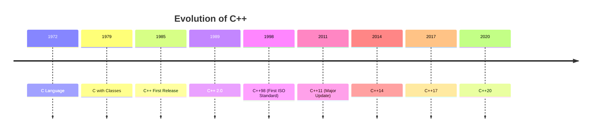
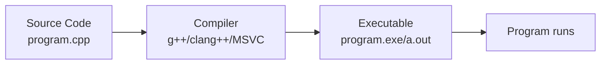

# C++ Introduction

Welcome to the world of C++! This introduction will help you understand what C++ is, why it's important, and how to write your first C++ program.

## What is C++?

<div style={{
    "width": "20%",
    "margin": "0 auto",
    "text-align": "center"
}}>
    
</div>

C++ (pronounced "see plus plus") is a powerful general-purpose programming language created by Bjarne Stroustrup in 1985 as an extension of the C programming language. It was designed to enhance C with object-oriented features while maintaining the efficiency and control that C provides.



## Why Learn C++?

C++ continues to be one of the most popular programming languages for several reasons:

1. **Performance**: C++ provides high performance and efficient memory management
2. **Versatility**: Used in game development, system software, embedded systems, and more
3. **Control**: Offers low-level memory manipulation alongside high-level abstractions
4. **Industry Demand**: Still widely used in many industries, from finance to gaming
5. **Foundation**: Learning C++ makes it easier to understand other programming languages

## Basic Structure of a C++ Program

Let's look at the structure of a simple C++ program:

```cpp
// This is a comment - it's not executed

#include <iostream>  // This includes the input/output library

// The main function - every C++ program starts execution here
int main() {
    // Print a message to the console
    std::cout << "Hello, World!" << std::endl;
    
    // Return 0 to indicate successful execution
    return 0;
}
```

When you run this program, you'll see:

```
Hello, World!
```

Let's break down the components:

1. **Comments**: Anything after `//` is a comment and is ignored by the compiler
2. **Include Directive**: `#include <iostream>` tells the compiler to include the standard input/output library
3. **Main Function**: Every C++ program must have a `main()` function, which is the entry point
4. **Standard Output**: `std::cout` is used to output text to the console
5. **Return Statement**: `return 0` indicates that the program executed successfully

## Basic Syntax Elements

### Variables and Data Types

In C++, you must declare variables with their types before using them:

```cpp
#include <iostream>

int main() {
    // Integer variable
    int age = 25;
    
    // Floating-point variable
    double height = 5.9;
    
    // Character variable
    char grade = 'A';
    
    // Boolean variable
    bool isStudent = true;
    
    // String (text) variable
    std::string name = "John";
    
    // Output the values
    std::cout << "Name: " << name << std::endl;
    std::cout << "Age: " << age << std::endl;
    std::cout << "Height: " << height << " feet" << std::endl;
    std::cout << "Grade: " << grade << std::endl;
    std::cout << "Is student: " << isStudent << std::endl;
    
    return 0;
}
```

Output:
```
Name: John
Age: 25
Height: 5.9 feet
Grade: A
Is student: 1
```

Note: Boolean values are displayed as `1` (true) or `0` (false) by default.

### Input and Output

C++ uses `cin` for input and `cout` for output:

```cpp
#include <iostream>
#include <string>

int main() {
    std::string name;
    int age;
    
    // Ask for user's name
    std::cout << "Enter your name: ";
    std::getline(std::cin, name);
    
    // Ask for user's age
    std::cout << "Enter your age: ";
    std::cin >> age;
    
    // Display the information
    std::cout << "Hello, " << name << "!" << std::endl;
    std::cout << "You are " << age << " years old." << std::endl;
    
    return 0;
}
```

Example interaction:
```
Enter your name: Sarah Johnson
Enter your age: 28
Hello, Sarah Johnson!
You are 28 years old.
```

## Compiling and Running C++ Programs

Unlike interpreted languages like Python, C++ needs to be compiled before it can be executed. Here's a simple workflow:

1. **Write code**: Create a file with a `.cpp` extension (e.g., `program.cpp`)
2. **Compile**: Use a C++ compiler to convert your code to an executable
3. **Execute**: Run the resulting executable file



Common compilation commands:

```bash
# Using g++ (GNU Compiler)
g++ program.cpp -o program

# Using clang++
clang++ program.cpp -o program

# To run the program (Linux/Mac)
./program

# To run the program (Windows)
program.exe
```

## Real-World Applications of C++

C++ is used in numerous applications and industries:

1. **Game Development**: Many game engines like Unreal Engine use C++
2. **Operating Systems**: Parts of Windows, Linux, and macOS are written in C++
3. **Database Systems**: MySQL, MongoDB, and other database systems
4. **Web Browsers**: Chrome, Firefox, and Safari have components written in C++
5. **Financial Systems**: High-frequency trading platforms often use C++
6. **Embedded Systems**: From smart TVs to automotive software
7. **Graphics Applications**: Adobe Photoshop and other creative tools

### Real-World Example: Simple Calculator

Here's a basic calculator that shows C++ in action:

```cpp
#include <iostream>

int main() {
    double num1, num2;
    char operation;
    
    std::cout << "Simple Calculator" << std::endl;
    std::cout << "----------------" << std::endl;
    
    // Get first number
    std::cout << "Enter first number: ";
    std::cin >> num1;
    
    // Get operation
    std::cout << "Enter operation (+, -, *, /): ";
    std::cin >> operation;
    
    // Get second number
    std::cout << "Enter second number: ";
    std::cin >> num2;
    
    // Perform calculation based on operation
    switch (operation) {
        case '+':
            std::cout << num1 << " + " << num2 << " = " << (num1 + num2) << std::endl;
            break;
        case '-':
            std::cout << num1 << " - " << num2 << " = " << (num1 - num2) << std::endl;
            break;
        case '*':
            std::cout << num1 << " * " << num2 << " = " << (num1 * num2) << std::endl;
            break;
        case '/':
            if (num2 != 0)
                std::cout << num1 << " / " << num2 << " = " << (num1 / num2) << std::endl;
            else
                std::cout << "Error: Division by zero!" << std::endl;
            break;
        default:
            std::cout << "Error: Invalid operation!" << std::endl;
    }
    
    return 0;
}
```

Example run:
```
Simple Calculator
----------------
Enter first number: 10
Enter operation (+, -, *, /): *
Enter second number: 5
10 * 5 = 50
```

## Summary

In this introduction to C++, we've covered:

- The history and importance of C++
- The basic structure of a C++ program
- Variables and data types
- Input and output operations
- How to compile and run C++ programs
- Real-world applications and a simple example

C++ might seem challenging at first, but with practice, you'll appreciate its power and flexibility. As you continue your C++ journey, you'll learn about more advanced features like functions, classes, object-oriented programming, and much more.

## Additional Resources

Here are some resources to help you continue learning:

- [cplusplus.com](http://www.cplusplus.com/) - Comprehensive C++ resource with tutorials and references
- [cppreference.com](https://en.cppreference.com/) - Detailed reference for C++ language and standard library
- [learncpp.com](https://www.learncpp.com/) - Free, comprehensive C++ tutorial

## Exercises

1. Modify the "Hello, World!" program to print your name
2. Create a program that converts temperatures from Celsius to Fahrenheit
3. Write a program that calculates the area of a rectangle
4. Create a simple program that asks the user for their birth year and calculates their age
5. Extend the calculator program to include percentage and exponent operations

Happy coding!