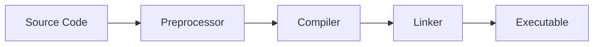

# C++ Environment Setup

Welcome to the first practical step in your C++ journey! Before you can start writing C++ programs, you need to set up your development environment. This guide will walk you through the process of setting up everything you need to write, compile, and run C++ programs on Windows, macOS, and Linux.

## Introduction

A C++ development environment typically consists of:

1. A **C++ compiler** that converts your source code into executable programs
2. A **text editor** or **Integrated Development Environment (IDE)** for writing code
3. Optional **libraries** and **tools** that enhance your development experience

Setting up your environment correctly is crucial for a smooth development experience. Let's explore how to set up these components on different operating systems.

## Setting Up on Windows

Windows offers several options for C++ development. Here are the most popular ones:

### Option 1: Visual Studio (Recommended for beginners)

Visual Studio is Microsoft's full-featured IDE that provides everything you need in one package.

#### Installation Steps:

1. **Download Visual Studio Community Edition** (free for individual developers) from [Visual Studio's website](https://visualstudio.microsoft.com/downloads/)
2. Run the installer and select "Desktop development with C++" workload
3. Wait for the installation to complete


#### Creating Your First Project:

1. Open Visual Studio
2. Select "Create a new project"
3. Choose "Console App" under C++ templates
4. Name your project and click "Create"
5. Replace the default code with this simple "Hello World" program:

```cpp
#include <iostream>

int main() {
    std::cout << "Hello, World!" << std::endl;
    return 0;
}
```

6. Press F5 to build and run your program

**Expected Output:**
```
Hello, World!
```

### Option 2: MinGW (For a lightweight setup)

MinGW (Minimalist GNU for Windows) provides the GCC compiler collection for Windows.

#### Installation Steps:

1. Download MinGW installer from [MinGW's website](https://sourceforge.net/projects/mingw/)
2. Run the installer and select the C++ compiler
3. Add MinGW's bin directory to your system PATH
4. Use a text editor like Visual Studio Code, Notepad++, or Sublime Text

## Setting Up on macOS

macOS comes with a pre-installed C++ compiler (Clang) but you'll need to set it up properly.

### Option 1: Using Xcode Command Line Tools

1. Open Terminal
2. Run the following command:

```bash
xcode-select --install
```

3. Follow the prompts to install the command-line tools

### Option 2: Using Xcode (Full IDE)

1. Download Xcode from the Mac App Store
2. Open Xcode and complete the installation
3. Create a new Command Line Tool project and select C++ as the language

### Verifying Your Installation

To verify your C++ compiler is correctly installed:

1. Open Terminal
2. Type the following command:

```bash
g++ --version
```

You should see version information for the C++ compiler.

## Setting Up on Linux

Linux distributions usually make it easy to install C++ development tools.

### For Ubuntu/Debian:

1. Open Terminal
2. Update your package lists:

```bash
sudo apt update
```

3. Install the build essentials package:

```bash
sudo apt install build-essential
```

This will install GCC/G++ and other necessary tools.

### For Fedora/RHEL:

```bash
sudo dnf install gcc-c++ make
```

### For Arch Linux:

```bash
sudo pacman -S gcc make
```

## Code Editors and IDEs

While a compiler is all you need to compile code, a good editor or IDE can significantly improve your coding experience:

### Popular Text Editors:

- **Visual Studio Code**: A free, lightweight, and powerful editor with excellent C++ support through extensions
- **Sublime Text**: A fast and minimalist editor popular among developers
- **Atom**: A hackable text editor with good community support
- **Vim/Emacs**: Advanced text editors with steep learning curves but powerful capabilities

### Popular IDEs for C++:

- **Visual Studio**: Best on Windows (as mentioned above)
- **CLion**: A commercial cross-platform IDE by JetBrains (free for students)
- **Qt Creator**: Good for cross-platform development, especially with Qt framework
- **Eclipse with C/C++ Development Tools (CDT)**: A free, open-source option

## Creating and Running Your First C++ Program

Let's create a simple program to verify your setup:

1. Create a new file named `hello.cpp` in your preferred editor
2. Add the following code:

```cpp
#include <iostream>

int main() {
    std::cout << "Hello, C++ World!" << std::endl;
    std::cout << "My C++ environment is set up correctly!" << std::endl;
    return 0;
}
```

3. Compile your program:

**On Windows (MinGW):**
```bash
g++ hello.cpp -o hello
```

**On macOS/Linux:**
```bash
g++ hello.cpp -o hello
```

4. Run your program:

**On Windows:**
```bash
hello
```

**On macOS/Linux:**
```bash
./hello
```

**Expected Output:**
```
Hello, C++ World!
My C++ environment is set up correctly!
```

## Understanding the Basic Compilation Process

When you compile a C++ program, several steps occur:



1. **Preprocessing**: Handles directives like `#include` and `#define`
2. **Compilation**: Converts C++ code to machine code
3. **Linking**: Combines object files and libraries into an executable

## Helpful Compiler Options

The C++ compiler offers many options to customize compilation:

```cpp
// Compile with warnings enabled (recommended for beginners)
g++ -Wall hello.cpp -o hello

// Compile with modern C++ standard (C++17)
g++ -std=c++17 hello.cpp -o hello

// Compile with debugging information
g++ -g hello.cpp -o hello
```

## Setting Up for Larger Projects

For real-world projects with multiple files, consider learning:

- **Makefiles**: Scripts that automate compilation of complex projects
- **CMake**: A cross-platform build system generator
- **Build systems** within IDEs like Visual Studio

Here's a simple Makefile example for a project with two source files:

```makefile
all: myprogram

myprogram: main.o utils.o
	g++ main.o utils.o -o myprogram

main.o: main.cpp
	g++ -c main.cpp

utils.o: utils.cpp
	g++ -c utils.cpp

clean:
	rm -f *.o myprogram
```

## Troubleshooting Common Setup Issues

### "Command not found" errors

This usually means the compiler isn't in your PATH. Add the compiler's directory to your system's PATH variable.

### Compiler errors about missing libraries

Install the necessary development libraries for your system:

**Ubuntu/Debian example:**
```bash
sudo apt install libboost-all-dev
```

### Permission denied when running executables on Linux/macOS

Make the file executable:
```bash
chmod +x ./hello
```

## Summary

Setting up a proper C++ development environment is the first crucial step in your programming journey. In this guide, you've learned how to:

- Install C++ compilers on Windows, macOS, and Linux
- Set up and use different text editors and IDEs
- Create, compile, and run a simple C++ program
- Understand basic compiler options
- Prepare for larger projects

With your environment now set up, you're ready to start writing C++ code! In the next sections, we'll dive into the fundamentals of C++ programming.

## Exercises

1. Set up a C++ development environment on your computer
2. Create and run the "Hello, World!" program
3. Try compiling with different compiler flags like `-Wall` and observe any warnings
4. Create a program that uses `#include <cmath>` to calculate the square root of a number to verify library linking
5. Experiment with a different IDE or text editor than your initial choice to find what works best for you

## Additional Resources

- [C++ Reference](https://en.cppreference.com/w/) - Comprehensive reference for C++ standard library
- [Microsoft's C++ Documentation](https://docs.microsoft.com/en-us/cpp/) - Excellent resource for Visual Studio users
- [GCC Documentation](https://gcc.gnu.org/onlinedocs/) - Complete documentation for the GCC compiler
- [Visual Studio Code C++ Extension Guide](https://code.visualstudio.com/docs/languages/cpp) - Setting up VS Code for C++ development

Now that your environment is ready, let's move on to learning the fundamental concepts of C++!