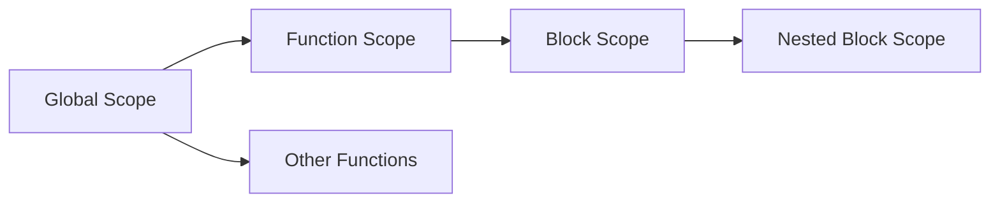

# C++ Scope

## Introduction

In C++, **scope** refers to the region of code where a variable or other identifier is accessible. Understanding scope is crucial because it determines:

- Where variables can be accessed
- How long variables exist in memory
- How to avoid naming conflicts between variables

Proper management of scope is essential for writing clean, maintainable code and avoiding bugs related to variable visibility. In this tutorial, we'll explore the different types of scope in C++ and how they affect your programs.

## Types of Scope in C++

C++ has several types of scope:

1. **Local scope (function scope)**
2. **Global scope**
3. **Block scope**
4. **Class scope** (which we'll cover in object-oriented programming)
5. **Namespace scope**

Let's explore each of these in detail.

## Local Scope

Variables declared inside a function are said to have **local scope**. These variables:

- Are created when the function is called
- Are destroyed when the function exits
- Can only be accessed within that function

```cpp
#include <iostream>
using namespace std;

void demonstrateLocalScope() {
    int localVar = 10; // This is a local variable
    cout << "Inside function: localVar = " << localVar << endl;
}

int main() {
    demonstrateLocalScope();
    
    // Uncommenting the line below would cause a compilation error
    // cout << "In main: localVar = " << localVar << endl;
    
    return 0;
}
```

**Output:**
```
Inside function: localVar = 10
```

In this example, `localVar` is only accessible within the `demonstrateLocalScope()` function. Trying to access it from `main()` would result in a compilation error.

### Function Parameters

Function parameters also have local scope:

```cpp
#include <iostream>
using namespace std;

void exampleFunction(int parameter) {  // parameter has local scope
    cout << "Parameter value: " << parameter << endl;
    parameter = 20;  // Modifying the parameter doesn't affect the original argument
    cout << "Modified parameter: " << parameter << endl;
}

int main() {
    int value = 10;
    cout << "Before function call: value = " << value << endl;
    exampleFunction(value);
    cout << "After function call: value = " << value << endl;
    
    return 0;
}
```

**Output:**
```
Before function call: value = 10
Parameter value: 10
Modified parameter: 20
After function call: value = 10
```

## Global Scope

Variables declared outside of any function have **global scope**. These variables:

- Are accessible from any part of the program
- Exist for the entire duration of the program
- Are initialized when the program starts

```cpp
#include <iostream>
using namespace std;

// This is a global variable
int globalVar = 100;

void function1() {
    cout << "In function1: globalVar = " << globalVar << endl;
    globalVar = 200;  // Modifying the global variable
}

void function2() {
    cout << "In function2: globalVar = " << globalVar << endl;
}

int main() {
    cout << "In main (initial): globalVar = " << globalVar << endl;
    function1();
    function2();
    cout << "In main (final): globalVar = " << globalVar << endl;
    
    return 0;
}
```

**Output:**
```
In main (initial): globalVar = 100
In function1: globalVar = 100
In function2: globalVar = 200
In main (final): globalVar = 200
```

### Local Variables vs. Global Variables with the Same Name

When a local variable has the same name as a global variable, the local variable **shadows** the global one:

```cpp
#include <iostream>
using namespace std;

int value = 100;  // Global variable

void shadowExample() {
    int value = 50;  // Local variable shadows the global one
    cout << "Local value: " << value << endl;
    
    // To access the global variable, use the scope resolution operator
    cout << "Global value: " << ::value << endl;
}

int main() {
    cout << "Global value in main: " << value << endl;
    shadowExample();
    
    return 0;
}
```

**Output:**
```
Global value in main: 100
Local value: 50
Global value: 100
```

Notice how we use the scope resolution operator `::` to access the global variable when it's shadowed by a local variable with the same name.

## Block Scope

In C++, a **block** is a section of code enclosed by curly braces `{}`. Variables declared inside a block have **block scope** and are only accessible within that block:

```cpp
#include <iostream>
using namespace std;

int main() {
    // main function scope
    int a = 10;
    
    cout << "Outside any block: a = " << a << endl;
    
    {  // Start of a new block
        cout << "Inside block (before declaration): a = " << a << endl;
        
        int b = 20;  // Variable with block scope
        int a = 30;  // This shadows the outer 'a'
        
        cout << "Inside block: a = " << a << endl;
        cout << "Inside block: b = " << b << endl;
    }  // End of block - 'b' is destroyed here
    
    cout << "Outside block: a = " << a << endl;
    
    // Uncommenting the line below would cause a compilation error
    // cout << "Outside block: b = " << b << endl;
    
    return 0;
}
```

**Output:**
```
Outside any block: a = 10
Inside block (before declaration): a = 10
Inside block: a = 30
Inside block: b = 20
Outside block: a = 10
```

### Loop Scope

Variables declared in the initialization part of a `for` loop have scope limited to the loop:

```cpp
#include <iostream>
using namespace std;

int main() {
    for (int i = 0; i < 3; i++) {
        cout << "Loop iteration: " << i << endl;
    }
    
    // Uncommenting the line below would cause a compilation error
    // cout << "After loop: i = " << i << endl;
    
    return 0;
}
```

**Output:**
```
Loop iteration: 0
Loop iteration: 1
Loop iteration: 2
```

## If Statement Scope

Variables declared in an `if` statement also have block scope:

```cpp
#include <iostream>
using namespace std;

int main() {
    if (true) {
        int ifVar = 100;
        cout << "Inside if: ifVar = " << ifVar << endl;
    }
    
    // Uncommenting the line below would cause a compilation error
    // cout << "Outside if: ifVar = " << ifVar << endl;
    
    return 0;
}
```

**Output:**
```
Inside if: ifVar = 100
```

## Static Local Variables

C++ allows you to create local variables with the `static` keyword. These variables:

- Are initialized only once when the function is first called
- Retain their value between function calls
- Still have local scope (only accessible within the function)

```cpp
#include <iostream>
using namespace std;

void countCalls() {
    static int count = 0;  // Initialized only once
    count++;
    cout << "This function has been called " << count << " times." << endl;
}

int main() {
    countCalls();
    countCalls();
    countCalls();
    
    return 0;
}
```

**Output:**
```
This function has been called 1 times.
This function has been called 2 times.
This function has been called 3 times.
```

## Scope in C++ Visualization

The following diagram illustrates how different scopes work in C++:



## Practical Example: A Temperature Converter

Let's see a practical example that demonstrates multiple scope concepts:

```cpp
#include <iostream>
using namespace std;

// Global constants
const double FREEZING_C = 0.0;
const double FREEZING_F = 32.0;

// Function to convert Celsius to Fahrenheit
double celsiusToFahrenheit(double celsius) {
    // Local scope - the celsius parameter
    return celsius * 9.0/5.0 + 32.0;
}

// Function to convert Fahrenheit to Celsius
double fahrenheitToCelsius(double fahrenheit) {
    // Local scope - the fahrenheit parameter
    return (fahrenheit - 32.0) * 5.0/9.0;
}

int main() {
    // Function scope
    char choice;
    double temperature;
    
    cout << "Temperature Converter" << endl;
    cout << "Enter 'C' to convert from Celsius to Fahrenheit" << endl;
    cout << "Enter 'F' to convert from Fahrenheit to Celsius" << endl;
    cout << "Your choice: ";
    cin >> choice;
    
    if (choice == 'C' || choice == 'c') {
        // Block scope within the if statement
        cout << "Enter temperature in Celsius: ";
        cin >> temperature;
        
        double result = celsiusToFahrenheit(temperature);
        cout << temperature << "°C = " << result << "°F" << endl;
        
        // Using global constants for comparison
        if (temperature < FREEZING_C) {
            // Nested block scope
            string message = "That's below freezing!";
            cout << message << endl;
        }
    }
    else if (choice == 'F' || choice == 'f') {
        // Different block scope
        cout << "Enter temperature in Fahrenheit: ";
        cin >> temperature;
        
        double result = fahrenheitToCelsius(temperature);
        cout << temperature << "°F = " << result << "°C" << endl;
        
        // Using global constants for comparison
        if (temperature < FREEZING_F) {
            // Nested block scope
            string message = "That's below freezing!";
            cout << message << endl;
        }
    }
    else {
        cout << "Invalid choice!" << endl;
    }
    
    return 0;
}
```

**Example Inputs and Outputs:**

Input:
```
C
25
```

Output:
```
Temperature Converter
Enter 'C' to convert from Celsius to Fahrenheit
Enter 'F' to convert from Fahrenheit to Celsius
Your choice: C
Enter temperature in Celsius: 25
25°C = 77°F
```

Input:
```
F
20
```

Output:
```
Temperature Converter
Enter 'C' to convert from Celsius to Fahrenheit
Enter 'F' to convert from Fahrenheit to Celsius
Your choice: F
Enter temperature in Fahrenheit: 20
20°F = -6.66667°C
That's below freezing!
```

## Best Practices for Managing Scope

1. **Minimize global variables**: Global variables can make code harder to maintain because any function can modify them. Use them sparingly.

2. **Declare variables in the smallest scope possible**: This improves readability and reduces the chance of unintended side effects.

3. **Use meaningful variable names**: This becomes even more important when you have variables with different scopes.

4. **Initialize variables at declaration**: This provides a clear starting value and helps avoid bugs.

5. **Be careful with shadowing**: Avoid giving local variables the same names as global ones to prevent confusion.

## Summary

In this tutorial, we've covered:

- **Local scope**: Variables declared inside functions
- **Global scope**: Variables declared outside any function
- **Block scope**: Variables declared inside blocks like loops and if statements
- **Static local variables**: Variables that maintain their values between function calls
- Best practices for managing scope in your C++ programs

Understanding scope is essential for writing clean, bug-free C++ code. It helps you control where variables can be accessed and how long they exist, which in turn helps prevent unintended side effects and makes your code more maintainable.

## Exercises

1. Write a program that demonstrates the difference between local and global variables by creating a variable named `counter` both globally and locally within different functions.

2. Create a function that uses a static local variable to keep track of how many times it's been called, and returns this count.

3. Write a program that has nested blocks with variables of the same name at different scopes. Use the scope resolution operator to access the outer variables.

4. Create a program with global constants and local variables to calculate the area and circumference of a circle when given the radius.

5. Implement a simple banking program that uses different scopes to manage account balance, deposits, and withdrawals.

## Additional Resources

- [C++ Variable Scope - CPlusPlus.com](http://www.cplusplus.com/doc/tutorial/variables/)
- [Storage Classes in C++ - GeeksforGeeks](https://www.geeksforgeeks.org/storage-classes-in-c/)
- [Scope in C++ - Programiz](https://www.programiz.com/cpp-programming/variable-scope)

Understanding scope is a critical step in mastering C++ fundamentals, and these concepts will serve as an important foundation as you advance to more complex topics like classes and object-oriented programming.