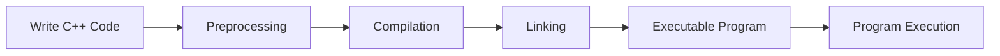

# C++ First Program

Welcome to the exciting world of C++ programming! In this tutorial, you'll write your very first C++ program—the traditional "Hello, World!" application. This simple program serves as the perfect introduction to the language and will help you understand the basic structure of C++ code.

## Introduction to C++ Programs

Every journey in programming begins with a simple first step. In C++, this step traditionally involves creating a program that displays a greeting message to the world. This seemingly simple task will introduce you to:

- The basic structure of a C++ program
- How to write C++ code
- How to compile and run a C++ program
- Understanding the essential components of C++ syntax

## The "Hello, World!" Program

Let's start by looking at the complete code for our first program:

```cpp
#include <iostream>

int main() {
    std::cout << "Hello, World!" << std::endl;
    return 0;
}
```

When you run this program, you'll see this output:

```
Hello, World!
```

That's it! You've just written your first C++ program. But what does each part of this code actually do? Let's break it down.

## Understanding the Code Line by Line

### The Include Directive

```cpp
#include <iostream>
```

This line is called a **preprocessor directive**. It tells the C++ compiler to include the standard `iostream` header file. This file contains declarations for standard input and output operations, which we need to display text on the screen.

### The Main Function

```cpp
int main() {
    // Code goes here
}
```

Every C++ program must have a `main()` function. This is the entry point of your program—the place where execution begins. The `int` before `main` indicates that this function will return an integer value when it completes.

### Displaying Output

```cpp
std::cout << "Hello, World!" << std::endl;
```

This line outputs the text "Hello, World!" to the console:
- `std::cout` is the "character output" object from the standard library
- The `<<` operator is called the insertion operator and sends data to the output stream
- `"Hello, World!"` is a string literal (text) to be displayed
- `std::endl` inserts a newline character and flushes the output buffer

### The Return Statement

```cpp
return 0;
```

This statement ends the main function and returns the value `0` to the operating system. In C++, returning `0` from the main function indicates that the program executed successfully.

## Compiling and Running Your First Program

To bring your code to life, you need to:

1. **Write** the code in a text editor and save it with a `.cpp` extension (e.g., `hello.cpp`)
2. **Compile** the code using a C++ compiler
3. **Run** the resulting executable file

Here's how to compile and run your program using common compilers:

### Using g++ (GNU Compiler)

```bash
g++ hello.cpp -o hello
./hello
```

### Using Visual C++ (Windows Command Prompt)

```bash
cl hello.cpp
hello
```

## Let's Add Some Complexity

Now that you understand the basics, let's add a bit more functionality to our program:

```cpp
#include <iostream>
#include <string>

int main() {
    // Declare a variable
    std::string name;
    
    // Prompt the user for input
    std::cout << "Please enter your name: ";
    
    // Get user input
    std::getline(std::cin, name);
    
    // Display personalized greeting
    std::cout << "Hello, " << name << "! Welcome to C++ programming!" << std::endl;
    
    return 0;
}
```

Sample interaction with this program:

```
Please enter your name: John
Hello, John! Welcome to C++ programming!
```

## How C++ Programs Work

Understanding how a C++ program flows from code to execution can be helpful:



1. **Preprocessing**: Includes header files and expands macros
2. **Compilation**: Converts C++ code to machine code
3. **Linking**: Connects your code with libraries
4. **Execution**: The program runs on your computer

## Common Issues for Beginners

When writing your first program, you might encounter some issues:

1. **Syntax Errors**: Forgetting semicolons `;`, braces `{}`, or misspelling keywords
2. **Missing Header Files**: Forgetting to include necessary libraries
3. **Case Sensitivity**: C++ is case-sensitive; `cout` is not the same as `Cout`
4. **Compilation Errors**: Issues that prevent your code from being compiled successfully

## Real-World Application

While "Hello, World!" may seem simple, it demonstrates the fundamental concept of outputting information—a core aspect of most programs. Real-world applications that build on this concept include:

- Command-line utilities that provide information to users
- Log generators that record application activity
- User interfaces that display data
- Communication systems that exchange messages

## Summary

Congratulations! You've written, compiled, and run your first C++ program. You've learned:

- The basic structure of a C++ program
- How to use the `main()` function as an entry point
- How to output text to the console using `std::cout`
- How to get user input with `std::cin`
- The process of compilation and execution

This is just the beginning of your C++ journey. As you progress, you'll build on these fundamentals to create increasingly complex and powerful applications.

## Exercises

To reinforce what you've learned, try these exercises:

1. Modify the "Hello, World!" program to display your name instead
2. Create a program that asks for the user's age and displays it
3. Write a program that asks for two numbers and displays their sum
4. Extend the program to display a multi-line message with personal information

## Additional Resources

- [C++ Reference](https://en.cppreference.com/) - Comprehensive C++ documentation
- [C++ Standard Library Headers](https://en.cppreference.com/w/cpp/header) - List of all standard headers
- [The C++ Programming Language](https://www.amazon.com/C-Programming-Language-4th/dp/0321563840) by Bjarne Stroustrup, the creator of C++
- [learncpp.com](https://www.learncpp.com/) - A free, comprehensive C++ tutorial

Now that you've written your first C++ program, you're ready to explore more complex C++ concepts in the following tutorials!