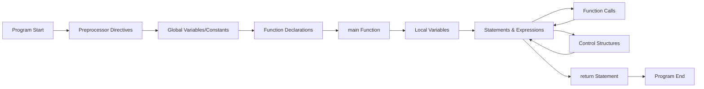

# C++ Syntax

## Introduction

Understanding the syntax of a programming language is like learning the grammar of a new spoken language. C++ syntax consists of rules that define how to write code that the compiler can understand. This guide will walk you through the fundamental syntax elements of C++, giving you a solid foundation to build your programming skills.

C++ is a powerful language that builds upon C, adding object-oriented features and other enhancements. Whether you're creating simple console applications or complex software systems, mastering C++ syntax is your first step toward becoming proficient in this versatile language.

## Basic Program Structure

Every C++ program follows a specific structure. Here's the simplest C++ program—the classic "Hello, World!" example:

```cpp
#include <iostream>

int main() {
    std::cout << "Hello, World!" << std::endl;
    return 0;
}
```

**Output:**
```
Hello, World!
```

Let's break down this program:

1. **`#include <iostream>`**: This is a preprocessor directive that includes the input/output stream library, giving us access to functions for input and output operations.

2. **`int main()`**: This defines the main function, which is the entry point of every C++ program. The `int` indicates that the function returns an integer value.

3. **The curly braces `{}`**: These enclose the body of the main function, containing the statements to be executed.

4. **`std::cout << "Hello, World!" << std::endl;`**: This statement outputs the text "Hello, World!" to the console. 
   - `std::cout` is the standard output stream
   - `<<` is the output operator
   - `std::endl` adds a newline character and flushes the output buffer

5. **`return 0;`**: This returns the value 0 to the operating system, indicating that the program has executed successfully.

## Comments

Comments are notes that you include in your code to explain what the code does. They are ignored by the compiler.

```cpp
// This is a single-line comment

/* This is a 
   multi-line comment */
```

## Variables and Data Types

Variables are containers for storing data values. In C++, you must declare a variable's type before using it.

### Basic Data Types

```cpp
#include <iostream>

int main() {
    // Integer types
    int age = 25;                 // Integer
    short small_number = 10;      // Short integer
    long large_number = 100000;   // Long integer
    
    // Floating-point types
    float price = 10.99f;         // Single precision floating-point
    double precise_value = 3.14159265359; // Double precision floating-point
    
    // Character type
    char grade = 'A';             // Single character
    
    // Boolean type
    bool is_active = true;        // Boolean (true or false)
    
    // Displaying variables
    std::cout << "Age: " << age << std::endl;
    std::cout << "Price: $" << price << std::endl;
    std::cout << "Grade: " << grade << std::endl;
    std::cout << "Active: " << is_active << std::endl;
    
    return 0;
}
```

**Output:**
```
Age: 25
Price: $10.99
Grade: A
Active: 1
```

Notice that boolean values display as `1` for `true` and `0` for `false` when output directly.

### Variable Declaration and Initialization

There are multiple ways to initialize variables in C++:

```cpp
// C-style initialization
int count = 10;

// Constructor initialization
int quantity(10);

// Uniform initialization (C++11 and later)
int total{10};
```

## Constants

Constants are variables whose values cannot be modified after initialization.

```cpp
const double PI = 3.14159265359;
const int MAX_STUDENTS = 30;

// Trying to change a constant will cause a compiler error
// PI = 3.14; // Error!
```

## Operators

C++ provides various operators for performing operations on variables and values.

### Arithmetic Operators

```cpp
#include <iostream>

int main() {
    int a = 10, b = 3;
    
    std::cout << "a + b = " << a + b << std::endl;  // Addition
    std::cout << "a - b = " << a - b << std::endl;  // Subtraction
    std::cout << "a * b = " << a * b << std::endl;  // Multiplication
    std::cout << "a / b = " << a / b << std::endl;  // Division (integer)
    std::cout << "a % b = " << a % b << std::endl;  // Modulus (remainder)
    
    // For floating-point division
    double c = 10.0, d = 3.0;
    std::cout << "c / d = " << c / d << std::endl;  // Division (floating-point)
    
    return 0;
}
```

**Output:**
```
a + b = 13
a - b = 7
a * b = 30
a / b = 3
a % b = 1
c / d = 3.33333
```

### Assignment Operators

```cpp
int x = 5;
x += 3;  // Equivalent to: x = x + 3
std::cout << "x after x += 3: " << x << std::endl;  // Output: 8

x -= 2;  // Equivalent to: x = x - 2
std::cout << "x after x -= 2: " << x << std::endl;  // Output: 6

x *= 4;  // Equivalent to: x = x * 4
std::cout << "x after x *= 4: " << x << std::endl;  // Output: 24

x /= 3;  // Equivalent to: x = x / 3
std::cout << "x after x /= 3: " << x << std::endl;  // Output: 8

x %= 3;  // Equivalent to: x = x % 3
std::cout << "x after x %= 3: " << x << std::endl;  // Output: 2
```

### Comparison Operators

```cpp
int p = 5, q = 10;

std::cout << "p == q: " << (p == q) << std::endl;  // Equal to
std::cout << "p != q: " << (p != q) << std::endl;  // Not equal to
std::cout << "p > q: " << (p > q) << std::endl;    // Greater than
std::cout << "p < q: " << (p < q) << std::endl;    // Less than
std::cout << "p >= q: " << (p >= q) << std::endl;  // Greater than or equal to
std::cout << "p <= q: " << (p <= q) << std::endl;  // Less than or equal to
```

**Output:**
```
p == q: 0
p != q: 1
p > q: 0
p < q: 1
p >= q: 0
p <= q: 1
```

### Logical Operators

```cpp
bool condition1 = true, condition2 = false;

std::cout << "condition1 && condition2: " << (condition1 && condition2) << std::endl;  // Logical AND
std::cout << "condition1 || condition2: " << (condition1 || condition2) << std::endl;  // Logical OR
std::cout << "!condition1: " << (!condition1) << std::endl;                           // Logical NOT
```

**Output:**
```
condition1 && condition2: 0
condition1 || condition2: 1
!condition1: 0
```

## Control Structures

Control structures direct the flow of execution in a program.

### Conditional Statements

#### If-Else Statement

```cpp
#include <iostream>

int main() {
    int age;
    
    std::cout << "Enter your age: ";
    std::cin >> age;
    
    if (age < 18) {
        std::cout << "You are a minor." << std::endl;
    } else if (age >= 18 && age < 65) {
        std::cout << "You are an adult." << std::endl;
    } else {
        std::cout << "You are a senior citizen." << std::endl;
    }
    
    return 0;
}
```

**Example Input/Output:**
```
Enter your age: 25
You are an adult.
```

#### Switch Statement

```cpp
#include <iostream>

int main() {
    int day;
    
    std::cout << "Enter a day number (1-7): ";
    std::cin >> day;
    
    switch (day) {
        case 1:
            std::cout << "Monday" << std::endl;
            break;
        case 2:
            std::cout << "Tuesday" << std::endl;
            break;
        case 3:
            std::cout << "Wednesday" << std::endl;
            break;
        case 4:
            std::cout << "Thursday" << std::endl;
            break;
        case 5:
            std::cout << "Friday" << std::endl;
            break;
        case 6:
            std::cout << "Saturday" << std::endl;
            break;
        case 7:
            std::cout << "Sunday" << std::endl;
            break;
        default:
            std::cout << "Invalid day number" << std::endl;
    }
    
    return 0;
}
```

**Example Input/Output:**
```
Enter a day number (1-7): 5
Friday
```

#### Ternary Operator

The ternary operator is a shorthand for an if-else statement:

```cpp
int score = 75;
std::string result = (score >= 60) ? "Pass" : "Fail";
std::cout << "Result: " << result << std::endl;  // Output: Result: Pass
```

### Loops

#### For Loop

```cpp
#include <iostream>

int main() {
    // Print numbers from 1 to 5
    for (int i = 1; i <= 5; i++) {
        std::cout << i << " ";
    }
    std::cout << std::endl;
    
    return 0;
}
```

**Output:**
```
1 2 3 4 5
```

#### While Loop

```cpp
#include <iostream>

int main() {
    int count = 1;
    
    // Print numbers from 1 to 5
    while (count <= 5) {
        std::cout << count << " ";
        count++;
    }
    std::cout << std::endl;
    
    return 0;
}
```

**Output:**
```
1 2 3 4 5
```

#### Do-While Loop

```cpp
#include <iostream>

int main() {
    int count = 1;
    
    // Print numbers from 1 to 5
    do {
        std::cout << count << " ";
        count++;
    } while (count <= 5);
    std::cout << std::endl;
    
    return 0;
}
```

**Output:**
```
1 2 3 4 5
```

## Practical Examples

Let's apply what we've learned to solve some real-world problems.

### Example 1: Simple Calculator

```cpp
#include <iostream>

int main() {
    double num1, num2;
    char operation;
    
    std::cout << "Enter first number: ";
    std::cin >> num1;
    
    std::cout << "Enter operation (+, -, *, /): ";
    std::cin >> operation;
    
    std::cout << "Enter second number: ";
    std::cin >> num2;
    
    double result;
    bool valid_operation = true;
    
    switch (operation) {
        case '+':
            result = num1 + num2;
            break;
        case '-':
            result = num1 - num2;
            break;
        case '*':
            result = num1 * num2;
            break;
        case '/':
            if (num2 != 0) {
                result = num1 / num2;
            } else {
                std::cout << "Error: Division by zero!" << std::endl;
                valid_operation = false;
            }
            break;
        default:
            std::cout << "Error: Invalid operation!" << std::endl;
            valid_operation = false;
    }
    
    if (valid_operation) {
        std::cout << num1 << " " << operation << " " << num2 << " = " << result << std::endl;
    }
    
    return 0;
}
```

**Example Input/Output:**
```
Enter first number: 10
Enter operation (+, -, *, /): *
Enter second number: 5
10 * 5 = 50
```

### Example 2: Temperature Converter

```cpp
#include <iostream>

int main() {
    double temperature;
    char unit;
    
    std::cout << "Enter temperature: ";
    std::cin >> temperature;
    
    std::cout << "Enter unit (C for Celsius, F for Fahrenheit): ";
    std::cin >> unit;
    
    double converted_temperature;
    
    if (unit == 'C' || unit == 'c') {
        // Convert Celsius to Fahrenheit
        converted_temperature = (temperature * 9.0/5.0) + 32;
        std::cout << temperature << "°C is " << converted_temperature << "°F" << std::endl;
    } else if (unit == 'F' || unit == 'f') {
        // Convert Fahrenheit to Celsius
        converted_temperature = (temperature - 32) * 5.0/9.0;
        std::cout << temperature << "°F is " << converted_temperature << "°C" << std::endl;
    } else {
        std::cout << "Error: Invalid unit! Use C for Celsius or F for Fahrenheit." << std::endl;
    }
    
    return 0;
}
```

**Example Input/Output:**
```
Enter temperature: 100
Enter unit (C for Celsius, F for Fahrenheit): C
100°C is 212°F
```

## Program Flow Diagram

Here's a visual representation of how C++ program execution flows:



## Summary

In this tutorial, we've covered the fundamental syntax of C++:

- Basic program structure and the main function
- Comments for code documentation
- Variables, data types, and constants
- Operators for arithmetic, assignment, comparison, and logical operations
- Control structures including if-else statements, switch statements, and loops
- Practical examples demonstrating how to apply these concepts

Understanding C++ syntax is the first step in your journey to becoming a proficient C++ programmer. With these foundations, you can start building more complex programs and exploring advanced features of the language.

## Exercises

Test your understanding with these exercises:

1. Write a program that calculates the area and perimeter of a rectangle.
2. Create a program that checks if a year is a leap year.
3. Write a program that prints a multiplication table for a number entered by the user.
4. Create a program that converts a decimal number to binary.
5. Write a program that finds the largest of three numbers entered by the user.

## Additional Resources

- [C++ Reference](https://en.cppreference.com/w/) - Comprehensive reference for C++ language
- [Cplusplus.com](http://www.cplusplus.com/doc/tutorial/) - C++ tutorials and reference
- [LearnCpp.com](https://www.learncpp.com/) - In-depth C++ tutorials
- [C++ Core Guidelines](https://isocpp.github.io/CppCoreGuidelines/CppCoreGuidelines) - Best practices for writing C++ code

Happy coding!