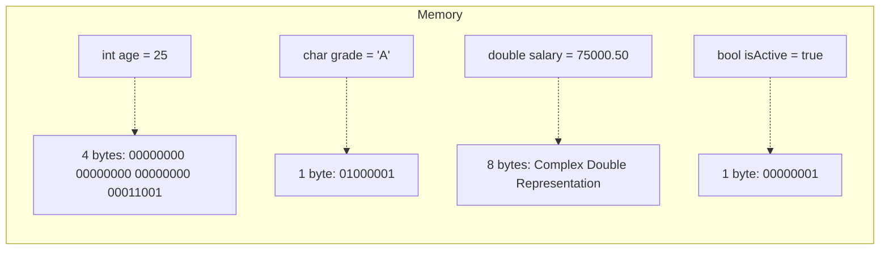

# C++ Variables

## Introduction

Variables are one of the fundamental building blocks in any programming language. In C++, variables serve as containers that hold data values during program execution. Think of variables as labeled boxes where you can store information that your program needs to remember and manipulate.

In this tutorial, you'll learn:
- What variables are and why they're important
- How to declare and initialize variables in C++
- Different data types available in C++
- Naming conventions and best practices
- How to use variables in real-world scenarios

## What Are Variables?

A variable is a named storage location in a computer's memory that holds a value. The value can be changed during program execution, hence the name "variable." Each variable in C++ has:

1. A name (identifier)
2. A type (which determines what kind of data it can store)
3. A value (the actual data being stored)
4. A memory location (address where the data is stored)

## Declaring Variables in C++

In C++, you must declare a variable before using it. The basic syntax for declaring a variable is:

```cpp
data_type variable_name;
```

For example:

```cpp
int age;         // Declares an integer variable named 'age'
double salary;   // Declares a double-precision floating-point variable named 'salary'
char grade;      // Declares a character variable named 'grade'
bool isActive;   // Declares a Boolean variable named 'isActive'
```

## Initializing Variables

Declaring a variable only creates the storage space. To assign a value to the variable, you need to initialize it. There are several ways to initialize variables in C++:

### Assignment Initialization

```cpp
int count;     // Declaration
count = 10;    // Initialization using assignment
```

### Immediate Initialization

```cpp
int count = 10;    // Declaration and initialization in one step
```

### Uniform Initialization (C++11 and later)

```cpp
int count{10};     // Curly brace initialization
```

## Example: Declaring and Using Variables

Here's a simple program demonstrating variable declaration, initialization, and usage:

```cpp
#include <iostream>
using namespace std;

int main() {
    // Variable declaration and initialization
    int age = 25;
    double height = 5.9;
    char grade = 'A';
    bool isStudent = true;
    
    // Using variables
    cout << "Age: " << age << " years" << endl;
    cout << "Height: " << height << " feet" << endl;
    cout << "Grade: " << grade << endl;
    cout << "Student status: " << (isStudent ? "Active" : "Inactive") << endl;
    
    // Modifying variables
    age = 26;
    height = 6.0;
    
    cout << "\nAfter modification:" << endl;
    cout << "Age: " << age << " years" << endl;
    cout << "Height: " << height << " feet" << endl;
    
    return 0;
}
```

**Output:**
```
Age: 25 years
Height: 5.9 feet
Grade: A
Student status: Active

After modification:
Age: 26 years
Height: 6 feet
```

This program demonstrates how variables store data and how that data can be accessed and modified during program execution.

## C++ Data Types

C++ supports various data types. Here are the most common ones:

### Fundamental Data Types

| Data Type | Description | Size (typical) | Example |
|-----------|-------------|----------------|---------|
| `int` | Integer values | 4 bytes | `int count = 10;` |
| `float` | Single-precision floating point | 4 bytes | `float price = 9.99f;` |
| `double` | Double-precision floating point | 8 bytes | `double distance = 45.6789;` |
| `char` | Single character | 1 byte | `char letter = 'A';` |
| `bool` | Boolean value (true/false) | 1 byte | `bool isValid = true;` |

### Type Modifiers

You can modify some data types using modifiers:
- `short`: Typically 2 bytes
- `long`: Typically 4 or 8 bytes
- `unsigned`: For non-negative values only

Examples:
```cpp
short int smallNumber = 32767;
long int bigNumber = 2147483647;
unsigned int positiveOnly = 4294967295;
```

## Variable Naming Rules and Conventions

When naming variables in C++, follow these rules:

1. Names can contain letters, digits, and underscores
2. Names must begin with a letter or underscore
3. Names are case-sensitive (`count` and `Count` are different variables)
4. Reserved keywords cannot be used as names

**Naming Conventions (Best Practices):**

- Use meaningful names that describe the purpose of the variable
- Use camelCase for variable names (e.g., `studentAge`, `totalAmount`)
- Avoid using single letters except for simple counters
- Be consistent in your naming style

**Examples:**

```cpp
// Good variable names
int studentCount = 25;
double averageScore = 85.5;
bool isGameOver = false;

// Poor variable names (avoid these practices)
int x = 25;               // Not descriptive
double a_v_g = 85.5;      // Hard to read
bool GAME = false;        // Unclear purpose
```

## Constants

Sometimes you want variables whose values cannot be changed after initialization. These are called constants:

```cpp
const double PI = 3.14159265359;
const int MAX_STUDENTS = 30;

// This would cause a compilation error:
// PI = 3.14; // Error: assignment of read-only variable
```

## Variable Scope

The scope of a variable determines where in your code the variable can be accessed:

### Local Variables

Variables declared inside a function or block are local to that function/block:

```cpp
void exampleFunction() {
    int localVar = 10;  // Local to exampleFunction
    // localVar can only be used inside this function
}
```

### Global Variables

Variables declared outside any function are global and can be accessed throughout the program:

```cpp
#include <iostream>
using namespace std;

int globalVar = 100;  // Global variable

void displayGlobal() {
    cout << "Global variable: " << globalVar << endl;
}

int main() {
    cout << "In main: " << globalVar << endl;
    globalVar = 200;
    displayGlobal();
    return 0;
}
```

**Output:**
```
In main: 100
Global variable: 200
```

## Practical Example: Temperature Converter

Let's build a practical example that uses variables to convert between Celsius and Fahrenheit:

```cpp
#include <iostream>
using namespace std;

int main() {
    // Declare variables
    double celsius, fahrenheit;
    
    // Get user input
    cout << "Enter temperature in Celsius: ";
    cin >> celsius;
    
    // Perform conversion
    fahrenheit = (celsius * 9.0/5.0) + 32;
    
    // Display result
    cout << celsius << " degrees Celsius = " << fahrenheit << " degrees Fahrenheit" << endl;
    
    return 0;
}
```

**Sample Input/Output:**
```
Enter temperature in Celsius: 25
25 degrees Celsius = 77 degrees Fahrenheit
```

## Auto Keyword (C++11)

In modern C++, you can use the `auto` keyword to automatically deduce the type from the initializer:

```cpp
auto age = 25;          // int
auto pi = 3.14159;      // double
auto name = "John";     // const char*
auto isOpen = true;     // bool
```

This is particularly useful with complex types but should be used judiciously to maintain code readability.

## Variable Memory Visualization

Here's a visualization of how variables are stored in memory:



Each variable occupies a specific amount of memory based on its data type, and the computer uses the variable's name to reference that memory location.

## Summary

In this tutorial, you've learned:

- Variables are named storage locations that hold data in a program
- How to declare and initialize variables using different syntaxes
- The common data types in C++ and when to use them
- Naming conventions and best practices for variables
- How to use constants for values that shouldn't change
- Variable scope and how it affects accessibility
- How to use variables in a practical application
- Modern C++ features like the `auto` keyword

Variables form the foundation of any C++ program, allowing you to store, retrieve, and manipulate data. Understanding variables is crucial for becoming proficient in C++ programming.

## Practice Exercises

1. Write a program that calculates the area and perimeter of a rectangle using variables.
2. Create a simple interest calculator (Principal × Rate × Time) using appropriate variable types.
3. Write a program that swaps the values of two variables without using a third variable.
4. Create a BMI (Body Mass Index) calculator using variables for height and weight.
5. Write a program that converts days into years, months, and days (assume 30 days per month).

## Additional Resources

- [C++ Reference: Basic Types](https://en.cppreference.com/w/cpp/language/types)
- [C++ Variables Video Tutorial](https://www.youtube.com/watch?v=zB9RI8_wExo)
- [C++ Data Types](https://www.geeksforgeeks.org/c-data-types/)
- Book: "C++ Primer" by Stanley B. Lippman