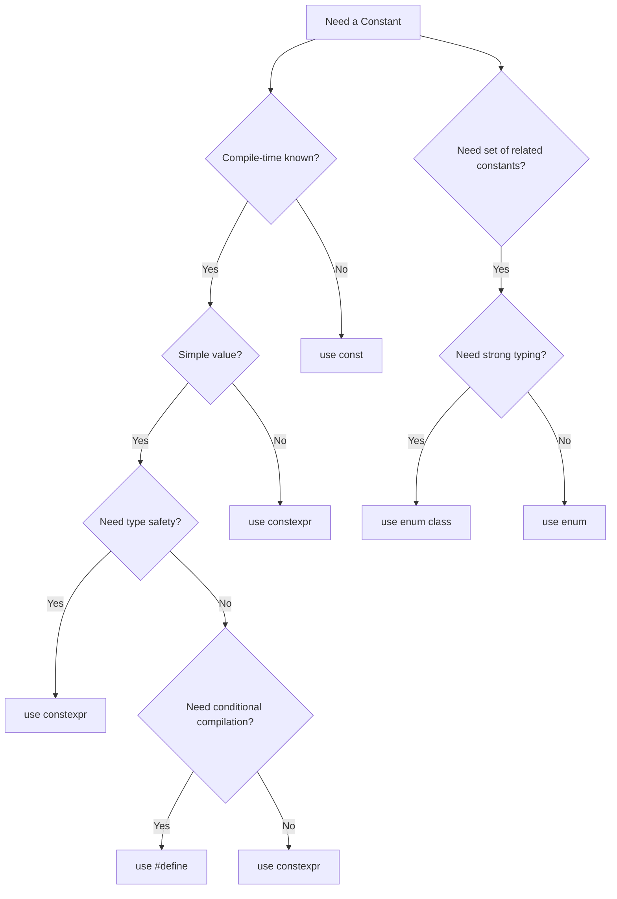

# C++ Constants

## Introduction

Constants are fixed values that remain unchanged throughout the execution of a program. Unlike variables, which can have their values modified, constants provide values that remain consistent. In C++, constants are essential for writing more predictable, readable, and maintainable code.

In this tutorial, we'll explore different ways to define and use constants in C++, along with their benefits and practical applications.

## Why Use Constants?

Before diving into the details, let's understand why constants are important:

1. **Code Reliability**: Constants prevent accidental changes to values that should remain fixed
2. **Code Readability**: Using named constants makes your code more self-explanatory
3. **Easier Maintenance**: Changing a constant value in one place affects all uses of that constant
4. **Performance Optimization**: Compilers can optimize code better when they know values won't change

## Types of Constants in C++

C++ provides several ways to define constants:

1. Literal Constants
2. Constant Variables (using `const` keyword)
3. Constant Expressions (using `constexpr` keyword)
4. Enumeration Constants (using `enum`)
5. Preprocessor Constants (using `#define`)

Let's explore each type in detail.

## 1. Literal Constants

Literal constants are fixed values written directly in the code. They are the simplest form of constants.

### Examples of Literal Constants:

```cpp
// Integer literals
42;       // decimal (base 10)
0x2A;     // hexadecimal (base 16)
052;      // octal (base 8)
0b101010; // binary (base 2, C++14 and later)

// Floating-point literals
3.14159;   // double precision
3.14159f;  // single precision (float)
3.14159L;  // extended precision (long double)

// Character literals
'A';       // character
'\n';      // newline character
'\u0041';  // Unicode character (hexadecimal)

// String literals
"Hello, World!";  // regular string
R"(Raw string with "quotes" inside)";  // raw string (C++11)

// Boolean literals
true;
false;
```

### Code Example: Using Literal Constants

```cpp
#include <iostream>
using namespace std;

int main() {
    cout << "Integer literal: " << 42 << endl;
    cout << "Floating-point literal: " << 3.14159 << endl;
    cout << "Character literal: " << 'A' << endl;
    cout << "String literal: " << "Hello, World!" << endl;
    cout << "Boolean literal: " << true << endl;
    
    return 0;
}
```

**Output:**
```
Integer literal: 42
Floating-point literal: 3.14159
Character literal: A
String literal: Hello, World!
Boolean literal: 1
```

## 2. Constant Variables (const)

The `const` keyword allows you to define variables whose values cannot be changed after initialization.

### Syntax:

```cpp
const type name = value;
```

### Code Example: Using const Variables

```cpp
#include <iostream>
using namespace std;

int main() {
    const int MAX_STUDENTS = 30;
    const double PI = 3.14159;
    const char NEWLINE = '\n';
    const string GREETING = "Hello, World!";
    
    cout << "Maximum students: " << MAX_STUDENTS << NEWLINE;
    cout << "Pi value: " << PI << NEWLINE;
    cout << "Greeting: " << GREETING << NEWLINE;
    
    // The following lines would cause compilation errors
    // MAX_STUDENTS = 40;  // Error: assignment of read-only variable
    // PI = 3.14;          // Error: assignment of read-only variable
    
    return 0;
}
```

**Output:**
```
Maximum students: 30
Pi value: 3.14159
Greeting: Hello, World!
```

### Constant References and Pointers

Constants can also be used with references and pointers:

```cpp
#include <iostream>
using namespace std;

int main() {
    int value = 10;
    const int* ptr1 = &value;     // Pointer to constant (can't modify *ptr1)
    int* const ptr2 = &value;     // Constant pointer (can't change ptr2)
    const int* const ptr3 = &value; // Constant pointer to constant
    
    // *ptr1 = 20;  // Error: assignment of read-only location
    *ptr2 = 20;     // OK: can modify the value
    // ptr2 = &value;  // Error: assignment of read-only variable
    
    cout << "Value after modification: " << value << endl;
    
    return 0;
}
```

**Output:**
```
Value after modification: 20
```

## 3. Constant Expressions (constexpr)

Introduced in C++11, `constexpr` is used to declare variables or functions that can be evaluated at compile time.

### Syntax:

```cpp
constexpr type name = value;
```

### Code Example: Using constexpr

```cpp
#include <iostream>
using namespace std;

// constexpr function
constexpr int factorial(int n) {
    return (n <= 1) ? 1 : n * factorial(n - 1);
}

int main() {
    constexpr int MAX_BUFFER_SIZE = 1024;
    constexpr double GOLDEN_RATIO = 1.618033988749895;
    constexpr int FACT_5 = factorial(5);  // Computed at compile time
    
    cout << "Maximum buffer size: " << MAX_BUFFER_SIZE << endl;
    cout << "Golden ratio: " << GOLDEN_RATIO << endl;
    cout << "5! = " << FACT_5 << endl;
    
    // Array with size determined by constexpr
    int buffer[MAX_BUFFER_SIZE];  // Valid: size known at compile time
    
    return 0;
}
```

**Output:**
```
Maximum buffer size: 1024
Golden ratio: 1.61803
5! = 120
```

### Difference between const and constexpr

- `const` means the value won't change after initialization
- `constexpr` means the value is computed at compile time
- All `constexpr` are `const`, but not all `const` are `constexpr`

```cpp
#include <iostream>
using namespace std;

int getValueAtRuntime() {
    cout << "Enter a value: ";
    int value;
    cin >> value;
    return value;
}

int main() {
    // This is valid
    const int runtime_const = getValueAtRuntime();
    
    // This would cause a compilation error
    // constexpr int runtime_constexpr = getValueAtRuntime();
    
    cout << "Const value from runtime: " << runtime_const << endl;
    
    return 0;
}
```

## 4. Enumeration Constants (enum)

Enumerations provide a way to define a set of named integer constants.

### Traditional Enumeration:

```cpp
#include <iostream>
using namespace std;

int main() {
    // Traditional enum
    enum Color { RED, GREEN, BLUE };  // RED=0, GREEN=1, BLUE=2 by default
    
    enum Weekday { MONDAY = 1, TUESDAY, WEDNESDAY, THURSDAY, FRIDAY = 10, SATURDAY, SUNDAY };
    // MONDAY=1, TUESDAY=2, ..., FRIDAY=10, SATURDAY=11, SUNDAY=12
    
    Color myColor = BLUE;
    Weekday today = WEDNESDAY;
    
    cout << "My color value: " << myColor << endl;
    cout << "Today value: " << today << endl;
    
    return 0;
}
```

**Output:**
```
My color value: 2
Today value: 3
```

### Scoped Enumeration (C++11):

Scoped enumerations (enum class) provide better type safety and scoping.

```cpp
#include <iostream>
using namespace std;

int main() {
    // Scoped enum (enum class)
    enum class Status { PENDING, PROCESSING, COMPLETED, FAILED };
    enum class Result { SUCCESS, FAILURE, UNKNOWN };
    
    Status currentStatus = Status::PROCESSING;
    Result operationResult = Result::SUCCESS;
    
    // Need explicit casting to print or use in arithmetic operations
    cout << "Current status: " << static_cast<int>(currentStatus) << endl;
    cout << "Operation result: " << static_cast<int>(operationResult) << endl;
    
    return 0;
}
```

**Output:**
```
Current status: 1
Operation result: 0
```

## 5. Preprocessor Constants (#define)

`#define` is a preprocessor directive that creates text substitutions before compilation.

### Syntax:

```cpp
#define NAME value
```

### Code Example: Using #define

```cpp
#include <iostream>

// Preprocessor constants
#define PI 3.14159
#define MAX_SIZE 100
#define PROGRAM_NAME "Constants Demo"
#define DEBUG_MODE

int main() {
    std::cout << "Program: " << PROGRAM_NAME << std::endl;
    std::cout << "Pi value: " << PI << std::endl;
    std::cout << "Maximum size: " << MAX_SIZE << std::endl;
    
    // Conditional compilation
    #ifdef DEBUG_MODE
        std::cout << "Debug mode is enabled" << std::endl;
    #endif
    
    return 0;
}
```

**Output:**
```
Program: Constants Demo
Pi value: 3.14159
Maximum size: 100
Debug mode is enabled
```

### Limitations of #define

While `#define` is powerful, it has several limitations compared to other constant types:

1. No type checking (it's a simple text replacement)
2. May lead to unexpected behavior due to text substitution rules
3. Not visible in debuggers
4. Not bound by scope rules

For these reasons, modern C++ code typically prefers `const` and `constexpr` over `#define` for defining constants.

## Practical Examples: Real-World Applications

### Example 1: Configuration Settings

```cpp
#include <iostream>
#include <string>
using namespace std;

// Application constants
namespace Config {
    constexpr int MAX_USERS = 1000;
    constexpr int TIMEOUT_MS = 30000;
    constexpr double VERSION = 1.2;
    const string APP_NAME = "MyApp";
    
    // Network settings
    namespace Network {
        constexpr int PORT = 8080;
        constexpr int MAX_CONNECTIONS = 100;
        constexpr int PACKET_SIZE = 1024;
    }
}

int main() {
    cout << "Application: " << Config::APP_NAME << " v" << Config::VERSION << endl;
    cout << "Maximum users: " << Config::MAX_USERS << endl;
    cout << "Network port: " << Config::Network::PORT << endl;
    cout << "Maximum connections: " << Config::Network::MAX_CONNECTIONS << endl;
    
    return 0;
}
```

**Output:**
```
Application: MyApp v1.2
Maximum users: 1000
Network port: 8080
Maximum connections: 100
```

### Example 2: Mathematical Calculations

```cpp
#include <iostream>
#include <cmath>
using namespace std;

// Mathematical constants
namespace Math {
    constexpr double PI = 3.14159265358979323846;
    constexpr double E = 2.71828182845904523536;
    constexpr double GOLDEN_RATIO = 1.61803398874989484820;
}

// Calculate area of circle
double calculateCircleArea(double radius) {
    return Math::PI * radius * radius;
}

// Calculate volume of sphere
double calculateSphereVolume(double radius) {
    return (4.0/3.0) * Math::PI * pow(radius, 3);
}

int main() {
    double radius = 5.0;
    
    cout << "For radius = " << radius << ":" << endl;
    cout << "Circle area: " << calculateCircleArea(radius) << endl;
    cout << "Sphere volume: " << calculateSphereVolume(radius) << endl;
    cout << "e^2: " << pow(Math::E, 2) << endl;
    
    return 0;
}
```

**Output:**
```
For radius = 5:
Circle area: 78.5398
Sphere volume: 523.599
e^2: 7.38906
```

### Example 3: Error Codes and Status

```cpp
#include <iostream>
#include <string>
using namespace std;

// Error codes using enum class
enum class ErrorCode {
    SUCCESS = 0,
    INVALID_INPUT = 100,
    FILE_NOT_FOUND = 200,
    NETWORK_ERROR = 300,
    PERMISSION_DENIED = 400,
    UNKNOWN_ERROR = 999
};

// Get error message based on error code
string getErrorMessage(ErrorCode code) {
    switch (code) {
        case ErrorCode::SUCCESS:
            return "Operation completed successfully";
        case ErrorCode::INVALID_INPUT:
            return "Invalid input provided";
        case ErrorCode::FILE_NOT_FOUND:
            return "File could not be found";
        case ErrorCode::NETWORK_ERROR:
            return "Network connection error";
        case ErrorCode::PERMISSION_DENIED:
            return "Permission denied";
        default:
            return "Unknown error occurred";
    }
}

int main() {
    ErrorCode result = ErrorCode::FILE_NOT_FOUND;
    
    cout << "Error code: " << static_cast<int>(result) << endl;
    cout << "Error message: " << getErrorMessage(result) << endl;
    
    return 0;
}
```

**Output:**
```
Error code: 200
Error message: File could not be found
```

## Best Practices for Using Constants

When working with constants in C++, keep these best practices in mind:

1. **Use `const` and `constexpr` instead of `#define`** for better type safety and debugging
2. **Use ALL_CAPS naming convention** for traditional constants to distinguish them from variables
3. **Group related constants** in namespaces or enum classes
4. **Define constants at the appropriate scope level** (global, namespace, class, or function)
5. **Use `constexpr` for values known at compile time** to enable compiler optimizations
6. **Prefer enum class over traditional enum** for type safety
7. **Document the meaning and units** of important constants

## When to Use Each Type of Constant

Here's a quick guide on when to use each type of constant:



## Summary

In this tutorial, we've covered:

1. **Literal Constants**: Fixed values written directly in the code (numbers, characters, strings)
2. **Constant Variables (`const`)**: Variables whose values cannot change after initialization
3. **Constant Expressions (`constexpr`)**: Values and functions that can be evaluated at compile time
4. **Enumeration Constants (`enum`)**: Sets of named integer constants
5. **Preprocessor Constants (`#define`)**: Text substitutions performed before compilation

Constants are a fundamental part of writing good C++ code. They improve code readability, maintainability, and can even enhance performance. By choosing the right type of constant for each situation, you'll create more robust and understandable programs.

## Exercises

1. Create a program that calculates the area and perimeter of various geometric shapes (circle, rectangle, triangle) using constants for PI and other values.

2. Define an enumeration for days of the week and write a function that determines if a given day is a weekday or weekend.

3. Create a constant expression function to calculate the Fibonacci sequence at compile time, and use it to initialize an array.

4. Implement a temperature conversion program that uses constants for freezing and boiling points in different temperature scales (Celsius, Fahrenheit, Kelvin).

5. Develop a simple configuration system using a namespace with constants for your application settings.

## Additional Resources

- [C++ Reference: const specifier](https://en.cppreference.com/w/cpp/language/cv)
- [C++ Reference: constexpr specifier](https://en.cppreference.com/w/cpp/language/constexpr)
- [C++ Reference: enum declaration](https://en.cppreference.com/w/cpp/language/enum)
- [C++ Core Guidelines: Constants and Immutability](https://isocpp.github.io/CppCoreGuidelines/CppCoreGuidelines#con-constants-and-immutability)

Happy coding with constants!