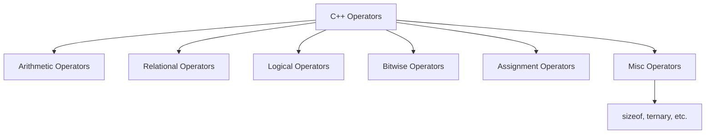

# C++ Operators

## Introduction

Operators are special symbols in C++ that perform specific operations on one, two, or three operands and return a result. Think of operators as functions that use a special syntax. For example, the addition operator (`+`) adds two numbers and returns the result.

Understanding operators is fundamental to writing effective C++ code. This guide will explore the various types of operators in C++, their functionality, precedence, and provide practical examples to solidify your understanding.

## Types of Operators in C++

C++ offers a rich set of operators that can be categorized as follows:



Let's explore each type in detail.

## Arithmetic Operators

Arithmetic operators perform mathematical operations on numeric values.

| Operator | Description | Example |
|---------|-------------|---------|
| `+` | Addition | `a + b` |
| `-` | Subtraction | `a - b` |
| `*` | Multiplication | `a * b` |
| `/` | Division | `a / b` |
| `%` | Modulus (Remainder) | `a % b` |
| `++` | Increment | `a++` or `++a` |
| `--` | Decrement | `a--` or `--a` |

### Example of Arithmetic Operators

```cpp
#include <iostream>
using namespace std;

int main() {
    int a = 10, b = 5;
    
    cout << "a + b = " << a + b << endl;  // Addition: 15
    cout << "a - b = " << a - b << endl;  // Subtraction: 5
    cout << "a * b = " << a * b << endl;  // Multiplication: 50
    cout << "a / b = " << a / b << endl;  // Division: 2
    cout << "a % b = " << a % b << endl;  // Modulus: 0

    // Increment and Decrement
    int c = a++;  // Post-increment
    int d = ++b;  // Pre-increment
    
    cout << "After a++, a = " << a << endl;  // 11
    cout << "c = " << c << endl;  // 10 (value of a before increment)
    cout << "After ++b, b = " << b << endl;  // 6
    cout << "d = " << d << endl;  // 6 (value of b after increment)
    
    return 0;
}
```

**Output:**
```
a + b = 15
a - b = 5
a * b = 50
a / b = 2
a % b = 0
After a++, a = 11
c = 10
After ++b, b = 6
d = 6
```

### Important Notes on Arithmetic Operators

1. **Division (`/`)**: 
   - For integer division, the result is truncated (decimal part is discarded)
   - For example, `5 / 2` returns `2`, not `2.5`
   - To get floating-point division, at least one operand must be a floating-point number: `5.0 / 2` returns `2.5`

2. **Modulus (`%`)**:
   - Works only with integers
   - The result takes the sign of the first operand
   - For instance, `-10 % 3` would return `-1`, not `2`

3. **Increment/Decrement (`++`/`--`)**:
   - Pre-increment (`++a`): Increments value, then returns
   - Post-increment (`a++`): Returns value, then increments
   - Same applies to decrement

## Relational Operators

Relational operators are used to compare values and return a Boolean result (`true` or `false`).

| Operator | Description | Example |
|---------|-------------|---------|
| `==` | Equal to | `a == b` |
| `!=` | Not equal to | `a != b` |
| `>` | Greater than | `a > b` |
| `<` | Less than | `a < b` |
| `>=` | Greater than or equal to | `a >= b` |
| `<=` | Less than or equal to | `a <= b` |

### Example of Relational Operators

```cpp
#include <iostream>
using namespace std;

int main() {
    int a = 10, b = 5, c = 10;
    
    cout << "a == b is " << (a == b) << endl;  // 0 (false)
    cout << "a == c is " << (a == c) << endl;  // 1 (true)
    cout << "a > b is " << (a > b) << endl;    // 1 (true)
    cout << "a < b is " << (a < b) << endl;    // 0 (false)
    cout << "a >= c is " << (a >= c) << endl;  // 1 (true)
    cout << "a <= c is " << (a <= c) << endl;  // 1 (true)
    cout << "a != b is " << (a != b) << endl;  // 1 (true)
    
    return 0;
}
```

**Output:**
```
a == b is 0
a == c is 1
a > b is 1
a < b is 0
a >= c is 1
a <= c is 1
a != b is 1
```

## Logical Operators

Logical operators are used to combine conditional statements and also return Boolean values.

| Operator | Description | Example |
|---------|-------------|---------|
| `&&` | Logical AND | `a && b` |
| `\|\|` | Logical OR | `a \|\| b` |
| `!` | Logical NOT | `!a` |

### Example of Logical Operators

```cpp
#include <iostream>
using namespace std;

int main() {
    bool a = true, b = false;
    
    cout << "a && b is " << (a && b) << endl;   // Logical AND: 0 (false)
    cout << "a || b is " << (a || b) << endl;   // Logical OR: 1 (true)
    cout << "!a is " << (!a) << endl;          // Logical NOT: 0 (false)
    cout << "!b is " << (!b) << endl;          // Logical NOT: 1 (true)
    
    // Real-world condition example
    int age = 25;
    bool hasLicense = true;
    
    if (age >= 18 && hasLicense) {
        cout << "You can drive" << endl;
    } else {
        cout << "You cannot drive" << endl;
    }
    
    return 0;
}
```

**Output:**
```
a && b is 0
a || b is 1
!a is 0
!b is 1
You can drive
```

### Short-Circuit Evaluation

C++ uses short-circuit evaluation for logical operators:

- For `&&`, if the first operand is `false`, the second operand is not evaluated because the result will always be `false`.
- For `||`, if the first operand is `true`, the second operand is not evaluated because the result will always be `true`.

```cpp
#include <iostream>
using namespace std;

int main() {
    int x = 10;
    
    // The second part won't be evaluated if x <= 0
    if (x > 0 && ++x > 10) {
        cout << "Condition is true" << endl;
    }
    
    cout << "x = " << x << endl;  // x = 11
    
    return 0;
}
```

## Bitwise Operators

Bitwise operators perform operations on individual bits of integer values.

| Operator | Description | Example |
|---------|-------------|---------|
| `&` | Bitwise AND | `a & b` |
| `\|` | Bitwise OR | `a \| b` |
| `^` | Bitwise XOR | `a ^ b` |
| `~` | Bitwise NOT | `~a` |
| `<<` | Left Shift | `a << n` |
| `>>` | Right Shift | `a >> n` |

### Example of Bitwise Operators

```cpp
#include <iostream>
using namespace std;

int main() {
    unsigned int a = 60;  // 0011 1100 in binary
    unsigned int b = 13;  // 0000 1101 in binary
    
    cout << "a & b = " << (a & b) << endl;   // Bitwise AND: 12 (0000 1100)
    cout << "a | b = " << (a | b) << endl;   // Bitwise OR: 61 (0011 1101)
    cout << "a ^ b = " << (a ^ b) << endl;   // Bitwise XOR: 49 (0011 0001)
    cout << "~a = " << (~a) << endl;         // Bitwise NOT: -61 (1100 0011)
    cout << "a << 2 = " << (a << 2) << endl; // Left shift: 240 (1111 0000)
    cout << "a >> 2 = " << (a >> 2) << endl; // Right shift: 15 (0000 1111)
    
    return 0;
}
```

**Output:**
```
a & b = 12
a | b = 61
a ^ b = 49
~a = -61
a << 2 = 240
a >> 2 = 15
```

### Practical Use Case for Bitwise Operators

Bitwise operators are commonly used in:

1. **Setting, clearing, and checking bits in a configuration flag**:

```cpp
#include <iostream>
using namespace std;

int main() {
    // Define flag values as powers of 2
    const unsigned char READ_PERMISSION = 1 << 2;    // 0000 0100
    const unsigned char WRITE_PERMISSION = 1 << 1;   // 0000 0010
    const unsigned char EXECUTE_PERMISSION = 1;      // 0000 0001
    
    unsigned char filePermissions = 0;
    
    // Set read and write permissions
    filePermissions |= READ_PERMISSION;
    filePermissions |= WRITE_PERMISSION;
    
    // Check permissions
    if (filePermissions & READ_PERMISSION) {
        cout << "Read permission is set" << endl;
    }
    
    if (filePermissions & EXECUTE_PERMISSION) {
        cout << "Execute permission is set" << endl;
    } else {
        cout << "Execute permission is not set" << endl;
    }
    
    // Remove write permission
    filePermissions &= ~WRITE_PERMISSION;
    
    if (filePermissions & WRITE_PERMISSION) {
        cout << "Write permission is set" << endl;
    } else {
        cout << "Write permission is not set" << endl;
    }
    
    return 0;
}
```

**Output:**
```
Read permission is set
Execute permission is not set
Write permission is not set
```

2. **Optimizing memory usage** when you need to store multiple boolean values in a single integer.

## Assignment Operators

Assignment operators are used to assign values to variables.

| Operator | Description | Example | Equivalent to |
|---------|-------------|---------|---------------|
| `=` | Simple assignment | `a = b` | `a = b` |
| `+=` | Add and assign | `a += b` | `a = a + b` |
| `-=` | Subtract and assign | `a -= b` | `a = a - b` |
| `*=` | Multiply and assign | `a *= b` | `a = a * b` |
| `/=` | Divide and assign | `a /= b` | `a = a / b` |
| `%=` | Modulus and assign | `a %= b` | `a = a % b` |
| `<<=` | Left shift and assign | `a <<= b` | `a = a << b` |
| `>>=` | Right shift and assign | `a >>= b` | `a = a >> b` |
| `&=` | Bitwise AND and assign | `a &= b` | `a = a & b` |
| `\|=` | Bitwise OR and assign | `a \|= b` | `a = a \| b` |
| `^=` | Bitwise XOR and assign | `a ^= b` | `a = a ^ b` |

### Example of Assignment Operators

```cpp
#include <iostream>
using namespace std;

int main() {
    int a = 10;
    
    cout << "Initial value of a: " << a << endl;
    
    a += 5;  // a = a + 5
    cout << "After a += 5: " << a << endl;
    
    a -= 3;  // a = a - 3
    cout << "After a -= 3: " << a << endl;
    
    a *= 2;  // a = a * 2
    cout << "After a *= 2: " << a << endl;
    
    a /= 4;  // a = a / 4
    cout << "After a /= 4: " << a << endl;
    
    a %= 2;  // a = a % 2
    cout << "After a %= 2: " << a << endl;
    
    return 0;
}
```

**Output:**
```
Initial value of a: 10
After a += 5: 15
After a -= 3: 12
After a *= 2: 24
After a /= 4: 6
After a %= 2: 0
```

## Miscellaneous Operators

C++ provides several other operators that serve specific purposes:

| Operator | Description | Example |
|---------|-------------|---------|
| `sizeof` | Returns the size of a variable or type | `sizeof(int)` |
| `?:` | Ternary (conditional) operator | `condition ? expr1 : expr2` |
| `&` | Address operator (returns address) | `&a` |
| `*` | Dereference operator (pointer) | `*ptr` |
| `::` | Scope resolution operator | `Class::member` |
| `.` | Member access for objects | `obj.member` |
| `->` | Member access for pointers | `ptr->member` |
| `,` | Comma operator (separates expressions) | `expr1, expr2` |

### The sizeof Operator

```cpp
#include <iostream>
using namespace std;

int main() {
    cout << "Size of char: " << sizeof(char) << " bytes" << endl;
    cout << "Size of int: " << sizeof(int) << " bytes" << endl;
    cout << "Size of float: " << sizeof(float) << " bytes" << endl;
    cout << "Size of double: " << sizeof(double) << " bytes" << endl;
    
    int arr[10];
    cout << "Size of array of 10 ints: " << sizeof(arr) << " bytes" << endl;
    
    return 0;
}
```

**Output (may vary depending on the system):**
```
Size of char: 1 bytes
Size of int: 4 bytes
Size of float: 4 bytes
Size of double: 8 bytes
Size of array of 10 ints: 40 bytes
```

### The Ternary Operator

The ternary operator takes three operands and is a shorthand for if-else statements.

```cpp
#include <iostream>
using namespace std;

int main() {
    int age = 20;
    
    // Instead of:
    if (age >= 18) {
        cout << "Adult" << endl;
    } else {
        cout << "Minor" << endl;
    }
    
    // You can use:
    cout << (age >= 18 ? "Adult" : "Minor") << endl;
    
    // You can even assign values:
    string status = (age >= 18) ? "Adult" : "Minor";
    cout << "Status: " << status << endl;
    
    return 0;
}
```

**Output:**
```
Adult
Adult
Status: Adult
```

## Operator Precedence and Associativity

Not all operators are evaluated with equal priority. Operator precedence determines the order in which operations are performed. Operators with higher precedence are evaluated first.

Here's a simplified precedence table (from highest to lowest):

1. Scope resolution (`::`)
2. Member access (`.`, `->`, `[]`), function calls, post-increment/decrement
3. Pre-increment/decrement, unary operators (`+`, `-`, `!`, `~`, `&`, `*`), `sizeof`
4. Casting operators
5. Multiplication, division, modulus (`*`, `/`, `%`)
6. Addition, subtraction (`+`, `-`)
7. Bitwise shift (`<<`, `>>`)
8. Relational operators (`<`, `<=`, `>`, `>=`)
9. Equality operators (`==`, `!=`)
10. Bitwise AND (`&`)
11. Bitwise XOR (`^`)
12. Bitwise OR (`|`)
13. Logical AND (`&&`)
14. Logical OR (`||`)
15. Conditional/ternary operator (`?:`)
16. Assignment operators (`=`, `+=`, `-=`, etc.)
17. Comma operator (`,`)

When operators have the same precedence, associativity determines the order of evaluation.

### Example of Operator Precedence

```cpp
#include <iostream>
using namespace std;

int main() {
    int result = 10 + 5 * 2;  // Multiplication has higher precedence
    cout << "10 + 5 * 2 = " << result << endl;  // 20, not 30
    
    result = (10 + 5) * 2;    // Parentheses change precedence
    cout << "(10 + 5) * 2 = " << result << endl;  // 30
    
    result = 10 + 20 / 5 - 3 * 2;  // Evaluate: 10 + 4 - 6
    cout << "10 + 20 / 5 - 3 * 2 = " << result << endl;  // 8
    
    return 0;
}
```

**Output:**
```
10 + 5 * 2 = 20
(10 + 5) * 2 = 30
10 + 20 / 5 - 3 * 2 = 8
```

## Real-World Example: Temperature Converter

Let's use various operators to create a useful temperature converter program:

```cpp
#include <iostream>
#include <iomanip>  // For formatting output
using namespace std;

int main() {
    double celsius, fahrenheit, kelvin;
    char choice;
    
    cout << "Temperature Converter" << endl;
    cout << "---------------------" << endl;
    cout << "Enter temperature value: ";
    cin >> celsius;
    
    // Convert from Celsius to Fahrenheit and Kelvin
    fahrenheit = (celsius * 9.0 / 5.0) + 32;
    kelvin = celsius + 273.15;
    
    cout << fixed << setprecision(2);  // Format output to 2 decimal places
    
    cout << "\nConversion results:" << endl;
    cout << celsius << "°C = " << fahrenheit << "°F" << endl;
    cout << celsius << "°C = " << kelvin << "K" << endl;
    
    // Check if water would freeze, boil, or remain liquid
    cout << "\nAt " << celsius << "°C, water would ";
    
    if (celsius <= 0) {
        cout << "freeze (solid)" << endl;
    } else if (celsius >= 100) {
        cout << "boil (gas)" << endl;
    } else {
        cout << "remain liquid" << endl;
    }
    
    // Using ternary operator to check if it's comfortable for humans
    bool isComfortable = (celsius >= 20 && celsius <= 25);
    cout << "This temperature is " << (isComfortable ? "comfortable" : "not comfortable") 
         << " for most people." << endl;
    
    return 0;
}
```

**Sample Output (for input 22):**
```
Temperature Converter
---------------------
Enter temperature value: 22

Conversion results:
22.00°C = 71.60°F
22.00°C = 295.15K

At 22.00°C, water would remain liquid
This temperature is comfortable for most people.
```

## Summary

Operators in C++ are essential tools that allow you to perform various operations on data. We've covered:

1. **Arithmetic operators** for mathematical calculations (`+`, `-`, `*`, `/`, `%`, `++`, `--`)
2. **Relational operators** for comparing values (`==`, `!=`, `>`, `<`, `>=`, `<=`)
3. **Logical operators** for combining conditions (`&&`, `||`, `!`)
4. **Bitwise operators** for bit-level operations (`&`, `|`, `^`, `~`, `<<`, `>>`)
5. **Assignment operators** for assigning values (`=`, `+=`, `-=`, etc.)
6. **Miscellaneous operators** for specific purposes (`sizeof`, ternary operator, etc.)
7. **Operator precedence and associativity** to determine the order of evaluation

Understanding operators and their behavior is fundamental to writing effective C++ code. With practice, you'll be able to combine operators to solve complex problems elegantly.

## Practice Exercises

1. Write a program to calculate the area and perimeter of a rectangle using arithmetic operators.
2. Create a program that checks if a number is even or odd using the modulus operator.
3. Implement a simple calculator that can perform addition, subtraction, multiplication, and division.
4. Write a program that uses bitwise operators to set, clear, and toggle specific bits in an integer.
5. Use the ternary operator to find the maximum of three numbers.

## Additional Resources

- [C++ Operator Precedence Table](https://en.cppreference.com/w/cpp/language/operator_precedence)
- [Bitwise Operations in C++](https://www.cprogramming.com/tutorial/bitwise_operators.html)
- [The C++ Standard Library](https://en.cppreference.com/w/cpp/header)

Happy coding!