# C++ Input Output

Input and output operations are fundamental aspects of any programming language. In C++, input/output operations are performed using streams, which provide a consistent interface for transferring data between the program and external devices like the keyboard, display, files, etc.

## Introduction to Streams in C++

In C++, a stream represents a sequence of bytes. It acts as an abstraction that hides the complexities of the underlying I/O operations. The C++ standard library provides various stream classes for different types of I/O operations:

- **Input streams**: Used to read data from a source
- **Output streams**: Used to write data to a destination
- **Input/Output streams**: Can both read and write data

These stream classes are defined in different header files:

- `<iostream>`: For console input/output
- `<fstream>`: For file input/output
- `<sstream>`: For string stream input/output

## Console Input and Output

The most basic I/O operations involve reading from and writing to the console. 

### Standard Output with `cout`

The `cout` (console output) object is used to display output on the console.

```cpp
#include <iostream>
using namespace std;

int main() {
    cout << "Hello, World!" << endl;
    
    int age = 25;
    cout << "I am " << age << " years old." << endl;
    
    double pi = 3.14159;
    cout << "The value of pi is approximately " << pi << endl;
    
    return 0;
}
```

**Output:**
```
Hello, World!
I am 25 years old.
The value of pi is approximately 3.14159
```

In this example:
- The `<<` operator is the **insertion operator** used to send data to the output stream.
- `endl` inserts a newline character and flushes the output buffer.
- We can chain multiple insertion operations in a single statement.

### Standard Input with `cin`

The `cin` (console input) object is used to read input from the console.

```cpp
#include <iostream>
using namespace std;

int main() {
    int age;
    cout << "Enter your age: ";
    cin >> age;
    
    string name;
    cout << "Enter your name: ";
    cin >> name;
    
    cout << "Hello, " << name << "! You are " << age << " years old." << endl;
    
    return 0;
}
```

**Sample Interaction:**
```
Enter your age: 28
Enter your name: John
Hello, John! You are 28 years old.
```

In this example:
- The `>>` operator is the **extraction operator** used to read data from the input stream.
- `cin` automatically converts the input to the appropriate data type.

### Reading an Entire Line

Note that `cin` with the extraction operator stops reading at whitespace. To read an entire line including spaces, use `getline()`:

```cpp
#include <iostream>
#include <string>
using namespace std;

int main() {
    string fullName;
    
    cout << "Enter your full name: ";
    getline(cin, fullName);
    
    cout << "Hello, " << fullName << "!" << endl;
    
    return 0;
}
```

**Sample Interaction:**
```
Enter your full name: John Doe
Hello, John Doe!
```

## Formatting Output

C++ provides several ways to format output:

### Using Manipulators

Manipulators change the way data is displayed:

```cpp
#include <iostream>
#include <iomanip> // Required for most manipulators
using namespace std;

int main() {
    double value = 3.14159265359;
    
    // Set precision (total digits)
    cout << "Default: " << value << endl;
    cout << "Precision(4): " << setprecision(4) << value << endl;
    
    // Fixed-point notation
    cout << "Fixed: " << fixed << value << endl;
    
    // Scientific notation
    cout << "Scientific: " << scientific << value << endl;
    
    // Field width and fill character
    cout << "Width(10): |" << setw(10) << 42 << "|" << endl;
    cout << "Fill with *: |" << setfill('*') << setw(10) << 42 << "|" << endl;
    
    // Show base for integers
    cout << "Decimal: " << dec << 42 << endl;
    cout << "Hexadecimal: " << hex << showbase << 42 << endl;
    cout << "Octal: " << oct << 42 << endl;
    
    return 0;
}
```

**Output:**
```
Default: 3.14159
Precision(4): 3.142
Fixed: 3.1416
Scientific: 3.1416e+00
Width(10): |        42|
Fill with *: |********42|
Decimal: 42
Hexadecimal: 0x2a
Octal: 052
```

## Error Handling

While performing I/O operations, it's important to handle errors properly:

```cpp
#include <iostream>
using namespace std;

int main() {
    int number;
    cout << "Enter an integer: ";
    
    if (cin >> number) {
        cout << "You entered: " << number << endl;
    } else {
        cout << "Invalid input! Not an integer." << endl;
        cin.clear(); // Clear error flags
        cin.ignore(numeric_limits<streamsize>::max(), '\n'); // Discard input
    }
    
    return 0;
}
```

## File Input and Output

File I/O allows your program to read from and write to files. The `<fstream>` header provides classes for file operations:

- `ifstream`: Input file stream (reading)
- `ofstream`: Output file stream (writing)
- `fstream`: File stream (both reading and writing)

### Writing to a File

```cpp
#include <iostream>
#include <fstream>
using namespace std;

int main() {
    // Create and open a file for writing
    ofstream outputFile("example.txt");
    
    // Check if file was opened successfully
    if (outputFile.is_open()) {
        // Write to the file
        outputFile << "Hello, File I/O!" << endl;
        outputFile << "This is a demonstration of writing to files in C++." << endl;
        outputFile << "Here are some numbers: " << 42 << " " << 3.14159 << endl;
        
        // Close the file
        outputFile.close();
        cout << "Data written to file successfully!" << endl;
    } else {
        cout << "Unable to open file for writing!" << endl;
    }
    
    return 0;
}
```

### Reading from a File

```cpp
#include <iostream>
#include <fstream>
#include <string>
using namespace std;

int main() {
    // Open a file for reading
    ifstream inputFile("example.txt");
    
    // Check if file was opened successfully
    if (inputFile.is_open()) {
        string line;
        
        // Read file line by line
        while (getline(inputFile, line)) {
            cout << line << endl;
        }
        
        // Close the file
        inputFile.close();
    } else {
        cout << "Unable to open file for reading!" << endl;
    }
    
    return 0;
}
```

### Reading and Writing Binary Files

For binary files, you can use the `ios::binary` flag:

```cpp
#include <iostream>
#include <fstream>
using namespace std;

struct Person {
    char name[50];
    int age;
    double salary;
};

int main() {
    Person person = {"John Doe", 30, 75000.50};
    
    // Write binary data
    ofstream outFile("person.bin", ios::binary);
    if (outFile.is_open()) {
        outFile.write(reinterpret_cast<char*>(&person), sizeof(Person));
        outFile.close();
        cout << "Binary data written successfully!" << endl;
    }
    
    // Read binary data
    Person readPerson;
    ifstream inFile("person.bin", ios::binary);
    if (inFile.is_open()) {
        inFile.read(reinterpret_cast<char*>(&readPerson), sizeof(Person));
        inFile.close();
        
        cout << "Name: " << readPerson.name << endl;
        cout << "Age: " << readPerson.age << endl;
        cout << "Salary: " << readPerson.salary << endl;
    }
    
    return 0;
}
```

## String Streams

String streams allow you to treat strings as streams, which is useful for parsing and formatting:

```cpp
#include <iostream>
#include <sstream>
#include <string>
using namespace std;

int main() {
    // String to numeric conversion
    string str = "42 3.14159 Hello";
    istringstream iss(str);
    
    int intValue;
    double doubleValue;
    string stringValue;
    
    iss >> intValue >> doubleValue >> stringValue;
    
    cout << "Parsed integer: " << intValue << endl;
    cout << "Parsed double: " << doubleValue << endl;
    cout << "Parsed string: " << stringValue << endl;
    
    // Numeric to string conversion
    ostringstream oss;
    oss << "The answer is " << 42 << " and pi is about " << 3.14;
    string result = oss.str();
    
    cout << "Formatted string: " << result << endl;
    
    return 0;
}
```

**Output:**
```
Parsed integer: 42
Parsed double: 3.14159
Parsed string: Hello
Formatted string: The answer is 42 and pi is about 3.14
```

## Real-World Example: A Simple Data Processing Application

Let's create a simple application that reads data from a file, processes it, and writes the results to another file:

```cpp
#include <iostream>
#include <fstream>
#include <sstream>
#include <string>
#include <vector>
#include <iomanip>
using namespace std;

struct Student {
    string name;
    int id;
    double gpa;
};

int main() {
    vector<Student> students;
    
    // Read student data from input file
    ifstream inputFile("students.txt");
    if (!inputFile.is_open()) {
        cerr << "Error: Cannot open input file!" << endl;
        return 1;
    }
    
    string line;
    while (getline(inputFile, line)) {
        istringstream iss(line);
        Student student;
        
        // Parse each line: name id gpa
        iss >> student.name >> student.id >> student.gpa;
        students.push_back(student);
    }
    inputFile.close();
    
    // Calculate average GPA
    double totalGpa = 0.0;
    for (const auto& student : students) {
        totalGpa += student.gpa;
    }
    double averageGpa = students.empty() ? 0.0 : totalGpa / students.size();
    
    // Write results to output file
    ofstream outputFile("results.txt");
    if (!outputFile.is_open()) {
        cerr << "Error: Cannot open output file!" << endl;
        return 1;
    }
    
    outputFile << "Student Report" << endl;
    outputFile << "==============" << endl;
    outputFile << fixed << setprecision(2);
    
    for (const auto& student : students) {
        outputFile << left << setw(15) << student.name 
                   << "ID: " << setw(6) << student.id
                   << "GPA: " << student.gpa << endl;
    }
    
    outputFile << "==============" << endl;
    outputFile << "Average GPA: " << averageGpa << endl;
    outputFile.close();
    
    cout << "Data processed successfully! Results written to results.txt" << endl;
    
    return 0;
}
```

**Example Input File (students.txt):**
```
JohnDoe 10001 3.75
JaneSmith 10002 4.00
BobJohnson 10003 3.25
AliceWilliams 10004 3.82
```

**Example Output File (results.txt):**
```
Student Report
==============
JohnDoe        ID: 10001 GPA: 3.75
JaneSmith      ID: 10002 GPA: 4.00
BobJohnson     ID: 10003 GPA: 3.25
AliceWilliams  ID: 10004 GPA: 3.82
==============
Average GPA: 3.71
```

## Flow of I/O in C++

Here's a visual representation of how I/O streams work in C++:

```mermaid
flowchart LR
    A[User/External Source] -->|Input| B[cin/ifstream/stringstream]
    B -->|Extraction >>| C[Program Variables]
    C -->|Insertion <<| D[cout/ofstream/stringstream]
    D -->|Output| E[Display/File/String]
    
    style A fill:#f9f,stroke:#333,stroke-width:2px
    style E fill:#f9f,stroke:#333,stroke-width:2px
    style B fill:#bbf,stroke:#333,stroke-width:2px
    style D fill:#bbf,stroke:#333,stroke-width:2px
    style C fill:#bfb,stroke:#333,stroke-width:2px
```



## Summary

In this tutorial, we covered:

1. **Stream Concept** - Understanding how C++ represents I/O as streams
2. **Console I/O** - Using `cin` and `cout` for standard input/output
3. **Formatting** - Applying manipulators to format output
4. **File I/O** - Reading from and writing to files using `ifstream` and `ofstream`
5. **String Streams** - Using `stringstream` for string parsing and formatting
6. **Error Handling** - Detecting and handling I/O errors
7. **Real-World Example** - Building a simple data processing application

Understanding I/O operations is essential for almost every C++ program, as they allow your applications to interact with users and external data sources.

## Exercises

1. Write a program that asks the user for their name, age, and favorite color, then displays the information in a formatted way.

2. Create a program that reads a text file, counts the occurrences of each word, and writes the word counts to another file in alphabetical order.

3. Implement a simple CSV parser that reads a CSV file into a vector of structs.

4. Create a program that formats and prints a table of data with proper alignment and borders.

5. Write a program that lets the user enter a mathematical expression as a string, then parses and evaluates it.

## Additional Resources

- [C++ Input/Output Streams](https://en.cppreference.com/w/cpp/io)
- [C++ File I/O](https://cplusplus.com/doc/tutorial/files/)
- [Formatting in C++](https://en.cppreference.com/w/cpp/io/manip)