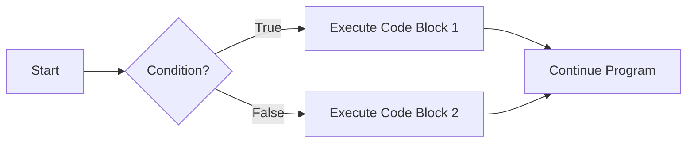

# C++ Conditional Statements

## Introduction

Conditional statements are a fundamental building block of programming that allow your code to make decisions. They evaluate expressions that result in either true or false, and then execute specific code blocks based on those results.

In this guide, we'll explore the various conditional statements available in C++:
- `if` statements
- `if-else` statements
- `if-else if-else` chains
- Nested conditionals
- `switch` statements
- Conditional (ternary) operator

By the end of this guide, you'll be able to write programs that can make decisions and respond to different conditions.

## Basic `if` Statement

The simplest form of a conditional statement is the `if` statement. It executes a block of code only if the specified condition evaluates to `true`.

### Syntax

```cpp
if (condition) {
    // Code to execute if condition is true
}
```

### Example: Checking Age Eligibility

```cpp
#include <iostream>
using namespace std;

int main() {
    int age;
    
    cout << "Enter your age: ";
    cin >> age;
    
    if (age >= 18) {
        cout << "You are eligible to vote!" << endl;
    }
    
    cout << "Program continues here regardless of the condition." << endl;
    
    return 0;
}
```

**Input:**
```
25
```

**Output:**
```
Enter your age: 25
You are eligible to vote!
Program continues here regardless of the condition.
```

**Input:**
```
16
```

**Output:**
```
Enter your age: 16
Program continues here regardless of the condition.
```

## `if-else` Statement

The `if-else` statement allows you to execute one block of code if the condition is true and another block if it's false.

### Syntax

```cpp
if (condition) {
    // Code to execute if condition is true
} else {
    // Code to execute if condition is false
}
```

### Example: Even or Odd Number

```cpp
#include <iostream>
using namespace std;

int main() {
    int number;
    
    cout << "Enter an integer: ";
    cin >> number;
    
    if (number % 2 == 0) {
        cout << number << " is an even number." << endl;
    } else {
        cout << number << " is an odd number." << endl;
    }
    
    return 0;
}
```

**Input:**
```
42
```

**Output:**
```
Enter an integer: 42
42 is an even number.
```

**Input:**
```
7
```

**Output:**
```
Enter an integer: 7
7 is an odd number.
```

## `if-else if-else` Chain

When you need to check multiple conditions, you can use an `if-else if-else` chain.

### Syntax

```cpp
if (condition1) {
    // Code executes if condition1 is true
} else if (condition2) {
    // Code executes if condition1 is false AND condition2 is true
} else if (condition3) {
    // Code executes if condition1 and condition2 are false AND condition3 is true
} else {
    // Code executes if all conditions are false
}
```

### Example: Grading System

```cpp
#include <iostream>
using namespace std;

int main() {
    int score;
    
    cout << "Enter your exam score (0-100): ";
    cin >> score;
    
    if (score >= 90) {
        cout << "Grade: A" << endl;
    } else if (score >= 80) {
        cout << "Grade: B" << endl;
    } else if (score >= 70) {
        cout << "Grade: C" << endl;
    } else if (score >= 60) {
        cout << "Grade: D" << endl;
    } else {
        cout << "Grade: F" << endl;
    }
    
    return 0;
}
```

**Input:**
```
85
```

**Output:**
```
Enter your exam score (0-100): 85
Grade: B
```

**Input:**
```
45
```

**Output:**
```
Enter your exam score (0-100): 45
Grade: F
```

## Nested Conditionals

You can place one conditional statement inside another for more complex decision-making.

### Example: Nested Temperature Check

```cpp
#include <iostream>
using namespace std;

int main() {
    double temperature;
    char unit;
    
    cout << "Enter the temperature: ";
    cin >> temperature;
    
    cout << "Enter unit (C for Celsius, F for Fahrenheit): ";
    cin >> unit;
    
    if (unit == 'C' || unit == 'c') {
        if (temperature > 30) {
            cout << "It's hot outside!" << endl;
        } else if (temperature > 20) {
            cout << "It's a pleasant day." << endl;
        } else {
            cout << "It's cold outside!" << endl;
        }
    } else if (unit == 'F' || unit == 'f') {
        if (temperature > 86) {
            cout << "It's hot outside!" << endl;
        } else if (temperature > 68) {
            cout << "It's a pleasant day." << endl;
        } else {
            cout << "It's cold outside!" << endl;
        }
    } else {
        cout << "Invalid unit entered." << endl;
    }
    
    return 0;
}
```

**Input:**
```
25
C
```

**Output:**
```
Enter the temperature: 25
Enter unit (C for Celsius, F for Fahrenheit): C
It's a pleasant day.
```

## Logical Operators in Conditions

You can combine multiple conditions using logical operators:
- `&&` (AND): Both conditions must be true
- `||` (OR): At least one condition must be true
- `!` (NOT): Inverts the condition's result

### Example: Discount Eligibility

```cpp
#include <iostream>
using namespace std;

int main() {
    int age;
    bool isStudent;
    char studentInput;
    
    cout << "Enter your age: ";
    cin >> age;
    
    cout << "Are you a student? (Y/N): ";
    cin >> studentInput;
    
    isStudent = (studentInput == 'Y' || studentInput == 'y');
    
    if (age < 18 || (age < 25 && isStudent)) {
        cout << "You're eligible for a youth discount!" << endl;
    } else if (age >= 65) {
        cout << "You're eligible for a senior discount!" << endl;
    } else {
        cout << "No special discounts available." << endl;
    }
    
    return 0;
}
```

**Input:**
```
22
Y
```

**Output:**
```
Enter your age: 22
Are you a student? (Y/N): Y
You're eligible for a youth discount!
```

**Input:**
```
70
N
```

**Output:**
```
Enter your age: 70
Are you a student? (Y/N): N
You're eligible for a senior discount!
```

## Switch Statement

The `switch` statement is an alternative to long `if-else if` chains when you need to compare a variable against multiple values.

### Syntax

```cpp
switch (expression) {
    case value1:
        // Code if expression equals value1
        break;
    case value2:
        // Code if expression equals value2
        break;
    // More cases...
    default:
        // Code if expression doesn't match any case
        break;
}
```

### Example: Day of the Week

```cpp
#include <iostream>
using namespace std;

int main() {
    int day;
    
    cout << "Enter a day number (1-7): ";
    cin >> day;
    
    switch (day) {
        case 1:
            cout << "Monday" << endl;
            break;
        case 2:
            cout << "Tuesday" << endl;
            break;
        case 3:
            cout << "Wednesday" << endl;
            break;
        case 4:
            cout << "Thursday" << endl;
            break;
        case 5:
            cout << "Friday" << endl;
            break;
        case 6:
            cout << "Saturday" << endl;
            break;
        case 7:
            cout << "Sunday" << endl;
            break;
        default:
            cout << "Invalid day number" << endl;
            break;
    }
    
    return 0;
}
```

**Input:**
```
3
```

**Output:**
```
Enter a day number (1-7): 3
Wednesday
```

### Important Switch Statement Rules:

1. The expression in the switch must evaluate to an integer, character, or enumeration type.
2. Case values must be constants or literal values, not variables.
3. The `break` statement is crucial - without it, execution "falls through" to the next case.
4. The `default` case is optional but recommended for handling unexpected values.

### Switch Fall-Through Example:

```cpp
#include <iostream>
using namespace std;

int main() {
    int month;
    
    cout << "Enter month number (1-12): ";
    cin >> month;
    
    cout << "Number of days: ";
    switch (month) {
        case 2:
            cout << "28 or 29 (leap year)" << endl;
            break;
        case 4:
        case 6:
        case 9:
        case 11:
            cout << "30" << endl;
            break;
        case 1:
        case 3:
        case 5:
        case 7:
        case 8:
        case 10:
        case 12:
            cout << "31" << endl;
            break;
        default:
            cout << "Invalid month" << endl;
    }
    
    return 0;
}
```

**Input:**
```
4
```

**Output:**
```
Enter month number (1-12): 4
Number of days: 30
```

## Conditional (Ternary) Operator

The conditional operator `? :` provides a shorthand way to write simple if-else statements.

### Syntax

```cpp
condition ? expression1 : expression2;
```

If `condition` is true, the value of `expression1` is returned, otherwise the value of `expression2` is returned.

### Example: Finding Maximum

```cpp
#include <iostream>
using namespace std;

int main() {
    int a, b;
    
    cout << "Enter two numbers: ";
    cin >> a >> b;
    
    // Using ternary operator to find the larger number
    int max = (a > b) ? a : b;
    
    cout << "The larger number is: " << max << endl;
    
    // Equivalent if-else statement:
    // if (a > b) {
    //     max = a;
    // } else {
    //     max = b;
    // }
    
    return 0;
}
```

**Input:**
```
24 17
```

**Output:**
```
Enter two numbers: 24 17
The larger number is: 24
```

## Flow Diagram of Conditional Statements

Here's a visual representation of how conditional statements control program flow:



## Real-World Application: Simple Calculator

Let's build a simple calculator that demonstrates various conditional statements in action:

```cpp
#include <iostream>
using namespace std;

int main() {
    double num1, num2, result;
    char operation;
    
    cout << "Simple Calculator" << endl;
    cout << "----------------" << endl;
    
    cout << "Enter first number: ";
    cin >> num1;
    
    cout << "Enter an operation (+, -, *, /): ";
    cin >> operation;
    
    cout << "Enter second number: ";
    cin >> num2;
    
    // Using switch for operation selection
    switch (operation) {
        case '+':
            result = num1 + num2;
            cout << num1 << " + " << num2 << " = " << result << endl;
            break;
        case '-':
            result = num1 - num2;
            cout << num1 << " - " << num2 << " = " << result << endl;
            break;
        case '*':
            result = num1 * num2;
            cout << num1 << " * " << num2 << " = " << result << endl;
            break;
        case '/':
            // Using nested if to handle division by zero
            if (num2 != 0) {
                result = num1 / num2;
                cout << num1 << " / " << num2 << " = " << result << endl;
            } else {
                cout << "Error: Division by zero is not allowed." << endl;
            }
            break;
        default:
            cout << "Error: Invalid operation." << endl;
    }
    
    // Using ternary operator for a simple result classification
    string assessment = (result >= 0) ? "positive" : "negative";
    cout << "The result is " << assessment << "." << endl;
    
    return 0;
}
```

**Input:**
```
10
*
5
```

**Output:**
```
Simple Calculator
----------------
Enter first number: 10
Enter an operation (+, -, *, /): *
Enter second number: 5
10 * 5 = 50
The result is positive.
```

**Input:**
```
10
/
0
```

**Output:**
```
Simple Calculator
----------------
Enter first number: 10
Enter an operation (+, -, *, /): /
Enter second number: 0
Error: Division by zero is not allowed.
The result is positive.
```

## Summary

Conditional statements in C++ allow your programs to make decisions based on conditions:

- **if statement**: Executes code only if a condition is true
- **if-else statement**: Chooses between two code blocks based on a condition
- **if-else if-else chain**: Evaluates multiple conditions in sequence
- **Nested conditionals**: Places conditional statements inside others for complex logic
- **switch statement**: Efficiently handles multiple cases for a single expression
- **Ternary operator**: Provides a compact way to write simple if-else statements

Mastering conditional statements is essential for creating dynamic programs that can respond to different inputs and situations.

## Practice Exercises

1. Write a program that calculates the absolute value of a number without using the `abs()` function.
2. Create a program that takes three integers as input and outputs the largest one.
3. Implement a program that determines if a year is a leap year (divisible by 4, but not by 100 unless it's also divisible by 400).
4. Build a simple traffic light system that outputs different messages based on the color input (red, yellow, green).
5. Create a menu-driven program that allows a user to convert between different units (e.g., temperature, length, weight).

## Additional Resources

- [cppreference - if statements](https://en.cppreference.com/w/cpp/language/if)
- [cppreference - switch statements](https://en.cppreference.com/w/cpp/language/switch)
- [cppreference - conditional operator](https://en.cppreference.com/w/cpp/language/operator_other#Conditional_operator)

Happy coding!