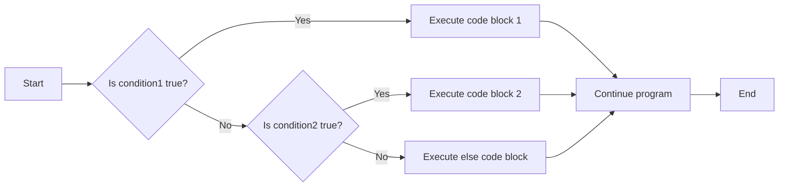

# C++ If Else

## Introduction

Decision making is a fundamental aspect of programming. In real life, we make decisions based on conditions - if it's raining, take an umbrella; otherwise, leave it at home. Programming languages need similar mechanisms to make choices, and in C++, the `if-else` statement serves this purpose.

The `if-else` construct allows your program to follow different paths of execution based on whether certain conditions are true or false. This capability is essential for creating dynamic and responsive programs that can adapt to different inputs and situations.

## Basic If Statement

The simplest form of conditional execution is the `if` statement. It executes a block of code only if a specified condition evaluates to `true`.

### Syntax

```cpp
if (condition) {
    // Code to execute if condition is true
}
```

### Example

Let's look at a simple program that checks if a number is positive:

```cpp
#include <iostream>
using namespace std;

int main() {
    int number;
    
    cout << "Enter a number: ";
    cin >> number;
    
    if (number > 0) {
        cout << "The number is positive." << endl;
    }
    
    cout << "Program completed." << endl;
    return 0;
}
```

**Input:**
```
5
```

**Output:**
```
Enter a number: 5
The number is positive.
Program completed.
```

**Input:**
```
-3
```

**Output:**
```
Enter a number: -3
Program completed.
```

In this example, the message "The number is positive" only appears when the user enters a positive number. The final message "Program completed" always appears because it's outside the `if` block.

## If-Else Statement

What if we want to execute one block of code when a condition is true and a different block when it's false? That's where the `if-else` statement comes in.

### Syntax

```cpp
if (condition) {
    // Code to execute if condition is true
} else {
    // Code to execute if condition is false
}
```

### Example

Let's modify our previous example to provide feedback for non-positive numbers as well:

```cpp
#include <iostream>
using namespace std;

int main() {
    int number;
    
    cout << "Enter a number: ";
    cin >> number;
    
    if (number > 0) {
        cout << "The number is positive." << endl;
    } else {
        cout << "The number is not positive." << endl;
    }
    
    return 0;
}
```

**Input:**
```
7
```

**Output:**
```
Enter a number: 7
The number is positive.
```

**Input:**
```
-4
```

**Output:**
```
Enter a number: -4
The number is not positive.
```

## If-Else If-Else Statement (Multiple Conditions)

When you need to check multiple conditions, you can chain `if-else` statements using the `else if` construct.

### Syntax

```cpp
if (condition1) {
    // Code to execute if condition1 is true
} else if (condition2) {
    // Code to execute if condition1 is false and condition2 is true
} else if (condition3) {
    // Code to execute if condition1 and condition2 are false and condition3 is true
} else {
    // Code to execute if all conditions are false
}
```

### Example

Let's expand our number classification program:

```cpp
#include <iostream>
using namespace std;

int main() {
    int number;
    
    cout << "Enter a number: ";
    cin >> number;
    
    if (number > 0) {
        cout << "The number is positive." << endl;
    } else if (number < 0) {
        cout << "The number is negative." << endl;
    } else {
        cout << "The number is zero." << endl;
    }
    
    return 0;
}
```

**Input:**
```
10
```

**Output:**
```
Enter a number: 10
The number is positive.
```

**Input:**
```
-10
```

**Output:**
```
Enter a number: -10
The number is negative.
```

**Input:**
```
0
```

**Output:**
```
Enter a number: 0
The number is zero.
```

## Nested If Statements

You can place an `if` statement inside another `if` or `else` block. This is called nesting and allows for more complex decision-making logic.

### Syntax

```cpp
if (condition1) {
    // Code to execute if condition1 is true
    if (condition2) {
        // Code to execute if both condition1 and condition2 are true
    } else {
        // Code to execute if condition1 is true but condition2 is false
    }
} else {
    // Code to execute if condition1 is false
}
```

### Example

Let's create a program that determines if a number is divisible by both 2 and 3:

```cpp
#include <iostream>
using namespace std;

int main() {
    int number;
    
    cout << "Enter a number: ";
    cin >> number;
    
    if (number % 2 == 0) {
        cout << number << " is even." << endl;
        
        if (number % 3 == 0) {
            cout << number << " is divisible by both 2 and 3." << endl;
        } else {
            cout << number << " is not divisible by 3." << endl;
        }
    } else {
        cout << number << " is odd." << endl;
        
        if (number % 3 == 0) {
            cout << number << " is divisible by 3." << endl;
        } else {
            cout << number << " is not divisible by 2 or 3." << endl;
        }
    }
    
    return 0;
}
```

**Input:**
```
12
```

**Output:**
```
Enter a number: 12
12 is even.
12 is divisible by both 2 and 3.
```

**Input:**
```
8
```

**Output:**
```
Enter a number: 8
8 is even.
8 is not divisible by 3.
```

**Input:**
```
9
```

**Output:**
```
Enter a number: 9
9 is odd.
9 is divisible by 3.
```

## Conditional Operators and Boolean Expressions

The conditions in `if` statements are boolean expressions that evaluate to either `true` or `false`. Here are common operators used in conditions:

| Operator | Description | Example |
|----------|-------------|---------|
| `==` | Equal to | `x == y` |
| `!=` | Not equal to | `x != y` |
| `>` | Greater than | `x > y` |
| `<` | Less than | `x < y` |
| `>=` | Greater than or equal to | `x >= y` |
| `<=` | Less than or equal to | `x <= y` |
| `&&` | Logical AND | `x > 0 && x < 10` |
| `\|\|` | Logical OR | `x < 0 \|\| x > 10` |
| `!` | Logical NOT | `!(x == y)` |

### Example Using Logical Operators

Here's a program that checks if a number is within a specific range:

```cpp
#include <iostream>
using namespace std;

int main() {
    int number;
    
    cout << "Enter a number between 1 and 100: ";
    cin >> number;
    
    if (number >= 1 && number <= 100) {
        cout << "Valid input!" << endl;
        
        if (number >= 1 && number <= 25) {
            cout << "The number is in the first quarter." << endl;
        } else if (number >= 26 && number <= 50) {
            cout << "The number is in the second quarter." << endl;
        } else if (number >= 51 && number <= 75) {
            cout << "The number is in the third quarter." << endl;
        } else {
            cout << "The number is in the fourth quarter." << endl;
        }
    } else {
        cout << "Invalid input! The number is not between 1 and 100." << endl;
    }
    
    return 0;
}
```

**Input:**
```
42
```

**Output:**
```
Enter a number between 1 and 100: 42
Valid input!
The number is in the second quarter.
```

**Input:**
```
150
```

**Output:**
```
Enter a number between 1 and 100: 150
Invalid input! The number is not between 1 and 100.
```

## Flow Visualization

The following diagram illustrates the flow of execution in an if-else if-else statement:



## Practical Applications

### 1. Temperature Converter with Feedback

```cpp
#include <iostream>
using namespace std;

int main() {
    double temp;
    char unit;
    
    cout << "Enter a temperature value: ";
    cin >> temp;
    cout << "Enter unit (C for Celsius, F for Fahrenheit): ";
    cin >> unit;
    
    if (unit == 'C' || unit == 'c') {
        double fahrenheit = (temp * 9.0/5.0) + 32;
        cout << temp << "°C is " << fahrenheit << "°F" << endl;
        
        if (temp <= 0) {
            cout << "That's freezing in Celsius!" << endl;
        } else if (temp >= 30) {
            cout << "That's hot in Celsius!" << endl;
        }
    } else if (unit == 'F' || unit == 'f') {
        double celsius = (temp - 32) * 5.0/9.0;
        cout << temp << "°F is " << celsius << "°C" << endl;
        
        if (temp <= 32) {
            cout << "That's freezing in Fahrenheit!" << endl;
        } else if (temp >= 86) {
            cout << "That's hot in Fahrenheit!" << endl;
        }
    } else {
        cout << "Invalid unit. Please enter C or F." << endl;
    }
    
    return 0;
}
```

**Input:**
```
25
C
```

**Output:**
```
Enter a temperature value: 25
Enter unit (C for Celsius, F for Fahrenheit): C
25°C is 77°F
```

### 2. Simple Calculator

```cpp
#include <iostream>
using namespace std;

int main() {
    double num1, num2;
    char operation;
    
    cout << "Enter first number: ";
    cin >> num1;
    cout << "Enter operation (+, -, *, /): ";
    cin >> operation;
    cout << "Enter second number: ";
    cin >> num2;
    
    if (operation == '+') {
        cout << num1 << " + " << num2 << " = " << num1 + num2 << endl;
    } else if (operation == '-') {
        cout << num1 << " - " << num2 << " = " << num1 - num2 << endl;
    } else if (operation == '*') {
        cout << num1 << " * " << num2 << " = " << num1 * num2 << endl;
    } else if (operation == '/') {
        if (num2 != 0) {
            cout << num1 << " / " << num2 << " = " << num1 / num2 << endl;
        } else {
            cout << "Error: Division by zero is not allowed." << endl;
        }
    } else {
        cout << "Invalid operation. Please use +, -, *, or /." << endl;
    }
    
    return 0;
}
```

**Input:**
```
10
*
5
```

**Output:**
```
Enter first number: 10
Enter operation (+, -, *, /): *
Enter second number: 5
10 * 5 = 50
```

**Input:**
```
8
/
0
```

**Output:**
```
Enter first number: 8
Enter operation (+, -, *, /): /
Enter second number: 0
Error: Division by zero is not allowed.
```

## Common Mistakes and Tips

1. **Forgetting Braces**: If you omit braces and write only one statement after the `if` or `else`, only that statement is conditional. Always use braces for clarity, especially as a beginner.

2. **Using `=` Instead of `==`**: The assignment operator `=` is different from the equality operator `==`. Using `if (x = 5)` assigns 5 to x instead of checking if x equals 5.

3. **Dangling Else Problem**: In nested ifs without braces, it can be unclear which `if` an `else` belongs to. C++ associates an `else` with the closest preceding `if` that doesn't have an `else`.

4. **Complex Conditions**: Break down complex conditions for readability. Use parentheses to clarify the order of evaluation.

## Summary

The `if-else` construct in C++ allows your program to make decisions and execute different code blocks based on conditions:

- Use `if` statements when you need to execute code only under certain conditions
- Use `if-else` when you need one path for the true condition and another for the false condition
- Use `if-else if-else` chains when you need to check multiple conditions
- Nested `if` statements allow for more complex decision-making logic
- Logical operators (`&&`, `||`, `!`) can be used to create complex conditions

If-else statements are foundational to programming and are used in virtually every non-trivial program. Mastering them is essential for writing effective C++ code.

## Exercises

1. Write a program that determines if a year is a leap year. (Hint: A year is a leap year if it's divisible by 4, except for century years which must be divisible by 400).

2. Create a program that asks the user for their grade (0-100) and outputs the letter grade according to this scale:
   - 90-100: A
   - 80-89: B
   - 70-79: C
   - 60-69: D
   - Below 60: F

3. Write a program that determines which of three input numbers is the largest.

4. Create a simple rock-paper-scissors game where the user plays against the computer.

5. Write a program that determines if a triangle is equilateral, isosceles, or scalene based on the lengths of its three sides.

## Additional Resources

- [CPlusPlus Tutorial on Control Structures](http://www.cplusplus.com/doc/tutorial/control/)
- [C++ Reference on if statements](https://en.cppreference.com/w/cpp/language/if)
- [C++ Programming - Wikibooks](https://en.wikibooks.org/wiki/C%2B%2B_Programming/Control_Structures)