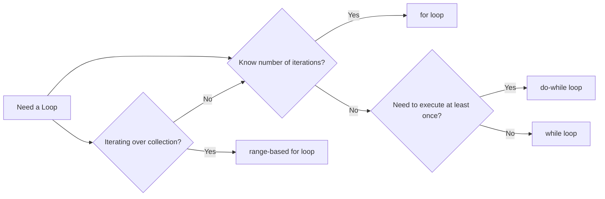

# C++ Loops

## Introduction

Loops are fundamental programming constructs that allow you to execute a block of code repeatedly. They are essential for automating repetitive tasks, processing collections of data, and creating efficient algorithms. In C++, loops provide a way to iterate through code until a specific condition is met, making your programs more powerful and concise.

This guide will explore the different types of loops available in C++, their syntax, use cases, and best practices. By the end, you'll understand how to effectively use loops in your C++ programs.

## Why Use Loops?

Imagine you need to print numbers from 1 to 100. Without loops, you would have to write 100 separate print statements. With loops, you can achieve this in just a few lines of code.

Loops allow you to:
- Reduce code repetition
- Automate iterative tasks
- Process data collections efficiently
- Create dynamic and responsive programs

## Types of Loops in C++

C++ offers four main types of loops:

1. `while` loop
2. `do-while` loop
3. `for` loop
4. Range-based `for` loop (introduced in C++11)

Let's dive into each type in detail.

## While Loop

The `while` loop executes a block of code as long as a specified condition is true. It first checks the condition; if true, it executes the code block. After execution, it checks the condition again, continuing this cycle until the condition becomes false.

### Syntax

```cpp
while (condition) {
    // Code to be repeated
}
```

### Example: Counting from 1 to 5

```cpp
#include <iostream>

int main() {
    int count = 1;
    
    while (count <= 5) {
        std::cout << count << " ";
        count++;
    }
    
    return 0;
}
```

**Output:**
```
1 2 3 4 5
```

### How It Works

1. `count` is initialized to 1
2. The `while` loop checks if `count <= 5` (true)
3. The code inside the loop executes, printing the current value of `count`
4. `count` is incremented by 1
5. The loop repeats steps 2-4 until `count` becomes 6, at which point the condition is false and the loop terminates

### Caution: Infinite Loops

If the condition in a `while` loop never becomes false, you'll create an infinite loop that will hang your program. Always ensure there's a way for the loop condition to eventually become false.

```cpp
// Infinite loop - DO NOT RUN
while (true) {
    std::cout << "This will never end!" << std::endl;
}
```

To prevent infinite loops, ensure that:
- Your condition can eventually become false
- You update relevant variables inside the loop
- You have a way to exit the loop (like a `break` statement)

## Do-While Loop

The `do-while` loop is similar to the `while` loop, but with one key difference: it executes the code block at least once before checking the condition.

### Syntax

```cpp
do {
    // Code to be repeated
} while (condition);
```

### Example: Getting Valid User Input

```cpp
#include <iostream>

int main() {
    int number;
    
    do {
        std::cout << "Enter a positive number: ";
        std::cin >> number;
    } while (number <= 0);
    
    std::cout << "You entered: " << number << std::endl;
    
    return 0;
}
```

**Sample Run:**
```
Enter a positive number: -5
Enter a positive number: 0
Enter a positive number: 10
You entered: 10
```

### When to Use Do-While

The `do-while` loop is particularly useful when:
- You want to execute code at least once regardless of the condition
- You're validating user input
- You need to process data before deciding whether to continue

## For Loop

The `for` loop provides a more compact syntax for iteration, combining initialization, condition checking, and increment/decrement in a single line.

### Syntax

```cpp
for (initialization; condition; update) {
    // Code to be repeated
}
```

### Example: Calculating Factorial

```cpp
#include <iostream>

int main() {
    int number = 5;
    int factorial = 1;
    
    for (int i = 1; i <= number; i++) {
        factorial *= i;
    }
    
    std::cout << "Factorial of " << number << " is " << factorial << std::endl;
    
    return 0;
}
```

**Output:**
```
Factorial of 5 is 120
```

### Components of a For Loop

1. **Initialization**: Executed once at the beginning (e.g., `int i = 1`)
2. **Condition**: Checked before each iteration (e.g., `i <= number`)
3. **Update**: Executed after each iteration (e.g., `i++`)

### For Loop Variations

You can customize your `for` loops in various ways:

**Multiple Initializations and Updates:**

```cpp
for (int i = 0, j = 10; i < j; i++, j--) {
    std::cout << "i = " << i << ", j = " << j << std::endl;
}
```

**Output:**
```
i = 0, j = 10
i = 1, j = 9
i = 2, j = 8
i = 3, j = 7
i = 4, j = 6
```

**Infinite For Loop:**

```cpp
// Use with caution!
for (;;) {
    // Code that runs forever unless break is used
}
```

## Range-Based For Loop (C++11)

Introduced in C++11, the range-based `for` loop simplifies iterating over collections like arrays, vectors, and other containers.

### Syntax

```cpp
for (element_type element : collection) {
    // Process element
}
```

### Example: Iterating Through an Array

```cpp
#include <iostream>
#include <vector>

int main() {
    std::vector<int> numbers = {1, 2, 3, 4, 5};
    
    for (int num : numbers) {
        std::cout << num * num << " ";
    }
    
    return 0;
}
```

**Output:**
```
1 4 9 16 25
```

### Using Auto for Type Deduction

You can use the `auto` keyword to let the compiler deduce the element type:

```cpp
for (auto num : numbers) {
    std::cout << num << " ";
}
```

### Using References to Modify Elements

To modify elements in the collection, use references:

```cpp
for (auto& num : numbers) {
    num *= 2;
}
```

## Loop Control Statements

C++ provides special statements to modify loop behavior:

### Break Statement

The `break` statement immediately exits the loop, skipping any remaining iterations.

```cpp
#include <iostream>

int main() {
    for (int i = 1; i <= 10; i++) {
        if (i == 6) {
            break;
        }
        std::cout << i << " ";
    }
    
    return 0;
}
```

**Output:**
```
1 2 3 4 5
```

### Continue Statement

The `continue` statement skips the current iteration and proceeds to the next one.

```cpp
#include <iostream>

int main() {
    for (int i = 1; i <= 10; i++) {
        if (i % 2 == 0) {
            continue;  // Skip even numbers
        }
        std::cout << i << " ";
    }
    
    return 0;
}
```

**Output:**
```
1 3 5 7 9
```

## Nested Loops

Loops can be placed inside other loops to handle multi-dimensional data or more complex iterations.

### Example: Multiplication Table

```cpp
#include <iostream>
#include <iomanip>  // For std::setw

int main() {
    for (int i = 1; i <= 5; i++) {
        for (int j = 1; j <= 5; j++) {
            std::cout << std::setw(4) << i * j;
        }
        std::cout << std::endl;
    }
    
    return 0;
}
```

**Output:**
```
   1   2   3   4   5
   2   4   6   8  10
   3   6   9  12  15
   4   8  12  16  20
   5  10  15  20  25
```

## Practical Applications

Let's explore some real-world applications of loops in C++.

### Example 1: Finding Prime Numbers

```cpp
#include <iostream>
#include <cmath>

bool isPrime(int n) {
    if (n <= 1) return false;
    if (n <= 3) return true;
    
    if (n % 2 == 0 || n % 3 == 0) return false;
    
    for (int i = 5; i * i <= n; i += 6) {
        if (n % i == 0 || n % (i + 2) == 0) {
            return false;
        }
    }
    
    return true;
}

int main() {
    std::cout << "Prime numbers between 1 and 50:" << std::endl;
    
    for (int i = 1; i <= 50; i++) {
        if (isPrime(i)) {
            std::cout << i << " ";
        }
    }
    
    return 0;
}
```

**Output:**
```
Prime numbers between 1 and 50:
2 3 5 7 11 13 17 19 23 29 31 37 41 43 47
```

### Example 2: Simple Menu-Driven Program

```cpp
#include <iostream>

int main() {
    int choice;
    bool running = true;
    
    while (running) {
        std::cout << "\n===== MENU =====" << std::endl;
        std::cout << "1. Say Hello" << std::endl;
        std::cout << "2. Calculate Square" << std::endl;
        std::cout << "3. Exit" << std::endl;
        std::cout << "Enter choice: ";
        std::cin >> choice;
        
        switch (choice) {
            case 1:
                std::cout << "Hello, World!" << std::endl;
                break;
            case 2:
                int num;
                std::cout << "Enter a number: ";
                std::cin >> num;
                std::cout << "Square of " << num << " is " << num * num << std::endl;
                break;
            case 3:
                std::cout << "Exiting program. Goodbye!" << std::endl;
                running = false;
                break;
            default:
                std::cout << "Invalid choice. Please try again." << std::endl;
        }
    }
    
    return 0;
}
```

## Loop Performance Considerations

When using loops, consider these performance tips:

1. **Minimize work inside loops**: Move calculations outside the loop when possible
2. **Avoid expensive operations**: Function calls or complex calculations inside loops can slow performance
3. **Optimize loop variables**: Use the most efficient data type for loop counters
4. **Consider loop unrolling**: For performance-critical code, manually unrolling loops can reduce overhead

```cpp
// Before optimization
for (int i = 0; i < 10; i++) {
    result += expensive_function(i); // Function called 10 times
}

// After optimization
int temp = expensive_function(0); // Function called once
for (int i = 0; i < 10; i++) {
    result += temp;
}
```

## Choosing the Right Loop

Here's a quick guide to help you choose the most appropriate loop:

- **while loop**: Use when you don't know how many iterations you need in advance, and the loop might not execute at all
- **do-while loop**: Use when you need to execute code at least once before checking the condition
- **for loop**: Use when you know the exact number of iterations in advance
- **range-based for loop**: Use when iterating over elements in a collection



## Common Loop Patterns

### Pattern 1: Counting (Ascending/Descending)

```cpp
// Ascending
for (int i = 1; i <= 10; i++) {
    std::cout << i << " ";
}

// Descending
for (int i = 10; i >= 1; i--) {
    std::cout << i << " ";
}
```

### Pattern 2: Loop with a Sentinel Value

```cpp
int value;
std::cout << "Enter numbers (enter -1 to stop):" << std::endl;

while (true) {
    std::cin >> value;
    if (value == -1) break;
    std::cout << "You entered: " << value << std::endl;
}
```

### Pattern 3: Accumulator Pattern

```cpp
int sum = 0;
for (int i = 1; i <= 100; i++) {
    sum += i;
}
std::cout << "Sum of numbers 1 to 100: " << sum << std::endl;
```

## Summary

Loops are powerful constructs in C++ that allow you to execute code repeatedly. We've covered:

- **While loops**: Execute as long as a condition is true
- **Do-while loops**: Execute at least once, then continue based on a condition
- **For loops**: Provide a compact way to iterate a specific number of times
- **Range-based for loops**: Simplify iteration over collections
- **Loop control statements**: Break and continue for fine-grained control
- **Nested loops**: For handling multi-dimensional data
- **Real-world applications**: Implementing algorithms and interactive programs

Understanding loops is essential for writing effective C++ programs. They not only make your code more concise but also more powerful, enabling you to solve complex problems efficiently.

## Exercises

Test your understanding with these exercises:

1. Write a program that prints all even numbers from 1 to 20.
2. Create a program that calculates the sum and average of n numbers entered by the user.
3. Write a loop that prints the Fibonacci sequence up to the 10th term.
4. Implement a simple number guessing game where the computer generates a random number, and the user has to guess it.
5. Create a program that prints a pattern of asterisks forming a right-angled triangle.

## Additional Resources

- [C++ Reference: Iteration statements](https://en.cppreference.com/w/cpp/language/statements#Iteration_statements)
- [LearnCpp.com: Loops](https://www.learncpp.com/cpp-tutorial/introduction-to-loops/)
- [CPlusPlus.com: Control Structures](http://www.cplusplus.com/doc/tutorial/control/)
- Book: "C++ Primer" by Stanley B. Lippman, Josée Lajoie, and Barbara E. Moo (Chapters on Control Flow)

Happy coding!