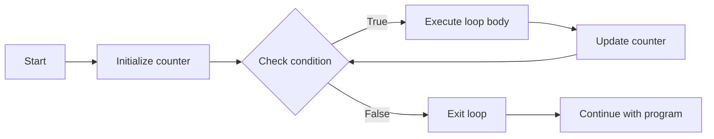

# C++ For Loop

## Introduction

In programming, we often need to repeat a set of instructions multiple times. Rather than writing the same code over and over, we use loops. The `for` loop is one of the most common and versatile loops in C++, providing a compact way to iterate over a range of values or perform a task a specific number of times.

In this guide, we'll cover everything you need to know about C++ for loops, starting with the basics and moving to more advanced usages and real-world applications.

## Basic Syntax of a For Loop

A for loop in C++ has the following standard syntax:

```cpp
for (initialization; condition; update) {
    // Code to be repeated
}
```

Let's break down each component:

1. **Initialization**: Executed once before the loop begins. Typically used to initialize a counter variable.
2. **Condition**: Evaluated before each iteration. If true, the loop continues; if false, the loop ends.
3. **Update**: Executed after each iteration. Usually increments or decrements the counter variable.

## Simple For Loop Example

Here's a basic example of a for loop that counts from 1 to 5:

```cpp
#include <iostream>
using namespace std;

int main() {
    for (int i = 1; i <= 5; i++) {
        cout << "Count: " << i << endl;
    }
    return 0;
}
```

**Output:**
```
Count: 1
Count: 2
Count: 3
Count: 4
Count: 5
```

### How It Works:

1. `int i = 1` initializes the counter variable to 1.
2. `i <= 5` checks if the counter is less than or equal to 5.
3. `i++` increments the counter after each iteration.
4. The loop body prints the current value of `i`.
5. Once `i` becomes 6, the condition `i <= 5` becomes false, and the loop ends.

## Variations of For Loops

### Counting Backwards

You can count downwards by using a decrement operator:

```cpp
#include <iostream>
using namespace std;

int main() {
    for (int i = 5; i >= 1; i--) {
        cout << "Countdown: " << i << endl;
    }
    return 0;
}
```

**Output:**
```
Countdown: 5
Countdown: 4
Countdown: 3
Countdown: 2
Countdown: 1
```

### Different Step Sizes

You can increment/decrement by values other than 1:

```cpp
#include <iostream>
using namespace std;

int main() {
    cout << "Even numbers from 2 to 10:" << endl;
    for (int i = 2; i <= 10; i += 2) {
        cout << i << " ";
    }
    cout << endl;
    
    cout << "Multiples of 3 from 3 to 15:" << endl;
    for (int i = 3; i <= 15; i += 3) {
        cout << i << " ";
    }
    cout << endl;
    
    return 0;
}
```

**Output:**
```
Even numbers from 2 to 10:
2 4 6 8 10 
Multiples of 3 from 3 to 15:
3 6 9 12 15 
```

### Using Multiple Variables

You can initialize and update multiple variables:

```cpp
#include <iostream>
using namespace std;

int main() {
    for (int i = 1, j = 10; i <= 5; i++, j--) {
        cout << "i = " << i << ", j = " << j << endl;
    }
    return 0;
}
```

**Output:**
```
i = 1, j = 10
i = 2, j = 9
i = 3, j = 8
i = 4, j = 7
i = 5, j = 6
```

### Infinite For Loops

You can create an infinite loop by omitting the condition:

```cpp
for (int i = 1; ; i++) {
    // This loop will run forever unless broken
    // Use with caution!
    cout << i << " ";
    if (i == 10) break; // Exit condition using break
}
```

**Output:**
```
1 2 3 4 5 6 7 8 9 10
```

## Nested For Loops

For loops can be nested inside other for loops, which is useful for working with multi-dimensional data:

```cpp
#include <iostream>
using namespace std;

int main() {
    // Print a simple 3x3 pattern
    for (int i = 1; i <= 3; i++) {
        for (int j = 1; j <= 3; j++) {
            cout << "(" << i << "," << j << ") ";
        }
        cout << endl;
    }
    return 0;
}
```

**Output:**
```
(1,1) (1,2) (1,3) 
(2,1) (2,2) (2,3) 
(3,1) (3,2) (3,3) 
```

## Flow Diagram of a For Loop



## Practical Examples

### Example 1: Calculating Factorial

This example calculates the factorial of a number using a for loop:

```cpp
#include <iostream>
using namespace std;

int main() {
    int num;
    long long factorial = 1;
    
    cout << "Enter a positive integer: ";
    cin >> num;
    
    if (num < 0) {
        cout << "Error: Factorial is not defined for negative numbers." << endl;
    } else {
        for (int i = 1; i <= num; i++) {
            factorial *= i;
        }
        cout << "Factorial of " << num << " is " << factorial << endl;
    }
    
    return 0;
}
```

**Input & Output:**
```
Enter a positive integer: 5
Factorial of 5 is 120
```

### Example 2: Generating a Pattern

This example uses nested for loops to generate a simple triangle pattern:

```cpp
#include <iostream>
using namespace std;

int main() {
    int rows;
    
    cout << "Enter the number of rows: ";
    cin >> rows;
    
    for (int i = 1; i <= rows; i++) {
        // Print spaces
        for (int j = 1; j <= rows - i; j++) {
            cout << " ";
        }
        
        // Print stars
        for (int k = 1; k <= 2 * i - 1; k++) {
            cout << "*";
        }
        
        cout << endl;
    }
    
    return 0;
}
```

**Input & Output:**
```
Enter the number of rows: 5
    *
   ***
  *****
 *******
*********
```

### Example 3: Finding Prime Numbers

This example checks if a number is prime using a for loop:

```cpp
#include <iostream>
#include <cmath>
using namespace std;

int main() {
    int num;
    bool isPrime = true;
    
    cout << "Enter a positive integer: ";
    cin >> num;
    
    // 0 and 1 are not prime numbers
    if (num <= 1) {
        isPrime = false;
    } else {
        // Check for divisibility from 2 up to the square root of num
        for (int i = 2; i <= sqrt(num); i++) {
            if (num % i == 0) {
                isPrime = false;
                break;
            }
        }
    }
    
    if (isPrime) {
        cout << num << " is a prime number." << endl;
    } else {
        cout << num << " is not a prime number." << endl;
    }
    
    return 0;
}
```

**Input & Output:**
```
Enter a positive integer: 17
17 is a prime number.
```

## Range-based For Loop (C++11 and later)

C++11 introduced a new, simpler form of the for loop, called the range-based for loop. It's especially useful when working with collections like arrays, vectors, and other containers:

```cpp
#include <iostream>
#include <vector>
using namespace std;

int main() {
    // Using range-based for loop with an array
    int numbers[] = {1, 2, 3, 4, 5};
    
    cout << "Array elements: ";
    for (int num : numbers) {
        cout << num << " ";
    }
    cout << endl;
    
    // Using range-based for loop with a vector
    vector<string> fruits = {"Apple", "Banana", "Cherry", "Date"};
    
    cout << "Fruits: ";
    for (const string& fruit : fruits) {
        cout << fruit << " ";
    }
    cout << endl;
    
    return 0;
}
```

**Output:**
```
Array elements: 1 2 3 4 5 
Fruits: Apple Banana Cherry Date 
```

The syntax `for (type element : collection)` means: "for each element of the specified type in the collection, do something." This makes your code more readable and less prone to errors like off-by-one mistakes.

## Common Pitfalls and Best Practices

### Pitfalls to Avoid:

1. **Infinite Loops**: Ensure your condition will eventually become false.
2. **Off-by-one Errors**: Double-check your loop boundaries (using `<=` vs. `<`).
3. **Modifying Loop Variables Inside the Loop**: This can lead to unexpected behavior.

### Best Practices:

1. **Keep Loop Bodies Simple**: If a loop body becomes too complex, consider refactoring.
2. **Use Meaningful Variable Names**: Use descriptive names instead of just `i`, `j`, `k` for more complex loops.
3. **Consider Performance**: For large datasets, optimize your loops for efficiency.

## Summary

The for loop is a powerful and flexible construct in C++ for implementing repetitive tasks. It comes in various forms:

- **Standard for loop**: `for (initialization; condition; update)`
- **Range-based for loop**: `for (type element : collection)`

With for loops, you can iterate over ranges, process collections, generate patterns, and solve mathematical problems efficiently. Understanding when and how to use for loops is essential for becoming proficient in C++ programming.

## Exercises

1. Write a program that uses a for loop to print the first 10 numbers in the Fibonacci sequence.
2. Create a program that displays a multiplication table from 1 to 10.
3. Write a program that uses nested for loops to display a rectangle of asterisks with a specified number of rows and columns.
4. Implement a program that calculates the sum of the first n natural numbers using a for loop.
5. Create a program that determines if a given number is a palindrome (same forwards and backwards) using a for loop.

## Additional Resources

- [C++ Reference - For Loops](https://en.cppreference.com/w/cpp/language/for)
- [Range-based For Loop Documentation](https://en.cppreference.com/w/cpp/language/range-for)
- [Iterators in C++](https://en.cppreference.com/w/cpp/iterator)

Happy coding!