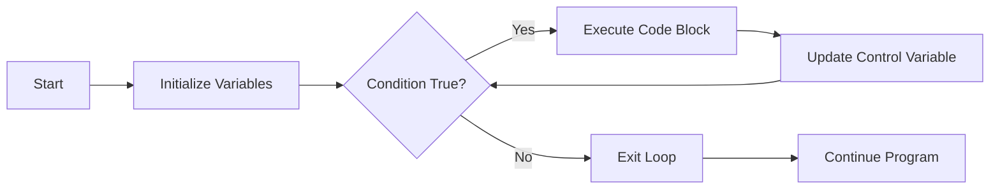

# C++ While Loop

## Introduction

The `while` loop is one of the fundamental loop structures in C++ that allows you to repeatedly execute a block of code as long as a specified condition remains true. It's an essential tool for handling repetitive tasks without writing the same code multiple times, making your programs more efficient and concise.

In this tutorial, we'll explore how the `while` loop works, its syntax, practical applications, and best practices to avoid common pitfalls.

## Basic Syntax

The basic syntax of a `while` loop in C++ is:

```cpp
while (condition) {
    // code to be executed repeatedly
    // as long as the condition is true
}
```

Here's how it works:
1. The condition is evaluated.
2. If the condition is `true`, the code block inside the loop executes.
3. After execution, the condition is evaluated again.
4. This process repeats until the condition becomes `false`.
5. Once the condition is `false`, the loop terminates, and program execution continues with the code following the loop.

## Simple While Loop Example

Let's start with a basic example that counts from 1 to 5:

```cpp
#include <iostream>
using namespace std;

int main() {
    int counter = 1;
    
    while (counter <= 5) {
        cout << "Count: " << counter << endl;
        counter++; // Increment counter
    }
    
    cout << "Loop finished!";
    return 0;
}
```

**Output:**
```
Count: 1
Count: 2
Count: 3
Count: 4
Count: 5
Loop finished!
```

### Explanation:

1. We initialize a variable `counter` with value `1`
2. The `while` loop checks if `counter` is less than or equal to 5
3. Inside the loop, we print the current value of `counter`
4. We increment `counter` by 1 with `counter++`
5. The loop continues until `counter` becomes 6, at which point the condition `counter <= 5` becomes false
6. After the loop exits, "Loop finished!" is printed

## Loop Control Variables

In most `while` loops, you'll need:

1. **Initialization**: Set up a control variable before the loop starts
2. **Condition**: Use the control variable in the loop condition
3. **Update**: Modify the control variable inside the loop to eventually make the condition false

If you forget to update the control variable, you might create an infinite loop!

## Infinite Loops

An infinite loop occurs when the condition of a `while` loop never becomes false. This is usually a programming error:

```cpp
while (true) {
    cout << "This will run forever!";
}
```

You can create an intentional infinite loop with `while(true)` or `for(;;)`, but you should include a way to exit the loop (using `break` or other control flow statements).

## The `do-while` Loop Variant

A close relative of the `while` loop is the `do-while` loop, which executes the code block at least once before checking the condition:

```cpp
do {
    // code to be executed
} while (condition);
```

Here's a comparison example:

```cpp
#include <iostream>
using namespace std;

int main() {
    int i = 6;
    
    cout << "while loop result:" << endl;
    while (i <= 5) {
        cout << i << " ";
        i++;
    }
    
    i = 6; // Reset i
    cout << "\ndo-while loop result:" << endl;
    do {
        cout << i << " ";
        i++;
    } while (i <= 5);
    
    return 0;
}
```

**Output:**
```
while loop result:

do-while loop result:
6 
```

Notice that the `while` loop's code block doesn't execute at all since the condition is initially false, but the `do-while` loop executes once before checking the condition.

## Practical Examples

### Example 1: User Input Validation

One common use of `while` loops is to validate user input:

```cpp
#include <iostream>
using namespace std;

int main() {
    int number;
    bool validInput = false;
    
    while (!validInput) {
        cout << "Enter a positive number: ";
        cin >> number;
        
        if (number > 0) {
            validInput = true;
            cout << "You entered: " << number << endl;
        } else {
            cout << "Invalid input! Please try again." << endl;
        }
    }
    
    return 0;
}
```

This loop will continue to prompt the user until they enter a positive number.

### Example 2: Menu-Based Program

A while loop can create an interactive menu:

```cpp
#include <iostream>
using namespace std;

int main() {
    int choice = 0;
    
    while (choice != 4) {
        cout << "\nMenu Options:" << endl;
        cout << "1. Add new item" << endl;
        cout << "2. View items" << endl;
        cout << "3. Delete item" << endl;
        cout << "4. Exit" << endl;
        cout << "Enter your choice (1-4): ";
        cin >> choice;
        
        switch (choice) {
            case 1:
                cout << "Adding new item..." << endl;
                break;
            case 2:
                cout << "Viewing items..." << endl;
                break;
            case 3:
                cout << "Deleting item..." << endl;
                break;
            case 4:
                cout << "Exiting program. Goodbye!" << endl;
                break;
            default:
                cout << "Invalid choice! Try again." << endl;
        }
    }
    
    return 0;
}
```

### Example 3: Calculating Factorial

Let's use a while loop to calculate the factorial of a number:

```cpp
#include <iostream>
using namespace std;

int main() {
    int number;
    cout << "Enter a number to calculate factorial: ";
    cin >> number;
    
    int factorial = 1;
    int i = 1;
    
    while (i <= number) {
        factorial *= i;
        i++;
    }
    
    cout << "Factorial of " << number << " is: " << factorial << endl;
    return 0;
}
```

**Input:** 5
**Output:** Factorial of 5 is: 120

## Loop Flow Visualization

Here's a visualization of the `while` loop flow:



## When to Use While Loops

Use `while` loops when:

1. You don't know in advance how many iterations are needed
2. The loop should continue until a specific condition is met
3. You're waiting for user input or an external event
4. You need to process data until reaching a sentinel value

## While Loop vs. For Loop

While both can accomplish similar tasks:

- **Use `while` loops** when the number of iterations is not known in advance
- **Use `for` loops** when iterating a specific number of times or over collections

## Common Pitfalls and Best Practices

1. **Infinite Loops**: Always ensure your loop condition will eventually become false
   
2. **Off-by-One Errors**: Be careful with boundary conditions (using `<=` vs `<`)
   
3. **Loop Variable Updates**: Always update your control variable inside the loop
   
4. **Early Exit**: Use `break` statements for early loop termination when needed
   
5. **Complex Conditions**: For readability, consider using compound conditions or boolean variables:

```cpp
// Instead of:
while (x > 0 && x < 100 && !isComplete && attempts < maxAttempts) {
    // code
}

// Consider:
bool shouldContinue = (x > 0 && x < 100 && !isComplete && attempts < maxAttempts);
while (shouldContinue) {
    // code
    // Update shouldContinue based on new values
    shouldContinue = (x > 0 && x < 100 && !isComplete && attempts < maxAttempts);
}
```

## Summary

The `while` loop is a fundamental control structure in C++ that allows you to execute a block of code repeatedly as long as a specified condition remains true. It's especially useful when you don't know the exact number of iterations needed beforehand.

Key points to remember:
- The while loop evaluates its condition before executing the loop body
- Ensure your loop condition eventually becomes false to avoid infinite loops
- Always update your control variables inside the loop
- For at least one execution regardless of the condition, use `do-while` loops

## Exercises

To practice your understanding of while loops, try these exercises:

1. Write a program that uses a while loop to find the sum of all even numbers from 2 to 100.
2. Create a program that prompts the user for numbers until they enter 0, then displays the sum of all entered numbers.
3. Implement a guessing game where the program chooses a random number between 1 and 100, and the user tries to guess it. Use a while loop to continue until they guess correctly.
4. Write a program that reverses a number using a while loop (e.g., input: 12345, output: 54321).
5. Create a program that prints the Fibonacci sequence up to n terms using a while loop.

## Additional Resources

- [C++ Reference: while loop](https://en.cppreference.com/w/cpp/language/while)
- [C++ Control Flow on cplusplus.com](http://www.cplusplus.com/doc/tutorial/control/)
- Book: "C++ Primer" by Stanley B. Lippman (Sections on Control Flow)

Happy coding!