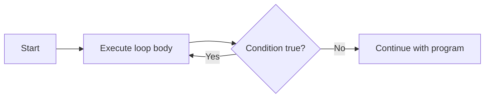

# C++ Do While Loops

## Introduction

In programming, we often need to execute a block of code repeatedly. C++ provides several loop structures to accomplish this, and the `do-while` loop is a special type that guarantees the loop body executes **at least once** before checking the condition.

Unlike a regular `while` loop which may never execute if the condition is initially false, a `do-while` loop always executes its body first and then evaluates the condition to determine if it should continue looping.

## Basic Syntax

Here's the basic syntax of a do-while loop:

```cpp
do {
    // Loop body
    // Code to be executed at least once
} while (condition);
```

Notice that:
- The loop body is enclosed in curly braces `{}`
- The condition is placed after the loop body
- The statement ends with a semicolon `;` after the condition

## How Do-While Loops Work

Let's visualize the flow of a do-while loop:



1. The loop body executes first
2. The condition is evaluated
3. If the condition is true, the loop body executes again
4. If the condition is false, the loop terminates and the program continues with the next statement

## Basic Example

Let's start with a simple example that prints numbers from 1 to 5:

```cpp
#include <iostream>
using namespace std;

int main() {
    int num = 1;
    
    do {
        cout << num << " ";
        num++;
    } while (num <= 5);
    
    return 0;
}
```

**Output:**
```
1 2 3 4 5
```

In this example:
1. We initialize `num` to 1
2. Inside the loop, we print the current value of `num` and increment it
3. After executing the loop body once, we check if `num` is less than or equal to 5
4. If true, we repeat the loop body; if false, we exit the loop

## When to Use Do-While Loops

Do-while loops are particularly useful when:

1. You need to execute code at least once before checking a condition
2. Processing user input where you want to prompt at least once
3. Implementing menus where you always want to display options first

## Do-While vs While Loops

The key difference between `do-while` and `while` loops is the timing of the condition check:

| Loop Type | Condition Check | Minimum Executions |
|-----------|-----------------|-------------------|
| while     | Before loop body| 0                 |
| do-while  | After loop body | 1                 |

Let's see the difference with an example where the condition is false from the start:

```cpp
#include <iostream>
using namespace std;

int main() {
    int x = 10;
    
    cout << "Using while loop:" << endl;
    while (x < 10) {
        cout << "This will not execute" << endl;
    }
    
    cout << "Using do-while loop:" << endl;
    do {
        cout << "This will execute once" << endl;
    } while (x < 10);
    
    return 0;
}
```

**Output:**
```
Using while loop:
Using do-while loop:
This will execute once
```

## Practical Examples

### Example 1: Input Validation

A common use case for do-while loops is input validation - making sure user input meets certain criteria:

```cpp
#include <iostream>
using namespace std;

int main() {
    int number;
    
    do {
        cout << "Enter a positive number: ";
        cin >> number;
        
        if (number <= 0) {
            cout << "That's not a positive number. Try again." << endl;
        }
    } while (number <= 0);
    
    cout << "You entered: " << number << endl;
    
    return 0;
}
```

**Sample Interaction:**
```
Enter a positive number: -5
That's not a positive number. Try again.
Enter a positive number: 0
That's not a positive number. Try again.
Enter a positive number: 10
You entered: 10
```

### Example 2: Menu-Based Program

Do-while loops are excellent for creating menu-driven programs:

```cpp
#include <iostream>
using namespace std;

int main() {
    int choice;
    
    do {
        // Display menu
        cout << "\n----- Calculator Menu -----" << endl;
        cout << "1. Add two numbers" << endl;
        cout << "2. Subtract two numbers" << endl;
        cout << "3. Multiply two numbers" << endl;
        cout << "4. Divide two numbers" << endl;
        cout << "5. Exit" << endl;
        cout << "Enter your choice (1-5): ";
        cin >> choice;
        
        // Process the choice
        switch (choice) {
            case 1: {
                int a, b;
                cout << "Enter two numbers: ";
                cin >> a >> b;
                cout << "Sum: " << a + b << endl;
                break;
            }
            case 2: {
                int a, b;
                cout << "Enter two numbers: ";
                cin >> a >> b;
                cout << "Difference: " << a - b << endl;
                break;
            }
            case 3: {
                int a, b;
                cout << "Enter two numbers: ";
                cin >> a >> b;
                cout << "Product: " << a * b << endl;
                break;
            }
            case 4: {
                int a, b;
                cout << "Enter two numbers: ";
                cin >> a >> b;
                if (b != 0)
                    cout << "Quotient: " << (float)a / b << endl;
                else
                    cout << "Error: Division by zero!" << endl;
                break;
            }
            case 5:
                cout << "Exiting program. Goodbye!" << endl;
                break;
            default:
                cout << "Invalid choice. Please try again." << endl;
        }
    } while (choice != 5);
    
    return 0;
}
```

### Example 3: Game Loop

Game development often uses do-while loops for the main game loop:

```cpp
#include <iostream>
#include <cstdlib>  // For rand() and srand()
#include <ctime>    // For time()
using namespace std;

int main() {
    // Seed the random number generator
    srand(time(0));
    
    // Game variables
    int secretNumber = rand() % 100 + 1;  // Random number between 1 and 100
    int guess;
    int attempts = 0;
    bool hasWon = false;
    
    cout << "Welcome to the Number Guessing Game!" << endl;
    cout << "I'm thinking of a number between 1 and 100." << endl;
    
    do {
        cout << "Enter your guess: ";
        cin >> guess;
        attempts++;
        
        if (guess < secretNumber) {
            cout << "Too low! Try again." << endl;
        } else if (guess > secretNumber) {
            cout << "Too high! Try again." << endl;
        } else {
            hasWon = true;
            cout << "Congratulations! You guessed the number in " << attempts << " attempts!" << endl;
        }
        
    } while (!hasWon);
    
    return 0;
}
```

## Common Pitfalls and Best Practices

### 1. Infinite Loops

Be careful not to create infinite loops by ensuring the condition can eventually become false:

```cpp
// Infinite loop - will run forever!
do {
    cout << "This will never end!" << endl;
} while (true);
```

To avoid infinite loops, make sure:
- The condition can eventually become false
- Variables in the condition are updated within the loop body
- You have a way to exit the loop (e.g., a break statement)

### 2. Forgetting the Semicolon

A common syntax error is forgetting the semicolon after the while condition:

```cpp
do {
    // Loop body
} while (condition)  // Missing semicolon will cause an error
```

### 3. Misplacing the Condition

Unlike other loops, the condition in a do-while loop goes after the loop body, not before:

```cpp
// INCORRECT
do (x < 10) {  // This is wrong!
    // Loop body
} while;

// CORRECT
do {
    // Loop body
} while (x < 10);
```

## Summary

The do-while loop is a powerful control flow structure in C++ that guarantees a block of code executes at least once before checking a condition. This makes it ideal for:

- Input validation
- Menu-driven programs
- Game loops
- Situations where code needs to execute at least once

Key points to remember:
- The loop body always executes at least once
- The condition is checked after the loop body executes
- The syntax requires a semicolon after the condition
- Be careful to avoid infinite loops

## Practice Exercises

1. **Temperature Converter**: Write a program that converts temperatures between Fahrenheit and Celsius. Use a do-while loop to keep asking the user if they want to perform another conversion.

2. **Password Validator**: Create a program that asks the user to enter a password. Use a do-while loop to keep asking until the password meets certain criteria (e.g., at least 8 characters, contains both letters and numbers).

3. **Dice Rolling Game**: Implement a simple dice game where the user rolls a die repeatedly until they roll a six. Count how many rolls it takes.

4. **Calculator with History**: Enhance the calculator example to keep a history of calculations. After each operation, ask if the user wants to see the history of calculations.

5. **Fibonacci Sequence**: Write a program that generates the Fibonacci sequence up to a user-specified number using a do-while loop.

## Additional Resources

- [CPlusPlus.com - Do-While Statement](http://www.cplusplus.com/doc/tutorial/control/)
- [GeeksforGeeks - C++ Do-While Loop](https://www.geeksforgeeks.org/cpp-do-while-loop/)
- [Programiz - C++ Do-While Loop](https://www.programiz.com/cpp-programming/do-while-loop)

Happy coding!