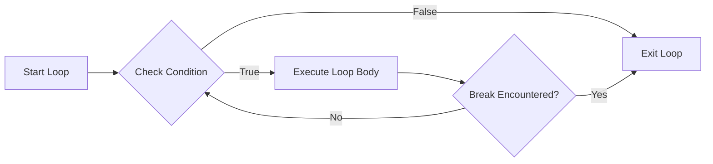
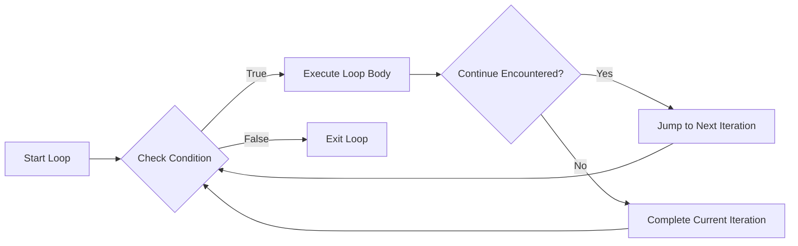

# C++ Break and Continue Statements

In programming, we often need to control the flow of our loops more precisely than just letting them run until a condition becomes false. C++ provides two special statements that give you more control over loop execution: `break` and `continue`. These statements allow you to exit a loop early or skip iterations, giving you finer control over your program's execution.

## Introduction to Break and Continue

Both `break` and `continue` statements are used inside loops, but they serve different purposes:

- **break**: Immediately terminates the loop and moves execution to the statement following the loop.
- **continue**: Skips the current iteration and jumps to the next iteration of the loop.

Let's explore each of these statements in detail.

## The Break Statement

The `break` statement causes immediate exit from a loop. When a `break` statement executes, the program continues with the statement following the loop.

### Basic Syntax

```cpp
break;
```

### How Break Works in Different Loops

The following diagram illustrates how the `break` statement affects loop execution:



### Example 1: Breaking out of a For Loop

```cpp
#include <iostream>
using namespace std;

int main() {
    cout << "Counting from 1 to 10, but stop at 5:" << endl;
    
    for (int i = 1; i <= 10; i++) {
        if (i > 5) {
            break; // Exit the loop when i becomes greater than 5
        }
        cout << i << " ";
    }
    
    cout << "\nLoop ended!" << endl;
    
    return 0;
}
```

**Output:**
```
Counting from 1 to 10, but stop at 5:
1 2 3 4 5 
Loop ended!
```

In this example, the `break` statement causes the loop to terminate when `i` becomes greater than 5, so only numbers from 1 to 5 are printed.

### Example 2: Breaking out of a While Loop

```cpp
#include <iostream>
using namespace std;

int main() {
    int sum = 0;
    int number;
    
    cout << "Enter positive numbers to add (enter a negative number to stop):" << endl;
    
    while (true) { // Infinite loop
        cout << "Enter a number: ";
        cin >> number;
        
        if (number < 0) {
            break; // Exit the loop when a negative number is entered
        }
        
        sum += number;
    }
    
    cout << "The sum of all numbers you entered is: " << sum << endl;
    
    return 0;
}
```

**Sample Input and Output:**
```
Enter positive numbers to add (enter a negative number to stop):
Enter a number: 5
Enter a number: 10
Enter a number: 15
Enter a number: -1
The sum of all numbers you entered is: 30
```

In this example, we use the `break` statement to exit an infinite loop when the user enters a negative number.

## The Continue Statement

The `continue` statement skips the rest of the current iteration and jumps to the next iteration of the loop.

### Basic Syntax

```cpp
continue;
```

### How Continue Works in Loops



### Example 1: Skipping Odd Numbers in a For Loop

```cpp
#include <iostream>
using namespace std;

int main() {
    cout << "Printing only even numbers from 1 to 10:" << endl;
    
    for (int i = 1; i <= 10; i++) {
        if (i % 2 != 0) {
            continue; // Skip the rest of the loop body for odd numbers
        }
        cout << i << " ";
    }
    
    cout << "\nLoop completed!" << endl;
    
    return 0;
}
```

**Output:**
```
Printing only even numbers from 1 to 10:
2 4 6 8 10 
Loop completed!
```

In this example, the `continue` statement skips the `cout` statement when `i` is odd, resulting in only even numbers being printed.

### Example 2: Using Continue in a While Loop

```cpp
#include <iostream>
using namespace std;

int main() {
    int i = 0;
    int sum = 0;
    
    cout << "Sum of numbers from 1 to 10, excluding multiples of 3:" << endl;
    
    while (i < 10) {
        i++;
        
        if (i % 3 == 0) {
            continue; // Skip multiples of 3
        }
        
        sum += i;
        cout << "Added " << i << ", sum is now " << sum << endl;
    }
    
    cout << "Final sum: " << sum << endl;
    
    return 0;
}
```

**Output:**
```
Sum of numbers from 1 to 10, excluding multiples of 3:
Added 1, sum is now 1
Added 2, sum is now 3
Added 4, sum is now 7
Added 5, sum is now 12
Added 7, sum is now 19
Added 8, sum is now 27
Added 10, sum is now 37
Final sum: 37
```

In this example, the `continue` statement causes the loop to skip adding multiples of 3 to the sum.

## Break vs. Continue: Key Differences

Let's summarize the key differences between `break` and `continue`:

| Statement | Effect on Loop | When to Use |
|-----------|----------------|-------------|
| `break`   | Terminates the loop completely | When you want to exit a loop early once a certain condition is met |
| `continue` | Skips the rest of the current iteration and moves to the next one | When you want to skip certain iterations but continue the loop |

## Real-World Applications

### Example 1: Menu-Based Program

```cpp
#include <iostream>
using namespace std;

int main() {
    int choice;
    bool running = true;
    
    while (running) {
        cout << "\n--- Menu ---" << endl;
        cout << "1. Say hello" << endl;
        cout << "2. Print current time" << endl;
        cout << "3. Tell a joke" << endl;
        cout << "4. Exit program" << endl;
        cout << "Enter your choice: ";
        cin >> choice;
        
        switch (choice) {
            case 1:
                cout << "Hello, user!" << endl;
                break;
            case 2:
                cout << "Sorry, I don't have access to the current time." << endl;
                break;
            case 3:
                cout << "Why do programmers prefer dark mode? Because light attracts bugs!" << endl;
                break;
            case 4:
                cout << "Exiting program. Goodbye!" << endl;
                running = false;
                break;
            default:
                cout << "Invalid choice. Please try again." << endl;
                continue; // Skip the rest of the loop and ask for input again
        }
        
        // This would be skipped for invalid choices due to the continue statement
        cout << "Operation completed successfully." << endl;
    }
    
    return 0;
}
```

### Example 2: Processing Data with Error Handling

```cpp
#include <iostream>
#include <vector>
using namespace std;

int main() {
    vector<int> numbers = {10, -5, 15, 0, 30, -8, 20};
    int positiveSum = 0;
    
    cout << "Processing data and calculating sum of positive numbers:" << endl;
    
    for (int i = 0; i < numbers.size(); i++) {
        cout << "Processing element at index " << i << " (value: " << numbers[i] << ")..." << endl;
        
        // Skip negative numbers
        if (numbers[i] < 0) {
            cout << "  Negative number detected, skipping..." << endl;
            continue;
        }
        
        // Break if we encounter zero
        if (numbers[i] == 0) {
            cout << "  Zero detected, stopping calculation..." << endl;
            break;
        }
        
        positiveSum += numbers[i];
        cout << "  Added to sum. Current sum: " << positiveSum << endl;
    }
    
    cout << "\nFinal sum of positive numbers (until zero or end): " << positiveSum << endl;
    
    return 0;
}
```

**Output:**
```
Processing data and calculating sum of positive numbers:
Processing element at index 0 (value: 10)...
  Added to sum. Current sum: 10
Processing element at index 1 (value: -5)...
  Negative number detected, skipping...
Processing element at index 2 (value: 15)...
  Added to sum. Current sum: 25
Processing element at index 3 (value: 0)...
  Zero detected, stopping calculation...

Final sum of positive numbers (until zero or end): 25
```

This example demonstrates both `break` and `continue` in a data processing scenario.

## Nested Loops and Break/Continue

When using `break` or `continue` in nested loops, they only affect the innermost loop where they appear. Let's see an example:

```cpp
#include <iostream>
using namespace std;

int main() {
    cout << "Multiplication table with breaks and continues:" << endl;
    
    for (int i = 1; i <= 5; i++) {
        cout << "Table for " << i << ":" << endl;
        
        for (int j = 1; j <= 10; j++) {
            // Skip multiples of 3
            if (j % 3 == 0) {
                continue;
            }
            
            // Stop at 7
            if (j > 7) {
                cout << "  Breaking inner loop at j = " << j << endl;
                break;
            }
            
            cout << "  " << i << " × " << j << " = " << (i * j) << endl;
        }
        
        cout << endl;
    }
    
    return 0;
}
```

**Output:**
```
Multiplication table with breaks and continues:
Table for 1:
  1 × 1 = 1
  1 × 2 = 2
  1 × 4 = 4
  1 × 5 = 5
  1 × 7 = 7
  Breaking inner loop at j = 8

Table for 2:
  2 × 1 = 2
  2 × 2 = 4
  2 × 4 = 8
  2 × 5 = 10
  2 × 7 = 14
  Breaking inner loop at j = 8

... (and so on for the rest of the tables)
```

## Summary

In this tutorial, we've explored the `break` and `continue` statements in C++:

- **break** terminates a loop completely and continues execution after the loop
- **continue** skips the current iteration and jumps to the next iteration
- These statements give you finer control over loop execution
- Use `break` when you want to exit a loop early based on a condition
- Use `continue` when you want to skip certain iterations but continue the loop
- In nested loops, these statements only affect the innermost loop where they appear

By mastering these flow control statements, you can write more efficient and cleaner code for scenarios where standard loop conditions aren't enough.

## Additional Resources

- [C++ Reference: break statement](https://en.cppreference.com/w/cpp/language/break)
- [C++ Reference: continue statement](https://en.cppreference.com/w/cpp/language/continue)

## Practice Exercises

1. Write a program that finds the first prime number greater than 100.
2. Create a program that sums all even numbers from 1 to 100 using a loop with a continue statement.
3. Write a program that asks users for numbers until they enter 0, but skip any negative numbers and only add positive ones to a running sum.
4. Create a nested loop to print a pattern, using break and continue to control the pattern.
5. Write a program that simulates a simple ATM, using a menu system with options for checking balance, depositing, withdrawing, and exiting. Use break and continue statements to control the program flow.