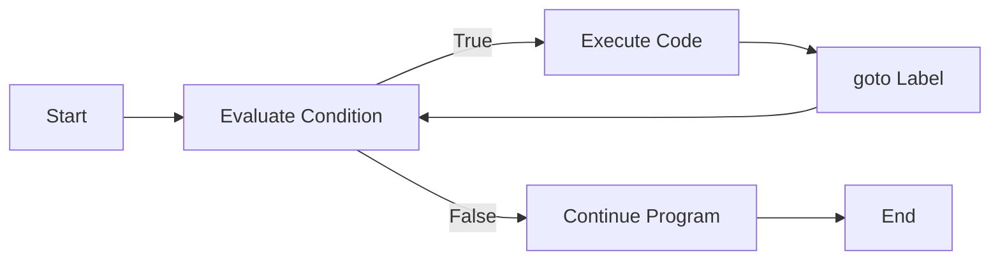

# C++ Goto Statement

## Introduction

The `goto` statement is one of the most controversial features in C++. It allows for an unconditional jump from one part of a program to another, effectively transferring control to a labeled statement within the same function. While it's often discouraged in modern programming practices for making code harder to read and maintain, understanding `goto` is still important for legacy code comprehension and for the rare cases where it might be appropriate.

In this guide, we'll explore:
- The syntax and basic usage of `goto`
- When (and when not) to use `goto`
- Practical examples and alternatives
- Best practices for control flow in C++

## Syntax and Basic Usage

The `goto` statement has two components:
1. A `goto` statement followed by a label name
2. A labeled statement (the target of the jump)

```cpp
#include <iostream>

int main() {
    int i = 1;
    
start:  // This is a label
    std::cout << "i = " << i << std::endl;
    i++;
    
    if (i <= 5)
        goto start;  // Jump back to the 'start' label
    
    std::cout << "Loop finished" << std::endl;
    return 0;
}
```

**Output:**
```
i = 1
i = 2
i = 3
i = 4
i = 5
Loop finished
```

In this example, the `goto` statement creates a loop-like behavior by jumping back to the `start` label until the condition `i <= 5` is no longer true.

## Scope and Limitations

It's important to understand the limitations of `goto`:

1. **Same Function Only**: A `goto` can only jump to a label within the same function.
2. **Cannot Skip Variable Initializations**: You cannot jump over variable initializations if they would be bypassed.
3. **Scope Constraints**: You cannot jump into the scope of a variable, but you can jump out of a scope.

```cpp
#include <iostream>

int main() {
    goto label1; // Error: Skips initialization of x
    
    int x = 10;
    
label1:
    std::cout << "Value of x: " << x << std::endl; // This would cause undefined behavior
    
    {
        int y = 20;
    label2:
        std::cout << "Inside block" << std::endl;
    }
    
    goto label2; // Error: Cannot jump into the scope of y
    
    return 0;
}
```

This code would not compile due to the described limitations.

## Common Use Cases

Despite its controversial nature, there are a few scenarios where `goto` might be justified:

### 1. Error Handling and Cleanup

One legitimate use of `goto` is for error handling in C-style code, especially when multiple resources need to be released:

```cpp
#include <iostream>
#include <cstdlib>

int main() {
    // Resource allocations
    int* array1 = new int[100];
    int* array2 = nullptr;
    FILE* file = nullptr;
    
    // Potential error points
    if (!array1) {
        std::cerr << "Failed to allocate array1" << std::endl;
        goto cleanup;
    }
    
    array2 = new int[200];
    if (!array2) {
        std::cerr << "Failed to allocate array2" << std::endl;
        goto cleanup;
    }
    
    file = fopen("data.txt", "r");
    if (!file) {
        std::cerr << "Failed to open file" << std::endl;
        goto cleanup;
    }
    
    // Normal processing would happen here
    std::cout << "All resources allocated successfully" << std::endl;
    
cleanup:
    // Cleanup code
    if (file) fclose(file);
    delete[] array2;
    delete[] array1;
    
    return 0;
}
```

### 2. Breaking Out of Nested Loops

`goto` can be used to break out of deeply nested loops, though in C++ there are often better alternatives:

```cpp
#include <iostream>

int main() {
    int matrix[3][3] = {
        {1, 2, 3},
        {4, 5, 6},
        {7, 8, 9}
    };
    
    // Search for the value 5
    for (int i = 0; i < 3; i++) {
        for (int j = 0; j < 3; j++) {
            if (matrix[i][j] == 5) {
                std::cout << "Found 5 at position [" << i << "][" << j << "]" << std::endl;
                goto found;
            }
        }
    }
    
    std::cout << "Value not found" << std::endl;
    goto end;
    
found:
    std::cout << "Search completed successfully" << std::endl;
    
end:
    return 0;
}
```

**Output:**
```
Found 5 at position [1][1]
Search completed successfully
```

## Better Alternatives to `goto`

In modern C++, there are usually better alternatives to `goto`:

### 1. For Error Handling: RAII (Resource Acquisition Is Initialization)

```cpp
#include <iostream>
#include <fstream>
#include <memory>

int main() {
    try {
        // Resources are automatically managed
        std::unique_ptr<int[]> array1 = std::make_unique<int[]>(100);
        std::unique_ptr<int[]> array2 = std::make_unique<int[]>(200);
        std::ifstream file("data.txt");
        
        if (!file.is_open()) {
            throw std::runtime_error("Failed to open file");
        }
        
        // Normal processing
        std::cout << "All resources allocated successfully" << std::endl;
        
        // Cleanup happens automatically when objects go out of scope
    }
    catch (const std::exception& e) {
        std::cerr << "Error: " << e.what() << std::endl;
        return 1;
    }
    
    return 0;
}
```

### 2. For Breaking Nested Loops: Extract to Function or Use Flag

```cpp
#include <iostream>

bool findValue(int matrix[3][3], int value, int& row, int& col) {
    for (int i = 0; i < 3; i++) {
        for (int j = 0; j < 3; j++) {
            if (matrix[i][j] == value) {
                row = i;
                col = j;
                return true;
            }
        }
    }
    return false;
}

int main() {
    int matrix[3][3] = {
        {1, 2, 3},
        {4, 5, 6},
        {7, 8, 9}
    };
    
    int row = -1, col = -1;
    if (findValue(matrix, 5, row, col)) {
        std::cout << "Found 5 at position [" << row << "][" << col << "]" << std::endl;
        std::cout << "Search completed successfully" << std::endl;
    } else {
        std::cout << "Value not found" << std::endl;
    }
    
    return 0;
}
```

## Control Flow Visualization

<div className="text-center">

</div>

## Best Practices

1. **Avoid `goto` When Possible**: Modern C++ offers better control structures like loops, functions, and exceptions.

2. **Limit Usage to Specific Cases**: Only use `goto` for:
   - Breaking out of deeply nested loops when no alternatives work
   - Error handling in C-style code with multiple cleanup points

3. **Clear Labels**: If you must use `goto`, use clear, descriptive label names.

4. **Forward Direction**: Prefer forward jumps over backward jumps to maintain readability.

5. **Local Scope**: Keep the jump distance short and within a local scope.

## Summary

The `goto` statement in C++ allows for unconditional jumps within a function, but it comes with significant limitations and can lead to confusing "spaghetti code" if misused. While there are a few legitimate use cases for `goto`, modern C++ programming generally favors other control structures and patterns like RAII, exceptions, and well-structured functions.

Understanding `goto` is valuable for maintaining legacy code and for those rare situations where other approaches may be more complex. However, as a beginner, it's important to first master the standard control structures and only resort to `goto` when absolutely necessary.

## Exercises

1. Rewrite the nested loop example using a boolean flag instead of `goto`.
2. Create a simple state machine using `goto` and then refactor it to use a more modern approach.
3. Find a C++ code example that uses `goto` for error handling and refactor it to use RAII principles.
4. Discuss the pros and cons of using `goto` in a team setting where multiple developers maintain the same codebase.

## Additional Resources

- [C++ Core Guidelines: ES.76: Avoid goto](https://isocpp.github.io/CppCoreGuidelines/CppCoreGuidelines#es76-avoid-goto)
- [C++ Reference: goto statement](https://en.cppreference.com/w/cpp/language/goto)
- "Clean Code" by Robert C. Martin (discusses control flow best practices)
- "Effective Modern C++" by Scott Meyers (covers better alternatives to goto)