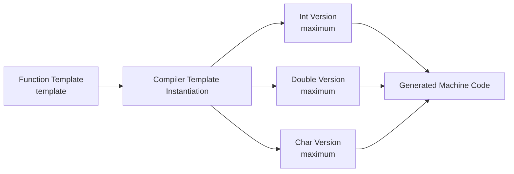

# C++ Function Templates

## Introduction

Function templates are one of the most powerful features in C++ that enable generic programming. They allow you to write a function once that can operate on different data types without having to rewrite the same logic for each type. This not only reduces code duplication but also makes your code more maintainable and flexible.

In this tutorial, we'll explore C++ function templates from the ground up, starting with basic concepts and gradually moving to more advanced use cases.

## What are Function Templates?

A function template is a blueprint for creating functions. Unlike regular functions that work with specific data types, templates allow the compiler to generate type-specific versions of your function based on the types you use when calling it.

Think of function templates as a recipe that can be adapted to work with different ingredients, where the ingredients are the data types.

## Basic Syntax

Here's the basic syntax for declaring a function template:

```cpp
template <typename T>
return_type function_name(parameters) {
    // function body
}
```

Let's break this down:
- The `template` keyword indicates that we're creating a template
- `<typename T>` declares a type parameter named `T` (you could use any valid identifier)
- `return_type` and `parameters` can use the type parameter `T`

## Your First Function Template

Let's create a simple function template that finds the maximum of two values:

```cpp
#include <iostream>

template <typename T>
T maximum(T a, T b) {
    return (a > b) ? a : b;
}

int main() {
    // Using with integers
    int i1 = 10, i2 = 20;
    std::cout << "Max of " << i1 << " and " << i2 << " is: " 
              << maximum(i1, i2) << std::endl;
    
    // Using with doubles
    double d1 = 10.5, d2 = 20.7;
    std::cout << "Max of " << d1 << " and " << d2 << " is: " 
              << maximum(d1, d2) << std::endl;
    
    // Using with characters
    char c1 = 'a', c2 = 'z';
    std::cout << "Max of " << c1 << " and " << c2 << " is: " 
              << maximum(c1, c2) << std::endl;
    
    return 0;
}
```

**Output:**
```
Max of 10 and 20 is: 20
Max of 10.5 and 20.7 is: 20.7
Max of a and z is: z
```

In this example, we defined the `maximum` function template once, but used it with three different data types: `int`, `double`, and `char`. The compiler automatically generates appropriate versions of the function for each type.

## How Function Templates Work

When you call a function template with specific types, the compiler performs a process called **template instantiation**. Let's visualize what happens:



When the compiler sees calls to `maximum(i1, i2)`, `maximum(d1, d2)`, and `maximum(c1, c2)`, it creates three separate functions, replacing `T` with the appropriate type in each case.

## Template Type Deduction

In the previous example, we didn't explicitly specify the type when calling the function. The compiler automatically deduced the type from the arguments provided. This is called **template type deduction**.

```cpp
maximum(10, 20);      // T is deduced as int
maximum(10.5, 20.7);  // T is deduced as double
maximum('a', 'z');    // T is deduced as char
```

## Explicit Template Argument Specification

Sometimes you might want to explicitly specify the template parameter type. You can do this using angle brackets:

```cpp
#include <iostream>

template <typename T>
T maximum(T a, T b) {
    return (a > b) ? a : b;
}

int main() {
    // Explicitly specifying the template argument type
    std::cout << maximum<int>(10, 20) << std::endl;
    std::cout << maximum<double>(10.5, 20.7) << std::endl;
    
    // This allows for type conversion
    std::cout << maximum<double>(10, 20.7) << std::endl;  // Converts 10 to 10.0
    
    return 0;
}
```

**Output:**
```
20
20.7
20.7
```

In the last example, by explicitly specifying `double` as the template type, the integer `10` is converted to a `double` before the function is executed.

## Multiple Template Parameters

Function templates can have multiple type parameters:

```cpp
#include <iostream>

template <typename T1, typename T2>
void printPair(T1 a, T2 b) {
    std::cout << "(" << a << ", " << b << ")" << std::endl;
}

int main() {
    printPair(10, "Hello");          // T1 is int, T2 is const char*
    printPair(3.14, 42);             // T1 is double, T2 is int
    printPair(true, 'X');            // T1 is bool, T2 is char
    
    return 0;
}
```

**Output:**
```
(10, Hello)
(3.14, 42)
(1, X)
```

## Template Parameters with Default Types

Similar to function default parameters, you can provide default types for template parameters:

```cpp
#include <iostream>

template <typename T = int>
void displayType(T value) {
    std::cout << "Type: ";
    if (std::is_same<T, int>::value) std::cout << "int";
    else if (std::is_same<T, double>::value) std::cout << "double";
    else if (std::is_same<T, char>::value) std::cout << "char";
    else std::cout << "other";
    
    std::cout << ", Value: " << value << std::endl;
}

int main() {
    displayType(10);        // Uses default type (int)
    displayType<double>(20.5);  // Explicitly specifies double
    displayType<char>('A');     // Explicitly specifies char
    
    return 0;
}
```

**Output:**
```
Type: int, Value: 10
Type: double, Value: 20.5
Type: char, Value: A
```

## Non-Type Template Parameters

Templates can also have non-type parameters, which are compile-time constants:

```cpp
#include <iostream>
#include <array>

template <typename T, size_t Size>
void printArray(const std::array<T, Size>& arr) {
    std::cout << "Array of size " << Size << ": ";
    for (const auto& element : arr) {
        std::cout << element << " ";
    }
    std::cout << std::endl;
}

int main() {
    std::array<int, 5> intArray = {1, 2, 3, 4, 5};
    std::array<double, 3> doubleArray = {1.1, 2.2, 3.3};
    
    printArray(intArray);       // T=int, Size=5
    printArray(doubleArray);    // T=double, Size=3
    
    return 0;
}
```

**Output:**
```
Array of size 5: 1 2 3 4 5 
Array of size 3: 1.1 2.2 3.3 
```

## Function Template Specialization

Sometimes you might want to provide a specialized implementation for a specific type. This is done using template specialization:

```cpp
#include <iostream>
#include <string>

// Primary template
template <typename T>
T maximum(T a, T b) {
    std::cout << "Generic template" << std::endl;
    return (a > b) ? a : b;
}

// Specialization for C-style strings
template <>
const char* maximum<const char*>(const char* a, const char* b) {
    std::cout << "Specialized template for C-strings" << std::endl;
    return (std::strcmp(a, b) > 0) ? a : b;
}

int main() {
    int i1 = 10, i2 = 20;
    std::cout << "Max: " << maximum(i1, i2) << std::endl;
    
    const char* s1 = "apple";
    const char* s2 = "banana";
    std::cout << "Max: " << maximum(s1, s2) << std::endl;
    
    return 0;
}
```

**Output:**
```
Generic template
Max: 20
Specialized template for C-strings
Max: banana
```

In this example, we specialize the `maximum` function for `const char*` to compare strings using `strcmp` instead of the `>` operator.

## Real-World Application: Generic Data Container

Let's create a more practical example: a simple generic data container class that uses function templates for operations:

```cpp
#include <iostream>
#include <vector>

template <typename T>
class DataContainer {
private:
    std::vector<T> data;

public:
    // Add element to container
    void add(const T& element) {
        data.push_back(element);
    }
    
    // Find sum of all elements
    template <typename U = T>
    U sum() {
        U result = U();
        for (const auto& element : data) {
            result += element;
        }
        return result;
    }
    
    // Find average of elements
    template <typename U = T>
    double average() {
        if (data.empty()) return 0;
        return static_cast<double>(sum<U>()) / data.size();
    }
    
    // Print all elements
    void print() const {
        std::cout << "[ ";
        for (const auto& element : data) {
            std::cout << element << " ";
        }
        std::cout << "]" << std::endl;
    }
};

int main() {
    // Container for integers
    DataContainer<int> intContainer;
    intContainer.add(10);
    intContainer.add(20);
    intContainer.add(30);
    
    std::cout << "Int Container: ";
    intContainer.print();
    std::cout << "Sum: " << intContainer.sum() << std::endl;
    std::cout << "Average: " << intContainer.average() << std::endl;
    
    // Container for doubles
    DataContainer<double> doubleContainer;
    doubleContainer.add(1.5);
    doubleContainer.add(2.5);
    doubleContainer.add(3.5);
    
    std::cout << "\nDouble Container: ";
    doubleContainer.print();
    std::cout << "Sum: " << doubleContainer.sum() << std::endl;
    std::cout << "Average: " << doubleContainer.average() << std::endl;
    
    return 0;
}
```

**Output:**
```
Int Container: [ 10 20 30 ]
Sum: 60
Average: 20

Double Container: [ 1.5 2.5 3.5 ]
Sum: 7.5
Average: 2.5
```

In this example, we've created a generic `DataContainer` class that can work with different data types. It uses function templates for operations like `sum()` and `average()`.

## Common Errors and Debugging Tips

When working with function templates, you might encounter some common issues:

### 1. Compiler Errors with Templates

Template errors can be cryptic. When you get an error message, focus on:
- The function template that's causing the issue
- The specific type the compiler is trying to instantiate
- Whether the type supports the operations you're using in the template

### 2. Type Constraints

Not all operations work with all types. For example, the `>` operator might not be defined for custom types. Always ensure the types you use with your template support the required operations.

### 3. Debugging Templates

Add print statements showing the types being used:

```cpp
template <typename T>
T maximum(T a, T b) {
    std::cout << "Calling maximum with type: " 
              << typeid(T).name() << std::endl;
    return (a > b) ? a : b;
}
```

## Best Practices

1. **Keep templates simple**: Complex templates can be hard to debug and understand.
2. **Document constraints**: Clearly document what operations the template expects from its types.
3. **Use type traits**: Utilize the `<type_traits>` library to check or enforce constraints.
4. **Consider concepts** (C++20): Use concepts to explicitly state requirements for template parameters.
5. **Avoid excessive specialization**: Too many specializations can make code hard to maintain.

## Summary

Function templates are a powerful C++ feature that allows you to write generic, reusable code. Key points to remember:

- Templates allow functions to work with multiple data types
- The compiler generates type-specific versions of your template functions
- Type deduction automatically determines the template parameter types
- You can explicitly specify template types when needed
- Templates can have multiple type parameters and non-type parameters
- Specialization allows custom implementations for specific types

By mastering function templates, you'll be able to write more flexible, maintainable code with less duplication.

## Exercises

1. Write a function template `swap` that exchanges the values of two variables of any type.
2. Create a function template `findMin` that finds the minimum value in an array of any type.
3. Implement a template function `reverse` that reverses the elements in an array.
4. Write a generic `printPairs` function that takes two arrays of potentially different types and prints all combinations.
5. Create a function template `countIf` that counts elements in an array that satisfy a given condition.

## Additional Resources

- [C++ Templates - The Complete Guide](https://www.amazon.com/C-Templates-Complete-Guide-2nd/dp/0321714121)
- [cppreference - Function Templates](https://en.cppreference.com/w/cpp/language/function_template)
- [C++ Core Guidelines on Templates](https://isocpp.github.io/CppCoreGuidelines/CppCoreGuidelines#t-templates-and-generic-programming)
- [Template Metaprogramming with C++](https://www.cppstories.com/2016/02/notes-on-c-sfinae/)

Happy coding with C++ function templates!