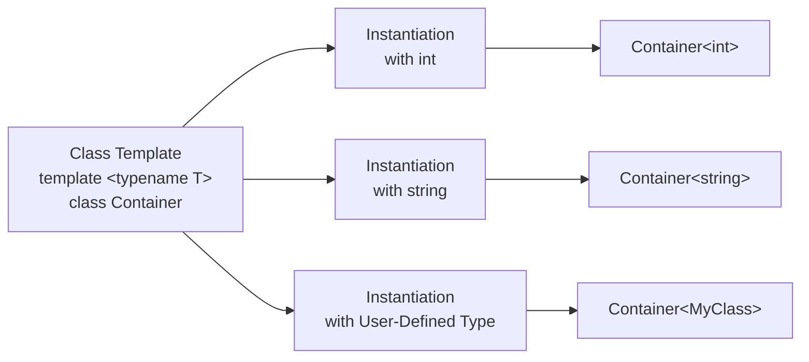

# C++ Class Templates

## Introduction

Class templates are one of the most powerful features in C++, allowing you to create generic classes that can work with any data type. Just as function templates let you write a single function that can operate on different types, class templates let you define a blueprint for a class that can be instantiated with various data types.

In this tutorial, you'll learn how to create and use class templates in C++, understand their syntax, explore real-world applications, and discover best practices for writing effective template classes.

## What Are Class Templates?

A class template is a generic class definition that serves as a pattern for creating specific class types. Instead of writing separate classes for handling different data types (like `IntArray`, `FloatArray`, `StringArray`), you can write a single template class (like `Array<T>`) that works with any type.

The primary advantages of class templates are:

- **Code reusability**: Write once, use with multiple types
- **Type safety**: Maintain strong typing while being generic
- **Flexibility**: Create specialized behavior based on the template parameters

## Basic Syntax of Class Templates

Here's the basic syntax for defining a class template:

```cpp
template <typename T>
class ClassName {
    // Class members using type T
public:
    // Methods that can use type T
};
```

Let's create a simple example of a class template for a generic storage container:

```cpp
#include <iostream>

template <typename T>
class Box {
private:
    T content;

public:
    Box(T value) : content(value) {}
    
    T getContent() {
        return content;
    }
    
    void setContent(T value) {
        content = value;
    }
    
    void printInfo() {
        std::cout << "Box contains: " << content << std::endl;
    }
};

int main() {
    // Create Box objects with different types
    Box<int> intBox(123);
    Box<std::string> stringBox("Hello World");
    Box<double> doubleBox(3.14159);
    
    // Use the Box objects
    intBox.printInfo();         // Output: Box contains: 123
    stringBox.printInfo();      // Output: Box contains: Hello World
    doubleBox.printInfo();      // Output: Box contains: 3.14159
    
    // Change the content
    intBox.setContent(456);
    intBox.printInfo();         // Output: Box contains: 456
    
    // Get the content
    std::string message = stringBox.getContent();
    std::cout << "Retrieved: " << message << std::endl;  // Output: Retrieved: Hello World
    
    return 0;
}
```

In this example, `Box` is a class template that can store any type of value. We've created three instances of `Box`: one for integers, one for strings, and one for doubles.

## Template Class Instantiation

When you use a class template, the compiler creates a specific class based on the template and the provided type arguments. This process is called *template instantiation*.

For example, when you write:

```cpp
Box<int> intBox(123);
```

The compiler generates a version of the `Box` class specifically for `int` type, replacing every occurrence of `T` with `int`.

## Multiple Template Parameters

Class templates can have multiple template parameters:

```cpp
#include <iostream>

template <typename T, typename U>
class Pair {
private:
    T first;
    U second;

public:
    Pair(T firstValue, U secondValue) : first(firstValue), second(secondValue) {}
    
    T getFirst() const { return first; }
    U getSecond() const { return second; }
    
    void setFirst(T value) { first = value; }
    void setSecond(U value) { second = value; }
    
    void printPair() const {
        std::cout << "(" << first << ", " << second << ")" << std::endl;
    }
};

int main() {
    Pair<int, std::string> student(101, "John Doe");
    student.printPair();  // Output: (101, John Doe)
    
    Pair<double, double> point(2.5, 3.7);
    point.printPair();    // Output: (2.5, 3.7)
    
    Pair<std::string, bool> status("Connection", true);
    status.printPair();   // Output: (Connection, 1)
    
    return 0;
}
```

## Non-Type Template Parameters

Besides types, class templates can also have non-type parameters such as integers, pointers, or references:

```cpp
#include <iostream>
#include <array>

template <typename T, size_t SIZE>
class StaticArray {
private:
    std::array<T, SIZE> data;

public:
    T& operator[](size_t index) {
        return data[index];
    }
    
    const T& operator[](size_t index) const {
        return data[index];
    }
    
    size_t size() const {
        return SIZE;
    }
    
    void fill(const T& value) {
        data.fill(value);
    }
};

int main() {
    StaticArray<int, 5> numbers;
    
    // Fill the array
    for (size_t i = 0; i < numbers.size(); ++i) {
        numbers[i] = i * 10;
    }
    
    // Print the array
    for (size_t i = 0; i < numbers.size(); ++i) {
        std::cout << numbers[i] << " ";
    }
    std::cout << std::endl;  // Output: 0 10 20 30 40
    
    // Create an array of different size and type
    StaticArray<char, 3> letters;
    letters[0] = 'A';
    letters[1] = 'B';
    letters[2] = 'C';
    
    for (size_t i = 0; i < letters.size(); ++i) {
        std::cout << letters[i] << " ";
    }
    std::cout << std::endl;  // Output: A B C
    
    return 0;
}
```

In this example, `SIZE` is a non-type template parameter that specifies the size of the array at compile time.

## Template Specialization

Sometimes you might want a template to behave differently for specific types. This is where template specialization comes in:

```cpp
#include <iostream>
#include <string>

// Primary template
template <typename T>
class TypeInfo {
public:
    static void print() {
        std::cout << "This is a generic type" << std::endl;
    }
};

// Specialization for int
template <>
class TypeInfo<int> {
public:
    static void print() {
        std::cout << "This is an integer type" << std::endl;
    }
};

// Specialization for std::string
template <>
class TypeInfo<std::string> {
public:
    static void print() {
        std::cout << "This is a string type" << std::endl;
    }
};

int main() {
    TypeInfo<double>::print();     // Output: This is a generic type
    TypeInfo<int>::print();        // Output: This is an integer type
    TypeInfo<std::string>::print(); // Output: This is a string type
    
    return 0;
}
```

The primary template provides the general implementation, while specialized templates override this behavior for specific types.

## Nested Templates

You can nest template classes within other template classes:

```cpp
#include <iostream>
#include <vector>

template <typename T>
class DataCollection {
public:
    // Nested template class
    template <typename U>
    class Iterator {
    private:
        U* ptr;
    public:
        Iterator(U* p) : ptr(p) {}
        
        U& operator*() {
            return *ptr;
        }
        
        Iterator& operator++() {
            ptr++;
            return *this;
        }
        
        bool operator!=(const Iterator& other) const {
            return ptr != other.ptr;
        }
    };
    
    std::vector<T> data;
    
    void add(const T& item) {
        data.push_back(item);
    }
    
    Iterator<T> begin() {
        return Iterator<T>(&data[0]);
    }
    
    Iterator<T> end() {
        return Iterator<T>(&data[0] + data.size());
    }
};

int main() {
    DataCollection<int> numbers;
    numbers.add(10);
    numbers.add(20);
    numbers.add(30);
    
    for (auto num : numbers) {
        std::cout << num << " ";
    }
    std::cout << std::endl;  // Output: 10 20 30
    
    return 0;
}
```

## Default Template Parameters

Like function parameters, template parameters can have default values:

```cpp
#include <iostream>

template <typename T = int, size_t SIZE = 10>
class DefaultArray {
private:
    T data[SIZE];
    
public:
    DefaultArray() {
        for (size_t i = 0; i < SIZE; ++i) {
            data[i] = T();
        }
    }
    
    void set(size_t index, T value) {
        if (index < SIZE) {
            data[index] = value;
        }
    }
    
    T get(size_t index) const {
        if (index < SIZE) {
            return data[index];
        }
        return T();
    }
    
    size_t size() const {
        return SIZE;
    }
};

int main() {
    // Using default template parameters
    DefaultArray<> array1;  // T is int, SIZE is 10
    array1.set(0, 100);
    array1.set(1, 200);
    
    std::cout << "array1[0] = " << array1.get(0) << std::endl;  // Output: array1[0] = 100
    std::cout << "array1 size: " << array1.size() << std::endl; // Output: array1 size: 10
    
    // Specifying parameters
    DefaultArray<double, 5> array2;
    array2.set(0, 3.14);
    array2.set(1, 2.71);
    
    std::cout << "array2[0] = " << array2.get(0) << std::endl;  // Output: array2[0] = 3.14
    std::cout << "array2 size: " << array2.size() << std::endl; // Output: array2 size: 5
    
    return 0;
}
```

## Real-World Example: A Generic Stack Implementation

Let's create a more practical example of a template class - a generic stack implementation:

```cpp
#include <iostream>
#include <stdexcept>

template <typename T>
class Stack {
private:
    struct Node {
        T data;
        Node* next;
        Node(const T& value) : data(value), next(nullptr) {}
    };
    
    Node* top;
    size_t stackSize;

public:
    // Constructor
    Stack() : top(nullptr), stackSize(0) {}
    
    // Destructor
    ~Stack() {
        while (!isEmpty()) {
            pop();
        }
    }
    
    // Copy constructor (deep copy)
    Stack(const Stack& other) : top(nullptr), stackSize(0) {
        if (other.isEmpty()) {
            return;
        }
        
        // Copy elements in reverse order to maintain the same stack order
        Node* temp = other.top;
        Stack<T> tempStack;
        
        while (temp) {
            tempStack.push(temp->data);
            temp = temp->next;
        }
        
        Node* tempNode = tempStack.top;
        while (tempNode) {
            push(tempNode->data);
            tempNode = tempNode->next;
        }
    }
    
    // Assignment operator
    Stack& operator=(const Stack& other) {
        if (this != &other) {
            // Clear current stack
            while (!isEmpty()) {
                pop();
            }
            
            // Copy from other stack
            if (!other.isEmpty()) {
                Node* temp = other.top;
                Stack<T> tempStack;
                
                while (temp) {
                    tempStack.push(temp->data);
                    temp = temp->next;
                }
                
                Node* tempNode = tempStack.top;
                while (tempNode) {
                    push(tempNode->data);
                    tempNode = tempNode->next;
                }
            }
        }
        return *this;
    }
    
    // Push element to the stack
    void push(const T& value) {
        Node* newNode = new Node(value);
        newNode->next = top;
        top = newNode;
        stackSize++;
    }
    
    // Pop element from the stack
    T pop() {
        if (isEmpty()) {
            throw std::underflow_error("Stack is empty");
        }
        
        Node* temp = top;
        T value = temp->data;
        top = top->next;
        delete temp;
        stackSize--;
        return value;
    }
    
    // Peek at the top element
    T peek() const {
        if (isEmpty()) {
            throw std::underflow_error("Stack is empty");
        }
        return top->data;
    }
    
    // Check if stack is empty
    bool isEmpty() const {
        return top == nullptr;
    }
    
    // Get size of stack
    size_t size() const {
        return stackSize;
    }
};

int main() {
    // Integer stack
    Stack<int> intStack;
    intStack.push(10);
    intStack.push(20);
    intStack.push(30);
    
    std::cout << "Integer Stack:" << std::endl;
    std::cout << "Size: " << intStack.size() << std::endl;
    std::cout << "Top element: " << intStack.peek() << std::endl;
    
    std::cout << "Popping elements: ";
    while (!intStack.isEmpty()) {
        std::cout << intStack.pop() << " ";
    }
    std::cout << std::endl;
    
    // String stack
    Stack<std::string> stringStack;
    stringStack.push("Hello");
    stringStack.push("World");
    stringStack.push("C++");
    
    std::cout << "\nString Stack:" << std::endl;
    std::cout << "Size: " << stringStack.size() << std::endl;
    std::cout << "Top element: " << stringStack.peek() << std::endl;
    
    std::cout << "Popping elements: ";
    while (!stringStack.isEmpty()) {
        std::cout << stringStack.pop() << " ";
    }
    std::cout << std::endl;
    
    // Testing copy constructor
    Stack<double> doubleStack;
    doubleStack.push(1.1);
    doubleStack.push(2.2);
    doubleStack.push(3.3);
    
    Stack<double> doubleStackCopy(doubleStack);
    
    std::cout << "\nOriginal Double Stack: ";
    while (!doubleStack.isEmpty()) {
        std::cout << doubleStack.pop() << " ";
    }
    std::cout << std::endl;
    
    std::cout << "Copied Double Stack: ";
    while (!doubleStackCopy.isEmpty()) {
        std::cout << doubleStackCopy.pop() << " ";
    }
    std::cout << std::endl;
    
    return 0;
}
```

**Output:**
```
Integer Stack:
Size: 3
Top element: 30
Popping elements: 30 20 10 

String Stack:
Size: 3
Top element: C++
Popping elements: C++ World Hello 

Original Double Stack: 3.3 2.2 1.1 
Copied Double Stack: 3.3 2.2 1.1 
```

This stack implementation shows how a single template class can be used to create stacks for different data types.

## Limitations and Considerations

When working with class templates, keep these considerations in mind:

1. **Compilation Model**: Template code must be available in header files since the instantiation happens at compile time.
2. **Error Messages**: Template errors can be cryptic and difficult to debug.
3. **Code Bloat**: Each template instantiation creates a separate copy of the code, which can increase binary size.
4. **Type Constraints**: Without concepts (C++20), it's hard to restrict which types can be used with a template.

## Template Class vs. Class Template

It's important to understand the difference:

- A **class template** is a blueprint for creating classes
- A **template class** is a specific class generated from a class template with particular template arguments

For example:
- `template <typename T> class Box {...}` is a class template
- `Box<int>` is a template class (a specific instantiation)

## Visualizing Template Instantiation

<div className="text-center">



</div>

## Summary

Class templates are a powerful C++ feature that allows you to create generic, reusable classes that can work with different types. They form the foundation of C++'s generic programming capabilities and are essential for creating flexible, type-safe container classes and data structures.

In this tutorial, you've learned:

- How to define and use class templates
- Creating templates with multiple parameters
- Using non-type template parameters
- Template specialization for type-specific behavior
- Nesting templates and using default template parameters
- Implementing a real-world example of a template class

Class templates, along with function templates, are what make the C++ Standard Library so powerful and flexible. Features like vectors, maps, and algorithms all rely heavily on templates to provide type-safe, generic functionality.

## Exercises

1. Create a template class `SmartPointer<T>` that wraps a pointer and automatically deletes it when the `SmartPointer` object goes out of scope (similar to `std::unique_ptr`).

2. Implement a template class `Pair<T, U>` that stores two values of potentially different types and provides methods to access and modify them.

3. Create a template class `Matrix<T>` that represents a 2D matrix with basic matrix operations (addition, multiplication, etc.).

4. Implement a `Queue<T>` template class with `enqueue()`, `dequeue()`, and `peek()` methods.

5. Create a template class `UniqueArray<T>` that only stores unique elements of type T (similar to `std::set`).

## Additional Resources

- [C++ Templates - The Complete Guide](https://www.cppstd.com/templates) by David Vandevoorde and Nicolai M. Josuttis
- [Modern C++ Design](https://en.wikipedia.org/wiki/Modern_C%2B%2B_Design) by Andrei Alexandrescu
- [C++ Standard Library Templates](https://en.cppreference.com/w/cpp/container)
- [C++ Template Metaprogramming](https://www.boost.org/doc/libs/release/libs/mpl/doc/index.html) in Boost libraries