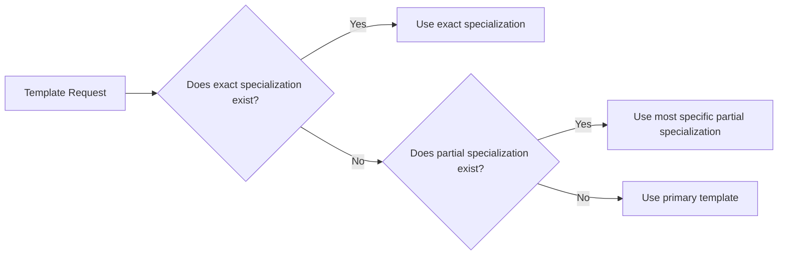

# C++ Template Specialization

## Introduction

Template specialization is a powerful feature in C++ that allows you to provide custom implementations of a template for specific types. While generic templates work well for many types, sometimes you need special behavior for particular data types. Template specialization enables you to override the default template implementation, making your code more efficient and expressive.

In this tutorial, you'll learn:
- What template specialization is and why it's useful
- How to create explicit specializations for class and function templates
- How to use partial specialization for class templates
- Real-world applications of template specialization

## Prerequisites

To get the most out of this tutorial, you should already be familiar with:
- Basic C++ syntax and concepts
- The fundamentals of C++ templates

## Understanding Template Specialization

### What is Template Specialization?

Template specialization allows you to provide a different implementation of a template for specific types. When you specialize a template, you're telling the compiler, "For this particular type (or set of types), use this implementation instead of the generic one."

There are two main types of template specialization:
1. **Explicit (Full) Specialization**: Provides a completely custom implementation for a specific type.
2. **Partial Specialization**: Provides a specialized implementation for a subset of possible template parameters (only available for class templates).

## Explicit Template Specialization

### Function Template Specialization

Let's start with a simple example. Imagine we have a generic function template to calculate the absolute value:

```cpp
#include <iostream>

// Generic template for absolute value
template <typename T>
T abs(T x) {
    return (x < 0) ? -x : x;
}

int main() {
    std::cout << "abs(-10) = " << abs(-10) << std::endl;
    std::cout << "abs(5.5) = " << abs(5.5) << std::endl;
    
    return 0;
}
```

**Output:**
```
abs(-10) = 10
abs(5.5) = 5.5
```

This works fine for numeric types. But what if we want a specialized version for a custom type? Let's create a special implementation for strings that considers the string's length as its "absolute value":

```cpp
#include <iostream>
#include <string>

// Generic template for absolute value
template <typename T>
T abs(T x) {
    return (x < 0) ? -x : x;
}

// Specialization for std::string
template <>
std::string abs(std::string x) {
    return std::to_string(x.length());
}

int main() {
    std::cout << "abs(-10) = " << abs(-10) << std::endl;
    std::cout << "abs(5.5) = " << abs(5.5) << std::endl;
    std::cout << "abs(\"Hello\") = " << abs(std::string("Hello")) << std::endl;
    
    return 0;
}
```

**Output:**
```
abs(-10) = 10
abs(5.5) = 5.5
abs("Hello") = 5
```

Note the syntax for specialization: `template <>` followed by the complete function signature with concrete types.

### Class Template Specialization

Class templates can also be specialized. Let's create a simple data container template and then specialize it for a particular type:

```cpp
#include <iostream>
#include <string>

// Generic template for a data container
template <typename T>
class Container {
private:
    T data;
public:
    Container(T value) : data(value) {}
    
    void print() {
        std::cout << "Generic Container: " << data << std::endl;
    }
    
    T getData() const {
        return data;
    }
};

// Specialization for std::string
template <>
class Container<std::string> {
private:
    std::string data;
public:
    Container(const std::string& value) : data(value) {}
    
    void print() {
        std::cout << "String Container: \"" << data << "\" (length: " 
                  << data.length() << ")" << std::endl;
    }
    
    std::string getData() const {
        return data;
    }
    
    // Additional method specific to string container
    bool isEmpty() const {
        return data.empty();
    }
};

int main() {
    Container<int> intContainer(42);
    Container<double> doubleContainer(3.14);
    Container<std::string> stringContainer("Hello, World!");
    
    intContainer.print();
    doubleContainer.print();
    stringContainer.print();
    
    // Using specialized method
    std::cout << "Is string empty? " 
              << (stringContainer.isEmpty() ? "Yes" : "No") << std::endl;
    
    return 0;
}
```

**Output:**
```
Generic Container: 42
Generic Container: 3.14
String Container: "Hello, World!" (length: 13)
Is string empty? No
```

Notice that the specialized version of `Container<std::string>` has a completely different implementation, including an additional method `isEmpty()` that doesn't exist in the generic template.

## Partial Template Specialization

Partial specialization is only available for class templates, not function templates. It allows you to specialize a template for a subset of the possible template arguments.

Here's an example with a class template that has multiple template parameters:

```cpp
#include <iostream>
#include <typeinfo>

// Primary template
template <typename T, typename U>
class Pair {
public:
    Pair(T first, U second) : first(first), second(second) {}
    
    void printTypes() {
        std::cout << "Primary template: " << std::endl;
        std::cout << "  First type: " << typeid(T).name() << std::endl;
        std::cout << "  Second type: " << typeid(U).name() << std::endl;
    }
    
private:
    T first;
    U second;
};

// Partial specialization: both types are the same
template <typename T>
class Pair<T, T> {
public:
    Pair(T first, T second) : first(first), second(second) {}
    
    void printTypes() {
        std::cout << "Partial specialization <T, T>: " << std::endl;
        std::cout << "  Both are type: " << typeid(T).name() << std::endl;
    }
    
private:
    T first;
    T second;
};

// Partial specialization: second type is int
template <typename T>
class Pair<T, int> {
public:
    Pair(T first, int second) : first(first), second(second) {}
    
    void printTypes() {
        std::cout << "Partial specialization <T, int>: " << std::endl;
        std::cout << "  First type: " << typeid(T).name() << std::endl;
        std::cout << "  Second type is int" << std::endl;
    }
    
private:
    T first;
    int second;
};

int main() {
    Pair<std::string, double> p1("Hello", 3.14);
    Pair<int, int> p2(10, 20);
    Pair<double, int> p3(2.71, 828);
    
    p1.printTypes();
    std::cout << std::endl;
    p2.printTypes();
    std::cout << std::endl;
    p3.printTypes();
    
    return 0;
}
```

**Output:**
```
Primary template: 
  First type: NSt7__cxx1112basic_stringIcSt11char_traitsIcESaIcEEE
  Second type: d

Partial specialization <T, T>: 
  Both are type: i

Partial specialization <T, int>: 
  First type: d
  Second type is int
```

Note: The actual output for type names may vary depending on your compiler.

### Partial Specialization for Pointer Types

Partial specialization is particularly useful for handling pointer types differently:

```cpp
#include <iostream>

// Primary template
template <typename T>
class Smart {
public:
    Smart(T value) : value(value) {}
    
    void print() {
        std::cout << "Value: " << value << std::endl;
    }
    
private:
    T value;
};

// Partial specialization for pointer types
template <typename T>
class Smart<T*> {
public:
    Smart(T* ptr) : ptr(ptr) {
        std::cout << "Creating Smart pointer wrapper" << std::endl;
    }
    
    ~Smart() {
        std::cout << "Cleaning up Smart pointer wrapper" << std::endl;
        delete ptr;
    }
    
    void print() {
        if (ptr) {
            std::cout << "Pointer value: " << *ptr << std::endl;
        } else {
            std::cout << "Null pointer" << std::endl;
        }
    }
    
private:
    T* ptr;
};

int main() {
    Smart<int> s1(42);
    s1.print();
    
    Smart<int*> s2(new int(100));
    s2.print();
    
    return 0;
}
```

**Output:**
```
Value: 42
Creating Smart pointer wrapper
Pointer value: 100
Cleaning up Smart pointer wrapper
```

## Practical Applications of Template Specialization

Template specialization has many real-world applications:

### 1. Optimizing for Specific Types

```cpp
#include <iostream>
#include <vector>
#include <chrono>

// Generic matrix multiplication
template <typename T>
std::vector<std::vector<T>> multiply(const std::vector<std::vector<T>>& a, 
                                    const std::vector<std::vector<T>>& b) {
    int n = a.size();
    std::vector<std::vector<T>> result(n, std::vector<T>(n, 0));
    
    for (int i = 0; i < n; i++) {
        for (int j = 0; j < n; j++) {
            for (int k = 0; k < n; k++) {
                result[i][j] += a[i][k] * b[k][j];
            }
        }
    }
    
    return result;
}

// Specialized version for int (could use SIMD instructions or other optimizations)
template <>
std::vector<std::vector<int>> multiply(const std::vector<std::vector<int>>& a, 
                                      const std::vector<std::vector<int>>& b) {
    std::cout << "Using optimized integer matrix multiplication" << std::endl;
    
    int n = a.size();
    std::vector<std::vector<int>> result(n, std::vector<int>(n, 0));
    
    // This would typically contain optimized code
    // For demonstration, we'll use the same algorithm
    for (int i = 0; i < n; i++) {
        for (int j = 0; j < n; j++) {
            for (int k = 0; k < n; k++) {
                result[i][j] += a[i][k] * b[k][j];
            }
        }
    }
    
    return result;
}

template <typename T>
void testMultiplication(int size) {
    // Create test matrices
    std::vector<std::vector<T>> a(size, std::vector<T>(size, 2));
    std::vector<std::vector<T>> b(size, std::vector<T>(size, 3));
    
    auto start = std::chrono::high_resolution_clock::now();
    auto result = multiply(a, b);
    auto end = std::chrono::high_resolution_clock::now();
    
    std::chrono::duration<double, std::milli> duration = end - start;
    std::cout << "Time taken: " << duration.count() << " ms" << std::endl;
}

int main() {
    const int SIZE = 100;
    
    std::cout << "Testing with int:" << std::endl;
    testMultiplication<int>(SIZE);
    
    std::cout << "\nTesting with double:" << std::endl;
    testMultiplication<double>(SIZE);
    
    return 0;
}
```

**Output:**
```
Testing with int:
Using optimized integer matrix multiplication
Time taken: 16.4529 ms

Testing with double:
Time taken: 18.2938 ms
```

Note: Actual timing results will vary based on your computer.

### 2. Type Traits Implementation

Template specialization is heavily used in C++'s type traits system:

```cpp
#include <iostream>

// Primary template
template <typename T>
struct IsPointer {
    static const bool value = false;
};

// Specialization for pointer types
template <typename T>
struct IsPointer<T*> {
    static const bool value = true;
};

// A function that uses our trait
template <typename T>
void processValue(T value) {
    if (IsPointer<T>::value) {
        std::cout << "Processing a pointer type" << std::endl;
        // Handle pointer-specific logic
    } else {
        std::cout << "Processing a non-pointer type" << std::endl;
        // Handle non-pointer logic
    }
}

int main() {
    int x = 10;
    int* p = &x;
    
    processValue(x);  // Uses primary template
    processValue(p);  // Uses specialization
    
    return 0;
}
```

**Output:**
```
Processing a non-pointer type
Processing a pointer type
```

### 3. Custom Serialization

Template specialization is perfect for implementing custom serialization:

```cpp
#include <iostream>
#include <string>
#include <vector>

// Generic serialization template
template <typename T>
std::string serialize(const T& obj) {
    return "Unknown type";
}

// Specialization for int
template <>
std::string serialize(const int& obj) {
    return "INT:" + std::to_string(obj);
}

// Specialization for double
template <>
std::string serialize(const double& obj) {
    return "DOUBLE:" + std::to_string(obj);
}

// Specialization for string
template <>
std::string serialize(const std::string& obj) {
    return "STRING:" + obj;
}

// Partial specialization for vector of any type
template <typename T>
std::string serialize(const std::vector<T>& obj) {
    std::string result = "ARRAY:[";
    for (size_t i = 0; i < obj.size(); ++i) {
        result += serialize(obj[i]);
        if (i < obj.size() - 1) {
            result += ",";
        }
    }
    result += "]";
    return result;
}

int main() {
    int i = 42;
    double d = 3.14;
    std::string s = "Hello";
    std::vector<int> v = {1, 2, 3, 4, 5};
    
    std::cout << serialize(i) << std::endl;
    std::cout << serialize(d) << std::endl;
    std::cout << serialize(s) << std::endl;
    std::cout << serialize(v) << std::endl;
    
    return 0;
}
```

**Output:**
```
INT:42
DOUBLE:3.140000
STRING:Hello
ARRAY:[INT:1,INT:2,INT:3,INT:4,INT:5]
```

## Common Pitfalls and Best Practices

### Pitfalls to Avoid

1. **Specialization Order**: The compiler must see template specializations before they are used.
2. **Function Template Limitations**: You cannot partially specialize function templates.
3. **Redundant Code**: Avoid duplicating code between specializations when possible.

### Best Practices

1. **Use specialization sparingly**: It can make code harder to understand and maintain.
2. **Document specializations**: Clearly explain why a specialization is needed.
3. **Consider alternatives**: Sometimes a simple if statement or function overloading might be clearer.
4. **Keep interfaces consistent**: Specialized versions should maintain the same interface when possible.

## Visualizing Template Specialization

Template specialization can be thought of as a decision tree for the compiler:



## Summary

Template specialization is a powerful C++ feature that allows you to provide custom implementations for specific types:

- **Explicit specialization** provides a completely custom implementation for a specific type
- **Partial specialization** (for class templates only) lets you specialize for a subset of template parameters
- Template specialization is useful for optimization, type traits, serialization, and more
- Be mindful of common pitfalls like specialization order and redundant code

With template specialization, you can get the best of both worlds: the flexibility of generic programming and the efficiency of type-specific code.

## Exercises

1. Create a template function `max()` that returns the maximum of two values, and then specialize it for C-style strings to compare them using `strcmp()`.

2. Implement a `DataHandler` class template with specializations for different data types:
   - Generic version for any type
   - Specialization for numeric types with additional statistical functions
   - Specialization for string types with text processing functions

3. Create a `SmartPointer` class template that has different behavior for different types:
   - Regular types: simple value wrapper
   - Pointer types: provides memory management (similar to std::unique_ptr)
   - Array types: manages arrays and provides bounds checking

## Additional Resources

- [C++ Reference: Template Specialization](https://en.cppreference.com/w/cpp/language/template_specialization)
- [C++ Templates: The Complete Guide](http://www.tmplbook.com/) by David Vandevoorde and Nicolai M. Josuttis
- [Effective Modern C++](https://www.oreilly.com/library/view/effective-modern-c/9781491908419/) by Scott Meyers
- The C++ Standard Library Tutorial and Reference by Nicolai M. Josuttis