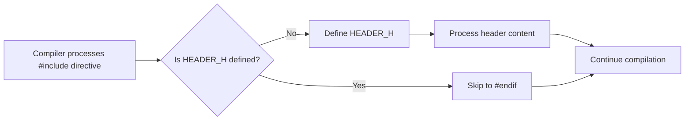

# C++ Include Guard

## Introduction

When developing C++ applications, you'll often split your code across multiple files to improve organization and maintainability. Header files (`.h` or `.hpp`) contain declarations that are used in multiple source files. However, this leads to a common problem: **header files might be included multiple times** in a single compilation unit, causing redefinition errors.

**Include guards** are a preprocessing technique that prevents a header file from being included multiple times during compilation. They are essential for preventing duplicate definitions and compilation errors in C++ programs.

## The Problem: Multiple Inclusion

Consider the following scenario:

```cpp
// Point.h
struct Point {
    int x;
    int y;
};
```

Now imagine two files include this header:

```cpp
// Shapes.h
#include "Point.h"
// Other declarations...
```

```cpp
// main.cpp
#include "Point.h"
#include "Shapes.h"  // This also includes Point.h
```

When compiling `main.cpp`, the `Point` struct will be defined twice, resulting in a compilation error:

```
error: redefinition of 'struct Point'
```

## The Solution: Include Guards

Include guards prevent this problem by using preprocessor directives to ensure the header content is included only once.

### Basic Include Guard Syntax

```cpp
// Point.h
#ifndef POINT_H
#define POINT_H

struct Point {
    int x;
    int y;
};

#endif // POINT_H
```

Here's how this works:

1. `#ifndef POINT_H` checks if the macro `POINT_H` is not defined
2. If `POINT_H` is not defined, the preprocessor defines it and processes the code inside
3. If `POINT_H` is already defined (from a previous inclusion), the preprocessor skips the code until `#endif`

### Example of Include Guards in Action

Let's see how include guards solve our previous problem:

```cpp
// Point.h
#ifndef POINT_H
#define POINT_H

struct Point {
    int x;
    int y;
};

#endif // POINT_H
```

```cpp
// Shapes.h
#ifndef SHAPES_H
#define SHAPES_H

#include "Point.h"

struct Circle {
    Point center;
    double radius;
};

#endif // SHAPES_H
```

```cpp
// main.cpp
#include "Point.h"
#include "Shapes.h"

int main() {
    Point p{5, 10};
    Circle c{{0, 0}, 7.5};
    
    return 0;
}
```

When `main.cpp` is compiled:

1. `Point.h` is included, defining `POINT_H` and the `Point` struct
2. `Shapes.h` is included and tries to include `Point.h` again
3. Since `POINT_H` is already defined, the content of `Point.h` is skipped
4. No redefinition error occurs

## Naming Conventions for Include Guards

Choosing a unique name for your include guard macros is important. Common conventions include:

- **Project_File_H**: `MYPROJECT_POINT_H`
- **Uppercase filepath**: `INCLUDE_GRAPHICS_POINT_H`
- **Using unique identifiers**: `POINT_H_A1B2C3D4`

Best practice is to choose a convention and consistently apply it throughout your project.

## The #pragma once Alternative

Modern C++ compilers support a simpler alternative to traditional include guards:

```cpp
// Point.h
#pragma once

struct Point {
    int x;
    int y;
};
```

`#pragma once` is a non-standard but widely supported directive that tells the compiler to include the file only once. It's shorter, eliminating the possibility of naming conflicts, and often more efficient.

### Traditional Include Guards vs. #pragma once

| Feature | Traditional Include Guards | #pragma once |
|---------|----------------------------|-------------|
| Standard | ISO C++ standard | Non-standard (but widely supported) |
| Verbosity | More verbose | Concise |
| Naming conflicts | Possible | Not possible |
| Implementation | Works at preprocessor level | Implementation-dependent |
| Portability | Works on all compilers | Most but not all compilers |

## Real-World Example: A Library Header

Here's a more complete example showing how include guards work in a real header file:

```cpp
// MathUtils.h
#ifndef MYLIB_MATHUTILS_H
#define MYLIB_MATHUTILS_H

#include <cmath> // Standard library header also has include guards

namespace MyLib {

// Constants
constexpr double PI = 3.14159265358979323846;

// Function declarations
double degreesToRadians(double degrees);
double radiansToDegrees(double radians);

// Template function
template<typename T>
T square(T value) {
    return value * value;
}

} // namespace MyLib

#endif // MYLIB_MATHUTILS_H
```

Implementation file:

```cpp
// MathUtils.cpp
#include "MathUtils.h"

namespace MyLib {

double degreesToRadians(double degrees) {
    return degrees * PI / 180.0;
}

double radiansToDegrees(double radians) {
    return radians * 180.0 / PI;
}

} // namespace MyLib
```

Usage:

```cpp
// main.cpp
#include "MathUtils.h"
#include <iostream>

int main() {
    double angle = 45.0;
    double radians = MyLib::degreesToRadians(angle);
    
    std::cout << angle << " degrees = " << radians << " radians" << std::endl;
    std::cout << "Square of " << angle << " = " << MyLib::square(angle) << std::endl;
    
    return 0;
}
```

Output:
```
45 degrees = 0.785398 radians
Square of 45 = 2025
```

## Include Guard Diagram

Here's a visual representation of how include guards work:



## Common Mistakes and Best Practices

### Mistakes to Avoid

1. **Using non-unique macro names**: May cause conflicts with other libraries
   ```cpp
   // BAD: Too generic
   #ifndef UTILS_H
   #define UTILS_H
   ```

2. **Forgetting to add include guards**: Always add them to every header file
3. **Inconsistent naming**: Use the same convention throughout your project
4. **Missing the closing `#endif`**: Always pair your `#ifndef` with an `#endif`

### Best Practices

1. **Use descriptive, project-specific macro names**:
   ```cpp
   // GOOD: Specific to project
   #ifndef MYPROJECT_UTILS_MODULE_H
   #define MYPROJECT_UTILS_MODULE_H
   ```

2. **Comment the closing `#endif` with the macro name** for improved readability:
   ```cpp
   #endif // MYPROJECT_UTILS_MODULE_H
   ```

3. **Consider using `#pragma once` if portability is not a concern**

4. **Always place include guards as the very first and last lines** in header files

## Summary

Include guards are a crucial preprocessing technique in C++ that prevent header files from being included multiple times in a single compilation unit. They solve the problem of duplicate definitions by ensuring the header's content is processed only once.

Key points to remember:

- Use either traditional include guards (`#ifndef`/`#define`/`#endif`) or `#pragma once`
- Choose unique names for include guard macros to avoid conflicts
- Add include guards to every header file you create
- Be consistent with your naming convention

By properly using include guards, you can create more maintainable and error-free C++ programs with modular code across multiple files.

## Further Exercises

1. Create a small C++ project with multiple header files that include each other. Implement include guards and verify they prevent redefinition errors.

2. Compare the compilation speed of a large project using traditional include guards versus `#pragma once`.

3. Examine open-source C++ projects to observe different include guard naming conventions.

4. Try deliberately creating an include guard naming conflict and observe the errors that occur.

## Additional Resources

- [C++ Core Guidelines: SF.8: Use #include guards for all header files](https://isocpp.github.io/CppCoreGuidelines/CppCoreGuidelines#sf8-use-include-guards-for-all-header-files)
- [The C++ Preprocessor](https://en.cppreference.com/w/cpp/preprocessor)
- [Include Guards vs #pragma once](https://en.wikipedia.org/wiki/Include_guard#Pragma_once)