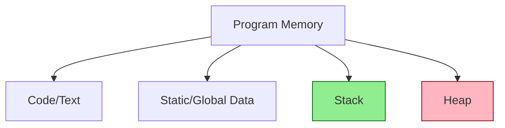

# C++ Stack and Heap Memory

Memory management is one of the key aspects of C++ programming that sets it apart from higher-level languages. Understanding how and where your data is stored is crucial for writing efficient and bug-free code. In this tutorial, we'll explore the two primary regions of memory used in C++ programs: the stack and the heap.

## Introduction to Memory Regions

When a C++ program runs, it primarily uses two regions of memory to store data:

1. **Stack**: A fixed-size, LIFO (Last-In-First-Out) data structure managed automatically by the compiler
2. **Heap**: A dynamic region of memory for allocating and deallocating memory at runtime

Let's visualize the basic memory layout of a typical C++ program:



## The Stack Memory

### What is the Stack?

The stack is a region of memory that stores data in a Last-In-First-Out (LIFO) order. Think of it like a stack of plates – you can only add or remove from the top.

### Key Characteristics of Stack Memory:

- **Fast allocation/deallocation**: Allocating memory on the stack is as simple as incrementing a pointer
- **Automatic memory management**: Variables are automatically created and destroyed
- **Limited size**: The stack typically has a fixed size (often a few MB)
- **Compile-time memory allocation**: Memory size needs to be known at compile time
- **Sequential memory access**: Variables are allocated and deallocated in a strict order

### What Goes on the Stack?

- Function parameters
- Local variables (when not dynamically allocated)
- Return addresses of function calls
- Control information for nested function calls

### Stack Example

```cpp
#include <iostream>

void stackExample() {
    // These variables are all allocated on the stack
    int number = 42;          // 4 bytes
    double price = 9.99;      // 8 bytes
    char letter = 'A';        // 1 byte
    
    // Arrays with fixed size are also on the stack
    int numbers[5] = {1, 2, 3, 4, 5};  // 20 bytes (5 * 4)
    
    std::cout << "Stack variables:" << std::endl;
    std::cout << "number: " << number << std::endl;
    std::cout << "price: " << price << std::endl;
    std::cout << "letter: " << letter << std::endl;
    std::cout << "numbers[0]: " << numbers[0] << std::endl;
    
    // When this function returns, all these variables are automatically deallocated
}

int main() {
    stackExample();
    return 0;
}
```

**Output:**
```
Stack variables:
number: 42
price: 9.99
letter: A
numbers[0]: 1
```

### Stack Limitations - Stack Overflow

A common issue with stack memory is **stack overflow**, which occurs when you exceed the stack's size limit:

```cpp
#include <iostream>

void recursiveFunction(int count) {
    // Local variable allocated on the stack
    int array[1000]; // 4000 bytes
    
    // Base case
    if (count <= 0) return;
    
    std::cout << "Recursive call: " << count << std::endl;
    
    // Recursive call - adds another stack frame
    recursiveFunction(count - 1);
}

int main() {
    // This might cause a stack overflow if called with a large number
    // recursiveFunction(1000); // Will likely crash the program
    
    // Safer version:
    recursiveFunction(10);
    return 0;
}
```

## The Heap Memory

### What is the Heap?

The heap (also called the "free store" in C++) is a region of memory used for dynamic memory allocation. Unlike the stack, memory in the heap can be allocated and freed in any order.

### Key Characteristics of Heap Memory:

- **Dynamic allocation/deallocation**: Memory is allocated and freed at runtime
- **Manual memory management**: You're responsible for freeing allocated memory
- **Larger size**: The heap can typically access all available memory
- **Run-time memory allocation**: Size can be determined during program execution
- **Non-sequential access**: Memory can be allocated and deallocated in any order

### What Goes on the Heap?

- Dynamically allocated data structures (vectors, linked lists, trees)
- Large objects that might exceed stack size
- Objects with a lifetime not tied to the current scope
- Objects whose size is determined at runtime

### Heap Example

```cpp
#include <iostream>

void heapExample() {
    // Allocate a single integer on the heap
    int* pNumber = new int;
    *pNumber = 42;
    
    // Allocate an array of integers on the heap
    int* pArray = new int[5];
    for (int i = 0; i < 5; i++) {
        pArray[i] = i + 1;
    }
    
    std::cout << "Heap variables:" << std::endl;
    std::cout << "*pNumber: " << *pNumber << std::endl;
    std::cout << "pArray[0]: " << pArray[0] << std::endl;
    
    // IMPORTANT: We must manually free the allocated memory
    delete pNumber;      // Free the single integer
    delete[] pArray;     // Free the array
}

int main() {
    heapExample();
    return 0;
}
```

**Output:**
```
Heap variables:
*pNumber: 42
pArray[0]: 1
```

### Heap Issues - Memory Leaks

A common issue with heap memory is **memory leaks**, which occur when you allocate memory but don't free it:

```cpp
#include <iostream>

void badFunction() {
    int* pNumber = new int(42);
    
    // Problem: No matching delete statement!
    // The memory will remain allocated after the function exits
}

void goodFunction() {
    int* pNumber = new int(42);
    
    // Use the memory...
    std::cout << "Value: " << *pNumber << std::endl;
    
    // Free the memory when done
    delete pNumber;
}

int main() {
    // This will leak memory
    badFunction();
    
    // This won't leak memory
    goodFunction();
    
    return 0;
}
```

## Stack vs. Heap: A Comparison

Let's compare these two memory regions:

| Feature | Stack | Heap |
|---------|-------|------|
| **Memory Management** | Automatic | Manual (with `new`/`delete`) |
| **Allocation Speed** | Very fast | Slower |
| **Flexibility** | Fixed size at compile time | Dynamic size at runtime |
| **Memory Size** | Limited (typically a few MB) | Large (limited by available memory) |
| **Memory Layout** | Contiguous blocks | May be fragmented |
| **Lifetime** | Tied to scope | Controlled by programmer |
| **Common Issues** | Stack overflow | Memory leaks, fragmentation |

## When to Use Stack vs. Heap

### Use the Stack When:

- Dealing with small, fixed-size objects
- Object lifetime is limited to the current scope
- You need maximum performance for allocation/deallocation
- You want automatic memory management

### Use the Heap When:

- Allocating large objects
- The object's size is not known at compile time
- You need the object to live beyond the current scope
- Implementing data structures with dynamic size (like linked lists)

## Practical Examples

### Example 1: Returning Data from Functions

```cpp
#include <iostream>
#include <string>

// BAD: Returning pointer to local stack variable
char* badStringFunction() {
    char localString[20] = "Hello, World!";
    return localString;  // DANGER: Returns pointer to memory that will be invalid!
}

// GOOD: Returning dynamically allocated memory (caller must delete)
char* goodStringFunction() {
    char* heapString = new char[20];
    strcpy(heapString, "Hello, World!");
    return heapString;  // Caller is responsible for delete[] heapString;
}

// BETTER: Using C++ strings (automatic memory management)
std::string bestStringFunction() {
    std::string str = "Hello, World!";
    return str;  // Safe, memory is managed automatically
}

int main() {
    // BAD: This will likely crash or show garbage
    // char* badPtr = badStringFunction();
    // std::cout << badPtr << std::endl;  // Undefined behavior!
    
    // GOOD: But requires manual cleanup
    char* goodPtr = goodStringFunction();
    std::cout << goodPtr << std::endl;
    delete[] goodPtr;  // Must clean up!
    
    // BEST: Safe and automatic
    std::string bestStr = bestStringFunction();
    std::cout << bestStr << std::endl;
    
    return 0;
}
```

**Output:**
```
Hello, World!
Hello, World!
```

### Example 2: Managing Variable-Length Data

```cpp
#include <iostream>
#include <vector>

void processData(int dataSize) {
    // Approach 1: Fixed stack allocation (risky if size is large)
    // int stackData[1000];  // What if dataSize > 1000?
    
    // Approach 2: Dynamic heap allocation (flexible but manual)
    int* heapData = new int[dataSize];
    
    // Fill the array
    for (int i = 0; i < dataSize; i++) {
        heapData[i] = i * 2;
    }
    
    // Process the first few elements
    std::cout << "Using raw dynamic array:" << std::endl;
    for (int i = 0; i < 5 && i < dataSize; i++) {
        std::cout << heapData[i] << " ";
    }
    std::cout << std::endl;
    
    // Clean up
    delete[] heapData;
    
    // Approach 3: Using std::vector (best of both worlds)
    std::vector<int> vecData(dataSize);
    
    // Fill the vector
    for (int i = 0; i < dataSize; i++) {
        vecData[i] = i * 2;
    }
    
    // Process the first few elements
    std::cout << "Using std::vector:" << std::endl;
    for (int i = 0; i < 5 && i < dataSize; i++) {
        std::cout << vecData[i] << " ";
    }
    std::cout << std::endl;
    
    // No manual cleanup needed!
}

int main() {
    // Process a moderate amount of data
    processData(1000);
    
    // Process a larger amount of data (would be risky with stack allocation)
    processData(100000);
    
    return 0;
}
```

**Output:**
```
Using raw dynamic array:
0 2 4 6 8 
Using std::vector:
0 2 4 6 8 
Using raw dynamic array:
0 2 4 6 8 
Using std::vector:
0 2 4 6 8 
```

## Modern C++ Approaches

Modern C++ offers several tools to make memory management safer and easier:

### Smart Pointers

Smart pointers automatically manage memory for you:

```cpp
#include <iostream>
#include <memory>

void smartPointerExample() {
    // unique_ptr - automatically deletes when it goes out of scope
    std::unique_ptr<int> uniqPtr = std::make_unique<int>(42);
    std::cout << "unique_ptr value: " << *uniqPtr << std::endl;
    
    // shared_ptr - reference counted, deletes when all references are gone
    std::shared_ptr<int> sharedPtr1 = std::make_shared<int>(100);
    {
        std::shared_ptr<int> sharedPtr2 = sharedPtr1;  // Reference count = 2
        std::cout << "shared_ptr value: " << *sharedPtr2 << std::endl;
        // sharedPtr2 goes out of scope here, but memory isn't freed yet
    }
    // Memory is freed when sharedPtr1 goes out of scope
}

int main() {
    smartPointerExample();
    return 0;
}
```

**Output:**
```
unique_ptr value: 42
shared_ptr value: 100
```

### Container Classes

Standard library containers handle memory for you:

```cpp
#include <iostream>
#include <vector>
#include <string>
#include <map>

void containersExample() {
    // vector - dynamic array
    std::vector<int> numbers = {1, 2, 3, 4, 5};
    numbers.push_back(6);  // Automatically resizes if needed
    
    // string - dynamic character array
    std::string text = "Hello";
    text += " World";  // Automatically manages memory
    
    // map - key-value storage
    std::map<std::string, int> ages;
    ages["Alice"] = 30;
    ages["Bob"] = 25;
    
    // Print values
    std::cout << "Vector: ";
    for (int num : numbers) std::cout << num << " ";
    std::cout << std::endl;
    
    std::cout << "String: " << text << std::endl;
    
    std::cout << "Map entries:" << std::endl;
    for (const auto& pair : ages) {
        std::cout << pair.first << ": " << pair.second << std::endl;
    }
}

int main() {
    containersExample();
    return 0;
}
```

**Output:**
```
Vector: 1 2 3 4 5 6 
String: Hello World
Map entries:
Alice: 30
Bob: 25
```

## Summary

Understanding stack and heap memory is essential for effective C++ programming:

- **Stack memory** is fast, automatic, but limited in size and lifetime
- **Heap memory** is flexible, manually managed, and can store large or variable-sized objects
- Use the stack for small, temporary objects
- Use the heap for large objects or those with a lifetime beyond the current scope
- Modern C++ provides tools like smart pointers and containers to simplify memory management

By mastering these concepts, you'll write more efficient, reliable code and avoid common memory-related bugs like stack overflows and memory leaks.

## Additional Resources

- [C++ Reference: Memory Management](https://en.cppreference.com/w/cpp/memory)
- [Stack Overflow: What and where are the stack and heap?](https://stackoverflow.com/questions/79923/what-and-where-are-the-stack-and-heap)
- [Microsoft C++ Documentation: Smart Pointers](https://docs.microsoft.com/en-us/cpp/cpp/smart-pointers-modern-cpp)

## Exercises

1. Write a program that creates an array on the stack and the heap, and compare the performance for different sizes.
2. Create a function that causes a stack overflow by using excessive recursion.
3. Implement a simple class that allocates memory on the heap in its constructor and properly cleans up in its destructor.
4. Convert a program that uses manual memory management (new/delete) to use smart pointers instead.
5. Experiment with a memory leak detection tool (like Valgrind) to find leaks in a simple program.