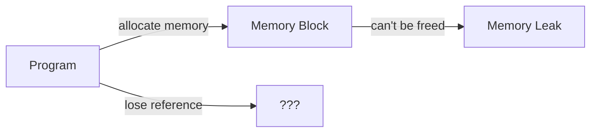

# C++ Memory Leaks

## Introduction

Memory leaks are one of the most common yet troublesome issues in C++ programming. They occur when your program allocates memory dynamically but fails to release it when it's no longer needed. Unlike some modern programming languages that have automatic garbage collection, C++ gives you direct control over memory management, which means you're responsible for cleaning up after yourself.

In this tutorial, we'll explore:
- What memory leaks are and why they're problematic
- How to identify memory leaks in your code
- Common patterns that cause memory leaks
- How to prevent memory leaks
- Tools for detecting memory leaks

## What is a Memory Leak?

A memory leak happens when a program allocates memory from the heap (using operators like `new` or functions like `malloc()`), but never deallocates it (using `delete` or `free()`), even though it's no longer needed. The program "loses" the reference to that memory, making it impossible to free it.



When memory leaks occur, the program's memory consumption grows over time, which can lead to:

1. **Reduced performance**: Less memory available for other operations
2. **Crashes**: When the system runs out of memory
3. **Resource exhaustion**: Other programs may not have enough memory to run
4. **Instability**: Unpredictable behavior when memory gets low

## Basic Example of a Memory Leak

Let's start with a simple example of a memory leak:

```cpp
#include <iostream>

void createMemoryLeak() {
    int* number = new int(42);
    // We allocate memory but never free it with delete
    std::cout << "Value: " << *number << std::endl;
    
    // Function ends, but the memory remains allocated!
}

int main() {
    createMemoryLeak();
    
    // Program continues, but we've lost the pointer to our allocated memory
    std::cout << "Function completed, but memory is still allocated!" << std::endl;
    
    return 0;
}
```

**Output:**
```
Value: 42
Function completed, but memory is still allocated!
```

In this example, we:
1. Allocate memory for an integer using `new`
2. Store the number 42 in that memory
3. Print the value
4. Exit the function, losing our pointer to the allocated memory
5. Never call `delete` to free the memory

This memory remains allocated until the program terminates. For a short-running program, this might not be noticeable, but for long-running applications or programs with frequent allocations, memory leaks can quickly become problematic.

## Common Causes of Memory Leaks

### 1. Forgetting to Delete Allocated Memory

The most straightforward cause is simply forgetting to call `delete` after using `new`:

```cpp
void forgetToDelete() {
    int* array = new int[100];  // Allocate memory
    
    // Do something with array
    for(int i = 0; i < 100; i++) {
        array[i] = i;
    }
    
    // Oops! Forgot to delete[] array
}
```

### 2. Early Returns or Exceptions

Memory leaks can occur when a function exits early due to a condition or exception before reaching the cleanup code:

```cpp
bool processData(int* data, int size) {
    int* buffer = new int[size];
    
    // Process data
    for(int i = 0; i < size; i++) {
        if(data[i] < 0) {
            // Early return, memory leak!
            return false;
        }
        buffer[i] = data[i] * 2;
    }
    
    // This only runs if all data is valid
    delete[] buffer;
    return true;
}
```

### 3. Lost Pointers Due to Reassignment

Reassigning a pointer without first freeing the memory it points to causes a leak:

```cpp
void reassignPointer() {
    int* pointer = new int(10);
    
    // Later in the code...
    pointer = new int(20);  // Memory leak! Lost reference to first allocation
    
    delete pointer;  // Only frees the second allocation
}
```

### 4. Circular References

When objects reference each other in a cycle and use manual memory management, memory leaks can occur:

```cpp
class Node {
public:
    Node* next;
    int data;
    
    Node(int value) : data(value), next(nullptr) {}
    
    ~Node() {
        // Doesn't delete 'next'
    }
};

void createCircularReference() {
    Node* node1 = new Node(1);
    Node* node2 = new Node(2);
    
    node1->next = node2;
    node2->next = node1;  // Circular reference
    
    delete node1;  // Only deletes node1, not node2!
}
```

## How to Prevent Memory Leaks

### 1. RAII (Resource Acquisition Is Initialization)

RAII is a C++ programming principle where resource management is tied to object lifetime:

```cpp
#include <iostream>
#include <memory>

class Resource {
public:
    Resource() {
        std::cout << "Resource acquired\n";
    }
    
    ~Resource() {
        std::cout << "Resource released\n";
    }
    
    void use() {
        std::cout << "Resource being used\n";
    }
};

void useResource() {
    // Resource automatically managed by stack-based object
    Resource r;
    r.use();
    
    // Resource automatically freed when function exits
}

int main() {
    useResource();
    std::cout << "After function call\n";
    return 0;
}
```

**Output:**
```
Resource acquired
Resource being used
Resource released
After function call
```

### 2. Smart Pointers

Modern C++ provides smart pointers that automatically manage memory:

#### std::unique_ptr

Provides exclusive ownership of a dynamically allocated object:

```cpp
#include <iostream>
#include <memory>

void smartPointerExample() {
    // Create a unique_ptr
    std::unique_ptr<int> number = std::make_unique<int>(42);
    
    std::cout << "Value: " << *number << std::endl;
    
    // No need to delete - memory is automatically freed when number goes out of scope
}

int main() {
    smartPointerExample();
    std::cout << "After function call - memory automatically freed\n";
    return 0;
}
```

**Output:**
```
Value: 42
After function call - memory automatically freed
```

#### std::shared_ptr

Allows multiple pointers to share ownership of a resource:

```cpp
#include <iostream>
#include <memory>

class SharedResource {
public:
    SharedResource(int id) : resourceId(id) {
        std::cout << "Resource " << resourceId << " created\n";
    }
    
    ~SharedResource() {
        std::cout << "Resource " << resourceId << " destroyed\n";
    }
    
    int resourceId;
};

void useSharedResource() {
    // Create a shared resource
    std::shared_ptr<SharedResource> resource1 = 
        std::make_shared<SharedResource>(1);
    
    {
        // Another pointer sharing ownership
        std::shared_ptr<SharedResource> resource2 = resource1;
        std::cout << "Using resource in inner scope: " << resource2->resourceId << "\n";
        // resource2 goes out of scope here, but doesn't delete the resource
    }
    
    std::cout << "Still using resource in outer scope: " << resource1->resourceId << "\n";
    // resource1 goes out of scope at the end of function, and resource is deleted
}

int main() {
    useSharedResource();
    std::cout << "After function call\n";
    return 0;
}
```

**Output:**
```
Resource 1 created
Using resource in inner scope: 1
Still using resource in outer scope: 1
Resource 1 destroyed
After function call
```

### 3. Proper Exception Handling

Use try-catch blocks and ensure resources are released even when exceptions occur:

```cpp
#include <iostream>
#include <stdexcept>

void safeResourceUsage() {
    int* array = nullptr;
    
    try {
        array = new int[1000];
        
        // Potentially throwing operation
        if (/* some condition */) {
            throw std::runtime_error("Something went wrong");
        }
        
        // Normal cleanup
        delete[] array;
    }
    catch(const std::exception& e) {
        // Cleanup in case of exception
        delete[] array;
        std::cout << "Exception caught: " << e.what() << std::endl;
    }
}
```

A better approach using smart pointers:

```cpp
#include <iostream>
#include <memory>
#include <stdexcept>

void safeResourceUsageWithSmartPointers() {
    auto array = std::make_unique<int[]>(1000);
    
    // No need for try-catch just for cleanup
    // If an exception occurs, array will be automatically cleaned up
    if (/* some condition */) {
        throw std::runtime_error("Something went wrong");
    }
    
    // Normal usage continues
}
```

## Real-World Example: A Resource Manager

Let's build a simple resource manager that demonstrates proper memory management:

```cpp
#include <iostream>
#include <memory>
#include <vector>
#include <string>

// A resource class
class DatabaseConnection {
public:
    DatabaseConnection(const std::string& connectionString) 
        : connectionString(connectionString) {
        std::cout << "Opening connection to: " << connectionString << std::endl;
    }
    
    ~DatabaseConnection() {
        std::cout << "Closing connection to: " << connectionString << std::endl;
    }
    
    void executeQuery(const std::string& query) {
        std::cout << "Executing query on " << connectionString 
                  << ": " << query << std::endl;
    }
    
private:
    std::string connectionString;
};

// Resource manager class
class ConnectionManager {
public:
    std::shared_ptr<DatabaseConnection> getConnection(const std::string& server) {
        // Check if we already have a connection to this server
        for (const auto& conn : connections) {
            if (conn->connectionString == server) {
                std::cout << "Reusing existing connection\n";
                return conn;
            }
        }
        
        // Create new connection
        auto newConnection = std::make_shared<DatabaseConnection>(server);
        connections.push_back(newConnection);
        return newConnection;
    }
    
private:
    std::vector<std::shared_ptr<DatabaseConnection>> connections;
};

int main() {
    ConnectionManager manager;
    
    {
        // Get a connection and use it
        auto conn1 = manager.getConnection("server1.example.com");
        conn1->executeQuery("SELECT * FROM users");
        
        // Get another connection
        auto conn2 = manager.getConnection("server2.example.com");
        conn2->executeQuery("SELECT * FROM products");
        
        // Reuse the first connection
        auto conn1again = manager.getConnection("server1.example.com");
        conn1again->executeQuery("SELECT * FROM orders");
        
        // Connections still alive here
        std::cout << "End of block\n";
    }
    
    // All connections are automatically closed when the manager goes out of scope
    std::cout << "End of program\n";
    
    return 0;
}
```

**Output:**
```
Opening connection to: server1.example.com
Executing query on server1.example.com: SELECT * FROM users
Opening connection to: server2.example.com
Executing query on server2.example.com: SELECT * FROM products
Reusing existing connection
Executing query on server1.example.com: SELECT * FROM orders
End of block
End of program
Closing connection to: server1.example.com
Closing connection to: server2.example.com
```

In this example:
1. We create a `DatabaseConnection` class that simulates a resource requiring proper cleanup
2. The `ConnectionManager` class manages these connections using `shared_ptr`
3. Connections are automatically cleaned up when they're no longer needed
4. We avoid memory leaks because the smart pointers handle the memory management

## Detecting Memory Leaks

### Tools for Finding Memory Leaks

1. **Valgrind**: A powerful tool for memory debugging, memory leak detection, and profiling
   ```bash
   # Compile with debug symbols
   g++ -g program.cpp -o program
   
   # Run with Valgrind
   valgrind --leak-check=full ./program
   ```

2. **Address Sanitizer**: Built into modern compilers (GCC and Clang)
   ```bash
   # Compile with Address Sanitizer
   g++ -fsanitize=address -g program.cpp -o program
   
   # Run the program normally
   ./program
   ```

3. **Visual Studio Memory Leak Detection**: If you're using Visual Studio on Windows
   ```cpp
   // Add these to your program
   #define _CRTDBG_MAP_ALLOC
   #include <stdlib.h>
   #include <crtdbg.h>
   
   int main() {
       // Your code here
       
       _CrtDumpMemoryLeaks(); // Report leaks at program exit
       return 0;
   }
   ```

### Creating A Simple Leak Detector

For educational purposes, let's create a simple leak detector:

```cpp
#include <iostream>
#include <map>
#include <string>

class MemoryTracker {
private:
    // Maps pointer address to allocation information
    static std::map<void*, std::string> allocations;
    
public:
    // Record an allocation
    static void recordAllocation(void* ptr, const std::string& info) {
        allocations[ptr] = info;
    }
    
    // Record a deallocation
    static void recordDeallocation(void* ptr) {
        allocations.erase(ptr);
    }
    
    // Report leaks
    static void reportLeaks() {
        if (allocations.empty()) {
            std::cout << "No memory leaks detected!\n";
            return;
        }
        
        std::cout << "Memory leaks detected!\n";
        for (const auto& [ptr, info] : allocations) {
            std::cout << "Leak at address " << ptr << ": " << info << std::endl;
        }
    }
};

// Initialize static member
std::map<void*, std::string> MemoryTracker::allocations;

// Override new operator
void* operator new(size_t size) {
    void* ptr = malloc(size);
    if (!ptr) throw std::bad_alloc();
    
    MemoryTracker::recordAllocation(ptr, "Allocation of size " + std::to_string(size));
    return ptr;
}

// Override delete operator
void operator delete(void* ptr) noexcept {
    if (ptr) {
        MemoryTracker::recordDeallocation(ptr);
        free(ptr);
    }
}

// Test functions
void noLeak() {
    int* p = new int(5);
    delete p;  // Properly deleted
}

void hasLeak() {
    int* p = new int(10);
    // No delete - this causes a leak
}

int main() {
    noLeak();
    hasLeak();
    
    MemoryTracker::reportLeaks();
    
    return 0;
}
```

**Output:**
```
Memory leaks detected!
Leak at address 0x55e7f5f2f2c0: Allocation of size 4
```

This simple leak detector works by:
1. Overriding the global `new` and `delete` operators
2. Tracking all allocations in a static map
3. Removing allocations from the map when they're freed
4. Reporting any remaining allocations at the end of the program

Note: This is a simplified educational example. In real-world applications, use professional tools like Valgrind or Address Sanitizer.

## Summary

Memory leaks in C++ occur when your program allocates memory dynamically but fails to deallocate it when it's no longer needed. They can lead to reduced performance, crashes, and system instability, especially in long-running applications.

Key takeaways:
- Memory leaks happen when you lose the reference to allocated memory without freeing it
- Common causes include forgotten `delete` calls, early returns, pointer reassignment, and circular references
- Prevention techniques include RAII, smart pointers, and proper exception handling
- Tools like Valgrind, Address Sanitizer, and Visual Studio's memory leak detector can help find leaks

Modern C++ provides many tools and techniques to help manage memory properly. Embracing these practices will make your code more robust, efficient, and easier to maintain.

## Exercises

1. Write a program that intentionally creates a memory leak. Then modify it to fix the leak using:
   a) Manual deallocation
   b) Smart pointers

2. Create a class that manages a dynamic array, ensuring no memory leaks using RAII principles.

3. Implement a simple linked list that avoids memory leaks when inserting and removing nodes.

4. Use Valgrind or Address Sanitizer to detect and fix memory leaks in an existing program.

5. Modify the Resource Manager example to use `std::weak_ptr` to avoid potential circular references.

## Additional Resources

- [C++ Core Guidelines: Memory Management](https://isocpp.github.io/CppCoreGuidelines/CppCoreGuidelines#r-resource-management)
- [Valgrind Documentation](https://valgrind.org/docs/)
- [AddressSanitizer Documentation](https://github.com/google/sanitizers/wiki/AddressSanitizer)
- [Smart Pointers in Modern C++](https://en.cppreference.com/w/cpp/memory)
- [C++ Memory Model](https://en.cppreference.com/w/cpp/language/memory_model)