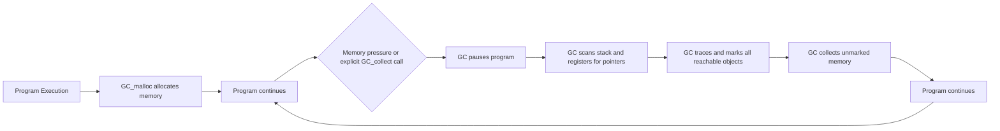

# C++ Garbage Collection

## Introduction

In many modern programming languages like Java, Python, and JavaScript, you don't need to explicitly free memory when you're done using it. The runtime environment automatically identifies and reclaims memory that is no longer in use through a process called **garbage collection**. However, C++ traditionally follows a different approach where memory management is manual—the programmer is responsible for allocating and deallocating memory.

This article explores the concept of garbage collection in C++, why C++ doesn't have built-in garbage collection by default, alternative approaches available in the language, and third-party garbage collection solutions for C++ projects.

## What is Garbage Collection?

Garbage collection is an automatic memory management strategy that:

1. Identifies memory that's no longer in use (garbage)
2. Reclaims that memory to be reused elsewhere in the program

The primary benefit is that programmers don't need to explicitly free memory, which helps prevent memory leaks and other memory-related bugs.

## Why C++ Doesn't Have Built-in Garbage Collection

C++ was designed with several core principles in mind:

- Performance efficiency
- Predictable resource usage
- "You don't pay for what you don't use"
- Control over memory management

Traditional garbage collection techniques can introduce:

- Unpredictable pauses (when the collector runs)
- Higher memory usage (overhead for tracking allocations)
- Performance costs (CPU time spent on collection)

These characteristics can be problematic for systems programming, embedded systems, game development, and other performance-critical applications where C++ is commonly used.

## Manual Memory Management in C++

In traditional C++, memory is managed manually using `new` and `delete`:

```cpp
// Allocate memory
int* numbers = new int[100];

// Use the memory
for (int i = 0; i < 100; i++) {
    numbers[i] = i;
}

// Process the data
int sum = 0;
for (int i = 0; i < 100; i++) {
    sum += numbers[i];
}
std::cout << "Sum: " << sum << std::endl;

// Free the memory when done
delete[] numbers;

// Output:
// Sum: 4950
```

This approach gives you complete control but requires careful tracking of allocations to prevent memory leaks.

## Modern C++ Memory Management Approaches

Modern C++ offers several memory management techniques that provide many of the benefits of garbage collection without the typical disadvantages.

### 1. RAII (Resource Acquisition Is Initialization)

RAII is a C++ programming technique where resource management is tied to object lifetime.

```cpp
#include <iostream>
#include <fstream>

void processFile(const std::string& filename) {
    // File will automatically close when function exits, 
    // even if an exception occurs
    std::ifstream file(filename);
    
    if (!file) {
        throw std::runtime_error("Could not open file");
    }
    
    // Process file...
    std::string line;
    while (std::getline(file, line)) {
        std::cout << line << std::endl;
    }
    
    // No need to explicitly close the file
}
```

### 2. Smart Pointers

Smart pointers are wrapper classes that manage memory automatically through RAII principles.

#### std::unique_ptr

Provides exclusive ownership of dynamically allocated memory:

```cpp
#include <iostream>
#include <memory>

class Resource {
public:
    Resource() { std::cout << "Resource acquired\n"; }
    ~Resource() { std::cout << "Resource released\n"; }
    void use() { std::cout << "Resource being used\n"; }
};

void useResource() {
    std::unique_ptr<Resource> res = std::make_unique<Resource>();
    res->use();
    // No need to delete - memory will be freed automatically
    // when res goes out of scope
}

int main() {
    std::cout << "Starting program\n";
    useResource();
    std::cout << "Program continues...\n";
    return 0;
}

// Output:
// Starting program
// Resource acquired
// Resource being used
// Resource released
// Program continues...
```

#### std::shared_ptr

Implements reference counting for shared ownership:

```cpp
#include <iostream>
#include <memory>
#include <vector>

class Image {
public:
    Image(const std::string& filename) : name(filename) {
        std::cout << "Loading image: " << name << std::endl;
    }
    
    ~Image() {
        std::cout << "Deleting image: " << name << std::endl;
    }
    
    void display() {
        std::cout << "Displaying " << name << std::endl;
    }
    
private:
    std::string name;
};

int main() {
    std::vector<std::shared_ptr<Image>> gallery;
    
    // Create and store shared_ptr to an Image
    auto img1 = std::make_shared<Image>("sunset.jpg");
    
    // Add to multiple containers
    gallery.push_back(img1);
    
    {
        // Create another reference to the same image
        std::shared_ptr<Image> currentImage = img1;
        currentImage->display();
        
        // currentImage goes out of scope here, but img1 still exists
        // so the Image isn't deleted yet
    }
    
    std::cout << "After inner scope\n";
    
    // More operations...
    gallery.clear();  // Now the reference count reaches zero, Image is deleted
    
    std::cout << "After gallery cleared\n";
    
    return 0;
}

// Output:
// Loading image: sunset.jpg
// Displaying sunset.jpg
// After inner scope
// Deleting image: sunset.jpg
// After gallery cleared
```

#### std::weak_ptr

Holds a non-owning reference to an object managed by a shared_ptr:

```cpp
#include <iostream>
#include <memory>

class Observer;

class Subject {
public:
    void addObserver(std::weak_ptr<Observer> observer) {
        observers.push_back(observer);
    }
    
    void notifyObservers();
    
private:
    std::vector<std::weak_ptr<Observer>> observers;
};

class Observer {
public:
    Observer(int id) : id(id) {}
    
    void notify() {
        std::cout << "Observer " << id << " notified\n";
    }
    
private:
    int id;
};

void Subject::notifyObservers() {
    for (auto it = observers.begin(); it != observers.end();) {
        // Try to get a shared_ptr from the weak_ptr
        if (auto observerPtr = it->lock()) {
            // Observer still exists, notify it
            observerPtr->notify();
            ++it;
        } else {
            // Observer has been destroyed, remove it
            it = observers.erase(it);
        }
    }
}

int main() {
    Subject subject;
    
    // Create some observers with shared ownership
    auto observer1 = std::make_shared<Observer>(1);
    auto observer2 = std::make_shared<Observer>(2);
    
    // Add weak references to the subject
    subject.addObserver(observer1);
    subject.addObserver(observer2);
    
    // Notify all observers
    subject.notifyObservers();
    
    // Remove one observer by letting the shared_ptr go out of scope
    observer1.reset();
    
    // Notify again - only observer 2 should be notified
    subject.notifyObservers();
    
    return 0;
}

// Output:
// Observer 1 notified
// Observer 2 notified
// Observer 2 notified
```

## Third-Party Garbage Collection Libraries for C++

### Boehm-Demers-Weiser Garbage Collector (Boehm GC)

The Boehm GC is a conservative garbage collector that can be used with C and C++ programs.

```cpp
#include <iostream>
#include <gc/gc.h>  // Include the Boehm GC header
#include <gc/gc_cpp.h> // C++ specific interface

// Define a class that uses garbage collection
class GCObject : public gc {
public:
    GCObject(int value) : data(value) {
        std::cout << "Created object with value " << data << std::endl;
    }
    
    ~GCObject() {
        std::cout << "Destructor called for object with value " << data << std::endl;
    }
    
    int getData() const { return data; }

private:
    int data;
};

int main() {
    // Initialize the garbage collector
    GC_INIT();
    
    std::cout << "Creating objects without explicit deletion\n";
    
    // Create objects without worrying about deleting them
    for (int i = 0; i < 5; i++) {
        // GC_NEW creates a new object managed by the garbage collector
        GCObject* obj = new (GC) GCObject(i);
        std::cout << "Created object: " << obj->getData() << std::endl;
    }
    
    std::cout << "Function exiting - objects will be collected when necessary\n";
    
    // Request garbage collection (optional)
    GC_gcollect();
    
    return 0;
}

// Example Output:
// Creating objects without explicit deletion
// Created object with value 0
// Created object: 0
// Created object with value 1
// Created object: 1
// Created object with value 2
// Created object: 2
// Created object with value 3
// Created object: 3
// Created object with value 4
// Created object: 4
// Function exiting - objects will be collected when necessary
// Destructor called for object with value 0
// Destructor called for object with value 1
// Destructor called for object with value 2
// Destructor called for object with value 3
// Destructor called for object with value 4
```

### How the Boehm GC Works

The Boehm garbage collector operates using these principles:

1. It scans memory for potential pointers
2. It marks all objects reachable from these pointers
3. It collects (frees) memory for unmarked objects



## Practical Example: Managing a Resource Pool

Here's an example comparing manual, smart pointer, and garbage collection approaches for managing a pool of resources:

```cpp
#include <iostream>
#include <memory>
#include <vector>
#include <string>

// A resource we need to manage
class DatabaseConnection {
public:
    DatabaseConnection(const std::string& dbName) : dbName(dbName) {
        std::cout << "Opening connection to " << dbName << std::endl;
    }
    
    ~DatabaseConnection() {
        std::cout << "Closing connection to " << dbName << std::endl;
    }
    
    void executeQuery(const std::string& query) {
        std::cout << "Executing on " << dbName << ": " << query << std::endl;
    }
    
private:
    std::string dbName;
};

// Approach 1: Manual memory management
void manualApproach() {
    std::cout << "\n--- Manual Memory Management ---\n";
    
    std::vector<DatabaseConnection*> connections;
    
    // Create connections
    connections.push_back(new DatabaseConnection("UserDB"));
    connections.push_back(new DatabaseConnection("ProductDB"));
    
    // Use connections
    for (auto conn : connections) {
        conn->executeQuery("SELECT * FROM table");
    }
    
    // Must manually clean up
    for (auto conn : connections) {
        delete conn;
    }
}

// Approach 2: Smart pointers
void smartPointerApproach() {
    std::cout << "\n--- Smart Pointer Approach ---\n";
    
    std::vector<std::shared_ptr<DatabaseConnection>> connections;
    
    // Create connections
    connections.push_back(std::make_shared<DatabaseConnection>("UserDB"));
    connections.push_back(std::make_shared<DatabaseConnection>("ProductDB"));
    
    // Use connections
    for (auto conn : connections) {
        conn->executeQuery("SELECT * FROM table");
    }
    
    // Automatic cleanup when vector is cleared or goes out of scope
    std::cout << "Clearing connections vector\n";
    connections.clear();
    std::cout << "Vector cleared, connections deleted\n";
}

int main() {
    manualApproach();
    smartPointerApproach();
    
    return 0;
}

// Output:
// --- Manual Memory Management ---
// Opening connection to UserDB
// Opening connection to ProductDB
// Executing on UserDB: SELECT * FROM table
// Executing on ProductDB: SELECT * FROM table
// Closing connection to UserDB
// Closing connection to ProductDB
//
// --- Smart Pointer Approach ---
// Opening connection to UserDB
// Opening connection to ProductDB
// Executing on UserDB: SELECT * FROM table
// Executing on ProductDB: SELECT * FROM table
// Clearing connections vector
// Closing connection to UserDB
// Closing connection to ProductDB
// Vector cleared, connections deleted
```

## Advantages and Disadvantages of Garbage Collection in C++

### Advantages

1. **Reduces Memory Leaks**: Automatically reclaims memory that is no longer in use
2. **Simplifies Development**: Programmers don't need to track every allocation
3. **Prevents Dangling Pointers**: Objects are only collected when unreachable
4. **Handles Cyclic References**: Some GC systems can handle circular references that reference counting cannot

### Disadvantages

1. **Performance Overhead**: Collection cycles can cause pauses in execution
2. **Memory Overhead**: Tracking allocations requires additional memory
3. **Less Predictable**: Memory release timing is not deterministic
4. **Not Ideal for All Applications**: Real-time systems, embedded systems, and performance-critical applications may suffer

## Best Practices for C++ Memory Management

1. **Prefer RAII**: Use stack-based objects and RAII whenever possible
2. **Use Smart Pointers**: Choose `unique_ptr` for exclusive ownership and `shared_ptr` for shared ownership
3. **Avoid Raw Pointers** that own memory
4. **Be Cautious with Circular References**: Use `weak_ptr` to break reference cycles
5. **Consider Object Pools** for frequently allocated/deallocated objects
6. **Profile Memory Usage**: Use tools like Valgrind, AddressSanitizer, or LeakSanitizer
7. **Isolate External Libraries**: If using a garbage collector like Boehm GC, consider isolating it to specific parts of your codebase

## Summary

While C++ doesn't have built-in garbage collection like Java or C#, it offers several effective memory management approaches:

1. **Manual Memory Management**: Complete control using `new`/`delete`
2. **RAII**: Automatic resource management tied to object lifetimes
3. **Smart Pointers**: Automated memory management with ownership semantics
4. **Third-Party GC Libraries**: Options like Boehm GC for automatic collection

Modern C++ typically favors smart pointers and RAII over traditional garbage collection, as these approaches provide many of the benefits without the performance costs. Choose the appropriate strategy based on your application's requirements for performance, predictability, and development simplicity.

## Additional Resources

- [C++ Core Guidelines for Resource Management](https://isocpp.github.io/CppCoreGuidelines/CppCoreGuidelines#r-resource-management)
- [Boehm-Demers-Weiser Garbage Collector](https://www.hboehm.info/gc/)
- [Smart Pointers in C++ Standard Library](https://en.cppreference.com/w/cpp/memory)
- Book: "Effective Modern C++" by Scott Meyers

## Exercises

1. Modify the "Managing a Resource Pool" example to implement a third version using the Boehm garbage collector.

2. Create a class hierarchy with circular references, then demonstrate how to properly manage them using:
   - Smart pointers (with `weak_ptr`)
   - A garbage collection approach

3. Write a memory leak detector that monitors allocations and deallocations in a C++ program, helping to identify potential memory leaks.

4. Compare the performance of different memory management approaches (manual, smart pointers, Boehm GC) for a task that creates and destroys many objects.

5. Implement a custom pool allocator that efficiently manages memory for fixed-size objects, comparing its performance to standard allocation techniques.