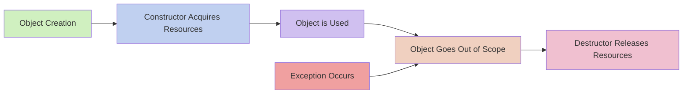

# C++ RAII Pattern

## Introduction

Resource Acquisition Is Initialization (RAII) is one of the most powerful and important idioms in C++. It's a programming technique that ties resource management to object lifetime, ensuring resources are properly acquired and released without explicit cleanup code. This pattern is central to writing safe, exception-resistant C++ code.

In this tutorial, you'll learn:
- What RAII is and why it's important
- How RAII prevents resource leaks
- Implementing RAII in your own classes
- Real-world applications of RAII
- Built-in C++ features that use RAII

## What is RAII?

RAII stands for "Resource Acquisition Is Initialization". The core idea is simple but powerful:

1. Acquire resources in the constructor of an object
2. Use the resources throughout the object's lifetime
3. Release resources in the destructor of the object

When this pattern is followed, resource management happens automatically as objects are created and destroyed, eliminating the need for explicit cleanup code.

### Why is RAII Important?

In languages without automatic garbage collection like C++, managing resources (memory, files, locks, etc.) becomes the programmer's responsibility. Before RAII, resource management typically looked like this:

```cpp
void processFile() {
    FILE* file = fopen("data.txt", "r");
    // Process the file...
    
    // What if an exception occurs here?
    
    fclose(file); // This might never be executed!
}
```

This code has a fundamental problem: if an exception occurs between opening and closing the file, the `fclose()` never executes, resulting in a resource leak.

RAII solves this by binding resource management to object lifetime, which C++ guarantees to manage properly even when exceptions occur.

## RAII in Action

Let's see how RAII transforms the previous example:

```cpp
#include <fstream>
#include <iostream>

void processFile() {
    // std::ifstream uses RAII
    std::ifstream file("data.txt");
    
    if (file.is_open()) {
        // Process the file...
        std::string content;
        file >> content;
        std::cout << "File content: " << content << std::endl;
    }
    
    // No need to close the file! The destructor will do it
    // automatically when the function ends, even if an exception occurs
}

int main() {
    processFile();
    return 0;
}
```

In this example:
- The `std::ifstream` constructor opens the file
- The destructor closes the file automatically when the object goes out of scope
- No explicit cleanup is needed

## Creating Your Own RAII Classes

Let's implement a simple RAII class that manages memory allocation for an array:

```cpp
#include <iostream>

class ArrayResource {
private:
    int* data;
    size_t size;

public:
    // Constructor acquires the resource
    ArrayResource(size_t size) : size(size) {
        std::cout << "Allocating memory for " << size << " integers\n";
        data = new int[size];
    }
    
    // Destructor releases the resource
    ~ArrayResource() {
        std::cout << "Freeing memory\n";
        delete[] data;
    }
    
    // Methods to use the resource
    void setValue(size_t index, int value) {
        if (index < size) {
            data[index] = value;
        }
    }
    
    int getValue(size_t index) const {
        return (index < size) ? data[index] : -1;
    }
    
    // Prevent copying to avoid double deletion
    ArrayResource(const ArrayResource&) = delete;
    ArrayResource& operator=(const ArrayResource&) = delete;
};

void useArray() {
    ArrayResource arr(5);
    
    // Use the array
    for (int i = 0; i < 5; i++) {
        arr.setValue(i, i * 10);
    }
    
    std::cout << "arr[3] = " << arr.getValue(3) << std::endl;
    
    // No need to manually free memory
    // The destructor will be called automatically
}

int main() {
    useArray();
    std::cout << "Function completed\n";
    return 0;
}
```

**Output:**
```
Allocating memory for 5 integers
arr[3] = 30
Freeing memory
Function completed
```

### Key Points to Remember When Creating RAII Classes:

1. **Acquire resources in the constructor**: Always initialize resources when the object is created
2. **Release resources in the destructor**: Clean up everything in the destructor
3. **Handle copying carefully**: Prevent copying or implement deep copies to avoid double-free issues
4. **Make destructors noexcept**: Destructors should not throw exceptions

## RAII with Smart Pointers

Modern C++ provides smart pointers that implement RAII for dynamic memory management:

```cpp
#include <iostream>
#include <memory>

class Resource {
public:
    Resource() {
        std::cout << "Resource acquired\n";
    }
    
    ~Resource() {
        std::cout << "Resource released\n";
    }
    
    void use() {
        std::cout << "Resource being used\n";
    }
};

void uniquePointerExample() {
    std::cout << "=== Using unique_ptr ===\n";
    
    // Resource acquisition happens here
    std::unique_ptr<Resource> res = std::make_unique<Resource>();
    
    // Use the resource
    res->use();
    
    // No need to delete - happens automatically
}

void sharedPointerExample() {
    std::cout << "\n=== Using shared_ptr ===\n";
    
    // Create a shared_ptr
    std::shared_ptr<Resource> res1 = std::make_shared<Resource>();
    
    {
        // Create another shared_ptr pointing to the same resource
        std::shared_ptr<Resource> res2 = res1;
        std::cout << "Resource reference count: " << res1.use_count() << std::endl;
        
        // res2 goes out of scope here, but the resource isn't destroyed yet
    }
    
    std::cout << "Resource reference count: " << res1.use_count() << std::endl;
    res1->use();
    
    // Resource will be destroyed when reference count reaches 0
}

int main() {
    uniquePointerExample();
    sharedPointerExample();
    std::cout << "\nProgram ending\n";
    return 0;
}
```

**Output:**
```
=== Using unique_ptr ===
Resource acquired
Resource being used
Resource released

=== Using shared_ptr ===
Resource acquired
Resource reference count: 2
Resource reference count: 1
Resource being used
Resource released

Program ending
```

## RAII for Different Resources

RAII isn't just for memory management. It can be used for any resource that needs acquisition and release:

### File Handling

```cpp
#include <fstream>
#include <iostream>
#include <string>

class FileLogger {
private:
    std::ofstream file;

public:
    FileLogger(const std::string& filename) : file(filename, std::ios::app) {
        if (!file) {
            throw std::runtime_error("Could not open log file");
        }
    }
    
    // Destructor closes the file automatically
    ~FileLogger() {
        if (file.is_open()) {
            file << "--- Log session ended ---\n";
        }
    }
    
    void log(const std::string& message) {
        file << message << std::endl;
    }
};

void performTask() {
    try {
        FileLogger logger("application.log");
        logger.log("Starting task");
        
        // Do some work
        logger.log("Task in progress");
        
        // Even if an exception occurs, the file will be properly closed
        logger.log("Task completed");
    }
    catch (const std::exception& e) {
        std::cerr << "Error: " << e.what() << std::endl;
    }
}
```

### Mutex Locking

```cpp
#include <iostream>
#include <mutex>
#include <thread>
#include <vector>

class Counter {
private:
    int count = 0;
    std::mutex mutex;

public:
    void increment() {
        // std::lock_guard is an RAII wrapper for mutex
        std::lock_guard<std::mutex> lock(mutex);
        count++;
        // mutex is automatically released when lock goes out of scope
    }
    
    int getCount() {
        std::lock_guard<std::mutex> lock(mutex);
        return count;
    }
};

void threadFunction(Counter& counter, int iterations) {
    for (int i = 0; i < iterations; i++) {
        counter.increment();
    }
}

int main() {
    Counter counter;
    
    std::vector<std::thread> threads;
    const int numThreads = 5;
    const int iterationsPerThread = 1000;
    
    // Create multiple threads
    for (int i = 0; i < numThreads; i++) {
        threads.push_back(std::thread(threadFunction, std::ref(counter), iterationsPerThread));
    }
    
    // Join all threads
    for (auto& thread : threads) {
        thread.join();
    }
    
    std::cout << "Final count: " << counter.getCount() << std::endl;
    // Should print: Final count: 5000
    
    return 0;
}
```

## Common RAII Classes in the Standard Library

The C++ Standard Library is full of RAII classes:

1. **Smart Pointers**:
   - `std::unique_ptr` - Exclusive ownership
   - `std::shared_ptr` - Shared ownership
   - `std::weak_ptr` - Non-owning reference to a shared_ptr

2. **File Handling**:
   - `std::ifstream` - Input file stream
   - `std::ofstream` - Output file stream
   - `std::fstream` - Input/output file stream

3. **Mutex Wrappers**:
   - `std::lock_guard` - Simple mutex wrapper
   - `std::unique_lock` - Flexible mutex wrapper
   - `std::scoped_lock` - Lock multiple mutexes

4. **Container Classes**:
   - `std::vector`
   - `std::string`
   - and all other STL containers

## RAII Design Pattern Visualization

Here's a conceptual diagram showing how RAII works:



## Best Practices for RAII

1. **Make resource acquisition and release symmetrical**: What you acquire in the constructor, release in the destructor.

2. **Keep RAII classes focused**: Each RAII class should manage a single resource or a cohesive set of resources.

3. **Design for the rule of three/five/zero**: If you need custom destructor, you likely need custom copy/move operations too.

4. **Make destructors noexcept**: Throwing exceptions from destructors leads to undefined behavior.

5. **Prefer standard library RAII classes**: Use standard containers and smart pointers when possible.

6. **Consider move semantics**: For better performance, implement move constructors and assignment operators for transferring resource ownership.

## Pitfalls to Avoid

1. **Circular references with shared_ptr**: Can cause memory leaks. Use weak_ptr to break cycles.

2. **Forgetting to disable copying**: If copying isn't appropriate, delete the copy constructor and assignment operator.

3. **Resource leaks in constructors**: If a constructor throws after acquiring some resources but before completion, make sure earlier acquisitions are properly released.

4. **Managing raw pointers**: Raw pointers don't automatically clean up their resources.

```cpp
// BAD: Potential memory leak
void bad() {
    MyClass* ptr = new MyClass();
    // If an exception occurs here, memory leaks
    delete ptr;
}

// GOOD: RAII handles cleanup automatically
void good() {
    std::unique_ptr<MyClass> ptr = std::make_unique<MyClass>();
    // Safe against exceptions
}
```

## Summary

The RAII pattern is a cornerstone of modern C++ programming that ensures resources are properly managed by tying them to object lifetimes. By using RAII:

- Resources are automatically released when they're no longer needed
- Code becomes exception-safe
- Resource leaks are prevented
- Code becomes cleaner and more maintainable

RAII is not just a technique but a mindset for C++ programming. Once you start thinking in terms of RAII, your code naturally becomes more robust and safe.

## Exercises

1. Create an RAII wrapper for a dynamically allocated 2D array.

2. Implement a simple `ConnectionPool` class that uses RAII to manage database connections.

3. Modify the following code to use RAII principles:
   ```cpp
   void processData() {
       int* data = new int[100];
       // Process data
       if (error_condition) {
           delete[] data;
           return;
       }
       // More processing
       delete[] data;
   }
   ```

4. Create an RAII wrapper for a system resource like a socket or a file descriptor.

5. Implement a thread-safe counter using RAII locks.

## Additional Resources

- [CppCoreGuidelines - R: Resource Management](https://isocpp.github.io/CppCoreGuidelines/CppCoreGuidelines#r-resource-management)
- Book: "Effective Modern C++" by Scott Meyers (especially Item 17)
- Book: "C++ Concurrency in Action" by Anthony Williams
- [Standard Library Headers and RAII Classes](https://en.cppreference.com/w/cpp/header)
- [Rule of Three/Five/Zero](https://en.cppreference.com/w/cpp/language/rule_of_three)

By understanding and applying RAII, you're adopting one of C++'s most powerful features for creating robust and leak-free code.