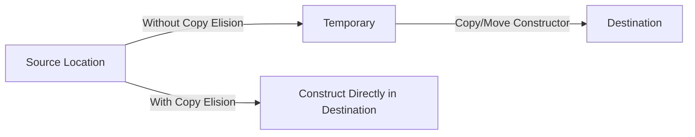

# C++ Copy Elision

## Introduction

When learning C++, you might have heard that the language can be less efficient due to object copying. However, modern C++ compilers are quite smart and employ various optimization techniques to avoid unnecessary copying. One such powerful optimization is **copy elision**.

Copy elision is a compiler optimization technique that eliminates unnecessary copying or moving of objects. This optimization is special because the C++ standard explicitly permits the compiler to skip calling copy and move constructors, even if these constructors have side effects.

In this article, we'll explore how copy elision works, its different forms, and how it can significantly improve your C++ program's performance.

## Understanding Copy Elision

### What is Copy Elision?

Copy elision is an optimization where the compiler eliminates unnecessary copy or move operations when an object is copied from one location to another. This is particularly useful when returning objects from functions or initializing objects with temporary values.

Before diving into specific examples, let's understand a common situation where copying might occur:

```cpp
class MyClass {
public:
    MyClass() {
        std::cout << "Constructor called\n";
    }
    
    MyClass(const MyClass& other) {
        std::cout << "Copy constructor called\n";
    }
    
    ~MyClass() {
        std::cout << "Destructor called\n";
    }
};

MyClass createObject() {
    return MyClass(); // Without copy elision, this would create a temporary and then copy it
}

int main() {
    MyClass obj = createObject(); // Without copy elision, another copy would happen here
    return 0;
}
```

**Without copy elision**, this code might produce:
```
Constructor called       // Temporary object in createObject
Copy constructor called  // Copy from temporary to return value
Destructor called        // Destroy temporary
Copy constructor called  // Copy from return value to obj
Destructor called        // Destroy return value
Destructor called        // Destroy obj at end of main
```

**With copy elision**, the output is much simpler:
```
Constructor called       // Direct construction of obj
Destructor called        // Destroy obj at end of main
```

That's much more efficient!

## Types of Copy Elision

### 1. Return Value Optimization (RVO)

RVO is the most common form of copy elision. It occurs when a function returns a local variable by value.

```cpp
MyClass createWithRVO() {
    MyClass local;
    return local; // RVO can happen here
}

int main() {
    MyClass obj = createWithRVO();
    return 0;
}
```

**Expected output with RVO:**
```
Constructor called
Destructor called
```

### 2. Named Return Value Optimization (NRVO)

NRVO is similar to RVO but applies specifically to named local variables that are returned.

```cpp
MyClass createWithNRVO() {
    MyClass local;
    // Some operations with local
    return local; // NRVO can happen here
}

int main() {
    MyClass obj = createWithNRVO();
    return 0;
}
```

**Expected output with NRVO:**
```
Constructor called
Destructor called
```

### 3. Temporary Object Elision

This happens when a temporary object is used to initialize another object.

```cpp
int main() {
    MyClass obj = MyClass(); // Copy from temporary can be elided
    return 0;
}
```

**Expected output with temporary elision:**
```
Constructor called
Destructor called
```

### 4. Elision in Exceptions

Copy elision can also occur when throwing and catching exceptions:

```cpp
void foo() {
    try {
        throw MyClass(); // Copy elision can happen here
    } catch (const MyClass& ex) {
        // Handle exception
    }
}
```

## Guaranteed Copy Elision (C++17)

In C++17, certain forms of copy elision became guaranteed by the standard. This means that in some cases, copy/move constructors don't even need to be available (they can be deleted or private).

```cpp
class NonCopyable {
public:
    NonCopyable() { std::cout << "Constructor called\n"; }
    ~NonCopyable() { std::cout << "Destructor called\n"; }
    
    // Delete copy and move operations
    NonCopyable(const NonCopyable&) = delete;
    NonCopyable& operator=(const NonCopyable&) = delete;
    NonCopyable(NonCopyable&&) = delete;
    NonCopyable& operator=(NonCopyable&&) = delete;
};

// This works in C++17 even though NonCopyable cannot be copied or moved
NonCopyable createNonCopyable() {
    return NonCopyable();
}

int main() {
    NonCopyable obj = createNonCopyable();
    return 0;
}
```

**Output:**
```
Constructor called
Destructor called
```

## Detecting Copy Elision

You can detect if copy elision is happening in your code by adding print statements to your constructors and destructors:

```cpp
#include <iostream>

class Detector {
public:
    Detector() {
        std::cout << "Constructor called: " << this << std::endl;
    }
    
    Detector(const Detector& other) {
        std::cout << "Copy constructor: from " << &other << " to " << this << std::endl;
    }
    
    Detector(Detector&& other) noexcept {
        std::cout << "Move constructor: from " << &other << " to " << this << std::endl;
    }
    
    ~Detector() {
        std::cout << "Destructor called: " << this << std::endl;
    }
};

Detector createDetector() {
    Detector local;
    return local;
}

int main() {
    std::cout << "Creating detector directly:\n";
    Detector d1;
    
    std::cout << "\nCreating detector from function:\n";
    Detector d2 = createDetector();
    
    return 0;
}
```

With copy elision, you would see the constructor and destructor being called only once for `d2`, and the address would be the same in both calls. Without copy elision, you would see additional constructor/destructor calls.

## Real-World Impact of Copy Elision

### Performance Improvement

Copy elision can significantly improve performance, especially when dealing with large objects. Consider a function that processes and returns a large vector:

```cpp
#include <iostream>
#include <vector>
#include <chrono>

std::vector<int> createLargeVector(size_t size) {
    std::vector<int> result(size, 42);
    return result; // NRVO can happen here
}

int main() {
    constexpr size_t SIZE = 10'000'000;
    
    auto start = std::chrono::high_resolution_clock::now();
    
    std::vector<int> largeVector = createLargeVector(SIZE);
    
    auto end = std::chrono::high_resolution_clock::now();
    auto duration = std::chrono::duration_cast<std::chrono::milliseconds>(end - start).count();
    
    std::cout << "Vector size: " << largeVector.size() << std::endl;
    std::cout << "Operation took " << duration << " ms" << std::endl;
    
    return 0;
}
```

Without copy elision, this would involve copying 10 million integers twice! With copy elision, the vector is constructed directly in its final location.

### Practical Design Consequences

Understanding copy elision can influence how you design your APIs. For example, it's often more efficient to return objects by value rather than using output parameters:

```cpp
// More modern approach, can benefit from copy elision
Result processData(const Data& input) {
    Result result;
    // Process input and fill result
    return result;
}

// Older approach, doesn't benefit from copy elision
void processData(const Data& input, Result& output) {
    // Process input and fill output
}
```

## When Copy Elision Might Not Happen

While modern compilers are very good at performing copy elision, there are cases where it might not happen:

1. When the return statement involves conditional logic with different variables
2. When compiler optimizations are disabled
3. When the code becomes too complex for the compiler to analyze

Here's an example where copy elision might be challenging for the compiler:

```cpp
MyClass createObject(bool condition) {
    MyClass obj1;
    MyClass obj2;
    
    if (condition) {
        return obj1; // Return one local
    } else {
        return obj2; // Return another local
    }
}
```

In this case, the compiler might not be able to optimize away all copies.

## Copy Elision vs. Move Semantics

Copy elision and move semantics are both optimizations, but they work at different levels:

- **Move semantics**: A language feature that allows transferring resources from one object to another instead of copying. It's applied at runtime.
- **Copy elision**: A compiler optimization that can eliminate both copies and moves entirely. It's applied at compile time.

Here's a comparison with a simple string class:

```cpp
#include <iostream>
#include <chrono>
#include <string>

class TrackingString {
    std::string data;
    static int copyCount, moveCount;

public:
    TrackingString(const char* str) : data(str) { 
        std::cout << "Constructor\n"; 
    }
    
    TrackingString(const TrackingString& other) : data(other.data) {
        ++copyCount;
        std::cout << "Copy constructor (total: " << copyCount << ")\n";
    }
    
    TrackingString(TrackingString&& other) noexcept : data(std::move(other.data)) {
        ++moveCount;
        std::cout << "Move constructor (total: " << moveCount << ")\n";
    }
    
    ~TrackingString() = default;
    
    static void resetCounters() { copyCount = moveCount = 0; }
    static void printStats() {
        std::cout << "Total copies: " << copyCount << "\n";
        std::cout << "Total moves: " << moveCount << "\n";
    }
};

int TrackingString::copyCount = 0;
int TrackingString::moveCount = 0;

TrackingString createString() {
    return TrackingString("Hello world!"); // Copy elision can happen here
}

int main() {
    std::cout << "With potential copy elision:\n";
    TrackingString::resetCounters();
    TrackingString s1 = createString();
    TrackingString::printStats();
    
    std::cout << "\nForcing a move:\n";
    TrackingString::resetCounters();
    TrackingString s2 = std::move(createString());  // Move is explicitly requested
    TrackingString::printStats();
    
    return 0;
}
```

**Likely output:**
```
With potential copy elision:
Constructor
Total copies: 0
Total moves: 0

Forcing a move:
Constructor
Move constructor (total: 1)
Total copies: 0
Total moves: 1
```

Notice how in the first case, no copies or moves happened due to copy elision, while in the second case, a move was performed because we explicitly requested it.

## Copy Elision Under the Hood

<div className="text-center">

</div>

Internally, copy elision works by allocating the object directly in its final memory location instead of creating it elsewhere and then copying or moving it. This optimization is possible because the compiler can predict where the object needs to end up.

## Summary

Copy elision is a powerful C++ optimization that can significantly improve the performance of your code by eliminating unnecessary copying and moving of objects. The main types of copy elision include:

1. Return Value Optimization (RVO)
2. Named Return Value Optimization (NRVO)
3. Temporary object elision
4. Elision in exception handling

Since C++17, some forms of copy elision are guaranteed by the standard, making it possible to return non-copyable and non-movable objects from functions by value.

Understanding copy elision can help you write more efficient code, especially when designing APIs that work with large objects. Remember that returning by value is often more efficient than using output parameters, thanks to copy elision.

## Exercises for Practice

1. Write a program that demonstrates RVO by returning a large vector from a function and verify that no copying occurs.
2. Create a class that cannot be copied or moved, and demonstrate that it can still be returned by value from a function in C++17.
3. Compare the performance of a function that returns a large object by value versus a function that fills an output parameter.
4. Experiment with different optimization levels in your compiler to see when copy elision is applied.
5. Write a complex function where copy elision might not occur and verify this by adding print statements to constructors and destructors.

## Additional Resources

- [C++ Standard: Copy Elision](https://en.cppreference.com/w/cpp/language/copy_elision)
- [Effective Modern C++ by Scott Meyers](https://www.oreilly.com/library/view/effective-modern-c/9781491908419/)
- [C++ Core Guidelines: F.45: Don't return a T&&](https://isocpp.github.io/CppCoreGuidelines/CppCoreGuidelines#f45-dont-return-t)
- [CppCon 2016: Arthur O'Dwyer "Template Normal Programming"](https://www.youtube.com/watch?v=vwrXHznaYLA)

Happy coding!