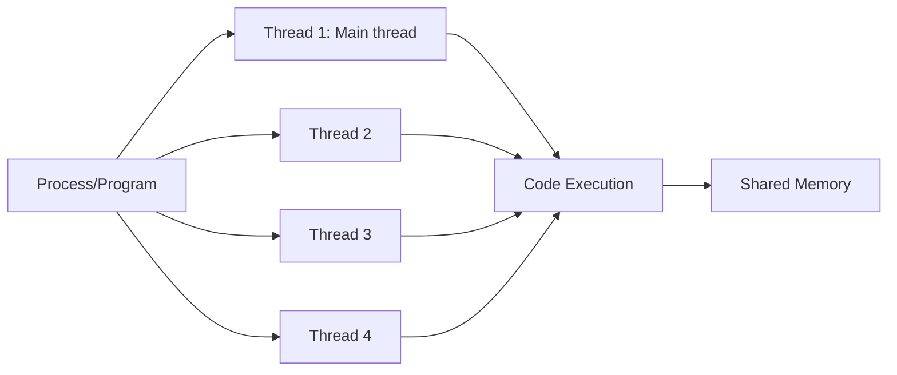

# C++ Thread Creation

## Introduction

Modern computers have processors with multiple cores, allowing them to execute multiple tasks simultaneously. **Multithreading** is a programming technique that lets us take advantage of these multiple cores by dividing our program into smaller tasks (threads) that can run concurrently.

In this tutorial, we'll explore how to create threads in C++ using the standard library introduced in C++11. By the end, you'll understand:

- What threads are and why they're useful
- How to create threads in C++
- Different ways to pass arguments to threads
- How to wait for threads to complete
- Common pitfalls and how to avoid them

## What is a Thread?

A thread is the smallest unit of execution within a process. A process (your program) can have multiple threads running concurrently, sharing the same memory space but executing independently.

Think of threads like workers in a restaurant:
- A single-threaded program is like having one chef doing everything
- A multi-threaded program is like having several chefs working simultaneously on different parts of the meal



## Basic Thread Creation

To create threads in C++, we need to include the `<thread>` header, introduced in C++11.

### A Simple Thread Example

Here's the simplest example of creating a thread:

```cpp
#include <iostream>
#include <thread>

void hello() {
    std::cout << "Hello from thread!" << std::endl;
}

int main() {
    std::cout << "Hello from main thread!" << std::endl;
    
    // Create a new thread that will execute the hello function
    std::thread t(hello);
    
    // Wait for the thread to finish
    t.join();
    
    std::cout << "Thread finished!" << std::endl;
    return 0;
}
```

**Output:**
```
Hello from main thread!
Hello from thread!
Thread finished!
```

### Let's break down what's happening:

1. We define a function `hello()` that will be executed in a separate thread
2. In `main()`, we create a `std::thread` object named `t`, passing the function `hello` as an argument
3. The thread starts executing immediately after creation
4. We call `t.join()` to wait for the thread to finish its execution
5. After the thread completes, the program continues and prints "Thread finished!"

## Creating Multiple Threads

Let's extend our example to create multiple threads:

```cpp
#include <iostream>
#include <thread>
#include <vector>

void threadFunction(int threadId) {
    std::cout << "Thread " << threadId << " is running" << std::endl;
}

int main() {
    const int numThreads = 5;
    std::vector<std::thread> threads;
    
    // Create multiple threads
    for (int i = 0; i < numThreads; i++) {
        threads.push_back(std::thread(threadFunction, i));
    }
    
    std::cout << "Created " << numThreads << " threads..." << std::endl;
    
    // Wait for all threads to finish
    for (auto& t : threads) {
        t.join();
    }
    
    std::cout << "All threads completed!" << std::endl;
    return 0;
}
```

**Output (may vary due to thread scheduling):**
```
Created 5 threads...
Thread 0 is running
Thread 2 is running
Thread 1 is running
Thread 3 is running
Thread 4 is running
All threads completed!
```

Notice that the threads may not execute in order! The operating system's scheduler determines when each thread runs.

## Passing Arguments to Threads

You can pass arguments to thread functions in several ways:

### 1. Passing Simple Arguments

```cpp
#include <iostream>
#include <thread>
#include <string>

void greet(std::string name, int age) {
    std::cout << "Hello, " << name << "! You are " << age << " years old." << std::endl;
}

int main() {
    // Pass arguments to the thread function
    std::thread t(greet, "Alice", 25);
    t.join();
    
    return 0;
}
```

**Output:**
```
Hello, Alice! You are 25 years old.
```

### 2. Using Lambda Functions

Lambda functions provide a convenient way to create threads with access to local variables:

```cpp
#include <iostream>
#include <thread>
#include <string>

int main() {
    std::string username = "Bob";
    int userAge = 30;
    
    // Using a lambda function
    std::thread t([username, userAge]() {
        std::cout << "Hello, " << username << "! You are " << userAge << " years old." << std::endl;
    });
    
    t.join();
    return 0;
}
```

**Output:**
```
Hello, Bob! You are 30 years old.
```

### 3. Using Member Functions

You can also use member functions of classes as thread functions:

```cpp
#include <iostream>
#include <thread>
#include <string>

class Greeter {
public:
    void sayHello(std::string name) {
        std::cout << "Hello, " << name << " from a class method!" << std::endl;
    }
};

int main() {
    Greeter greeter;
    
    // Create a thread with a member function
    // Note: first argument is the member function, 
    // second is the object instance,
    // remaining arguments are passed to the function
    std::thread t(&Greeter::sayHello, &greeter, "Charlie");
    
    t.join();
    return 0;
}
```

**Output:**
```
Hello, Charlie from a class method!
```

## Thread Management

### Joining vs Detaching Threads

There are two primary ways to handle thread termination:

1. **Joining a thread** (`t.join()`) - Makes the calling thread wait until thread `t` completes execution.
2. **Detaching a thread** (`t.detach()`) - Separates the thread from the thread object, letting it run independently.

```cpp
#include <iostream>
#include <thread>
#include <chrono>

void backgroundTask() {
    std::cout << "Background task starting..." << std::endl;
    std::this_thread::sleep_for(std::chrono::seconds(2));
    std::cout << "Background task completed!" << std::endl;
}

int main() {
    // Example with join
    std::cout << "Creating a joined thread..." << std::endl;
    std::thread joinedThread(backgroundTask);
    std::cout << "Waiting for joined thread to finish..." << std::endl;
    joinedThread.join(); // Wait for thread to finish
    std::cout << "Joined thread has completed." << std::endl;
    
    // Example with detach
    std::cout << "\nCreating a detached thread..." << std::endl;
    std::thread detachedThread(backgroundTask);
    detachedThread.detach(); // Don't wait - let it run independently
    std::cout << "Main thread continues without waiting..." << std::endl;
    
    // Sleep to give the detached thread time to run
    // (In a real program, you'd use proper synchronization instead)
    std::this_thread::sleep_for(std::chrono::seconds(3));
    
    return 0;
}
```

**Output:**
```
Creating a joined thread...
Waiting for joined thread to finish...
Background task starting...
Background task completed!
Joined thread has completed.

Creating a detached thread...
Main thread continues without waiting...
Background task starting...
Background task completed!
```

### Important Rules for Thread Management

1. **Always call either join() or detach()**  
   If you don't call either `join()` or `detach()` on a thread before it's destroyed, the program will terminate (via `std::terminate()`).

2. **Check if a thread is joinable**  
   Always check if a thread is joinable before calling `join()` or `detach()`:

```cpp
if (t.joinable()) {
    t.join();
}
```

## Getting Thread Information

### Thread IDs

Each thread has a unique identifier that can be accessed using `get_id()`:

```cpp
#include <iostream>
#include <thread>
#include <sstream>

void threadFunction() {
    std::thread::id threadId = std::this_thread::get_id();
    std::stringstream ss;
    ss << threadId;
    std::cout << "Thread function running in thread " << ss.str() << std::endl;
}

int main() {
    std::thread::id mainThreadId = std::this_thread::get_id();
    std::stringstream ss;
    ss << mainThreadId;
    std::cout << "Main thread id: " << ss.str() << std::endl;
    
    std::thread t(threadFunction);
    
    std::cout << "Thread created with id: " << t.get_id() << std::endl;
    
    t.join();
    return 0;
}
```

**Output (actual IDs will vary):**
```
Main thread id: 1
Thread created with id: 2
Thread function running in thread 2
```

### Getting the Number of Available Threads

You can query the hardware to find out how many concurrent threads are supported:

```cpp
#include <iostream>
#include <thread>

int main() {
    unsigned int numThreads = std::thread::hardware_concurrency();
    std::cout << "This system can run " 
              << numThreads 
              << " concurrent threads" << std::endl;
    return 0;
}
```

**Output (will vary by system):**
```
This system can run 8 concurrent threads
```

## Real-World Example: Parallel Image Processing

Let's create a simplified example of processing an image in parallel by dividing it into chunks that are processed by different threads:

```cpp
#include <iostream>
#include <thread>
#include <vector>
#include <chrono>

// Simulated image processing function
void processImageChunk(int chunkId, int startRow, int endRow) {
    std::cout << "Processing chunk " << chunkId << " (rows " 
              << startRow << " to " << endRow << ")" << std::endl;
    
    // Simulate processing time (more complex in real applications)
    std::this_thread::sleep_for(std::chrono::milliseconds(200));
    
    std::cout << "Finished chunk " << chunkId << std::endl;
}

int main() {
    // Image properties
    const int imageHeight = 800;
    const int imageWidth = 600;
    
    // Determine available hardware threads
    unsigned int numThreads = std::thread::hardware_concurrency();
    // Use at least 1 thread, but no more than needed
    numThreads = std::max(1u, std::min(numThreads, 8u));
    
    std::cout << "Processing image of " << imageWidth << "x" << imageHeight 
              << " pixels using " << numThreads << " threads" << std::endl;
    
    // Calculate rows per thread (simple even division)
    int rowsPerThread = imageHeight / numThreads;
    
    // Create and start threads
    std::vector<std::thread> threads;
    
    auto startTime = std::chrono::high_resolution_clock::now();
    
    for (unsigned int i = 0; i < numThreads; i++) {
        int startRow = i * rowsPerThread;
        int endRow = (i == numThreads - 1) ? imageHeight : (i + 1) * rowsPerThread;
        
        threads.push_back(std::thread(processImageChunk, i, startRow, endRow));
    }
    
    // Wait for all threads to complete
    for (auto& t : threads) {
        t.join();
    }
    
    auto endTime = std::chrono::high_resolution_clock::now();
    auto duration = std::chrono::duration_cast<std::chrono::milliseconds>(endTime - startTime);
    
    std::cout << "Image processing completed in " << duration.count() 
              << " milliseconds" << std::endl;
    
    return 0;
}
```

**Output (with 4 threads):**
```
Processing image of 600x800 pixels using 4 threads
Processing chunk 0 (rows 0 to 200)
Processing chunk 1 (rows 200 to 400)
Processing chunk 2 (rows 400 to 600)
Processing chunk 3 (rows 600 to 800)
Finished chunk 0
Finished chunk 1
Finished chunk 2
Finished chunk 3
Image processing completed in 207 milliseconds
```

In a real application, this would perform actual image processing operations (filtering, color adjustments, etc.) on each chunk of the image.

## Common Pitfalls and How to Avoid Them

### 1. Data Races

When multiple threads access the same data without proper synchronization, you can get unpredictable results:

```cpp
#include <iostream>
#include <thread>
#include <vector>

// This function has a data race problem
void unsafeCounter() {
    static int counter = 0;
    
    // Each thread increments the counter 100,000 times
    for (int i = 0; i < 100000; i++) {
        counter++; // PROBLEM: Multiple threads accessing this without synchronization
    }
    
    std::cout << "Counter value: " << counter << std::endl;
}

int main() {
    std::vector<std::thread> threads;
    
    // Create 10 threads that will all increment the counter
    for (int i = 0; i < 10; i++) {
        threads.push_back(std::thread(unsafeCounter));
    }
    
    // Wait for all threads to finish
    for (auto& t : threads) {
        t.join();
    }
    
    return 0;
}
```

**Output (will vary and be inconsistent):**
```
Counter value: 347891
Counter value: 428713
Counter value: 509872
Counter value: 611238
Counter value: 712502
Counter value: 800129
Counter value: 889702
Counter value: 921856
Counter value: 989512
Counter value: 1000000
```

The expected final value is 1,000,000, but due to the data race, we usually get less.

To fix this, we need to use proper synchronization mechanisms which we'll cover in other tutorials.

### 2. Forgetting to Join or Detach Threads

If you forget to call `join()` or `detach()` on a thread that's still joinable when its destructor is called, your program will terminate:

```cpp
#include <iostream>
#include <thread>

void simpleTask() {
    std::cout << "Doing work..." << std::endl;
}

void badFunction() {
    // Create a thread
    std::thread t(simpleTask);
    
    // Oops! We forgot to join or detach the thread!
    // When this function returns, t's destructor will call std::terminate()
}

int main() {
    try {
        badFunction();
    } catch(...) {
        std::cout << "Caught exception" << std::endl;
    }
    
    return 0;
}
```

**Output (program crashes):**
```
Doing work...
terminate called after throwing an instance of 'std::system_error'
  what():  Resource deadlock avoided
Aborted
```

Always make sure to join or detach your threads before they go out of scope!

## Summary

In this tutorial, you've learned:

- How to create threads using `std::thread` in C++
- Different ways to pass arguments to thread functions
- How to join and detach threads
- How to get thread information like thread IDs
- A practical example of parallel image processing
- Common pitfalls to avoid when working with threads

Threads are a powerful tool for improving the performance of your applications, especially on modern multi-core processors. However, they also introduce complexities in terms of synchronization and data sharing, which we'll cover in subsequent tutorials.

## Exercises

1. Create a program that spawns 5 threads, each printing their thread ID and a unique message.
2. Write a function that uses threads to calculate the sum of a large array by dividing it into chunks.
3. Modify the image processing example to measure the speedup when using different numbers of threads.
4. Create a thread class that automatically joins in its destructor to prevent the "forgetting to join" problem.
5. Experiment with the unsafe counter example and try to figure out ways to fix it.

## Additional Resources

- [C++ Reference for std::thread](https://en.cppreference.com/w/cpp/thread/thread)
- Book: "C++ Concurrency in Action" by Anthony Williams
- Book: "Effective Modern C++" by Scott Meyers (Item 37: Make `std::threads` unjoinable on all paths)
- [C++ Core Guidelines: Concurrency](https://isocpp.github.io/CppCoreGuidelines/CppCoreGuidelines#S-concurrency)

In the next tutorial, we'll explore thread synchronization mechanisms like mutexes, locks, and condition variables to properly handle shared data between threads.