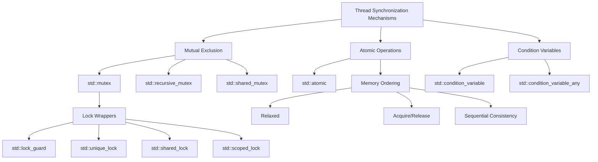

# C++ Thread Synchronization

## Introduction

When working with multiple threads in C++, one of the biggest challenges is ensuring that threads cooperate correctly without interfering with each other. This is where **thread synchronization** comes into play.

Thread synchronization refers to the mechanisms that coordinate the execution of multiple threads to prevent issues like:

- **Race conditions**: When two or more threads access shared data and try to modify it simultaneously
- **Deadlocks**: When two or more threads are blocked forever, waiting for each other
- **Data inconsistency**: When shared data becomes corrupted due to concurrent modifications

In this tutorial, we'll explore various C++ synchronization techniques that help us write safe and efficient multithreaded programs.

## Why Thread Synchronization is Necessary

To understand why synchronization is necessary, let's first look at a simple example of what happens when we don't synchronize threads:

```cpp
#include <iostream>
#include <thread>
#include <vector>

int counter = 0;

void increment_counter() {
    for (int i = 0; i < 100000; ++i) {
        counter++; // This is a non-atomic operation!
    }
}

int main() {
    std::vector<std::thread> threads;
    
    // Create 10 threads
    for (int i = 0; i < 10; ++i) {
        threads.push_back(std::thread(increment_counter));
    }
    
    // Wait for all threads to complete
    for (auto& t : threads) {
        t.join();
    }
    
    std::cout << "Expected value: " << 10 * 100000 << std::endl;
    std::cout << "Actual value: " << counter << std::endl;
    
    return 0;
}
```

**Output:**
```
Expected value: 1000000
Actual value: 423571  // This value may vary in each run
```

Why didn't we get the expected value? The reason is a **race condition**. When multiple threads try to increment `counter`, they might:
1. Read the current value
2. Increment it
3. Write the new value back

If two threads read the same value before either has a chance to write back, one of the increments gets lost.

## Basic Synchronization with Mutexes

A **mutex** (mutual exclusion) is the most basic synchronization primitive. It's like a lock that only one thread can hold at a time.

```cpp
#include <iostream>
#include <thread>
#include <vector>
#include <mutex>

int counter = 0;
std::mutex counter_mutex; // Mutex to protect the counter

void increment_counter() {
    for (int i = 0; i < 100000; ++i) {
        counter_mutex.lock();   // Acquire the lock
        counter++;              // Critical section
        counter_mutex.unlock(); // Release the lock
    }
}

int main() {
    std::vector<std::thread> threads;
    
    // Create 10 threads
    for (int i = 0; i < 10; ++i) {
        threads.push_back(std::thread(increment_counter));
    }
    
    // Wait for all threads to complete
    for (auto& t : threads) {
        t.join();
    }
    
    std::cout << "Expected value: " << 10 * 100000 << std::endl;
    std::cout << "Actual value: " << counter << std::endl;
    
    return 0;
}
```

**Output:**
```
Expected value: 1000000
Actual value: 1000000
```

Now we get the correct result! The mutex ensures that only one thread can modify the counter at a time.

### Using RAII with std::lock_guard

Manually calling `lock()` and `unlock()` can be error-prone. If we forget to unlock or an exception occurs between the lock and unlock, we might end up with a deadlock. C++ provides RAII wrappers to handle this automatically:

```cpp
void increment_counter_safe() {
    for (int i = 0; i < 100000; ++i) {
        std::lock_guard<std::mutex> lock(counter_mutex); // Automatically unlocks when out of scope
        counter++;
    }
}
```

## More Advanced Locking Mechanisms

### std::unique_lock

`std::unique_lock` provides more flexibility than `std::lock_guard`:

```cpp
#include <mutex>
#include <thread>
#include <iostream>

std::mutex mtx;
int shared_data = 0;

void process_data() {
    std::unique_lock<std::mutex> lock(mtx);
    // We can unlock early if needed
    shared_data++;
    
    // Do some calculations that don't need the lock
    lock.unlock();
    
    // Computation that doesn't need the lock
    int local_result = 42;
    
    // Lock again to update shared data
    lock.lock();
    shared_data += local_result;
}

int main() {
    std::thread t1(process_data);
    std::thread t2(process_data);
    
    t1.join();
    t2.join();
    
    std::cout << "Final value: " << shared_data << std::endl;
    return 0;
}
```

### std::shared_lock and std::shared_mutex (C++17)

For scenarios where you have many readers but few writers, a `std::shared_mutex` can improve performance:

```cpp
#include <shared_mutex>
#include <thread>
#include <iostream>
#include <vector>
#include <string>

class ThreadSafeCounter {
private:
    mutable std::shared_mutex mutex_;
    int value_ = 0;

public:
    // Multiple threads can read the counter's value at the same time
    int get() const {
        std::shared_lock<std::shared_mutex> lock(mutex_);
        return value_;
    }

    // Only one thread can increment the counter at a time
    void increment() {
        std::unique_lock<std::shared_mutex> lock(mutex_);
        value_++;
    }
};

int main() {
    ThreadSafeCounter counter;
    std::vector<std::thread> threads;
    
    // Start 10 reader threads
    for (int i = 0; i < 10; ++i) {
        threads.push_back(std::thread([&counter, i]() {
            for (int j = 0; j < 5; ++j) {
                std::cout << "Thread " << i << " reads: " << counter.get() << std::endl;
                std::this_thread::sleep_for(std::chrono::milliseconds(10));
            }
        }));
    }
    
    // Start 2 writer threads
    for (int i = 0; i < 2; ++i) {
        threads.push_back(std::thread([&counter, i]() {
            for (int j = 0; j < 5; ++j) {
                counter.increment();
                std::cout << "Thread " << i + 10 << " increments counter" << std::endl;
                std::this_thread::sleep_for(std::chrono::milliseconds(50));
            }
        }));
    }
    
    for (auto& t : threads) {
        t.join();
    }
    
    std::cout << "Final counter value: " << counter.get() << std::endl;
    return 0;
}
```

## Condition Variables

Condition variables allow threads to wait until a specific condition is met. They're useful for producer-consumer scenarios:

```cpp
#include <iostream>
#include <thread>
#include <mutex>
#include <condition_variable>
#include <queue>
#include <chrono>

std::queue<int> data_queue;
std::mutex mtx;
std::condition_variable data_cond;
bool done = false;

// Producer thread
void producer() {
    for (int i = 0; i < 10; ++i) {
        {
            std::lock_guard<std::mutex> lock(mtx);
            data_queue.push(i);
            std::cout << "Produced: " << i << std::endl;
        }
        
        // Notify the consumer that data is ready
        data_cond.notify_one();
        
        // Simulate work
        std::this_thread::sleep_for(std::chrono::milliseconds(100));
    }
    
    // Let the consumer know we're done
    {
        std::lock_guard<std::mutex> lock(mtx);
        done = true;
    }
    data_cond.notify_one();
}

// Consumer thread
void consumer() {
    while (true) {
        std::unique_lock<std::mutex> lock(mtx);
        
        // Wait until there's data or we're done
        data_cond.wait(lock, []{ return !data_queue.empty() || done; });
        
        // If queue is empty and we're done, exit
        if (data_queue.empty() && done) {
            break;
        }
        
        // Process data
        int value = data_queue.front();
        data_queue.pop();
        
        std::cout << "Consumed: " << value << std::endl;
        
        // Unlock before processing to allow more data to be added
        lock.unlock();
        
        // Simulate processing
        std::this_thread::sleep_for(std::chrono::milliseconds(200));
    }
}

int main() {
    std::thread prod(producer);
    std::thread cons(consumer);
    
    prod.join();
    cons.join();
    
    return 0;
}
```

**Output:**
```
Produced: 0
Consumed: 0
Produced: 1
Consumed: 1
Produced: 2
Produced: 3
Consumed: 2
Produced: 4
Consumed: 3
Produced: 5
Produced: 6
Consumed: 4
Produced: 7
Consumed: 5
Produced: 8
Consumed: 6
Produced: 9
Consumed: 7
Consumed: 8
Consumed: 9
```

## Atomic Operations

For simple operations, using atomic types can be more efficient than mutexes:

```cpp
#include <iostream>
#include <thread>
#include <vector>
#include <atomic>

std::atomic<int> atomic_counter(0);

void increment_atomic() {
    for (int i = 0; i < 100000; ++i) {
        atomic_counter++; // Atomic increment - no mutex needed!
    }
}

int main() {
    std::vector<std::thread> threads;
    
    // Create 10 threads
    for (int i = 0; i < 10; ++i) {
        threads.push_back(std::thread(increment_atomic));
    }
    
    // Wait for all threads to complete
    for (auto& t : threads) {
        t.join();
    }
    
    std::cout << "Expected value: " << 10 * 100000 << std::endl;
    std::cout << "Actual value: " << atomic_counter << std::endl;
    
    return 0;
}
```

**Output:**
```
Expected value: 1000000
Actual value: 1000000
```

Atomic operations are especially useful for counters, flags, and other simple shared variables.

## Real-World Example: Thread-Safe Logger

Let's implement a thread-safe logger that multiple threads can use simultaneously:

```cpp
#include <iostream>
#include <thread>
#include <mutex>
#include <sstream>
#include <vector>
#include <fstream>
#include <chrono>

class Logger {
private:
    std::mutex mtx;
    std::ofstream file;

public:
    Logger(const std::string& filename) {
        file.open(filename, std::ios::app);
    }

    ~Logger() {
        if (file.is_open()) {
            file.close();
        }
    }

    void log(const std::string& message) {
        // Get current time
        auto now = std::chrono::system_clock::now();
        auto now_time_t = std::chrono::system_clock::to_time_t(now);
        
        std::stringstream ss;
        ss << std::put_time(std::localtime(&now_time_t), "[%Y-%m-%d %H:%M:%S] ");
        ss << "[Thread " << std::this_thread::get_id() << "] " << message << std::endl;
        
        // Lock to prevent interleaved output
        std::lock_guard<std::mutex> lock(mtx);
        file << ss.str();
        file.flush();
        std::cout << ss.str();
    }
};

void worker(Logger& logger, int id) {
    for (int i = 0; i < 5; ++i) {
        std::stringstream msg;
        msg << "Worker " << id << " - Log entry " << i;
        logger.log(msg.str());
        
        // Simulate random work
        std::this_thread::sleep_for(std::chrono::milliseconds(50 + rand() % 100));
    }
}

int main() {
    Logger logger("application.log");
    std::vector<std::thread> threads;
    
    // Create worker threads
    for (int i = 0; i < 5; ++i) {
        threads.push_back(std::thread(worker, std::ref(logger), i));
    }
    
    // Join threads
    for (auto& t : threads) {
        t.join();
    }
    
    logger.log("All workers completed");
    return 0;
}
```

## Thread Synchronization Pitfalls

### Deadlocks

A deadlock occurs when two or more threads are waiting for each other, causing all of them to be stuck. Here's an example:

```cpp
#include <iostream>
#include <thread>
#include <mutex>

std::mutex mutex1, mutex2;

void thread_1() {
    std::cout << "Thread 1 starting..." << std::endl;
    
    // Lock the first mutex
    mutex1.lock();
    std::cout << "Thread 1 locked mutex1" << std::endl;
    
    // Sleep to increase the chance of a deadlock
    std::this_thread::sleep_for(std::chrono::milliseconds(100));
    
    // Try to lock the second mutex
    std::cout << "Thread 1 trying to lock mutex2..." << std::endl;
    mutex2.lock();
    
    // Critical section with both mutexes locked
    std::cout << "Thread 1 locked both mutexes" << std::endl;
    
    // Unlock in reverse order
    mutex2.unlock();
    mutex1.unlock();
}

void thread_2() {
    std::cout << "Thread 2 starting..." << std::endl;
    
    // Lock the second mutex
    mutex2.lock();
    std::cout << "Thread 2 locked mutex2" << std::endl;
    
    // Sleep to increase the chance of a deadlock
    std::this_thread::sleep_for(std::chrono::milliseconds(100));
    
    // Try to lock the first mutex
    std::cout << "Thread 2 trying to lock mutex1..." << std::endl;
    mutex1.lock();
    
    // Critical section with both mutexes locked
    std::cout << "Thread 2 locked both mutexes" << std::endl;
    
    // Unlock in reverse order
    mutex1.unlock();
    mutex2.unlock();
}

int main() {
    std::thread t1(thread_1);
    std::thread t2(thread_2);
    
    t1.join();
    t2.join();
    
    std::cout << "No deadlock occurred!" << std::endl;
    return 0;
}
```

This program will likely deadlock because:
1. Thread 1 locks mutex1 and tries to lock mutex2
2. Thread 2 locks mutex2 and tries to lock mutex1
3. Both threads are now waiting for a mutex that the other thread holds

### Deadlock Prevention with std::lock

We can use `std::lock` to acquire multiple locks atomically, preventing deadlocks:

```cpp
#include <iostream>
#include <thread>
#include <mutex>

std::mutex mutex1, mutex2;

void thread_1_safe() {
    std::cout << "Thread 1 starting..." << std::endl;
    
    // Lock both mutexes safely
    std::lock(mutex1, mutex2);
    
    // These calls are actually not needed for locking (already locked by std::lock)
    // but they're needed to properly associate each mutex with a std::lock_guard
    std::lock_guard<std::mutex> lock1(mutex1, std::adopt_lock);
    std::lock_guard<std::mutex> lock2(mutex2, std::adopt_lock);
    
    std::cout << "Thread 1 locked both mutexes" << std::endl;
    
    // Mutexes automatically unlocked when lock_guards go out of scope
}

void thread_2_safe() {
    std::cout << "Thread 2 starting..." << std::endl;
    
    // Lock both mutexes safely, even in reverse order
    std::lock(mutex1, mutex2);
    
    std::lock_guard<std::mutex> lock2(mutex2, std::adopt_lock);
    std::lock_guard<std::mutex> lock1(mutex1, std::adopt_lock);
    
    std::cout << "Thread 2 locked both mutexes" << std::endl;
    
    // Mutexes automatically unlocked when lock_guards go out of scope
}

int main() {
    std::thread t1(thread_1_safe);
    std::thread t2(thread_2_safe);
    
    t1.join();
    t2.join();
    
    std::cout << "No deadlock occurred!" << std::endl;
    return 0;
}
```

### Using std::scoped_lock (C++17)

In C++17, `std::scoped_lock` provides an even simpler solution:

```cpp
void thread_function() {
    // Acquires both locks atomically (never deadlocks)
    std::scoped_lock lock(mutex1, mutex2);
    
    // Critical section with both mutexes locked
    std::cout << "Thread locked both mutexes" << std::endl;
    
    // Mutexes automatically unlocked when scoped_lock goes out of scope
}
```

## Best Practices for Thread Synchronization

1. **Keep critical sections small**: Lock for as short a time as possible
2. **Use the appropriate synchronization mechanism**:
   - For simple counters and flags, use atomic types
   - For complex data structures, use mutexes
   - For reader/writer scenarios, use shared_mutex
3. **Always use RAII lock wrappers** (std::lock_guard, std::unique_lock) instead of manually calling lock/unlock
4. **Acquire multiple locks in a consistent order** or use std::lock/std::scoped_lock to prevent deadlocks
5. **Be aware of the false sharing problem**: When different threads modify variables that are close in memory
6. **Consider lock-free algorithms** for performance-critical code, but be aware they are complex to implement correctly

## Mermaid Diagram: Thread Synchronization Mechanisms

Here's a visual overview of the synchronization mechanisms we've discussed:



## Summary

Thread synchronization is essential for writing correct multithreaded C++ programs. In this tutorial, we've covered:

1. **Why** thread synchronization is necessary
2. **Mutexes** for mutual exclusion
3. **Lock wrappers** (lock_guard, unique_lock, shared_lock, scoped_lock) for safe locking
4. **Condition variables** for thread coordination
5. **Atomic operations** for simple shared data
6. **Deadlocks** and how to prevent them
7. **Best practices** for effective thread synchronization

By using these techniques, you can write multithreaded C++ programs that are both correct and efficient.

## Exercises

1. Modify the thread-safe counter example to keep track of both a total count and the number of increments performed by each thread.
2. Implement a thread-safe queue class with methods like `push()`, `pop()`, `empty()`, and `size()`.
3. Create a simple thread pool that accepts tasks and executes them using a fixed number of worker threads.
4. Implement a readers-writer lock using only mutex and condition variables (without using std::shared_mutex).
5. Modify the logger example to write to different files based on log severity (info, warning, error).

## Additional Resources

- [C++ Reference: Thread Support Library](https://en.cppreference.com/w/cpp/thread)
- [C++ Core Guidelines on Concurrency](https://isocpp.github.io/CppCoreGuidelines/CppCoreGuidelines#S-concurrency)
- "C++ Concurrency in Action" by Anthony Williams - A comprehensive book on C++ multithreading
- [CppCon Talks on Concurrency](https://www.youtube.com/results?search_query=cppcon+concurrency)

Happy threading!