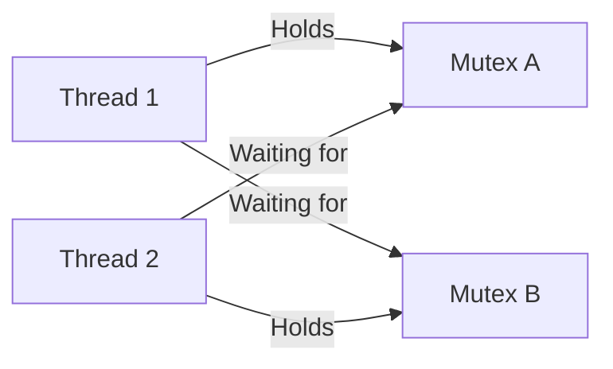

# C++ Mutex

## Introduction

When working with multiple threads in C++, one of the most critical challenges is managing access to shared resources. Imagine two threads trying to update the same variable simultaneously - this can lead to unpredictable results and bugs that are difficult to reproduce and fix. This is where **mutexes** come into play.

A **mutex** (short for "mutual exclusion") is a synchronization primitive that prevents multiple threads from accessing shared resources simultaneously. Think of it as a lock that a thread must acquire before accessing a shared resource, and release afterward. If another thread tries to acquire the lock while it's already held, that thread will wait until the lock becomes available.

In this tutorial, we'll explore:
- What mutexes are and why they're essential
- Different types of mutexes in C++
- How to use mutexes to protect shared resources
- Common patterns and best practices
- Potential pitfalls and how to avoid them

## Understanding Race Conditions

Before diving into mutexes, let's understand the problem they solve. A **race condition** occurs when multiple threads access and modify shared data simultaneously, leading to unpredictable behavior.

Consider this simple example:

```cpp
#include <iostream>
#include <thread>
#include <vector>

int counter = 0;

void incrementCounter() {
    for (int i = 0; i < 100000; ++i) {
        counter++; // This is not thread-safe!
    }
}

int main() {
    std::vector<std::thread> threads;
    
    // Create 10 threads, each incrementing the counter
    for (int i = 0; i < 10; ++i) {
        threads.push_back(std::thread(incrementCounter));
    }
    
    // Wait for all threads to complete
    for (auto& t : threads) {
        t.join();
    }
    
    std::cout << "Final counter value: " << counter << std::endl;
    std::cout << "Expected value: " << 10 * 100000 << std::endl;
    
    return 0;
}
```

**Expected Output:**
```
Final counter value: 437852  (This number will vary between runs)
Expected value: 1000000
```

The actual output will almost certainly be less than 1,000,000, and it will differ each time you run the program. This is because `counter++` is not an atomic operation; it involves reading the value, incrementing it, and writing it back. When multiple threads do this simultaneously, some increments are lost.

## Basic Mutex Usage

Let's fix the race condition using a mutex:

```cpp
#include <iostream>
#include <thread>
#include <vector>
#include <mutex>

int counter = 0;
std::mutex counterMutex; // Declare a mutex

void incrementCounter() {
    for (int i = 0; i < 100000; ++i) {
        // Lock the mutex before accessing the shared resource
        counterMutex.lock();
        counter++;
        // Unlock the mutex after accessing the shared resource
        counterMutex.unlock();
    }
}

int main() {
    std::vector<std::thread> threads;
    
    // Create 10 threads, each incrementing the counter
    for (int i = 0; i < 10; ++i) {
        threads.push_back(std::thread(incrementCounter));
    }
    
    // Wait for all threads to complete
    for (auto& t : threads) {
        t.join();
    }
    
    std::cout << "Final counter value: " << counter << std::endl;
    std::cout << "Expected value: " << 10 * 100000 << std::endl;
    
    return 0;
}
```

**Output:**
```
Final counter value: 1000000
Expected value: 1000000
```

Now the program always produces the correct result! Let's break down how this works:

1. We create a `std::mutex` object called `counterMutex`
2. Before accessing the shared counter, a thread calls `lock()` on the mutex
3. If another thread already has the mutex locked, the calling thread waits until the mutex is unlocked
4. After modifying the counter, the thread calls `unlock()` to release the mutex
5. This ensures that only one thread can modify the counter at any given time

## RAII Lock Guards

Manually calling `lock()` and `unlock()` works, but it's error-prone. If you forget to unlock a mutex or an exception is thrown after locking but before unlocking, the mutex remains locked, potentially causing deadlocks.

C++ provides a safer approach using the RAII (Resource Acquisition Is Initialization) idiom with `std::lock_guard`:

```cpp
#include <iostream>
#include <thread>
#include <vector>
#include <mutex>

int counter = 0;
std::mutex counterMutex;

void incrementCounter() {
    for (int i = 0; i < 100000; ++i) {
        // Create a lock_guard that automatically locks the mutex
        // and unlocks it when the lock_guard goes out of scope
        std::lock_guard<std::mutex> guard(counterMutex);
        counter++;
        // The mutex is automatically unlocked when guard is destroyed
    }
}

int main() {
    std::vector<std::thread> threads;
    
    for (int i = 0; i < 10; ++i) {
        threads.push_back(std::thread(incrementCounter));
    }
    
    for (auto& t : threads) {
        t.join();
    }
    
    std::cout << "Final counter value: " << counter << std::endl;
    std::cout << "Expected value: " << 10 * 100000 << std::endl;
    
    return 0;
}
```

This code has the same output as before, but it's safer because:
- The mutex is automatically unlocked when the `lock_guard` goes out of scope, even if an exception occurs
- You can't forget to unlock the mutex
- The code is cleaner and less error-prone

## Types of Mutexes in C++

C++ offers several types of mutexes for different scenarios:

### 1. `std::mutex`

The basic mutex we've been using so far. It's non-recursive, meaning a thread cannot lock it multiple times without unlocking.

### 2. `std::recursive_mutex`

Allows the same thread to lock the mutex multiple times. The thread must unlock it the same number of times for other threads to be able to acquire it.

```cpp
#include <iostream>
#include <thread>
#include <mutex>

std::recursive_mutex recursiveMutex;

void recursiveFunction(int depth) {
    std::lock_guard<std::recursive_mutex> guard(recursiveMutex);
    std::cout << "Recursion depth: " << depth << std::endl;
    
    if (depth > 0) {
        recursiveFunction(depth - 1); // The same thread can acquire the mutex again
    }
}

int main() {
    std::thread t(recursiveFunction, 5);
    t.join();
    return 0;
}
```

**Output:**
```
Recursion depth: 5
Recursion depth: 4
Recursion depth: 3
Recursion depth: 2
Recursion depth: 1
Recursion depth: 0
```

### 3. `std::timed_mutex`

Extends the basic mutex with the ability to specify a timeout when trying to acquire the lock.

```cpp
#include <iostream>
#include <thread>
#include <mutex>
#include <chrono>

std::timed_mutex timedMutex;

void tryLock(int id) {
    // Try to acquire the lock for 500ms
    if (timedMutex.try_lock_for(std::chrono::milliseconds(500))) {
        std::cout << "Thread " << id << " acquired the lock" << std::endl;
        std::this_thread::sleep_for(std::chrono::seconds(1));
        timedMutex.unlock();
    } else {
        std::cout << "Thread " << id << " couldn't acquire the lock within timeout" << std::endl;
    }
}

int main() {
    std::thread t1(tryLock, 1);
    std::this_thread::sleep_for(std::chrono::milliseconds(100)); // Give t1 time to acquire the lock
    std::thread t2(tryLock, 2);
    
    t1.join();
    t2.join();
    return 0;
}
```

**Possible Output:**
```
Thread 1 acquired the lock
Thread 2 couldn't acquire the lock within timeout
```

### 4. `std::recursive_timed_mutex`

Combines the features of `recursive_mutex` and `timed_mutex`, allowing recursive locking with timeout capabilities.

## Mutex vs. Atomic Operations

For simple counters like in our examples, C++ also provides atomic operations, which can be more efficient:

```cpp
#include <iostream>
#include <thread>
#include <vector>
#include <atomic>

std::atomic<int> counter(0); // Atomic counter

void incrementCounter() {
    for (int i = 0; i < 100000; ++i) {
        counter++; // This is now thread-safe!
    }
}

int main() {
    std::vector<std::thread> threads;
    
    for (int i = 0; i < 10; ++i) {
        threads.push_back(std::thread(incrementCounter));
    }
    
    for (auto& t : threads) {
        t.join();
    }
    
    std::cout << "Final counter value: " << counter << std::endl;
    std::cout << "Expected value: " << 10 * 100000 << std::endl;
    
    return 0;
}
```

**Output:**
```
Final counter value: 1000000
Expected value: 1000000
```

While atomic operations are excellent for simple operations like incrementing a counter, mutexes are necessary for protecting more complex operations or when multiple related variables need to be updated together.

## Real-World Example: Thread-Safe Logger

Here's a more practical example of using mutexes to create a thread-safe logger:

```cpp
#include <iostream>
#include <thread>
#include <mutex>
#include <string>
#include <vector>

class Logger {
private:
    std::mutex logMutex;
    
public:
    void log(const std::string& message) {
        std::lock_guard<std::mutex> guard(logMutex);
        std::cout << "[" << std::this_thread::get_id() << "] " << message << std::endl;
    }
};

void performTask(Logger& logger, int taskId) {
    // Simulate some work
    std::this_thread::sleep_for(std::chrono::milliseconds(taskId * 100));
    
    // Log start
    logger.log("Task " + std::to_string(taskId) + " starting");
    
    // Simulate more work
    std::this_thread::sleep_for(std::chrono::milliseconds(200));
    
    // Log completion
    logger.log("Task " + std::to_string(taskId) + " completed");
}

int main() {
    Logger logger;
    std::vector<std::thread> threads;
    
    // Create 5 tasks
    for (int i = 1; i <= 5; ++i) {
        threads.push_back(std::thread(performTask, std::ref(logger), i));
    }
    
    // Wait for all tasks to complete
    for (auto& t : threads) {
        t.join();
    }
    
    return 0;
}
```

**Possible Output:**
```
[140615725018880] Task 1 starting
[140615725018880] Task 1 completed
[140615716626176] Task 2 starting
[140615716626176] Task 2 completed
[140615708233472] Task 3 starting
[140615708233472] Task 3 completed
[140615699840768] Task 4 starting
[140615699840768] Task 4 completed
[140615691448064] Task 5 starting
[140615691448064] Task 5 completed
```

This logger ensures that log messages from different threads don't get interleaved or corrupted, providing clean, organized output.

## Best Practices for Using Mutexes

1. **Keep Critical Sections Small**: Lock the mutex for as short a time as possible to minimize contention.

2. **Use RAII Lock Guards**: Prefer `std::lock_guard`, `std::unique_lock`, or `std::scoped_lock` (C++17) over manual locking and unlocking.

3. **Avoid Nested Locks**: Be careful with nested locks to prevent deadlocks. If you need to lock multiple mutexes, use `std::lock` or `std::scoped_lock` to lock them all at once.

4. **Be Consistent with Lock Order**: If you must lock multiple mutexes separately, always do it in the same order across all threads.

5. **Consider Lock Granularity**: Sometimes using multiple fine-grained mutexes is better than a single coarse-grained one.

## Common Pitfalls

### Deadlocks

A deadlock occurs when two or more threads are waiting for locks held by each other, resulting in all threads being stuck indefinitely.



To prevent deadlocks, you can use `std::lock` to lock multiple mutexes atomically:

```cpp
#include <iostream>
#include <thread>
#include <mutex>

std::mutex mutexA, mutexB;

void threadFunction1() {
    // Lock both mutexes atomically to prevent deadlock
    std::lock(mutexA, mutexB);
    
    // Adopt the locks into lock_guards for RAII management
    std::lock_guard<std::mutex> guardA(mutexA, std::adopt_lock);
    std::lock_guard<std::mutex> guardB(mutexB, std::adopt_lock);
    
    std::cout << "Thread 1 has both locks" << std::endl;
    std::this_thread::sleep_for(std::chrono::seconds(1));
}

void threadFunction2() {
    // Even though we're trying to lock in the opposite order, std::lock
    // prevents deadlock
    std::lock(mutexB, mutexA);
    
    std::lock_guard<std::mutex> guardB(mutexB, std::adopt_lock);
    std::lock_guard<std::mutex> guardA(mutexA, std::adopt_lock);
    
    std::cout << "Thread 2 has both locks" << std::endl;
    std::this_thread::sleep_for(std::chrono::seconds(1));
}

int main() {
    std::thread t1(threadFunction1);
    std::thread t2(threadFunction2);
    
    t1.join();
    t2.join();
    
    return 0;
}
```

In C++17, you can use `std::scoped_lock` for an even cleaner solution:

```cpp
void threadFunction1() {
    std::scoped_lock lock(mutexA, mutexB); // Locks both mutexes
    std::cout << "Thread 1 has both locks" << std::endl;
    std::this_thread::sleep_for(std::chrono::seconds(1));
}

void threadFunction2() {
    std::scoped_lock lock(mutexB, mutexA); // Order doesn't matter!
    std::cout << "Thread 2 has both locks" << std::endl;
    std::this_thread::sleep_for(std::chrono::seconds(1));
}
```

### Priority Inversion

This occurs when a high-priority thread is waiting for a lock held by a low-priority thread, which itself is preempted by a medium-priority thread. This effectively gives the medium-priority thread precedence over the high-priority thread.

### Lock Contention

When many threads compete for the same lock, performance can suffer significantly. Consider using more fine-grained locks or exploring lock-free data structures for high-contention scenarios.

## Summary

Mutexes are essential tools for thread synchronization in C++ multithreaded programs. They help prevent race conditions by ensuring that only one thread can access a shared resource at a time. Key points to remember:

- Use mutexes to protect shared resources from concurrent access
- Prefer RAII lock guards over manual locking/unlocking
- Keep critical sections as small as possible
- Be aware of potential deadlocks and use appropriate techniques to prevent them
- Choose the right type of mutex for your specific needs

By understanding and properly using mutexes, you can write robust, efficient, and correct multithreaded C++ programs.

## Exercises

1. Implement a thread-safe counter class that provides increment, decrement, and get operations.
2. Create a thread-safe queue that allows multiple producer threads and multiple consumer threads.
3. Modify the thread-safe logger to write to a file instead of the console.
4. Implement a reader-writer lock that allows multiple readers but only one writer.
5. Create a program that demonstrates and resolves a deadlock situation.

## Additional Resources

- [C++ Reference: Mutex](https://en.cppreference.com/w/cpp/thread/mutex)
- [C++ Reference: Lock Guard](https://en.cppreference.com/w/cpp/thread/lock_guard)
- Book: "C++ Concurrency in Action" by Anthony Williams
- Book: "Effective Modern C++" by Scott Meyers (Item 39: Consider void futures for one-shot event communication)
- [CppCon Talks on Concurrency](https://www.youtube.com/results?search_query=cppcon+concurrency)

Happy multithreaded programming!