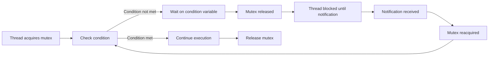

# C++ Condition Variables

## Introduction

When working with multithreaded applications in C++, we often need mechanisms to synchronize threads based on certain conditions. **Condition variables** are synchronization primitives that enable threads to wait until a particular condition occurs. They are especially useful when one thread needs to signal other waiting threads about a state change.

Condition variables work in conjunction with mutexes to provide a way for threads to atomically release a mutex and enter a wait state until they are notified by another thread. This mechanism helps solve producer-consumer problems, implement thread-safe queues, and handle various synchronization scenarios.

In this tutorial, we'll explore:
- What condition variables are and why they're needed
- How to use `std::condition_variable` in C++
- Common patterns for condition variables
- Practical examples for real-world applications

## Basic Concepts

### What is a Condition Variable?

A condition variable is a synchronization primitive that allows threads to wait until a specific condition occurs. Threads that are waiting on a condition variable are blocked until another thread notifies them.

In C++, condition variables are part of the standard library since C++11 and are defined in the `<condition_variable>` header.

### Key Components

1. **`std::condition_variable`**: The primary condition variable class
2. **`std::mutex`**: Used in conjunction with condition variables for locking
3. **`std::unique_lock`**: A movable mutex ownership wrapper used with condition variables
4. **Predicate**: A condition that determines whether a thread should continue waiting

### How Condition Variables Work

The basic workflow for condition variables is:

1. A thread acquires a lock on a mutex
2. The thread checks if a condition is met
3. If the condition is not met, the thread waits on the condition variable, which atomically releases the mutex
4. When notified, the thread reacquires the mutex and checks the condition again
5. If the condition is now met, the thread continues execution; otherwise, it goes back to waiting



## Basic Syntax and Usage

### Initializing Condition Variables

```cpp
#include <condition_variable>
#include <mutex>

std::mutex mtx;
std::condition_variable cv;
```

### Waiting on a Condition Variable

```cpp
std::unique_lock<std::mutex> lock(mtx);
cv.wait(lock);  // Simple wait

// Wait with a predicate (recommended)
cv.wait(lock, []{ return condition_is_met; });
```

### Notifying Waiting Threads

```cpp
// Notify one waiting thread
cv.notify_one();

// Notify all waiting threads
cv.notify_all();
```

## Basic Example: A Simple Producer-Consumer

Let's implement a simple producer-consumer example to demonstrate condition variables:

```cpp
#include <iostream>
#include <condition_variable>
#include <mutex>
#include <queue>
#include <thread>

std::queue<int> data_queue;
std::mutex mtx;
std::condition_variable cv;
bool finished = false;

void producer() {
    for (int i = 0; i < 10; i++) {
        // Simulate some work
        std::this_thread::sleep_for(std::chrono::milliseconds(200));
        
        // Add data to the queue
        {
            std::lock_guard<std::mutex> lock(mtx);
            data_queue.push(i);
            std::cout << "Produced: " << i << std::endl;
        }
        
        // Notify consumer
        cv.notify_one();
    }
    
    // Signal that production is finished
    {
        std::lock_guard<std::mutex> lock(mtx);
        finished = true;
    }
    cv.notify_one();
}

void consumer() {
    while (true) {
        std::unique_lock<std::mutex> lock(mtx);
        
        // Wait until queue has data or production is finished
        cv.wait(lock, [] { return !data_queue.empty() || finished; });
        
        // Exit if production is finished and queue is empty
        if (data_queue.empty() && finished) {
            break;
        }
        
        // Process data
        int value = data_queue.front();
        data_queue.pop();
        std::cout << "Consumed: " << value << std::endl;
        
        // Release lock while processing (simulating work)
        lock.unlock();
        std::this_thread::sleep_for(std::chrono::milliseconds(500));
    }
}

int main() {
    std::thread producer_thread(producer);
    std::thread consumer_thread(consumer);
    
    producer_thread.join();
    consumer_thread.join();
    
    return 0;
}
```

**Output:**
```
Produced: 0
Consumed: 0
Produced: 1
Consumed: 1
Produced: 2
Consumed: 2
Produced: 3
Consumed: 3
Produced: 4
Consumed: 4
Produced: 5
Consumed: 5
Produced: 6
Consumed: 6
Produced: 7
Consumed: 7
Produced: 8
Consumed: 8
Produced: 9
Consumed: 9
```

### Explaining the Example

1. We create a shared queue for data transmission between threads
2. The producer adds numbers to the queue and notifies the consumer
3. The consumer waits until there's data in the queue or production is finished
4. The condition variable ensures the consumer doesn't waste CPU cycles checking an empty queue

## Important Condition Variable Methods

| Method | Description |
|--------|-------------|
| `wait(lock)` | Blocks the thread until the condition variable is notified |
| `wait(lock, predicate)` | Blocks until notified and the predicate returns true |
| `wait_for(lock, duration)` | Waits for a specified duration or until notified |
| `wait_until(lock, time_point)` | Waits until a specified time point or until notified |
| `notify_one()` | Unblocks one waiting thread |
| `notify_all()` | Unblocks all waiting threads |

## Common Pitfalls and Best Practices

### Avoiding Spurious Wakeups

Condition variables can wake up without an explicit notification (called a spurious wakeup). Always use a predicate with `wait()` to recheck the condition after waking up:

```cpp
cv.wait(lock, []{ return condition_is_met; });

// Which is equivalent to:
while (!condition_is_met) {
    cv.wait(lock);
}
```

### Using `notify_one()` vs. `notify_all()`

- Use `notify_one()` when only one thread needs to process the event
- Use `notify_all()` when multiple threads should be woken to check the condition

### Potential Deadlocks

Be careful with the order of locking to prevent deadlocks. Always follow a consistent locking order across your application.

## Advanced Example: Thread-Safe Queue with Timeout

Let's implement a more robust thread-safe queue that also supports timeout for waiting consumers:

```cpp
#include <iostream>
#include <condition_variable>
#include <mutex>
#include <queue>
#include <thread>
#include <chrono>
#include <optional>

template<typename T>
class ThreadSafeQueue {
private:
    std::queue<T> queue;
    mutable std::mutex mtx;
    std::condition_variable cv;
    bool shutdown = false;

public:
    // Add an item to the queue
    void push(T item) {
        std::lock_guard<std::mutex> lock(mtx);
        queue.push(std::move(item));
        cv.notify_one();
    }
    
    // Get an item or return nullopt if timeout occurs
    std::optional<T> pop_with_timeout(std::chrono::milliseconds timeout) {
        std::unique_lock<std::mutex> lock(mtx);
        
        // Wait until queue has data or timeout
        bool success = cv.wait_for(lock, timeout, [this] {
            return !queue.empty() || shutdown;
        });
        
        if (!success || queue.empty()) {
            return std::nullopt;  // Timeout or empty queue
        }
        
        T value = std::move(queue.front());
        queue.pop();
        return value;
    }
    
    // Check if queue is empty
    bool empty() const {
        std::lock_guard<std::mutex> lock(mtx);
        return queue.empty();
    }
    
    // Signal shutdown
    void signal_shutdown() {
        std::lock_guard<std::mutex> lock(mtx);
        shutdown = true;
        cv.notify_all();
    }
};

// Example usage
void producer(ThreadSafeQueue<int>& queue) {
    for (int i = 0; i < 5; i++) {
        std::this_thread::sleep_for(std::chrono::milliseconds(500));
        std::cout << "Producing: " << i << std::endl;
        queue.push(i);
    }
}

void consumer(ThreadSafeQueue<int>& queue, int id) {
    for (int i = 0; i < 3; i++) {
        auto value = queue.pop_with_timeout(std::chrono::seconds(1));
        if (value) {
            std::cout << "Consumer " << id << " got: " << *value << std::endl;
            std::this_thread::sleep_for(std::chrono::milliseconds(300));
        } else {
            std::cout << "Consumer " << id << " timeout!" << std::endl;
        }
    }
}

int main() {
    ThreadSafeQueue<int> queue;
    
    std::thread prod(producer, std::ref(queue));
    std::thread cons1(consumer, std::ref(queue), 1);
    std::thread cons2(consumer, std::ref(queue), 2);
    
    prod.join();
    cons1.join();
    cons2.join();
    
    return 0;
}
```

**Sample Output:**
```
Producing: 0
Consumer 1 got: 0
Producing: 1
Consumer 2 got: 1
Producing: 2
Consumer 1 got: 2
Producing: 3
Consumer 2 got: 3
Producing: 4
Consumer 1 got: 4
Consumer 2 timeout!
```

### Key Points from the Advanced Example

1. We use `std::optional<T>` to indicate when a timeout occurs
2. The `wait_for()` method allows waiting with a timeout
3. The template makes our queue reusable for any data type
4. Multiple consumers can take items from the queue
5. We include a shutdown mechanism to properly terminate threads

## Real-World Applications

### Application 1: Task Scheduler

Condition variables are excellent for implementing task schedulers where worker threads need to wait for tasks:

```cpp
#include <iostream>
#include <condition_variable>
#include <mutex>
#include <queue>
#include <thread>
#include <vector>
#include <functional>

class TaskScheduler {
private:
    std::vector<std::thread> workers;
    std::queue<std::function<void()>> tasks;
    std::mutex queue_mutex;
    std::condition_variable condition;
    bool stop;

public:
    TaskScheduler(size_t threads) : stop(false) {
        for (size_t i = 0; i < threads; ++i) {
            workers.emplace_back([this] {
                while (true) {
                    std::function<void()> task;
                    
                    {
                        std::unique_lock<std::mutex> lock(queue_mutex);
                        condition.wait(lock, [this] { 
                            return stop || !tasks.empty(); 
                        });
                        
                        if (stop && tasks.empty()) {
                            return;
                        }
                        
                        task = std::move(tasks.front());
                        tasks.pop();
                    }
                    
                    task(); // Execute the task
                }
            });
        }
    }
    
    template<class F>
    void enqueue(F&& f) {
        {
            std::unique_lock<std::mutex> lock(queue_mutex);
            tasks.emplace(std::forward<F>(f));
        }
        condition.notify_one();
    }
    
    ~TaskScheduler() {
        {
            std::unique_lock<std::mutex> lock(queue_mutex);
            stop = true;
        }
        
        condition.notify_all();
        
        for (std::thread &worker : workers) {
            worker.join();
        }
    }
};

// Example usage
int main() {
    TaskScheduler scheduler(4); // Create a thread pool with 4 workers
    
    // Enqueue tasks
    for (int i = 0; i < 8; ++i) {
        scheduler.enqueue([i] {
            std::cout << "Task " << i << " executed by thread " 
                      << std::this_thread::get_id() << std::endl;
            std::this_thread::sleep_for(std::chrono::milliseconds(100));
        });
    }
    
    // Allow some time for tasks to complete
    std::this_thread::sleep_for(std::chrono::seconds(1));
    
    return 0;
}
```

### Application 2: Barrier Synchronization

Condition variables can be used to implement a barrier that ensures all threads reach a certain point before any can proceed:

```cpp
#include <iostream>
#include <condition_variable>
#include <mutex>
#include <thread>
#include <vector>

class Barrier {
private:
    std::mutex mtx;
    std::condition_variable cv;
    size_t count;
    size_t threshold;
    size_t generation;

public:
    explicit Barrier(size_t count) : count(count), threshold(count), generation(0) {}
    
    void wait() {
        std::unique_lock<std::mutex> lock(mtx);
        auto gen = generation;
        
        if (--count == 0) {
            // Last thread to reach the barrier
            count = threshold;
            generation++;
            cv.notify_all();
        } else {
            // Wait until the last thread arrives
            cv.wait(lock, [this, gen] { return gen != generation; });
        }
    }
};

void worker(Barrier& barrier, int id) {
    // Phase 1
    std::cout << "Thread " << id << " started phase 1\n";
    std::this_thread::sleep_for(std::chrono::milliseconds(100 * id));
    std::cout << "Thread " << id << " completed phase 1\n";
    
    barrier.wait();  // Wait for all threads to complete phase 1
    
    // Phase 2
    std::cout << "Thread " << id << " started phase 2\n";
    std::this_thread::sleep_for(std::chrono::milliseconds(150 * id));
    std::cout << "Thread " << id << " completed phase 2\n";
    
    barrier.wait();  // Wait for all threads to complete phase 2
    
    std::cout << "Thread " << id << " is done\n";
}

int main() {
    const int num_threads = 4;
    Barrier barrier(num_threads);
    
    std::vector<std::thread> threads;
    for (int i = 0; i < num_threads; ++i) {
        threads.emplace_back(worker, std::ref(barrier), i);
    }
    
    for (auto& t : threads) {
        t.join();
    }
    
    return 0;
}
```

## Summary

Condition variables are powerful synchronization primitives that enable efficient thread coordination in C++ multithreaded applications. They allow threads to wait for specific conditions without busy waiting, which helps conserve CPU resources.

Key takeaways from this tutorial:

1. Condition variables work in conjunction with mutexes
2. Always use predicates with `wait()` to handle spurious wakeups
3. Use `notify_one()` when only one thread should be notified
4. Use `notify_all()` when all waiting threads should check the condition
5. Be careful with lock ordering to avoid deadlocks
6. Condition variables are particularly useful for producer-consumer patterns and task schedulers

Understanding condition variables is essential for writing efficient multithreaded C++ applications and solving synchronization challenges in a clean, expressive way.

## Exercises

1. Modify the thread-safe queue to implement a bounded queue with a maximum size
2. Implement a simple thread pool that uses condition variables for task management
3. Create a program that simulates multiple readers and writers using condition variables
4. Implement a countdown latch using condition variables
5. Build a thread-safe message dispatch system with multiple subscribers

## Additional Resources

- [C++ Reference: std::condition_variable](https://en.cppreference.com/w/cpp/thread/condition_variable)
- [C++ Concurrency in Action](https://www.manning.com/books/c-plus-plus-concurrency-in-action-second-edition) by Anthony Williams
- [C++ Standard Library: A Tutorial and Reference](https://www.oreilly.com/library/view/the-c-standard/9780201379266/) by Nicolai M. Josuttis