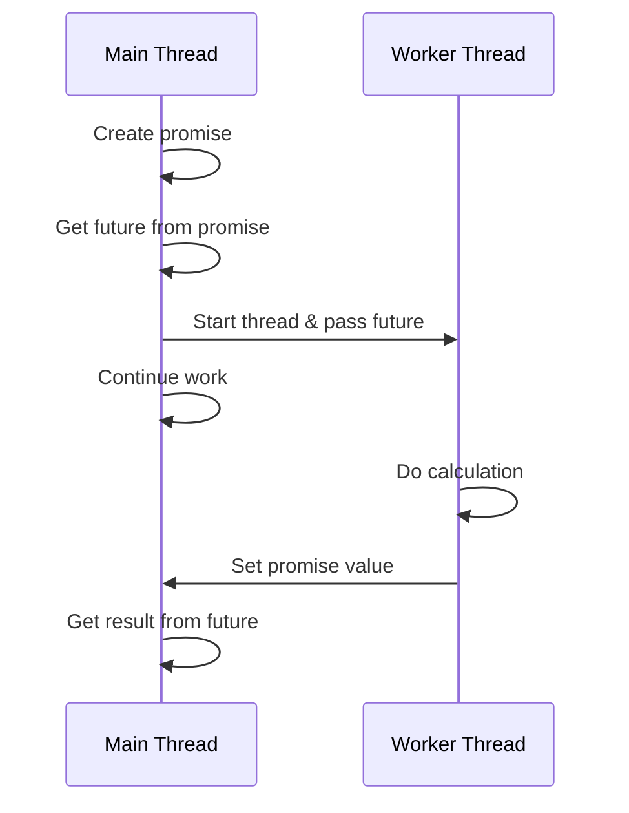

# C++ Future and Promise

## Introduction

When working with multithreaded programs in C++, one of the most important challenges is how to exchange data between threads safely. The C++11 standard introduced two powerful mechanisms for this purpose: `std::future` and `std::promise`. Together, they provide a clean way to retrieve results from asynchronous operations without the complexity of manual thread synchronization.

In this tutorial, we'll explore:
- What futures and promises are
- How they help with asynchronous programming
- How to use them in real-world scenarios
- Common patterns and best practices

## Understanding the Future-Promise Mechanism

### The Basic Concept

Before diving into code, let's understand the core concept:

- **Promise**: An object that "promises" to provide a result at some point in the future
- **Future**: An object that can retrieve the value set by the associated promise

Think of it as a communication channel:
- One thread creates a promise and passes its associated future to another thread
- The second thread can wait for the future to become ready
- When the first thread sets a value on the promise, the future becomes ready and the second thread can retrieve that value



## Getting Started with Future and Promise

### Basic Usage Example

Let's start with a simple example that demonstrates how to use `std::future` and `std::promise`:

```cpp
#include <iostream>
#include <future>
#include <thread>
#include <chrono>

void calculate(std::promise<int> result_promise) {
    std::cout << "Worker thread: Calculating result...\n";
    
    // Simulate work
    std::this_thread::sleep_for(std::chrono::seconds(2));
    
    // Set the result
    result_promise.set_value(42);
    
    std::cout << "Worker thread: Result is ready!\n";
}

int main() {
    // Create a promise
    std::promise<int> result_promise;
    
    // Get the future from the promise
    std::future<int> result_future = result_promise.get_future();
    
    // Start a thread and pass the promise
    std::cout << "Main thread: Starting worker thread...\n";
    std::thread worker_thread(calculate, std::move(result_promise));
    
    // Do some work in the main thread
    std::cout << "Main thread: Doing other work...\n";
    std::this_thread::sleep_for(std::chrono::seconds(1));
    std::cout << "Main thread: Other work completed\n";
    
    // Wait for the result
    std::cout << "Main thread: Waiting for result...\n";
    int result = result_future.get();
    
    std::cout << "Main thread: Result is: " << result << std::endl;
    
    // Join the worker thread
    worker_thread.join();
    
    return 0;
}
```

**Output:**
```
Main thread: Starting worker thread...
Main thread: Doing other work...
Worker thread: Calculating result...
Main thread: Other work completed
Main thread: Waiting for result...
Worker thread: Result is ready!
Main thread: Result is: 42
```

### Step-by-Step Explanation

1. We create a `std::promise<int>` in the main thread that will eventually contain an integer result.
2. We obtain a `std::future<int>` from the promise using the `get_future()` method.
3. We launch a worker thread and pass the promise to it (using `std::move` since promises are not copyable).
4. The main thread continues with other work while the worker thread calculates.
5. When the main thread needs the result, it calls `get()` on the future, which will block until the result is available.
6. The worker thread, after completing its calculation, sets the result by calling `set_value()` on the promise.
7. This automatically makes the result available to the future in the main thread.

## Advanced Usage

### Error Handling with Promises

One powerful feature of the promise-future mechanism is the ability to propagate exceptions across threads:

```cpp
#include <iostream>
#include <future>
#include <thread>
#include <stdexcept>

void calculate_with_error(std::promise<int> result_promise) {
    try {
        std::cout << "Worker thread: Starting calculation...\n";
        
        // Simulate work
        std::this_thread::sleep_for(std::chrono::seconds(1));
        
        // Simulate an error
        throw std::runtime_error("Something went wrong during calculation!");
        
        // This code won't execute
        result_promise.set_value(42);
    } catch (...) {
        // Forward the exception to the future
        result_promise.set_exception(std::current_exception());
    }
}

int main() {
    std::promise<int> result_promise;
    std::future<int> result_future = result_promise.get_future();
    
    std::cout << "Main thread: Starting worker thread...\n";
    std::thread worker_thread(calculate_with_error, std::move(result_promise));
    
    std::cout << "Main thread: Waiting for result...\n";
    
    try {
        // This will throw the exception set in the worker thread
        int result = result_future.get();
        std::cout << "Main thread: Result is: " << result << std::endl;
    } catch (const std::exception& e) {
        std::cout << "Main thread: Exception caught: " << e.what() << std::endl;
    }
    
    worker_thread.join();
    
    return 0;
}
```

**Output:**
```
Main thread: Starting worker thread...
Main thread: Waiting for result...
Worker thread: Starting calculation...
Main thread: Exception caught: Something went wrong during calculation!
```

### Shared Futures

A `std::future` can only have its `get()` method called once. If you need to access the result multiple times or from multiple threads, you can use `std::shared_future`:

```cpp
#include <iostream>
#include <future>
#include <thread>
#include <vector>

void print_result(std::shared_future<int> future, int id) {
    std::cout << "Thread " << id << " waiting for result...\n";
    
    // All threads can call get() on the same shared_future
    int result = future.get();
    
    std::cout << "Thread " << id << " got result: " << result << std::endl;
}

int main() {
    std::promise<int> result_promise;
    
    // Create a shared_future from the future
    std::shared_future<int> shared_result = result_promise.get_future().share();
    
    // Create multiple threads that all wait on the same result
    std::vector<std::thread> threads;
    for (int i = 0; i < 3; i++) {
        threads.emplace_back(print_result, shared_result, i);
    }
    
    std::cout << "Main thread: Threads are waiting, setting value in 2 seconds...\n";
    std::this_thread::sleep_for(std::chrono::seconds(2));
    
    // Set the value that all threads are waiting for
    result_promise.set_value(100);
    
    // Join all threads
    for (auto& t : threads) {
        t.join();
    }
    
    return 0;
}
```

**Output:**
```
Main thread: Threads are waiting, setting value in 2 seconds...
Thread 0 waiting for result...
Thread 1 waiting for result...
Thread 2 waiting for result...
Thread 0 got result: 100
Thread 1 got result: 100
Thread 2 got result: 100
```

## Practical Applications

### Implementing a Task Queue

One common use case for futures and promises is implementing a task queue where tasks can be submitted and their results retrieved later:

```cpp
#include <iostream>
#include <future>
#include <thread>
#include <queue>
#include <functional>
#include <mutex>
#include <condition_variable>
#include <vector>

class TaskQueue {
private:
    std::queue<std::function<void()>> tasks;
    std::mutex queue_mutex;
    std::condition_variable condition;
    bool stop_flag = false;
    std::vector<std::thread> worker_threads;

public:
    // Start worker threads
    TaskQueue(int num_threads) {
        for (int i = 0; i < num_threads; ++i) {
            worker_threads.emplace_back([this] {
                while (true) {
                    std::function<void()> task;
                    
                    {
                        std::unique_lock<std::mutex> lock(queue_mutex);
                        condition.wait(lock, [this] { 
                            return stop_flag || !tasks.empty(); 
                        });
                        
                        if (stop_flag && tasks.empty()) {
                            return;
                        }
                        
                        task = std::move(tasks.front());
                        tasks.pop();
                    }
                    
                    task(); // Execute the task
                }
            });
        }
    }
    
    // Add a task and return a future to its result
    template<class F, class... Args>
    auto enqueue(F&& f, Args&&... args) 
        -> std::future<typename std::result_of<F(Args...)>::type> {
        
        // Create a function that returns the type we need
        using return_type = typename std::result_of<F(Args...)>::type;
        
        // Create a packaged task that will execute our function
        auto task = std::make_shared<std::packaged_task<return_type()>>(
            std::bind(std::forward<F>(f), std::forward<Args>(args)...)
        );
        
        // Get the future from the task
        std::future<return_type> result = task->get_future();
        
        {
            std::unique_lock<std::mutex> lock(queue_mutex);
            
            // Add the task to the queue
            tasks.emplace([task]() { (*task)(); });
        }
        
        // Notify a worker thread
        condition.notify_one();
        
        return result;
    }
    
    // Shutdown the task queue
    ~TaskQueue() {
        {
            std::unique_lock<std::mutex> lock(queue_mutex);
            stop_flag = true;
        }
        
        condition.notify_all();
        
        for (std::thread& worker : worker_threads) {
            worker.join();
        }
    }
};

// Example usage
int calculate_sum(int a, int b) {
    std::cout << "Calculating sum of " << a << " and " << b << " in thread: " 
              << std::this_thread::get_id() << std::endl;
    std::this_thread::sleep_for(std::chrono::seconds(1)); // Simulate work
    return a + b;
}

int main() {
    // Create a task queue with 4 worker threads
    TaskQueue queue(4);
    
    // Submit several tasks
    std::vector<std::future<int>> results;
    
    for (int i = 0; i < 8; ++i) {
        results.push_back(queue.enqueue(calculate_sum, i, i+1));
    }
    
    // Get and print results
    for (int i = 0; i < results.size(); ++i) {
        std::cout << "Result " << i << ": " << results[i].get() << std::endl;
    }
    
    return 0;
}
```

This example demonstrates a powerful pattern using futures, packaged tasks, and a thread pool to create an asynchronous task system.

### Implementing a Timeout Mechanism

Sometimes you need to wait for a result, but only for a limited time. Here's how to implement a timeout with futures:

```cpp
#include <iostream>
#include <future>
#include <chrono>
#include <thread>

int long_calculation() {
    // Simulate a long calculation
    std::this_thread::sleep_for(std::chrono::seconds(3));
    return 42;
}

int main() {
    // Start the calculation asynchronously
    std::future<int> result = std::async(std::launch::async, long_calculation);
    
    std::cout << "Waiting for result with timeout...\n";
    
    // Try to get the result with a 2-second timeout
    if (result.wait_for(std::chrono::seconds(2)) == std::future_status::ready) {
        std::cout << "Result is ready: " << result.get() << std::endl;
    } else {
        std::cout << "Timeout: Result not available yet.\n";
        
        // We can still get the result later if needed
        std::cout << "Waiting for result to complete anyway...\n";
        int value = result.get();
        std::cout << "Result finally arrived: " << value << std::endl;
    }
    
    return 0;
}
```

**Output:**
```
Waiting for result with timeout...
Timeout: Result not available yet.
Waiting for result to complete anyway...
Result finally arrived: 42
```

## Common Pitfalls and Best Practices

### 1. Always Handle the Future

If you create a promise and get a future from it, make sure that:

- The promise always sets a value or an exception
- The future is always waited on or its result is retrieved

If a promise is destroyed without setting a value, the future will throw a `std::future_error` with the code `std::future_errc::broken_promise`.

### 2. Moving Promises

Remember that promise objects can't be copied, only moved:

```cpp
// Correct
std::promise<int> promise1;
std::thread t(some_function, std::move(promise1));

// Wrong - will not compile
std::promise<int> promise2;
std::thread t(some_function, promise2);  // Error: promise is not copyable
```

### 3. Be Careful with `get()`

Calling `get()` on a future more than once will throw an exception. If you need to access the result multiple times, use `std::shared_future`.

### 4. Use `std::async` for Simple Cases

For simple one-off asynchronous operations, consider using `std::async` instead of manually managing promises:

```cpp
// Using std::async instead of manually creating promise/future
std::future<int> result = std::async(std::launch::async, []() {
    return 42;
});

// Get the result
int value = result.get();
```

## Summary

In this tutorial, we've explored C++ futures and promises, which provide a powerful mechanism for asynchronous programming:

- `std::promise` allows one thread to set a value that will be retrieved by another thread
- `std::future` provides access to a value that will be set in the future
- This mechanism provides clean, exception-safe communication between threads
- Advanced patterns like shared futures and task queues build on these primitives

Futures and promises make multithreaded code cleaner and safer by reducing the need for manual synchronization primitives like mutexes and condition variables.

## Exercises

To solidify your understanding of futures and promises, try these exercises:

1. Implement a function that performs multiple calculations in parallel and returns the sum of all results.
2. Create a program that fetches data from three different sources concurrently and combines the results.
3. Implement a simple cache system where results are computed asynchronously and stored for later use.
4. Extend the task queue example to support task cancellation.
5. Create a function that runs a calculation with a timeout and returns a default value if the calculation takes too long.

## Additional Resources

- [C++ Reference: std::future](https://en.cppreference.com/w/cpp/thread/future)
- [C++ Reference: std::promise](https://en.cppreference.com/w/cpp/thread/promise)
- [C++ Reference: std::async](https://en.cppreference.com/w/cpp/thread/async)
- Book: "C++ Concurrency in Action" by Anthony Williams
- Book: "Effective Modern C++" by Scott Meyers (Item 39 covers futures)