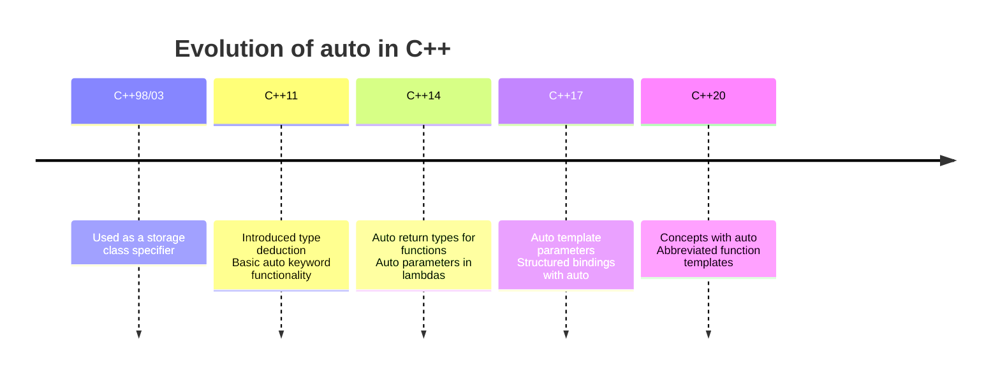

# C++ Auto Keyword

## Introduction

The `auto` keyword in C++ is one of the most impactful features introduced in C++11. It allows the compiler to automatically deduce the type of a variable from its initializer, eliminating the need to explicitly specify types in many cases. This feature significantly improves code readability, reduces typing errors, and makes code maintenance easier, especially when dealing with complex type names.

Before C++11, you had to explicitly specify the type of every variable:

```cpp
std::vector<int>::iterator it = myVector.begin();
std::map<std::string, std::vector<int>>::const_iterator mapIt = myMap.find("key");
```

With `auto`, the same code becomes much cleaner:

```cpp
auto it = myVector.begin();
auto mapIt = myMap.find("key");
```

Let's dive deeper into how `auto` works and how it can make your C++ code more elegant and maintainable.

## Basic Usage of `auto`

### Syntax and Type Deduction

The basic syntax for using `auto` is straightforward:

```cpp
auto variable_name = initializer;
```

When you use `auto`, the compiler looks at the initializer expression and determines the appropriate type for the variable.

```cpp
#include <iostream>
#include <string>

int main() {
    // Integer type deduction
    auto a = 5;              // int
    
    // Floating-point type deduction
    auto b = 3.14;           // double
    
    // String type deduction
    auto c = "Hello";        // const char*
    auto d = std::string("Hello");  // std::string
    
    // Print types (using type traits from C++11)
    std::cout << "Type of a: " << typeid(a).name() << std::endl;
    std::cout << "Type of b: " << typeid(b).name() << std::endl;
    std::cout << "Type of c: " << typeid(c).name() << std::endl;
    std::cout << "Type of d: " << typeid(d).name() << std::endl;
    
    return 0;
}
```

Output (may vary depending on the compiler):
```
Type of a: i
Type of b: d
Type of c: PKc
Type of d: NSt7__cxx1112basic_stringIcSt11char_traitsIcESaIcEEE
```

Note that while the output of `typeid().name()` can be compiler-dependent, the actual types being deduced are standardized.

### Type Modifiers with `auto`

You can combine `auto` with type modifiers like `const`, `&` (reference), and `*` (pointer):

```cpp
#include <iostream>
#include <vector>

int main() {
    std::vector<int> numbers = {1, 2, 3, 4, 5};
    
    // auto with reference
    auto& first = numbers[0];
    first = 10;  // This modifies the original vector
    
    // auto with const
    const auto size = numbers.size();
    // size = 10;  // Error! Cannot modify a const variable
    
    // auto with pointer
    auto ptr = &numbers[0];
    *ptr = 20;  // This modifies the original vector
    
    // Print the vector to see changes
    std::cout << "Vector contents: ";
    for (const auto& num : numbers) {
        std::cout << num << " ";
    }
    std::cout << std::endl;
    
    return 0;
}
```

Output:
```
Vector contents: 20 2 3 4 5
```

## Common Use Cases for `auto`

### Iterator Declarations

Iterators in C++ often have long and complex type names. Using `auto` makes the code much cleaner:

```cpp
#include <iostream>
#include <map>
#include <string>
#include <vector>

int main() {
    // Complex container
    std::map<std::string, std::vector<int>> data = {
        {"Alice", {90, 85, 92}},
        {"Bob", {75, 80, 70}},
        {"Charlie", {95, 90, 98}}
    };
    
    // Without auto (verbose and error-prone)
    std::map<std::string, std::vector<int>>::iterator it1;
    for (it1 = data.begin(); it1 != data.end(); ++it1) {
        std::cout << it1->first << ": ";
        
        std::vector<int>::iterator it2;
        for (it2 = it1->second.begin(); it2 != it1->second.end(); ++it2) {
            std::cout << *it2 << " ";
        }
        std::cout << std::endl;
    }
    
    std::cout << "\nSame loop with auto:\n";
    
    // With auto (clean and readable)
    for (auto it = data.begin(); it != data.end(); ++it) {
        std::cout << it->first << ": ";
        
        for (auto score : it->second) {
            std::cout << score << " ";
        }
        std::cout << std::endl;
    }
    
    return 0;
}
```

Output:
```
Alice: 90 85 92 
Bob: 75 80 70 
Charlie: 95 90 98 

Same loop with auto:
Alice: 90 85 92 
Bob: 75 80 70 
Charlie: 95 90 98 
```

### Range-based for Loops

Using `auto` with range-based for loops (introduced in C++11) creates very clean and readable code:

```cpp
#include <iostream>
#include <vector>

int main() {
    std::vector<int> numbers = {1, 2, 3, 4, 5};
    
    // Using auto with range-based for loop
    std::cout << "Elements: ";
    for (const auto& num : numbers) {
        std::cout << num << " ";
    }
    std::cout << std::endl;
    
    // Modifying elements
    for (auto& num : numbers) {
        num *= 2;
    }
    
    std::cout << "After doubling: ";
    for (const auto& num : numbers) {
        std::cout << num << " ";
    }
    std::cout << std::endl;
    
    return 0;
}
```

Output:
```
Elements: 1 2 3 4 5 
After doubling: 2 4 6 8 10 
```

### Lambda Function Return Types

The `auto` keyword really shines when used with lambda functions, especially for return type deduction:

```cpp
#include <iostream>
#include <vector>
#include <algorithm>

int main() {
    std::vector<int> numbers = {5, 2, 9, 1, 7, 3};
    
    // Using auto with lambda
    auto square = [](int x) { return x * x; };
    
    std::cout << "Original numbers: ";
    for (const auto& num : numbers) {
        std::cout << num << " ";
    }
    std::cout << std::endl;
    
    std::cout << "Squares: ";
    for (const auto& num : numbers) {
        std::cout << square(num) << " ";
    }
    std::cout << std::endl;
    
    // Complex lambda with auto return type
    auto transformAndSum = [](const std::vector<int>& vec, auto transformer) {
        int sum = 0;
        for (const auto& v : vec) {
            sum += transformer(v);
        }
        return sum;
    };
    
    int sumOfSquares = transformAndSum(numbers, square);
    std::cout << "Sum of squares: " << sumOfSquares << std::endl;
    
    return 0;
}
```

Output:
```
Original numbers: 5 2 9 1 7 3 
Squares: 25 4 81 1 49 9 
Sum of squares: 169
```

## Understanding Type Deduction Rules

While `auto` is powerful, it's important to understand some nuances of type deduction:

```cpp
#include <iostream>
#include <type_traits>
#include <vector>

int main() {
    // 1. auto drops references
    int x = 10;
    int& ref = x;
    auto a = ref;        // 'a' is int, not int&
    a = 20;              // does not change x
    
    std::cout << "x = " << x << ", a = " << a << std::endl;
    
    // To keep reference:
    auto& b = ref;       // 'b' is int&
    b = 30;              // changes x
    
    std::cout << "After changing b: x = " << x << std::endl;
    
    // 2. auto drops const (unless using const auto or auto&)
    const int y = 5;
    auto c = y;          // 'c' is int, not const int
    c = 15;              // ok
    
    const auto d = y;    // 'd' is const int
    // d = 25;           // Error! Cannot modify const int
    
    // 3. auto with initializer lists requires explicit type
    // auto e = {1, 2, 3};   // e is std::initializer_list<int>
    
    // 4. Special case: auto with vector<bool>
    std::vector<bool> flags = {true, false, true};
    auto flag = flags[0];  // Not a bool! It's std::vector<bool>::reference
    
    std::cout << "std::is_same<decltype(flag), bool>::value = " 
              << std::is_same<decltype(flag), bool>::value << std::endl;
    
    return 0;
}
```

Output:
```
x = 10, a = 20
After changing b: x = 30
std::is_same<decltype(flag), bool>::value = 0
```

## When to Use and When to Avoid `auto`

### Good Use Cases

1. **Complex Iterator Types**: When the type is long and complicated
2. **Range-based For Loops**: Almost always a good idea
3. **Lambda Function Parameters (C++14+)**: For generic lambdas
4. **When Type is Clear from Context**: When the actual type is obvious from the right side

### When to Avoid

1. **Public API Signatures**: Function return types should generally be explicit
2. **When Type Clarity is Important**: If the exact type matters for understanding
3. **When Refactoring Could Change Types**: If your initializer might change to a different type

```cpp
#include <iostream>
#include <vector>
#include <map>
#include <string>

// Good use: Template function with complex return type
template<typename Container>
auto getFirstElement(const Container& c) -> decltype(c.front()) {
    return c.front();
}

// Avoid: Public API functions should have explicit return types
// auto calculateTotal(const std::vector<int>& values);  // Avoid this
double calculateTotal(const std::vector<int>& values) {  // Prefer this
    double sum = 0;
    for (const auto& val : values) {
        sum += val;
    }
    return sum;
}

int main() {
    std::vector<int> numbers = {1, 2, 3, 4, 5};
    
    // Good: Iterator declaration
    auto it = numbers.begin();
    
    // Good: Range-based for loop
    for (const auto& num : numbers) {
        std::cout << num << " ";
    }
    std::cout << std::endl;
    
    // Avoid: When type clarity matters
    auto result = calculateTotal(numbers);
    std::cout << "Total: " << result << std::endl;
    
    // Good: Complex types
    std::map<std::string, std::vector<int>> userData;
    auto userDataIt = userData.begin();  // Much cleaner
    
    return 0;
}
```

## Real-World Applications

### Example 1: Data Processing with Templates

```cpp
#include <iostream>
#include <vector>
#include <string>
#include <algorithm>
#include <functional>

// A generic data processor using auto
template<typename Data, typename Func>
auto processData(const Data& data, Func processor) {
    using result_type = decltype(processor(*data.begin()));
    std::vector<result_type> results;
    
    for (const auto& item : data) {
        results.push_back(processor(item));
    }
    
    return results;
}

int main() {
    // Sample dataset: student scores
    std::vector<int> scores = {85, 92, 76, 88, 95, 65, 89, 91};
    
    // Process 1: Normalize scores to 0-1 scale
    auto normalizedScores = processData(scores, [](int score) {
        return score / 100.0;
    });
    
    // Process 2: Grade conversion
    auto letterGrades = processData(scores, [](int score) -> std::string {
        if (score >= 90) return "A";
        if (score >= 80) return "B";
        if (score >= 70) return "C";
        if (score >= 60) return "D";
        return "F";
    });
    
    // Display results
    std::cout << "Original scores: ";
    for (const auto& score : scores) {
        std::cout << score << " ";
    }
    std::cout << "\n\nNormalized scores: ";
    for (const auto& score : normalizedScores) {
        std::cout << score << " ";
    }
    std::cout << "\n\nLetter grades: ";
    for (const auto& grade : letterGrades) {
        std::cout << grade << " ";
    }
    std::cout << std::endl;
    
    return 0;
}
```

Output:
```
Original scores: 85 92 76 88 95 65 89 91

Normalized scores: 0.85 0.92 0.76 0.88 0.95 0.65 0.89 0.91

Letter grades: B A C B A D B A
```

### Example 2: Working with Complex Data Structures

```cpp
#include <iostream>
#include <map>
#include <vector>
#include <string>
#include <algorithm>
#include <numeric>

// Student record structure
struct StudentRecord {
    std::string name;
    std::vector<int> scores;
    double getAverage() const {
        if (scores.empty()) return 0.0;
        return std::accumulate(scores.begin(), scores.end(), 0.0) / scores.size();
    }
};

int main() {
    // Complex data structure: Course -> Students -> Records
    std::map<std::string, std::vector<StudentRecord>> courses = {
        {"Math", {
            {"Alice", {95, 88, 92}},
            {"Bob", {75, 82, 79}},
            {"Charlie", {90, 85, 88}}
        }},
        {"Physics", {
            {"Alice", {85, 90, 88}},
            {"David", {92, 95, 90}},
            {"Eve", {78, 80, 82}}
        }},
        {"Computer Science", {
            {"Bob", {98, 95, 92}},
            {"Charlie", {85, 88, 90}},
            {"David", {90, 92, 94}}
        }}
    };
    
    // Find top performers in each course
    std::map<std::string, std::string> topPerformers;
    
    for (const auto& course : courses) {
        const auto& courseName = course.first;
        const auto& students = course.second;
        
        // Using auto with algorithm
        auto topStudent = std::max_element(
            students.begin(), 
            students.end(),
            [](const auto& a, const auto& b) {
                return a.getAverage() < b.getAverage();
            }
        );
        
        if (topStudent != students.end()) {
            topPerformers[courseName] = topStudent->name;
        }
    }
    
    // Display course averages
    std::cout << "Course Averages:\n";
    std::cout << "===============\n";
    
    for (const auto& course : courses) {
        const auto& courseName = course.first;
        const auto& students = course.second;
        
        double courseAvg = 0.0;
        for (const auto& student : students) {
            courseAvg += student.getAverage();
        }
        courseAvg /= students.size();
        
        std::cout << courseName << ": " << courseAvg 
                  << " (Top performer: " << topPerformers[courseName] << ")\n";
    }
    
    std::cout << "\nDetailed Student Records:\n";
    std::cout << "========================\n";
    
    // Collecting all unique students
    std::map<std::string, std::map<std::string, double>> studentAverages;
    
    for (const auto& course : courses) {
        const auto& courseName = course.first;
        const auto& students = course.second;
        
        for (const auto& student : students) {
            studentAverages[student.name][courseName] = student.getAverage();
        }
    }
    
    // Print student details
    for (const auto& student : studentAverages) {
        std::cout << student.first << ":\n";
        
        for (const auto& course : student.second) {
            std::cout << "  " << course.first << ": " << course.second << "\n";
        }
        std::cout << "\n";
    }
    
    return 0;
}
```

This example demonstrates how `auto` can be used with complex nested data structures to make code more readable and maintainable.

## Evolution of `auto` in Modern C++

The `auto` keyword has evolved across different C++ standards:



## Common Mistakes and Pitfalls

1. **Misunderstanding the Deduced Type**:

```cpp
#include <iostream>
#include <vector>

int main() {
    std::vector<bool> bools = {true, false, true};
    
    // Mistake: Assuming 'flag' is a bool
    auto flag = bools[0];  // This is std::vector<bool>::reference, not bool!
    
    // To get an actual bool:
    bool actualFlag = bools[0];
    
    std::cout << "Are they the same type? " 
              << std::boolalpha 
              << std::is_same<decltype(flag), bool>::value 
              << std::endl;
    
    return 0;
}
```

2. **Forgetting That `auto` Drops References and CV-Qualifiers**:

```cpp
#include <iostream>

int main() {
    int x = 10;
    
    // auto drops the reference
    int& rx = x;
    auto a = rx;  // 'a' is int, not int&
    
    // To keep reference, use auto&
    auto& b = rx; // 'b' is int&
    
    // Verify
    a = 20;
    std::cout << "After changing a to 20, x = " << x << std::endl;
    
    b = 30;
    std::cout << "After changing b to 30, x = " << x << std::endl;
    
    return 0;
}
```

3. **Readability Issues**:

```cpp
#include <iostream>

// Bad: Unclear what type is returned
auto calculateSomething() {
    return 3.14159;  // Is this intentionally double? float? long double?
}

// Good: Type is clear from function name
auto calculatePi() {
    return 3.14159;
}

// Better for APIs: Explicit return type
double calculateExplicitPi() {
    return 3.14159;
}

int main() {
    // Bad usage: What is 'value'?
    auto value = calculateSomething() * 2;
    
    // Good usage: Type is clear from context
    auto radius = 5.0;  // Clearly a floating-point number
    auto area = 3.14159 * radius * radius;  // Clearly a floating-point calculation
    
    std::cout << "Area: " << area << std::endl;
    
    return 0;
}
```

## Summary

The `auto` keyword is a powerful feature in modern C++ that can:

1. **Simplify complex type declarations**, making code more readable
2. **Reduce errors** caused by type mismatches
3. **Work with templates and generic code** more effectively
4. **Improve maintainability** by focusing on the logic rather than types

However, it should be used judiciously:

1. **Use `auto`** when the type is clear from context or when it's complex
2. **Avoid `auto`** when explicit types are important for API design or code clarity
3. **Remember type deduction rules**, especially regarding references and const-qualifiers

By mastering the `auto` keyword, you'll write cleaner, more maintainable C++ code that's less prone to typing errors and adapts better to changes.

## Exercises

1. **Basic Auto Usage**: Write a program that declares variables of different types using `auto` and prints their types using `typeid`.

2. **Auto with Containers**: Create a program that processes a `std::map<std::string, std::vector<int>>` using `auto` to simplify iterator declarations.

3. **Lambda Functions**: Write a program that uses `auto` with lambda functions to transform a vector of integers in three different ways.

4. **Type Deduction Challenge**: Create examples that demonstrate the difference between `auto`, `auto&`, `const auto`, and `const auto&`.

5. **Real-world Application**: Implement a simple template function that processes data from different container types using `auto` to handle the varying return types.

## Additional Resources

- [C++ Reference: auto specifier](https://en.cppreference.com/w/cpp/language/auto)
- [Effective Modern C++](https://www.oreilly.com/library/view/effective-modern-c/9781491908419/) by Scott Meyers (Items 5 and 6)
- [C++ Core Guidelines: Auto](https://isocpp.github.io/CppCoreGuidelines/CppCoreGuidelines#Res-auto)
- [C++11/14/17/20 Features](https://github.com/AnthonyCalandra/modern-cpp-features)