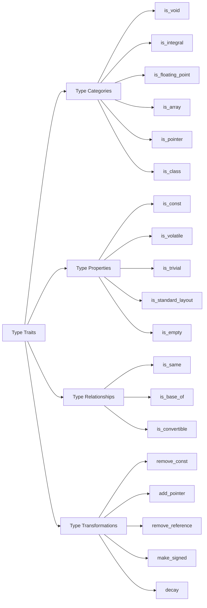

# C++ Type Traits

## Introduction

Type traits are a powerful feature in modern C++ that allow you to inspect, query, and modify types at compile time. They form a fundamental part of C++ template metaprogramming, enabling developers to write generic code that can make decisions based on the properties of types.

Introduced in C++11 as part of the Standard Template Library (STL), type traits reside in the `<type_traits>` header and provide a unified interface for type inspection and manipulation. They're particularly useful when:

- You need to conditionally compile code based on type properties
- You want to create templates that behave differently depending on the types they're used with
- You need to ensure compile-time correctness based on type relationships

Let's dive into the world of type traits and see how they can make your C++ code more robust, flexible, and efficient!

## Understanding Type Traits

Type traits are implemented as template classes or structs that provide information about types. Most type traits follow a consistent pattern:

```cpp
template <typename T>
struct some_trait {
    static constexpr bool value = /* true or false based on T */;
};
```

Since C++17, you can use the `_v` suffix to directly access the value:

```cpp
template <typename T>
inline constexpr bool some_trait_v = some_trait<T>::value;
```

### Basic Type Classification

Let's start with some basic examples:

```cpp
#include <iostream>
#include <type_traits>

int main() {
    // Check if types are integral
    std::cout << "Is int integral? " 
              << std::is_integral<int>::value << std::endl;
    std::cout << "Is float integral? " 
              << std::is_integral<float>::value << std::endl;
    
    // Using the _v suffix (C++17)
    std::cout << "Is double floating point? " 
              << std::is_floating_point_v<double> << std::endl;
    
    return 0;
}
```

**Output:**
```
Is int integral? 1
Is float integral? 0
Is double floating point? 1
```

In this example, we use `std::is_integral` and `std::is_floating_point` to check properties of types at compile time.

## Common Type Traits Categories

Type traits can be grouped into several categories based on their functionality:

### 1. Primary Type Categories

These traits tell you which fundamental category a type belongs to:

```cpp
#include <iostream>
#include <type_traits>
#include <vector>

template <typename T>
void print_type_info() {
    std::cout << "Type info for " << typeid(T).name() << ":\n";
    std::cout << "- Is void? " << std::is_void_v<T> << "\n";
    std::cout << "- Is integral? " << std::is_integral_v<T> << "\n";
    std::cout << "- Is floating point? " << std::is_floating_point_v<T> << "\n";
    std::cout << "- Is array? " << std::is_array_v<T> << "\n";
    std::cout << "- Is pointer? " << std::is_pointer_v<T> << "\n";
    std::cout << "- Is class? " << std::is_class_v<T> << "\n\n";
}

int main() {
    print_type_info<int>();
    print_type_info<float*>();
    print_type_info<std::vector<int>>();
    
    return 0;
}
```

### 2. Type Properties

These traits let you query specific properties of types:

```cpp
#include <iostream>
#include <type_traits>

class EmptyClass {};

class ClassWithMembers {
    int x;
    double y;
};

int main() {
    std::cout << "Is EmptyClass empty? " 
              << std::is_empty_v<EmptyClass> << std::endl;
    std::cout << "Is ClassWithMembers empty? " 
              << std::is_empty_v<ClassWithMembers> << std::endl;
    
    std::cout << "Is const int const-qualified? " 
              << std::is_const_v<const int> << std::endl;
    std::cout << "Is int const-qualified? " 
              << std::is_const_v<int> << std::endl;
    
    return 0;
}
```

### 3. Type Relationships

These traits examine relationships between types:

```cpp
#include <iostream>
#include <type_traits>

class Base {};
class Derived : public Base {};

int main() {
    std::cout << "Is Derived derived from Base? " 
              << std::is_base_of_v<Base, Derived> << std::endl;
    std::cout << "Is Base derived from Derived? " 
              << std::is_base_of_v<Derived, Base> << std::endl;
    
    std::cout << "Are int and int the same? " 
              << std::is_same_v<int, int> << std::endl;
    std::cout << "Are int and unsigned int the same? " 
              << std::is_same_v<int, unsigned int> << std::endl;
    
    return 0;
}
```

### 4. Type Transformations

These traits allow you to transform types:

```cpp
#include <iostream>
#include <type_traits>

template <typename T>
void print_type_transformations() {
    std::cout << "Original type: " << typeid(T).name() << std::endl;
    
    // Remove const
    std::cout << "Remove const: " 
              << typeid(std::remove_const_t<T>).name() << std::endl;
    
    // Add pointer
    std::cout << "Add pointer: " 
              << typeid(std::add_pointer_t<T>).name() << std::endl;
    
    // Remove reference
    std::cout << "Remove reference: " 
              << typeid(std::remove_reference_t<T>).name() << std::endl;
}

int main() {
    print_type_transformations<const int&>();
    return 0;
}
```

## Practical Applications of Type Traits

Now that we've covered the basics, let's explore some practical applications of type traits in real-world code.

### Example 1: Creating Type-Safe Functions

Type traits can help you create functions that work only with specific types:

```cpp
#include <iostream>
#include <type_traits>
#include <string>

// This function only accepts arithmetic types (integers or floating point)
template <typename T>
typename std::enable_if<std::is_arithmetic_v<T>, T>::type
safe_divide(T a, T b) {
    if (b == 0) {
        std::cerr << "Error: Division by zero!" << std::endl;
        return 0;
    }
    return a / b;
}

int main() {
    std::cout << "10 / 2 = " << safe_divide(10, 2) << std::endl;
    std::cout << "10.5 / 2.1 = " << safe_divide(10.5, 2.1) << std::endl;
    
    // This would cause a compile error:
    // safe_divide(std::string("hello"), std::string("world"));
    
    return 0;
}
```

**Output:**
```
10 / 2 = 5
10.5 / 2.1 = 5
```

### Example 2: Optimizing Code Based on Type Properties

You can use type traits to optimize code based on properties of types:

```cpp
#include <iostream>
#include <type_traits>
#include <vector>

template <typename Container>
void optimize_clear(Container& container) {
    // For trivially destructible types, we can just set the size to 0
    if constexpr (std::is_trivially_destructible_v<typename Container::value_type>) {
        std::cout << "Using optimized clear (trivially destructible)" << std::endl;
        container.resize(0);
    } else {
        std::cout << "Using standard clear (non-trivially destructible)" << std::endl;
        container.clear();
    }
}

struct Simple {
    int x;
};

struct Complex {
    std::vector<int> data;
    ~Complex() {
        std::cout << "Complex destructor called" << std::endl;
    }
};

int main() {
    std::vector<Simple> simpleVec(5);
    std::vector<Complex> complexVec(5);
    
    optimize_clear(simpleVec);
    optimize_clear(complexVec);
    
    return 0;
}
```

### Example 3: SFINAE with Type Traits

SFINAE (Substitution Failure Is Not An Error) combined with type traits allows for powerful template techniques:

```cpp
#include <iostream>
#include <type_traits>
#include <vector>
#include <list>

// Only works with containers that have random access iterators
template <typename Container>
typename std::enable_if<
    std::is_same_v<
        typename std::iterator_traits<typename Container::iterator>::iterator_category,
        std::random_access_iterator_tag
    >,
    void
>::type
efficient_algorithm(Container& container) {
    std::cout << "Using efficient algorithm for random access containers" << std::endl;
    // Implementation that relies on random access
}

// Fallback for containers without random access
template <typename Container>
typename std::enable_if<
    !std::is_same_v<
        typename std::iterator_traits<typename Container::iterator>::iterator_category,
        std::random_access_iterator_tag
    >,
    void
>::type
efficient_algorithm(Container& container) {
    std::cout << "Using fallback algorithm for non-random access containers" << std::endl;
    // Alternative implementation
}

int main() {
    std::vector<int> vec = {1, 2, 3, 4, 5};
    std::list<int> lst = {1, 2, 3, 4, 5};
    
    efficient_algorithm(vec);  // Uses random access version
    efficient_algorithm(lst);  // Uses fallback version
    
    return 0;
}
```

### Example 4: Simplified Code with C++17's `if constexpr`

C++17 introduced `if constexpr`, which works great with type traits:

```cpp
#include <iostream>
#include <type_traits>
#include <string>

template <typename T>
void print_numeric_info(const T& value) {
    std::cout << "Value: " << value << std::endl;
    
    if constexpr (std::is_integral_v<T>) {
        std::cout << "This is an integral type" << std::endl;
        if constexpr (std::is_signed_v<T>) {
            std::cout << "It's signed, and can be negative" << std::endl;
        } else {
            std::cout << "It's unsigned, always positive" << std::endl;
        }
    } else if constexpr (std::is_floating_point_v<T>) {
        std::cout << "This is a floating-point type" << std::endl;
        std::cout << "It can represent: " << 
            (std::is_same_v<T, float> ? "less" : 
             std::is_same_v<T, double> ? "medium" : "high") << 
            " precision" << std::endl;
    } else {
        std::cout << "This is neither integral nor floating-point" << std::endl;
    }
}

int main() {
    print_numeric_info(42);
    std::cout << "-------------------" << std::endl;
    print_numeric_info(42u);
    std::cout << "-------------------" << std::endl;
    print_numeric_info(42.0f);
    std::cout << "-------------------" << std::endl;
    print_numeric_info(42.0);
    std::cout << "-------------------" << std::endl;
    print_numeric_info(std::string("42"));
    
    return 0;
}
```

## Type Traits in C++20

C++20 introduces even more type traits and concepts, which are an extension of the type traits system:

```cpp
#include <iostream>
#include <concepts>
#include <type_traits>

// A function that only accepts types that satisfy a concept
template <std::integral T>
void integer_only(T value) {
    std::cout << "Called with integral type: " << value << std::endl;
}

int main() {
    integer_only(42);
    // This would cause a compile error:
    // integer_only(42.0);
    
    return 0;
}
```

## Common Type Traits Cheat Sheet

Here's a quick reference for some commonly used type traits:



## Summary

Type traits are a powerful tool in modern C++ that allow you to:

1. **Inspect types at compile time** to make decisions based on their properties
2. **Modify types** through transformations like adding/removing qualifiers
3. **Write generic code** that can adapt to different types
4. **Enable or disable functions** based on type properties
5. **Optimize operations** based on type characteristics

They're an essential tool for template metaprogramming and enable you to write more flexible, type-safe, and efficient code. As you grow more familiar with C++, type traits will become an indispensable part of your toolkit for creating robust and reusable code.

## Exercises

To solidify your understanding of type traits, try these exercises:

1. Write a template function `print_if_printable<T>` that only compiles if the type T has a stream output operator (`<<`).

2. Create a `safe_container_access` function that works with any container but performs bounds checking for those that don't have random access iterators.

3. Implement a `is_smart_pointer` type trait that detects if a type is a smart pointer (`std::shared_ptr`, `std::unique_ptr`, or `std::weak_ptr`).

4. Write a function that can calculate the square root of a number, but only for floating-point types. For integer types, it should convert them to double first.

5. Create a `max_value` function that returns the maximum possible value for any numeric type using `std::numeric_limits` and type traits.

## Additional Resources

- [C++ Reference: Type Traits](https://en.cppreference.com/w/cpp/header/type_traits)
- [C++ Reference: Concepts](https://en.cppreference.com/w/cpp/language/constraints)
- [C++ Templates: The Complete Guide, 2nd Edition](http://www.tmplbook.com/) - An excellent book that covers type traits in depth
- [CppCon: Type Traits - What are they and why should I use them?](https://www.youtube.com/watch?v=VvbTP_k_Df4)