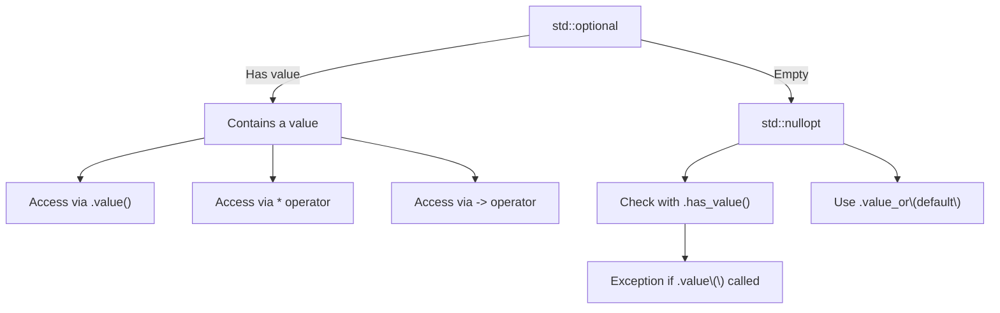

# C++ Optional

## Introduction

Have you ever needed to represent a value that might or might not exist? In C++, before C++17, you'd typically use pointers (possibly `nullptr`), special sentinel values, or complex return structures to represent optional values. C++17 introduced `std::optional`, a template class that elegantly solves this problem by providing a container that either contains a value or is empty.

`std::optional` is part of the C++17 standard and lives in the `<optional>` header. It represents an optional value: a value that may or may not be present. This is particularly useful for:

- Functions that might fail to return a meaningful value
- Optional parameters or properties
- Delayed initialization
- Situations where there isn't a natural "null" or default value

## Basic Usage

### Including the Optional Header

To use `std::optional`, you need to include the appropriate header:

```cpp
#include <optional>
```

### Creating and Checking Optional Values

Let's look at some basic ways to work with optional values:

```cpp
#include <iostream>
#include <optional>
#include <string>

int main() {
    // Create an empty optional
    std::optional<int> emptyOpt;
    
    // Create an optional with a value
    std::optional<int> valueOpt = 42;
    
    // Check if an optional contains a value
    if (emptyOpt.has_value()) {
        std::cout << "emptyOpt has value: " << emptyOpt.value() << std::endl;
    } else {
        std::cout << "emptyOpt is empty" << std::endl;
    }
    
    if (valueOpt.has_value()) {
        std::cout << "valueOpt has value: " << valueOpt.value() << std::endl;
    } else {
        std::cout << "valueOpt is empty" << std::endl;
    }
    
    return 0;
}
```

Output:
```
emptyOpt is empty
valueOpt has value: 42
```

### Accessing Optional Values

There are several ways to access the value inside an optional:

```cpp
#include <iostream>
#include <optional>
#include <string>

int main() {
    std::optional<std::string> opt = "Hello, World!";
    
    // Method 1: Using .value()
    std::cout << "Using .value(): " << opt.value() << std::endl;
    
    // Method 2: Using the * operator (like a pointer)
    std::cout << "Using * operator: " << *opt << std::endl;
    
    // Method 3: Using .value_or() with a default
    std::optional<std::string> emptyOpt;
    std::cout << "Empty optional with .value_or(): " 
              << emptyOpt.value_or("Default value") << std::endl;
    
    return 0;
}
```

Output:
```
Using .value(): Hello, World!
Using * operator: Hello, World!
Empty optional with .value_or(): Default value
```

### Handling Missing Values

When you try to access a value from an empty optional using `.value()`, it throws a `std::bad_optional_access` exception:

```cpp
#include <iostream>
#include <optional>

int main() {
    std::optional<int> emptyOpt;
    
    try {
        // This will throw an exception
        int value = emptyOpt.value();
        std::cout << "Value: " << value << std::endl;
    } catch (const std::bad_optional_access& e) {
        std::cout << "Exception caught: " << e.what() << std::endl;
    }
    
    return 0;
}
```

Output:
```
Exception caught: bad optional access
```

## Practical Use Cases

### Function That May Fail

One common use case for `std::optional` is a function that might not be able to return a valid result:

```cpp
#include <iostream>
#include <optional>
#include <string>
#include <cctype>

// Function that tries to convert a string to an integer
std::optional<int> stringToInt(const std::string& str) {
    // Check if the string contains only digits
    for (char c : str) {
        if (!std::isdigit(c)) {
            return std::nullopt; // Return empty optional
        }
    }
    
    return std::stoi(str); // Return integer value
}

int main() {
    std::string validInput = "12345";
    std::string invalidInput = "123abc";
    
    auto result1 = stringToInt(validInput);
    if (result1) {
        std::cout << "Conversion successful: " << *result1 << std::endl;
    } else {
        std::cout << "Conversion failed for: " << validInput << std::endl;
    }
    
    auto result2 = stringToInt(invalidInput);
    if (result2) {
        std::cout << "Conversion successful: " << *result2 << std::endl;
    } else {
        std::cout << "Conversion failed for: " << invalidInput << std::endl;
    }
    
    return 0;
}
```

Output:
```
Conversion successful: 12345
Conversion failed for: 123abc
```

### Optional Function Parameters

`std::optional` can be used to represent optional function parameters:

```cpp
#include <iostream>
#include <optional>
#include <string>

// Function with an optional parameter
std::string greet(const std::string& name, 
                  std::optional<std::string> title = std::nullopt) {
    std::string greeting = "Hello, ";
    
    if (title) {
        greeting += *title + " ";
    }
    
    greeting += name + "!";
    return greeting;
}

int main() {
    std::cout << greet("Alice") << std::endl;
    std::cout << greet("Bob", "Dr.") << std::endl;
    
    return 0;
}
```

Output:
```
Hello, Alice!
Hello, Dr. Bob!
```

### Delayed Initialization

`std::optional` is perfect for values that might be initialized later:

```cpp
#include <iostream>
#include <optional>
#include <string>

class UserProfile {
private:
    std::string username;
    std::optional<std::string> fullName;
    std::optional<int> age;

public:
    UserProfile(const std::string& uname) : username(uname) {}
    
    void setFullName(const std::string& name) {
        fullName = name;
    }
    
    void setAge(int userAge) {
        age = userAge;
    }
    
    void printProfile() {
        std::cout << "Username: " << username << std::endl;
        std::cout << "Full name: " << fullName.value_or("Not provided") << std::endl;
        
        if (age) {
            std::cout << "Age: " << *age << std::endl;
        } else {
            std::cout << "Age: Not provided" << std::endl;
        }
    }
};

int main() {
    UserProfile user("johndoe123");
    user.printProfile();
    
    std::cout << "\nUpdating profile...\n" << std::endl;
    
    user.setFullName("John Doe");
    user.setAge(30);
    user.printProfile();
    
    return 0;
}
```

Output:
```
Username: johndoe123
Full name: Not provided
Age: Not provided

Updating profile...

Username: johndoe123
Full name: John Doe
Age: 30
```

## Advanced Features

### Constructing In-Place

You can construct complex objects directly in the optional using `std::in_place`:

```cpp
#include <iostream>
#include <optional>
#include <vector>

int main() {
    // In-place construction of a vector with 3 elements
    std::optional<std::vector<int>> optVec(std::in_place, {1, 2, 3});
    
    if (optVec) {
        std::cout << "Vector contents: ";
        for (int num : *optVec) {
            std::cout << num << " ";
        }
        std::cout << std::endl;
    }
    
    return 0;
}
```

Output:
```
Vector contents: 1 2 3
```

### Resetting an Optional

You can clear an optional using the `reset()` method:

```cpp
#include <iostream>
#include <optional>

int main() {
    std::optional<int> opt = 42;
    
    std::cout << "Before reset: " 
              << (opt.has_value() ? "has value" : "empty") << std::endl;
    
    opt.reset();
    
    std::cout << "After reset: " 
              << (opt.has_value() ? "has value" : "empty") << std::endl;
    
    return 0;
}
```

Output:
```
Before reset: has value
After reset: empty
```

### Comparing Optionals

`std::optional` provides comparison operators that work intuitively:

```cpp
#include <iostream>
#include <optional>

int main() {
    std::optional<int> a = 42;
    std::optional<int> b = 42;
    std::optional<int> c = 50;
    std::optional<int> empty;
    
    std::cout << "a == b: " << (a == b) << std::endl;
    std::cout << "a == c: " << (a == c) << std::endl;
    std::cout << "a == empty: " << (a == empty) << std::endl;
    std::cout << "empty == empty: " << (empty == empty) << std::endl;
    
    std::cout << "a < c: " << (a < c) << std::endl;
    std::cout << "a < empty: " << (a < empty) << std::endl;
    std::cout << "empty < a: " << (empty < a) << std::endl;
    
    return 0;
}
```

Output:
```
a == b: 1
a == c: 0
a == empty: 0
empty == empty: 1
a < c: 1
a < empty: 0
empty < a: 1
```

## Real-World Example: Database Query

Here's a more complex example showing how you might use `std::optional` in a database query function:

```cpp
#include <iostream>
#include <optional>
#include <string>
#include <unordered_map>

// Simplified user record
struct User {
    int id;
    std::string name;
    std::string email;
    
    void print() const {
        std::cout << "User ID: " << id << std::endl;
        std::cout << "Name: " << name << std::endl;
        std::cout << "Email: " << email << std::endl;
    }
};

// Mock database
class UserDatabase {
private:
    std::unordered_map<int, User> users;

public:
    UserDatabase() {
        // Add some sample users
        users[1] = {1, "Alice Smith", "alice@example.com"};
        users[2] = {2, "Bob Johnson", "bob@example.com"};
        users[3] = {3, "Charlie Brown", "charlie@example.com"};
    }
    
    // Find a user by ID, returning optional
    std::optional<User> findUserById(int id) {
        auto it = users.find(id);
        if (it != users.end()) {
            return it->second;  // Return the user
        }
        return std::nullopt;    // User not found
    }
};

int main() {
    UserDatabase db;
    
    // Find a user that exists
    auto user1 = db.findUserById(2);
    if (user1) {
        std::cout << "Found user:\n";
        user1->print();
    } else {
        std::cout << "User with ID 2 not found" << std::endl;
    }
    
    std::cout << "\n";
    
    // Try to find a user that doesn't exist
    auto user2 = db.findUserById(42);
    if (user2) {
        std::cout << "Found user:\n";
        user2->print();
    } else {
        std::cout << "User with ID 42 not found" << std::endl;
    }
    
    return 0;
}
```

Output:
```
Found user:
User ID: 2
Name: Bob Johnson
Email: bob@example.com

User with ID 42 not found
```

## Visualizing std::optional

Here's a diagram showing the concept of std::optional:



## Summary

`std::optional` is a powerful utility in modern C++ that provides a clear and safer way to represent optional values. Key points to remember:

1. `std::optional<T>` represents a value of type T that may or may not be present
2. Use `.has_value()` or implicit conversion to bool to check if the optional contains a value
3. Access the value using `.value()`, `*` operator, or `.value_or(default)`
4. Use `std::nullopt` to explicitly represent an empty optional
5. Be careful with `.value()` - it throws an exception if the optional is empty

Using `std::optional` leads to:
- More expressive and self-documenting code
- Elimination of awkward sentinel values
- Safer handling of possibly-missing values
- Cleaner APIs with explicit optional parameters

## Exercises

1. Write a function that finds the first even number in a vector and returns it as an optional.
2. Create a configuration class that uses optionals for all settings that have default values.
3. Implement a safe division function that returns an optional (to handle division by zero).
4. Extend the database example to include a function that searches users by name and returns an optional vector of matching users.
5. Create a parser for a simple key-value format that returns optional values when trying to retrieve non-existent keys.

## Additional Resources

- [C++ Reference: std::optional](https://en.cppreference.com/w/cpp/utility/optional)
- [C++17 STL Cookbook's chapter on std::optional](https://www.packtpub.com/product/c-17-stl-cookbook/9781787120495)
- [Effective Modern C++ by Scott Meyers](https://www.oreilly.com/library/view/effective-modern-c/9781491908419/)