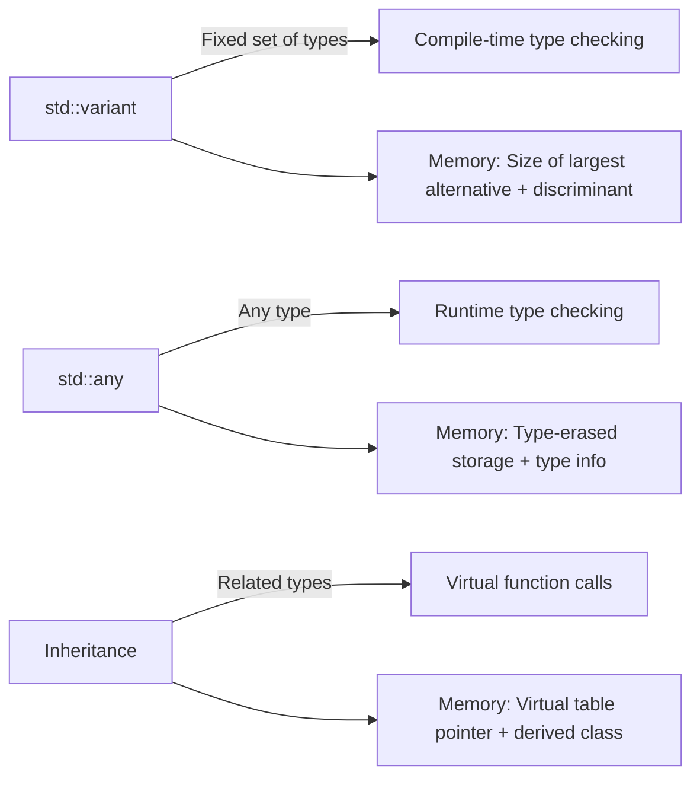

# C++ Variant

## Introduction

Have you ever wanted to store different types of values in a single variable? In C, you might use a `union`, but those are not type-safe and don't track which type is currently stored. C++17 introduced `std::variant`, a powerful template class that allows you to store values of different types in a single variable while maintaining type safety.

`std::variant` is part of the Standard Library and is defined in the `<variant>` header. It's essentially a type-safe union that knows which type it's currently holding, making it much safer and more useful than traditional unions.

## Basic Usage of std::variant

Let's start with a simple example of how to use `std::variant`:

```cpp
#include <iostream>
#include <variant>
#include <string>

int main() {
    // A variant that can hold either an int, double, or string
    std::variant<int, double, std::string> myVariant;
    
    // Default-initialized to the first alternative (int with value 0)
    std::cout << "Initially, variant holds: " << std::get<int>(myVariant) << std::endl;
    
    // Assign a double value
    myVariant = 3.14;
    std::cout << "Now variant holds: " << std::get<double>(myVariant) << std::endl;
    
    // Assign a string value
    myVariant = "Hello, Variant!";
    std::cout << "Finally, variant holds: " << std::get<std::string>(myVariant) << std::endl;
    
    return 0;
}
```

**Output:**
```
Initially, variant holds: 0
Now variant holds: 3.14
Finally, variant holds: Hello, Variant!
```

In this example, we defined a variant that can hold either an `int`, a `double`, or a `std::string`. We then assigned different types of values to it and used `std::get<T>` to retrieve the stored value.

## Checking the Current Type

What if you don't know which type the variant currently holds? You can use `std::holds_alternative` to check:

```cpp
#include <iostream>
#include <variant>
#include <string>

int main() {
    std::variant<int, double, std::string> myVariant = "Hello";
    
    if (std::holds_alternative<int>(myVariant)) {
        std::cout << "Variant holds an int: " << std::get<int>(myVariant) << std::endl;
    } 
    else if (std::holds_alternative<double>(myVariant)) {
        std::cout << "Variant holds a double: " << std::get<double>(myVariant) << std::endl;
    } 
    else if (std::holds_alternative<std::string>(myVariant)) {
        std::cout << "Variant holds a string: " << std::get<std::string>(myVariant) << std::endl;
    }
    
    return 0;
}
```

**Output:**
```
Variant holds a string: Hello
```

## Safe Value Access

Using `std::get<T>` is not always safe because it throws an exception if the variant doesn't hold the specified type. There are safer ways to access the value:

### Using std::get_if

```cpp
#include <iostream>
#include <variant>
#include <string>

int main() {
    std::variant<int, double, std::string> myVariant = 42;
    
    // get_if returns a pointer to the value if the type matches, or nullptr if not
    if (const int* pVal = std::get_if<int>(&myVariant)) {
        std::cout << "Variant holds an int: " << *pVal << std::endl;
    } else {
        std::cout << "Variant does not hold an int" << std::endl;
    }
    
    // Trying to get a type that isn't currently held
    if (const std::string* pStr = std::get_if<std::string>(&myVariant)) {
        std::cout << "Variant holds a string: " << *pStr << std::endl;
    } else {
        std::cout << "Variant does not hold a string" << std::endl;
    }
    
    return 0;
}
```

**Output:**
```
Variant holds an int: 42
Variant does not hold a string
```

## Visiting a Variant

The most elegant way to work with variants is by using the `std::visit` function, which applies a visitor function to the currently held value:

```cpp
#include <iostream>
#include <variant>
#include <string>

int main() {
    std::variant<int, double, std::string> myVariant = 3.14;
    
    // Using a lambda as a visitor
    std::visit([](const auto& value) {
        std::cout << "Variant holds: " << value << std::endl;
        
        // We can also check the specific type inside the visitor
        using T = std::decay_t<decltype(value)>;
        if constexpr (std::is_same_v<T, int>) {
            std::cout << "It's an integer!" << std::endl;
        } else if constexpr (std::is_same_v<T, double>) {
            std::cout << "It's a double!" << std::endl;
        } else if constexpr (std::is_same_v<T, std::string>) {
            std::cout << "It's a string!" << std::endl;
        }
    }, myVariant);
    
    return 0;
}
```

**Output:**
```
Variant holds: 3.14
It's a double!
```

The visitor pattern is very powerful because it enforces handling all possible types at compile time.

## Visitor with Multiple Return Types

You can also create visitors that return different types depending on the variant's content:

```cpp
#include <iostream>
#include <variant>
#include <string>

int main() {
    std::variant<int, double, std::string> myVariant = 42;
    
    auto result = std::visit([](const auto& value) -> std::string {
        using T = std::decay_t<decltype(value)>;
        
        if constexpr (std::is_same_v<T, int>) {
            return "Got an int: " + std::to_string(value);
        } else if constexpr (std::is_same_v<T, double>) {
            return "Got a double: " + std::to_string(value);
        } else if constexpr (std::is_same_v<T, std::string>) {
            return "Got a string: " + value;
        }
    }, myVariant);
    
    std::cout << result << std::endl;
    
    return 0;
}
```

**Output:**
```
Got an int: 42
```

## Overload Pattern for Visitors

For more complex visitors, you can use the overload pattern to create a visitor with multiple overloaded function call operators:

```cpp
#include <iostream>
#include <variant>
#include <string>

// Helper template for creating overloaded visitors
template<class... Ts>
struct overloaded : Ts... {
    using Ts::operator()...;
};

// Class template deduction guide (C++17)
template<class... Ts> overloaded(Ts...) -> overloaded<Ts...>;

int main() {
    std::variant<int, double, std::string> myVariant = "Hello, Visitor!";
    
    std::visit(overloaded {
        [](int value) { std::cout << "It's an int: " << value << std::endl; },
        [](double value) { std::cout << "It's a double: " << value << std::endl; },
        [](const std::string& value) { std::cout << "It's a string: " << value << std::endl; }
    }, myVariant);
    
    return 0;
}
```

**Output:**
```
It's a string: Hello, Visitor!
```

## Real-World Example: Parsing Different Data Types

Let's consider a real-world example where `std::variant` is useful. Imagine you're parsing a configuration file that can contain different types of values:

```cpp
#include <iostream>
#include <variant>
#include <string>
#include <map>
#include <fstream>
#include <sstream>

// A configuration value can be a string, int, double, or boolean
using ConfigValue = std::variant<std::string, int, double, bool>;

class Configuration {
private:
    std::map<std::string, ConfigValue> settings;

public:
    void load(const std::string& filename) {
        std::ifstream file(filename);
        if (!file.is_open()) {
            std::cerr << "Failed to open file: " << filename << std::endl;
            return;
        }

        std::string line;
        while (std::getline(file, line)) {
            // Skip empty lines and comments
            if (line.empty() || line[0] == '#') continue;
            
            std::istringstream iss(line);
            std::string key, value_str;
            
            if (std::getline(iss, key, '=') && std::getline(iss, value_str)) {
                // Trim whitespace
                key.erase(0, key.find_first_not_of(" \t"));
                key.erase(key.find_last_not_of(" \t") + 1);
                value_str.erase(0, value_str.find_first_not_of(" \t"));
                value_str.erase(value_str.find_last_not_of(" \t") + 1);
                
                // Try to interpret the value
                parseValue(key, value_str);
            }
        }
    }
    
    void parseValue(const std::string& key, const std::string& value_str) {
        // Try to parse as boolean
        if (value_str == "true" || value_str == "false") {
            settings[key] = (value_str == "true");
            return;
        }
        
        // Try to parse as integer
        try {
            size_t pos;
            int i_val = std::stoi(value_str, &pos);
            if (pos == value_str.size()) {
                settings[key] = i_val;
                return;
            }
        } catch (...) {}
        
        // Try to parse as double
        try {
            size_t pos;
            double d_val = std::stod(value_str, &pos);
            if (pos == value_str.size()) {
                settings[key] = d_val;
                return;
            }
        } catch (...) {}
        
        // Default to string
        settings[key] = value_str;
    }
    
    void printConfig() const {
        for (const auto& [key, value] : settings) {
            std::cout << key << " = ";
            std::visit([](const auto& v) { std::cout << v; }, value);
            
            // Print the type for clarity
            std::visit([](const auto& v) {
                using T = std::decay_t<decltype(v)>;
                if constexpr (std::is_same_v<T, std::string>)
                    std::cout << " (string)";
                else if constexpr (std::is_same_v<T, int>)
                    std::cout << " (int)";
                else if constexpr (std::is_same_v<T, double>)
                    std::cout << " (double)";
                else if constexpr (std::is_same_v<T, bool>)
                    std::cout << " (bool)";
            }, value);
            
            std::cout << std::endl;
        }
    }
    
    template<typename T>
    T get(const std::string& key) const {
        auto it = settings.find(key);
        if (it != settings.end()) {
            try {
                return std::get<T>(it->second);
            } catch (const std::bad_variant_access&) {
                std::cerr << "Configuration value '" << key << "' is not of requested type" << std::endl;
            }
        } else {
            std::cerr << "Configuration key '" << key << "' not found" << std::endl;
        }
        
        // Return a default-constructed value if the key doesn't exist or has the wrong type
        return T{};
    }
};

int main() {
    // Simulate a config file
    std::ofstream temp_config("temp_config.txt");
    temp_config << "server_name = My Server\n";
    temp_config << "max_connections = 100\n";
    temp_config << "timeout = 30.5\n";
    temp_config << "debug_mode = true\n";
    temp_config.close();
    
    Configuration config;
    config.load("temp_config.txt");
    config.printConfig();
    
    // Use the typed getters
    std::string server = config.get<std::string>("server_name");
    int max_conn = config.get<int>("max_connections");
    double timeout = config.get<double>("timeout");
    bool debug = config.get<bool>("debug_mode");
    
    std::cout << "\nUsing typed getters:\n";
    std::cout << "Server: " << server << std::endl;
    std::cout << "Max Connections: " << max_conn << std::endl;
    std::cout << "Timeout: " << timeout << std::endl;
    std::cout << "Debug Mode: " << (debug ? "Enabled" : "Disabled") << std::endl;
    
    // Cleanup
    std::remove("temp_config.txt");
    
    return 0;
}
```

**Output:**
```
debug_mode = 1 (bool)
max_connections = 100 (int)
server_name = My Server (string)
timeout = 30.5 (double)

Using typed getters:
Server: My Server
Max Connections: 100
Timeout: 30.5
Debug Mode: Enabled
```

In this example, we use `std::variant` to store configuration values of different types. This is much safer and more convenient than trying to handle different types with separate variables or converting everything to strings.

## Handling Exceptional Cases

`std::variant` can also hold a valueless state, though this is rare. It happens when an exception is thrown during assignment:

```cpp
#include <iostream>
#include <variant>
#include <string>
#include <stdexcept>

class ThrowOnCopy {
public:
    ThrowOnCopy() = default;
    ThrowOnCopy(const ThrowOnCopy&) {
        throw std::runtime_error("Exception during copy!");
    }
};

int main() {
    try {
        std::variant<int, ThrowOnCopy> v = 10;
        std::cout << "Variant holds int: " << std::get<int>(v) << std::endl;
        
        ThrowOnCopy obj;
        // This will throw during the copy into the variant
        v = obj;
    } 
    catch (const std::exception& e) {
        std::cout << "Caught exception: " << e.what() << std::endl;
    }
    
    std::variant<int, ThrowOnCopy> v = 42;
    
    try {
        // After an exception during assignment, the variant is valueless
        std::get<int>(v); // This will throw std::bad_variant_access
    } 
    catch (const std::bad_variant_access& e) {
        std::cout << "Bad variant access: " << e.what() << std::endl;
    }
    
    // Check if the variant is valueless
    std::cout << "Variant is " 
              << (v.valueless_by_exception() ? "valueless" : "not valueless") 
              << std::endl;
    
    return 0;
}
```

## Performance Considerations

`std::variant` stores its alternatives in a union and uses extra space to keep track of which type is active. It's generally more efficient than dynamic solutions like `std::any` or inheritance-based polymorphism when you have a fixed set of types. Here's a comparison:



## Summary

`std::variant` is a powerful feature in modern C++ that provides type-safe unions. It's particularly useful when:

- You need to store one of several possible types in a variable
- You want compile-time type safety
- You want to avoid the overhead of dynamic polymorphism
- You have a fixed set of unrelated types that you need to work with

Key points to remember:

1. `std::variant` stores one of several alternative types
2. It's initialized with the first alternative by default
3. Use `std::get<T>` to access a value by type (may throw an exception)
4. Use `std::get_if<T>` for safe access (returns nullptr if the type doesn't match)
5. Use `std::holds_alternative<T>` to check which type is currently held
6. Use `std::visit` for type-safe processing of the current value
7. It's more efficient than `std::any` or inheritance for a fixed set of types

## Exercises

1. Create a variant that can hold an integer, a string, or a vector of doubles, and write a visitor that calculates the "size" of each (length of string, number of elements in vector, or the integer value itself).

2. Implement a simple calculator that can evaluate expressions with different return types (int, double, or bool) using variants.

3. Create a function that takes a variant containing different numeric types and returns a variant with the same types but with the value doubled.

4. Modify the configuration example to support arrays of values (e.g., "allowed_ports = [80, 443, 8080]").

5. Implement a simple state machine using variants to represent different states and transitions.

## Additional Resources

- [C++ Reference for std::variant](https://en.cppreference.com/w/cpp/utility/variant)
- [C++17 In Detail: std::variant](https://en.cppreference.com/w/cpp/utility/variant)
- ["Variants: Past, Present, and Future" - David Sankel (CppCon 2016)](https://www.youtube.com/watch?v=k3O4EKX4z1c)
- [C++ Core Guidelines: F.18: For "will-happen" choices, use std::variant](https://isocpp.github.io/CppCoreGuidelines/CppCoreGuidelines#f18-for-will-happen-choices-use-stdvariant)