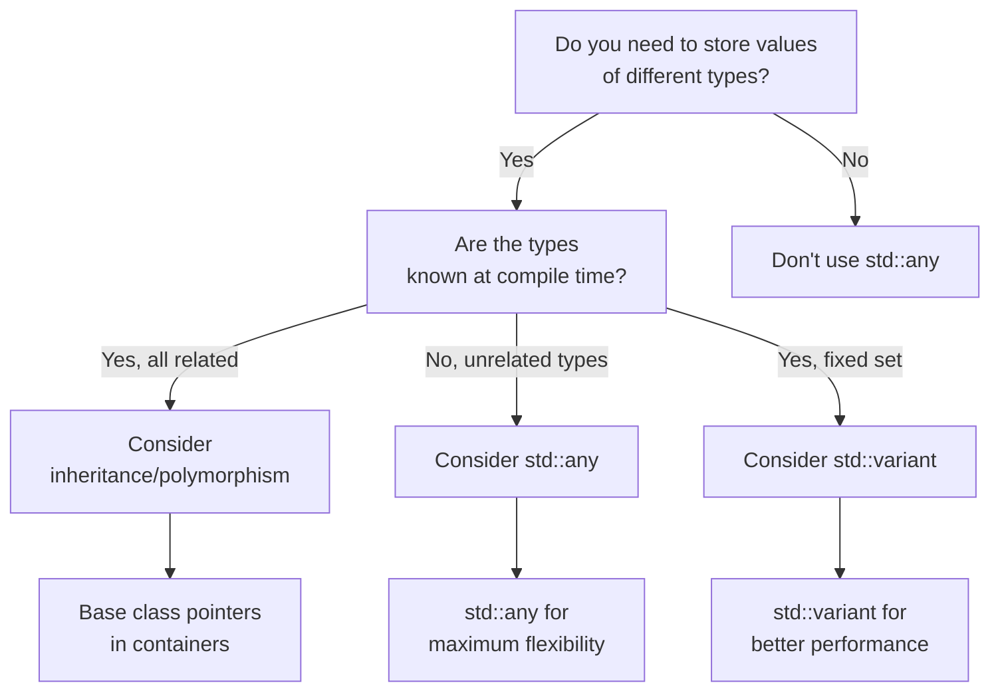

# C++ Any

## Introduction

Have you ever needed to store values of different types in the same container or variable but found inheritance and polymorphism too restrictive? C++17 introduced `std::any`, a type-safe container that can store a single value of any type. This powerful feature enables flexible type erasure and runtime polymorphism without requiring inheritance relationships.

`std::any` is part of the C++17 standard and lives in the `<any>` header. It allows you to work with heterogeneous types in a type-safe manner, unlike the old C-style approach of using `void*` pointers which lacks type safety.

## Basic Usage

Let's start with the simplest example of using `std::any`:

```cpp
#include <any>
#include <iostream>
#include <string>

int main() {
    // Create an empty std::any
    std::any a;
    
    // Check if it holds a value
    std::cout << "Initially, a.has_value(): " << std::boolalpha << a.has_value() << std::endl;
    
    // Assign an integer
    a = 42;
    std::cout << "After assignment, a.has_value(): " << a.has_value() << std::endl;
    std::cout << "Value: " << std::any_cast<int>(a) << std::endl;
    
    // Assign a string
    a = std::string("Hello, std::any!");
    std::cout << "Value: " << std::any_cast<std::string>(a) << std::endl;
    
    return 0;
}
```

**Output:**
```
Initially, a.has_value(): false
After assignment, a.has_value(): true
Value: 42
Value: Hello, std::any!
```

In this example:
1. We create an empty `std::any` object
2. We check if it contains a value using `has_value()`
3. We assign an integer value and retrieve it using `std::any_cast<int>`
4. We assign a string value and retrieve it using `std::any_cast<std::string>`

## Key Operations

### Creating and Assigning Values

You can create a `std::any` in several ways:

```cpp
#include <any>
#include <string>
#include <vector>

int main() {
    // Default constructor - creates an empty any
    std::any empty;
    
    // Direct initialization with a value
    std::any intValue(42);
    std::any stringValue(std::string("Hello"));
    
    // Using make_any helper (similar to make_shared/make_unique)
    auto floatValue = std::make_any<float>(3.14f);
    
    // Assignment after creation
    std::any a;
    a = 100;                      // Store an int
    a = 3.14;                     // Now store a double
    a = std::vector<int>{1,2,3};  // Now store a vector
    
    return 0;
}
```

### Checking the Type

You can check what type is currently stored using `type()`:

```cpp
#include <any>
#include <iostream>
#include <typeinfo>

int main() {
    std::any a = 42;
    
    // Get the type information
    const std::type_info& typeInfo = a.type();
    std::cout << "Type name: " << typeInfo.name() << std::endl;
    
    // Check if it's an int
    bool isInt = (a.type() == typeid(int));
    std::cout << "Is int? " << std::boolalpha << isInt << std::endl;
    
    a = std::string("Now I'm a string");
    isInt = (a.type() == typeid(int));
    std::cout << "Is int? " << isInt << std::endl;
    
    return 0;
}
```

**Output (may vary by compiler):**
```
Type name: i
Is int? true
Is int? false
```

### Retrieving Values with any_cast

The primary way to access the stored value is through `std::any_cast`:

```cpp
#include <any>
#include <iostream>
#include <string>

int main() {
    std::any a = 42;
    
    try {
        // Correct cast
        int value = std::any_cast<int>(a);
        std::cout << "Value: " << value << std::endl;
        
        // Incorrect cast - will throw std::bad_any_cast
        std::string str = std::any_cast<std::string>(a);
    } 
    catch(const std::bad_any_cast& e) {
        std::cout << "Exception: " << e.what() << std::endl;
    }
    
    // Using pointer version for safer access
    if(int* valuePtr = std::any_cast<int>(&a)) {
        std::cout << "Value via pointer: " << *valuePtr << std::endl;
    }
    
    if(std::string* strPtr = std::any_cast<std::string>(&a)) {
        std::cout << "String value: " << *strPtr << std::endl;
    } else {
        std::cout << "Not a string" << std::endl;
    }
    
    return 0;
}
```

**Output:**
```
Value: 42
Exception: bad any_cast
Value via pointer: 42
Not a string
```

There are two forms of `any_cast`:
1. **Value form**: `std::any_cast<T>(a)` - returns the value or throws `std::bad_any_cast` if the type doesn't match
2. **Pointer form**: `std::any_cast<T>(&a)` - returns a pointer to the value or `nullptr` if the type doesn't match

## Practical Examples

### Heterogeneous Property Bag

A common use case for `std::any` is implementing a property bag or attributes system:

```cpp
#include <any>
#include <string>
#include <unordered_map>
#include <iostream>

class PropertyBag {
private:
    std::unordered_map<std::string, std::any> properties;

public:
    template<typename T>
    void setProperty(const std::string& name, T value) {
        properties[name] = std::any(std::move(value));
    }
    
    template<typename T>
    T getProperty(const std::string& name, const T& defaultValue = T{}) const {
        auto it = properties.find(name);
        if (it != properties.end()) {
            try {
                return std::any_cast<T>(it->second);
            } catch (const std::bad_any_cast&) {
                return defaultValue;
            }
        }
        return defaultValue;
    }
    
    bool hasProperty(const std::string& name) const {
        return properties.find(name) != properties.end();
    }
};

int main() {
    PropertyBag props;
    
    // Set various properties
    props.setProperty("name", std::string("Widget"));
    props.setProperty("width", 100);
    props.setProperty("height", 200);
    props.setProperty("visible", true);
    props.setProperty("tags", std::vector<std::string>{"UI", "Container"});
    
    // Retrieve properties
    std::string name = props.getProperty<std::string>("name");
    int width = props.getProperty<int>("width");
    bool visible = props.getProperty<bool>("visible");
    
    std::cout << "Name: " << name << std::endl;
    std::cout << "Width: " << width << std::endl;
    std::cout << "Visible: " << std::boolalpha << visible << std::endl;
    
    // Using a default value for a non-existent property
    int depth = props.getProperty<int>("depth", 10);
    std::cout << "Depth (default): " << depth << std::endl;
    
    return 0;
}
```

**Output:**
```
Name: Widget
Width: 100
Visible: true
Depth (default): 10
```

### Plugin System

Another practical application is building a simple plugin system:

```cpp
#include <any>
#include <iostream>
#include <string>
#include <unordered_map>
#include <functional>
#include <memory>

// A simple plugin system
class PluginManager {
private:
    std::unordered_map<std::string, std::any> plugins;

public:
    template<typename PluginType, typename... Args>
    void registerPlugin(const std::string& name, Args&&... args) {
        plugins[name] = std::make_shared<PluginType>(std::forward<Args>(args)...);
    }
    
    template<typename PluginType>
    std::shared_ptr<PluginType> getPlugin(const std::string& name) {
        auto it = plugins.find(name);
        if (it != plugins.end()) {
            try {
                return std::any_cast<std::shared_ptr<PluginType>>(it->second);
            } catch (const std::bad_any_cast&) {
                return nullptr;
            }
        }
        return nullptr;
    }
};

// Plugin interfaces
struct Logger {
    virtual ~Logger() = default;
    virtual void log(const std::string& message) = 0;
};

struct FileHandler {
    virtual ~FileHandler() = default;
    virtual bool save(const std::string& data) = 0;
    virtual std::string load() = 0;
};

// Plugin implementations
class ConsoleLogger : public Logger {
public:
    void log(const std::string& message) override {
        std::cout << "[LOG] " << message << std::endl;
    }
};

class SimpleFileHandler : public FileHandler {
    std::string lastData;
public:
    bool save(const std::string& data) override {
        std::cout << "Saving data: " << data << std::endl;
        lastData = data;
        return true;
    }
    
    std::string load() override {
        std::cout << "Loading data" << std::endl;
        return lastData;
    }
};

int main() {
    PluginManager plugins;
    
    // Register plugins
    plugins.registerPlugin<ConsoleLogger>("logger");
    plugins.registerPlugin<SimpleFileHandler>("fileHandler");
    
    // Use plugins
    auto logger = plugins.getPlugin<Logger>("logger");
    if (logger) {
        logger->log("System initialized");
    }
    
    auto fileHandler = plugins.getPlugin<FileHandler>("fileHandler");
    if (fileHandler) {
        fileHandler->save("Important data");
        std::string data = fileHandler->load();
        
        if (logger) {
            logger->log("Loaded data: " + data);
        }
    }
    
    return 0;
}
```

**Output:**
```
[LOG] System initialized
Saving data: Important data
Loading data
[LOG] Loaded data: Important data
```

## Common Pitfalls and Best Practices

### Performance Considerations

`std::any` involves dynamic memory allocation and type erasure, which adds overhead:

```cpp
#include <any>
#include <string>
#include <iostream>
#include <chrono>
#include <vector>

// A simple benchmark function
template<typename Func>
long long benchmark(Func func, int iterations) {
    auto start = std::chrono::high_resolution_clock::now();
    
    for (int i = 0; i < iterations; ++i) {
        func();
    }
    
    auto end = std::chrono::high_resolution_clock::now();
    return std::chrono::duration_cast<std::chrono::microseconds>(end - start).count();
}

int main() {
    const int iterations = 1000000;
    
    // Benchmark direct int usage
    auto directTime = benchmark([&]() {
        int x = 42;
        int y = x + 1;
        (void)y; // Prevent optimization
    }, iterations);
    
    // Benchmark std::any
    auto anyTime = benchmark([&]() {
        std::any a = 42;
        int x = std::any_cast<int>(a);
        int y = x + 1;
        (void)y; // Prevent optimization
    }, iterations);
    
    std::cout << "Direct int: " << directTime << " microseconds" << std::endl;
    std::cout << "std::any: " << anyTime << " microseconds" << std::endl;
    std::cout << "Overhead factor: " << (double)anyTime / directTime << "x" << std::endl;
    
    return 0;
}
```

**Example Output:**
```
Direct int: 1234 microseconds
std::any: 12543 microseconds
Overhead factor: 10.165x
```

### Memory Management

`std::any` automatically manages memory for stored values:

```cpp
#include <any>
#include <iostream>
#include <string>
#include <memory>

class Resource {
public:
    Resource(const std::string& id) : id_(id) {
        std::cout << "Resource " << id_ << " created" << std::endl;
    }
    
    ~Resource() {
        std::cout << "Resource " << id_ << " destroyed" << std::endl;
    }
    
    std::string getId() const { return id_; }
    
private:
    std::string id_;
};

int main() {
    {
        std::any a;
        
        // Assign a resource
        a = Resource("A");
        std::cout << "Resource ID: " << std::any_cast<Resource>(a).getId() << std::endl;
        
        // Reassign - previous resource is destroyed
        a = Resource("B");
        std::cout << "New resource ID: " << std::any_cast<Resource>(a).getId() << std::endl;
        
        // Reset explicitly
        a.reset();
        std::cout << "After reset, has_value: " << std::boolalpha << a.has_value() << std::endl;
    }
    // The any object goes out of scope here
    
    return 0;
}
```

**Output:**
```
Resource A created
Resource ID: A
Resource B created
New resource ID: B
Resource A destroyed
Resource B destroyed
After reset, has_value: false
```

### Type Safety

Unlike `void*`, `std::any` maintains type safety:

```cpp
#include <any>
#include <iostream>
#include <string>

int main() {
    std::any a = 42;
    
    // Safe type checking
    if (a.type() == typeid(int)) {
        std::cout << "Contains an int: " << std::any_cast<int>(a) << std::endl;
    }
    
    // Safe conversion
    try {
        double d = std::any_cast<double>(a);  // Wrong type
        std::cout << "Value: " << d << std::endl;
    }
    catch (const std::bad_any_cast& e) {
        std::cout << "Type error: " << e.what() << std::endl;
    }
    
    return 0;
}
```

**Output:**
```
Contains an int: 42
Type error: bad any_cast
```

## When to Use std::any

`std::any` is most appropriate in these scenarios:



**Good use cases:**
- Plugin systems
- Property bags
- Configuration systems
- Script binding
- Serialization/deserialization

**Alternatives to consider:**
- **std::variant**: When you know the fixed set of possible types at compile time
- **Polymorphism**: When the types share a common interface
- **Templates**: When the operations on the types can be resolved at compile time

## Summary

`std::any` is a powerful addition to C++17 that provides type-safe storage for single values of arbitrary types. Key points to remember:

- `std::any` allows you to store values of any type in a type-safe manner
- Use `std::any_cast` to retrieve values, either with exceptions or with null pointer checks
- `std::any` handles memory management automatically
- It's ideal for scenarios with truly dynamic types but comes with runtime overhead
- Consider alternatives like `std::variant` or inheritance when you have a more constrained set of types

## Additional Resources

- [C++ Reference - std::any](https://en.cppreference.com/w/cpp/utility/any)
- [C++17 - The Complete Guide by Nicolai Josuttis](https://leanpub.com/cpp17)
- [CppCon 2016: Stephen T. Lavavej "std::variant and std::visit"](https://www.youtube.com/watch?v=0Lwy4_sKeJM)

## Exercises

1. Create a function that takes a vector of `std::any` and counts how many elements of each type it contains.
2. Implement a simple JSON-like value class using `std::any` that can store null, boolean, number, string, array, and object types.
3. Build a command line argument parser that can store different types of arguments (integers, strings, booleans) using `std::any`.
4. Extend the PropertyBag example to support notifications when properties change.
5. Compare the performance of `std::any` vs. `std::variant` for a specific use case in your domain.