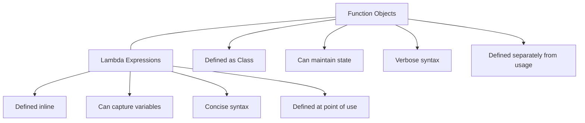

# C++ Lambda Expressions

## Introduction

Lambda expressions, introduced in C++11, are one of the most powerful features of modern C++. They allow you to define anonymous functions (functions without names) right at the location where they are needed. This feature enables more concise and readable code, especially when working with algorithms and callbacks.

Think of lambda expressions as small, inline functions that you can define on the spot, without having to declare a separate function elsewhere in your code. This is particularly useful for short operations that you only need to use once.

## Basic Syntax of Lambda Expressions

A lambda expression in C++ has the following general syntax:

```cpp
[capture-list](parameters) -> return_type { body }
```

Let's break down each component:

- **Capture list**: Specifies which variables from the surrounding scope are accessible inside the lambda. It can be empty `[]`.
- **Parameters**: Similar to function parameters, defining inputs to the lambda (optional).
- **Return type**: Specifies the type returned by the lambda (optional, can be deduced in most cases).
- **Body**: The actual code to be executed when the lambda is called.

### A Simple Lambda Example

```cpp
#include <iostream>

int main() {
    // A simple lambda that takes no parameters and returns nothing
    auto sayHello = []() {
        std::cout << "Hello, Lambda!" << std::endl;
    };
    
    // Calling the lambda
    sayHello();
    
    return 0;
}
```

**Output:**
```
Hello, Lambda!
```

In this example, we defined a lambda expression that prints a message. We stored it in a variable `sayHello` and then called it like a function.

## Lambda Captures: Accessing Variables from Outside

One of the most powerful features of lambdas is their ability to "capture" variables from the surrounding scope. This allows them to access and use variables defined outside the lambda.

### Capture by Value

When you capture a variable by value, a copy of the variable is made and used inside the lambda.

```cpp
#include <iostream>

int main() {
    int x = 10;
    
    // Capturing x by value
    auto lambda = [x]() {
        std::cout << "x inside lambda: " << x << std::endl;
    };
    
    x = 20; // Changing x after the lambda is defined
    
    lambda(); // The lambda still uses the original value of x
    std::cout << "x outside lambda: " << x << std::endl;
    
    return 0;
}
```

**Output:**
```
x inside lambda: 10
x outside lambda: 20
```

Notice that the lambda used the value of `x` at the time the lambda was defined (10), not the modified value (20).

### Capture by Reference

You can also capture variables by reference, which allows the lambda to access and modify the original variable.

```cpp
#include <iostream>

int main() {
    int x = 10;
    
    // Capturing x by reference
    auto lambda = [&x]() {
        x = 30; // Modifying the original variable
        std::cout << "x inside lambda: " << x << std::endl;
    };
    
    lambda();
    std::cout << "x outside lambda after lambda call: " << x << std::endl;
    
    return 0;
}
```

**Output:**
```
x inside lambda: 30
x outside lambda after lambda call: 30
```

In this case, the lambda modified the original variable `x`.

### Default Captures

You can also capture all variables used in the lambda:

- `[=]` captures all variables by value
- `[&]` captures all variables by reference

```cpp
#include <iostream>

int main() {
    int a = 1, b = 2, c = 3;
    
    // Capturing all variables by value
    auto lambdaValue = [=]() {
        std::cout << "Values: " << a << ", " << b << ", " << c << std::endl;
    };
    
    // Capturing all variables by reference
    auto lambdaRef = [&]() {
        a *= 10; b *= 10; c *= 10;
        std::cout << "Modified values: " << a << ", " << b << ", " << c << std::endl;
    };
    
    lambdaValue();
    lambdaRef();
    std::cout << "Outside values: " << a << ", " << b << ", " << c << std::endl;
    
    return 0;
}
```

**Output:**
```
Values: 1, 2, 3
Modified values: 10, 20, 30
Outside values: 10, 20, 30
```

### Mixed Captures

You can also mix value and reference captures:

```cpp
#include <iostream>

int main() {
    int a = 1, b = 2;
    
    // Capture a by value and b by reference
    auto lambda = [a, &b]() {
        // Cannot modify a because it's captured by value
        // b can be modified as it's captured by reference
        b += 10;
        std::cout << "a: " << a << ", b: " << b << std::endl;
    };
    
    lambda();
    std::cout << "Outside - a: " << a << ", b: " << b << std::endl;
    
    return 0;
}
```

**Output:**
```
a: 1, b: 12
Outside - a: 1, b: 12
```

## Parameters in Lambda Expressions

Like regular functions, lambdas can accept parameters:

```cpp
#include <iostream>

int main() {
    // Lambda with parameters
    auto add = [](int a, int b) {
        return a + b;
    };
    
    int result = add(5, 3);
    std::cout << "5 + 3 = " << result << std::endl;
    
    return 0;
}
```

**Output:**
```
5 + 3 = 8
```

## Specifying Return Types

In most cases, the compiler can deduce the return type of a lambda. However, you can explicitly specify it:

```cpp
#include <iostream>

int main() {
    // Explicitly specifying the return type
    auto divide = [](double a, double b) -> double {
        if (b == 0) return 0;
        return a / b;
    };
    
    std::cout << "10 / 2 = " << divide(10, 2) << std::endl;
    std::cout << "10 / 0 = " << divide(10, 0) << std::endl;
    
    return 0;
}
```

**Output:**
```
10 / 2 = 5
10 / 0 = 0
```

## Using Lambdas with Standard Algorithms

One of the most common uses of lambda expressions is with standard library algorithms. Here's an example using `std::sort`:

```cpp
#include <iostream>
#include <vector>
#include <algorithm>

int main() {
    std::vector<int> numbers = {5, 2, 8, 1, 9, 3};
    
    // Sort in descending order using a lambda
    std::sort(numbers.begin(), numbers.end(), [](int a, int b) {
        return a > b;
    });
    
    std::cout << "Numbers sorted in descending order: ";
    for (int num : numbers) {
        std::cout << num << " ";
    }
    std::cout << std::endl;
    
    return 0;
}
```

**Output:**
```
Numbers sorted in descending order: 9 8 5 3 2 1
```

## Mutable Lambdas

By default, the body of a lambda cannot modify variables captured by value. To allow this, you can use the `mutable` keyword:

```cpp
#include <iostream>

int main() {
    int count = 0;
    
    // A mutable lambda that can modify count (though it's a copy)
    auto counter = [count]() mutable {
        count++;
        return count;
    };
    
    std::cout << "First call: " << counter() << std::endl;
    std::cout << "Second call: " << counter() << std::endl;
    std::cout << "Original count: " << count << std::endl;
    
    return 0;
}
```

**Output:**
```
First call: 1
Second call: 2
Original count: 0
```

Note that `mutable` only allows the lambda to modify its own copy of the captured variables, not the original variables.

## Real-World Application: Event Handling

Lambdas are particularly useful for event handling scenarios:

```cpp
#include <iostream>
#include <functional>
#include <vector>

// A simple event system
class Button {
private:
    std::function<void()> onClick;
    std::string name;
    
public:
    Button(const std::string& buttonName) : name(buttonName) {}
    
    void setOnClickHandler(std::function<void()> handler) {
        onClick = handler;
    }
    
    void click() {
        std::cout << "Button " << name << " clicked!" << std::endl;
        if (onClick) onClick();
    }
};

int main() {
    Button saveButton("Save");
    Button cancelButton("Cancel");
    
    int saveCount = 0;
    
    // Set click handlers using lambdas
    saveButton.setOnClickHandler([&saveCount]() {
        saveCount++;
        std::cout << "Data saved! Save count: " << saveCount << std::endl;
    });
    
    cancelButton.setOnClickHandler([]() {
        std::cout << "Operation cancelled!" << std::endl;
    });
    
    // Simulate button clicks
    saveButton.click();
    cancelButton.click();
    saveButton.click();
    
    return 0;
}
```

**Output:**
```
Button Save clicked!
Data saved! Save count: 1
Button Cancel clicked!
Operation cancelled!
Button Save clicked!
Data saved! Save count: 2
```

## Real-World Application: Data Transformation

Lambdas are excellent for data transformation tasks:

```cpp
#include <iostream>
#include <vector>
#include <algorithm>
#include <functional>

// A function that applies a transformation to each element
template<typename T, typename Func>
std::vector<T> transform_data(const std::vector<T>& data, Func transformer) {
    std::vector<T> result;
    std::transform(data.begin(), data.end(), std::back_inserter(result), transformer);
    return result;
}

int main() {
    std::vector<int> numbers = {1, 2, 3, 4, 5};
    
    // Square each number
    auto squared = transform_data(numbers, [](int x) { return x * x; });
    
    // Double each number
    auto doubled = transform_data(numbers, [](int x) { return x * 2; });
    
    // Increment each number
    auto incremented = transform_data(numbers, [](int x) { return x + 1; });
    
    // Display results
    std::cout << "Original: ";
    for (int n : numbers) std::cout << n << " ";
    
    std::cout << "\nSquared: ";
    for (int n : squared) std::cout << n << " ";
    
    std::cout << "\nDoubled: ";
    for (int n : doubled) std::cout << n << " ";
    
    std::cout << "\nIncremented: ";
    for (int n : incremented) std::cout << n << " ";
    
    std::cout << std::endl;
    
    return 0;
}
```

**Output:**
```
Original: 1 2 3 4 5 
Squared: 1 4 9 16 25 
Doubled: 2 4 6 8 10 
Incremented: 2 3 4 5 6
```

## Lambdas vs. Function Objects

Here's a comparison between lambdas and traditional function objects (functors):



Lambda expressions provide a more concise way to achieve the same functionality as function objects, making your code cleaner and more maintainable.

## Summary

Lambda expressions are a powerful feature of modern C++ that allow you to:

- Define functions inline, where they are used
- Capture variables from the surrounding scope
- Write more concise and readable code
- Simplify work with standard algorithms
- Implement callbacks and event handlers elegantly

The syntax of lambdas may seem complex at first, but they greatly enhance code readability and maintainability once you get comfortable with them.

## Further Learning

### Exercises

1. **Basic Lambda**: Write a lambda function that checks if a number is even and use it with `std::count_if` on a vector of integers.
2. **Capture Practice**: Create a lambda that calculates the average of a vector of numbers, capturing the vector by reference.
3. **Algorithm Implementation**: Implement a simple filtering function that uses a lambda to filter a vector based on a condition.
4. **Event System**: Expand the Button example to include different types of events and multiple event handlers.

### Additional Resources

- [C++ Reference: Lambda expressions](https://en.cppreference.com/w/cpp/language/lambda)
- [Microsoft's C++ Lambda Documentation](https://learn.microsoft.com/en-us/cpp/cpp/lambda-expressions-in-cpp)
- [C++11 Lambda Tutorial](https://www.cprogramming.com/c++11/c++11-lambda-closures.html)
- [Effective Modern C++](https://www.oreilly.com/library/view/effective-modern-c/9781491908419/) by Scott Meyers - Chapter on Lambda Expressions

Lambda expressions are a cornerstone of modern C++ programming. By mastering them, you'll write more elegant and efficient code, taking full advantage of C++'s functional programming capabilities.