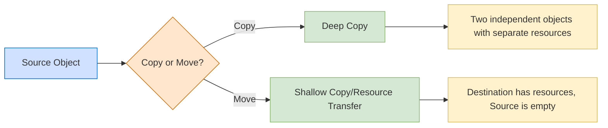

# C++ Rvalue References

## Introduction

Rvalue references, introduced in C++11, represent one of the most significant additions to the language in recent years. They form the foundation for move semantics and perfect forwarding, which dramatically improve performance for resource management operations.

In this tutorial, you'll learn:
- What rvalue references are and how they differ from lvalue references
- The concept of move semantics and why it matters
- How to implement move constructors and move assignment operators
- Practical applications and best practices for using rvalue references

Let's dive into this powerful C++ feature that helps write more efficient code!

## Understanding Lvalues and Rvalues

Before we explore rvalue references, let's ensure we understand what lvalues and rvalues are:

### Lvalues

An **lvalue** refers to an object that occupies some identifiable location in memory (like a variable).

```cpp
int x = 10; // x is an lvalue
```

Here, `x` has a memory location we can refer to.

### Rvalues

An **rvalue** is an expression that doesn't represent an object occupying a specific memory location (like a temporary or literal value).

```cpp
int x = 10; // 10 is an rvalue
int y = x + 20; // x + 20 is an rvalue
```

Here, `10` and `x + 20` are temporary values that don't persist beyond the expression.

## Lvalue References vs Rvalue References

Let's look at the difference between traditional references (lvalue references) and rvalue references:

### Lvalue References

An lvalue reference is declared with a single ampersand (`&`):

```cpp
int x = 10;
int& ref = x; // lvalue reference to x
// ref = 20; // This changes the value of x
```

Lvalue references must be initialized with lvalues, not rvalues:

```cpp
int& ref = 10; // Error: cannot bind lvalue reference to an rvalue
```

### Rvalue References

An rvalue reference is declared with a double ampersand (`&&`):

```cpp
int&& ref = 10; // Valid: rvalue reference bound to an rvalue
```

Rvalue references can bind to rvalues, but not to lvalues (without a cast):

```cpp
int x = 10;
int&& ref = x; // Error: cannot bind rvalue reference to an lvalue
int&& ref2 = std::move(x); // Valid: std::move casts x to an rvalue
```

## Example: Basic Rvalue References

```cpp
#include <iostream>

void process(int& x) {
    std::cout << "Lvalue reference: " << x << std::endl;
}

void process(int&& x) {
    std::cout << "Rvalue reference: " << x << std::endl;
}

int main() {
    int a = 10;
    
    process(a);        // Calls process(int& x)
    process(20);       // Calls process(int&& x)
    process(a + 5);    // Calls process(int&& x)
    
    return 0;
}
```

**Output:**
```
Lvalue reference: 10
Rvalue reference: 20
Rvalue reference: 15
```

## The Need for Move Semantics

Before move semantics, transferring ownership of resources (like memory) was inefficient:

```cpp
std::vector<int> createVector() {
    std::vector<int> result(1000, 42);
    return result; // Before C++11: expensive copy operation
}

std::vector<int> vec = createVector(); // Another copy!
```

With each copy, the entire vector's elements would be duplicated, leading to significant performance costs.

## Move Semantics with Rvalue References

Move semantics allow "stealing" resources from objects that are about to be destroyed (like temporaries), avoiding expensive deep copies.

### `std::move`

`std::move` is a utility that converts an lvalue to an rvalue reference, enabling move operations:

```cpp
#include <iostream>
#include <vector>
#include <string>

int main() {
    std::string str1 = "Hello, world!";
    std::string str2 = std::move(str1); // Move str1's content to str2
    
    std::cout << "str1: '" << str1 << "'" << std::endl; // str1 is now empty
    std::cout << "str2: '" << str2 << "'" << std::endl; // str2 has the content
    
    return 0;
}
```

**Output:**
```
str1: ''
str2: 'Hello, world!'
```

:::caution
After calling `std::move` on an object, it's in a valid but unspecified state. Don't assume anything about its contents after a move operation!
:::

## Move Constructor and Move Assignment

### Move Constructor

A move constructor transfers resources from another object instead of copying them:

```cpp
class MyString {
private:
    char* data;
    size_t size;

public:
    // Regular constructor
    MyString(const char* str) {
        size = strlen(str);
        data = new char[size + 1];
        memcpy(data, str, size + 1);
        std::cout << "Regular constructor" << std::endl;
    }
    
    // Copy constructor
    MyString(const MyString& other) {
        size = other.size;
        data = new char[size + 1];
        memcpy(data, other.data, size + 1);
        std::cout << "Copy constructor" << std::endl;
    }
    
    // Move constructor
    MyString(MyString&& other) noexcept {
        // Take ownership of other's resources
        data = other.data;
        size = other.size;
        
        // Reset other
        other.data = nullptr;
        other.size = 0;
        
        std::cout << "Move constructor" << std::endl;
    }
    
    // Destructor
    ~MyString() {
        delete[] data;
    }
    
    // For display
    void print() const {
        if (data) {
            std::cout << data << std::endl;
        } else {
            std::cout << "[empty]" << std::endl;
        }
    }
};
```

### Move Assignment Operator

Similar to the move constructor, but used for assignment operations:

```cpp
// Move assignment operator
MyString& operator=(MyString&& other) noexcept {
    if (this != &other) {
        // Free existing resources
        delete[] data;
        
        // Take ownership of other's resources
        data = other.data;
        size = other.size;
        
        // Reset other
        other.data = nullptr;
        other.size = 0;
    }
    std::cout << "Move assignment" << std::endl;
    return *this;
}
```

## Complete Example with Move Semantics

Here's a complete example showing when move operations are triggered:

```cpp
#include <iostream>
#include <utility>
#include <cstring>

class MyString {
private:
    char* data;
    size_t size;

public:
    // Regular constructor
    MyString(const char* str) {
        size = strlen(str);
        data = new char[size + 1];
        memcpy(data, str, size + 1);
        std::cout << "Regular constructor" << std::endl;
    }
    
    // Copy constructor
    MyString(const MyString& other) {
        size = other.size;
        data = new char[size + 1];
        memcpy(data, other.data, size + 1);
        std::cout << "Copy constructor" << std::endl;
    }
    
    // Move constructor
    MyString(MyString&& other) noexcept {
        data = other.data;
        size = other.size;
        other.data = nullptr;
        other.size = 0;
        std::cout << "Move constructor" << std::endl;
    }
    
    // Copy assignment
    MyString& operator=(const MyString& other) {
        if (this != &other) {
            delete[] data;
            size = other.size;
            data = new char[size + 1];
            memcpy(data, other.data, size + 1);
        }
        std::cout << "Copy assignment" << std::endl;
        return *this;
    }
    
    // Move assignment
    MyString& operator=(MyString&& other) noexcept {
        if (this != &other) {
            delete[] data;
            data = other.data;
            size = other.size;
            other.data = nullptr;
            other.size = 0;
        }
        std::cout << "Move assignment" << std::endl;
        return *this;
    }
    
    // Destructor
    ~MyString() {
        delete[] data;
    }
    
    // For display
    void print() const {
        if (data) {
            std::cout << data << std::endl;
        } else {
            std::cout << "[empty]" << std::endl;
        }
    }
};

// Function that returns by value
MyString createString() {
    MyString temp("Temporary String");
    return temp;  // Return value optimization may apply
}

int main() {
    std::cout << "1. Regular construction:" << std::endl;
    MyString s1("Hello");
    s1.print();
    
    std::cout << "\n2. Copy construction:" << std::endl;
    MyString s2 = s1;
    s2.print();
    
    std::cout << "\n3. Move construction with std::move:" << std::endl;
    MyString s3 = std::move(s1);
    std::cout << "s3: ";
    s3.print();
    std::cout << "s1 (after move): ";
    s1.print();
    
    std::cout << "\n4. Move construction from temporary:" << std::endl;
    MyString s4 = createString();
    s4.print();
    
    std::cout << "\n5. Copy assignment:" << std::endl;
    MyString s5("Target");
    s5 = s2;
    s5.print();
    
    std::cout << "\n6. Move assignment:" << std::endl;
    MyString s6("Another target");
    s6 = std::move(s2);
    std::cout << "s6: ";
    s6.print();
    std::cout << "s2 (after move): ";
    s2.print();
    
    return 0;
}
```

**Output:**
```
1. Regular construction:
Regular constructor
Hello

2. Copy construction:
Copy constructor
Hello

3. Move construction with std::move:
Move constructor
s3: Hello
s1 (after move): [empty]

4. Move construction from temporary:
Regular constructor
Move constructor
Temporary String

5. Copy assignment:
Regular constructor
Copy assignment
Hello

6. Move assignment:
Regular constructor
Move assignment
s6: Hello
s2 (after move): [empty]
```

## Perfect Forwarding

Rvalue references also enable "perfect forwarding" - the ability to pass arguments while preserving their value category (lvalue vs rvalue).

This is achieved with template functions and `std::forward`:

```cpp
#include <iostream>
#include <utility>

void process(int& x) {
    std::cout << "lvalue reference: " << x << std::endl;
}

void process(int&& x) {
    std::cout << "rvalue reference: " << x << std::endl;
}

// This template function preserves the value category of T
template<typename T>
void perfectForward(T&& arg) {
    process(std::forward<T>(arg));
}

int main() {
    int x = 10;
    
    std::cout << "Direct calls:" << std::endl;
    process(x);      // Calls process(int&)
    process(20);     // Calls process(int&&)
    
    std::cout << "\nForwarded calls:" << std::endl;
    perfectForward(x);   // Should call process(int&)
    perfectForward(20);  // Should call process(int&&)
    
    return 0;
}
```

**Output:**
```
Direct calls:
lvalue reference: 10
rvalue reference: 20

Forwarded calls:
lvalue reference: 10
rvalue reference: 20
```

The magic happens because `T&&` in a template parameter is a **universal reference** that can bind to both lvalues and rvalues, and `std::forward` ensures we preserve the original value category.

## Practical Applications

### 1. Efficient Resource Management

Move semantics are crucial for classes that manage resources:
- `std::string`
- `std::vector` and other containers
- Smart pointers like `std::unique_ptr`
- File handles, network connections, etc.

### 2. Improving Performance in STL Containers

```cpp
#include <iostream>
#include <vector>
#include <string>
#include <chrono>

int main() {
    const int iterations = 100000;
    std::vector<std::string> vecCopy;
    std::vector<std::string> vecMove;
    
    // Reserve space to avoid reallocations
    vecCopy.reserve(iterations);
    vecMove.reserve(iterations);
    
    std::string testString = "This is a test string that is long enough to allocate memory";
    
    // Time the copy operations
    auto startCopy = std::chrono::high_resolution_clock::now();
    for (int i = 0; i < iterations; i++) {
        vecCopy.push_back(testString);
    }
    auto endCopy = std::chrono::high_resolution_clock::now();
    
    // Time the move operations
    auto startMove = std::chrono::high_resolution_clock::now();
    for (int i = 0; i < iterations; i++) {
        vecMove.push_back(std::move(testString));
        testString = "This is a test string that is long enough to allocate memory"; // Restore for next iteration
    }
    auto endMove = std::chrono::high_resolution_clock::now();
    
    auto copyDuration = std::chrono::duration_cast<std::chrono::milliseconds>(endCopy - startCopy).count();
    auto moveDuration = std::chrono::duration_cast<std::chrono::milliseconds>(endMove - startMove).count();
    
    std::cout << "Copy duration: " << copyDuration << " ms" << std::endl;
    std::cout << "Move duration: " << moveDuration << " ms" << std::endl;
    std::cout << "Performance improvement: " << (copyDuration > 0 ? static_cast<double>(copyDuration) / moveDuration : 0) << "x" << std::endl;
    
    return 0;
}
```

### 3. Implementing the Move-and-Swap Idiom

A clean way to implement both move and copy operations:

```cpp
class Resource {
private:
    int* data;
    size_t size;

public:
    // Constructor and other methods...
    
    // Copy constructor
    Resource(const Resource& other) : data(nullptr), size(0) {
        Resource copy(other.data, other.size);
        swap(*this, copy);
    }
    
    // Move constructor
    Resource(Resource&& other) noexcept : data(nullptr), size(0) {
        swap(*this, other);
    }
    
    // Assignment operator (handles both copy and move)
    Resource& operator=(Resource other) noexcept {
        swap(*this, other);
        return *this;
    }
    
    // Swap function - the key to the idiom
    friend void swap(Resource& first, Resource& second) noexcept {
        // Enable ADL (not necessary in this case, but good practice)
        using std::swap;
        
        // Swap members
        swap(first.data, second.data);
        swap(first.size, second.size);
    }
    
    // Destructor
    ~Resource() {
        delete[] data;
    }
};
```

## Best Practices

1. **Mark move operations with `noexcept`**:
   This allows STL containers to use them in exception-safe contexts.

2. **Always leave moved-from objects in a valid, destructible state**:
   After moving from an object, it should be empty but still usable.

3. **Don't rely on specific values in moved-from objects**:
   The C++ standard only requires them to be valid, not to have specific values.

4. **Consider implementing the rule of five**:
   If you need a custom destructor, copy constructor, copy assignment, move constructor, or move assignment, you probably need all five.

5. **Use `std::move` to convert lvalues to rvalue references**:
   But remember it doesn't actually move anything—it just enables moving.

6. **Use `std::forward` for perfect forwarding**:
   When you need to preserve value categories in templated functions.

## Diagram: Move vs. Copy



## Summary

Rvalue references and move semantics are powerful C++11 features that improve performance by:

1. Enabling efficient transfer of resources instead of expensive copies
2. Facilitating perfect forwarding in template functions
3. Reducing memory allocations and deallocations
4. Optimizing operations with temporary objects

By understanding and properly implementing move operations, you can significantly improve the performance of your C++ code, especially when dealing with resource-managing classes.

## Additional Resources

1. [C++ Reference: Rvalue References](https://en.cppreference.com/w/cpp/language/reference#Rvalue_references)
2. [C++ Move Semantics - The Complete Guide](https://www.cprogramming.com/c++11/rvalue-references-and-move-semantics-in-c++11.html)
3. [CppCon Presentations on YouTube about Move Semantics](https://www.youtube.com/results?search_query=cppcon+move+semantics)

## Exercises

1. Implement a simple smart pointer class with move semantics.
2. Create a custom string class with both copy and move operations, and compare their performance.
3. Modify an existing class to support move operations and measure the performance improvement.
4. Implement a function that takes advantage of perfect forwarding to efficiently process both lvalues and rvalues.
5. Explain what would happen if you forgot to nullify pointers in a move constructor or move assignment operator.

Happy coding with modern C++!