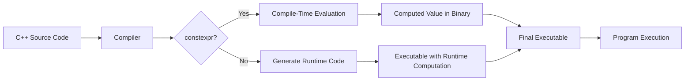

# C++ Constexpr

## Introduction

In modern C++, `constexpr` is one of the most powerful features introduced to enhance performance by enabling more computation to happen at compile time rather than runtime. First introduced in C++11 and significantly enhanced in C++14 and C++17, `constexpr` allows the programmer to specify that the value of a variable or the result of a function can be computed at compile time.

This feature is particularly valuable because:

1. **Performance**: Computations performed at compile time don't incur runtime costs
2. **Embedded Systems**: It enables complex calculations for resource-constrained environments
3. **Template Metaprogramming**: It simplifies many complex metaprogramming techniques

Let's dive into how `constexpr` works and how you can use it in your C++ programs.

## Basic Usage of constexpr

### constexpr Variables

At its simplest, `constexpr` can be used to declare variables that are guaranteed to be computed at compile time:

```cpp
constexpr int answer = 42;                  // Simple constant
constexpr double pi = 3.14159265358979323;  // Mathematical constant
constexpr int square_of_7 = 7 * 7;          // Compile-time computation
```

While this looks similar to using `const`, there's an important distinction: `constexpr` ensures that the value is computed at compile time, while `const` only promises that the variable won't be modified.

### constexpr Functions

The real power of `constexpr` comes when applied to functions:

```cpp
constexpr int square(int x) {
    return x * x;
}

// This will be computed at compile-time
constexpr int result = square(7);  // result = 49, determined during compilation

// This can be computed at either compile-time or runtime
int input;
cin >> input;
int dynamic_result = square(input);  // Computed at runtime
```

Let's see this in action with a full example:

```cpp
#include <iostream>

constexpr int factorial(int n) {
    return (n <= 1) ? 1 : n * factorial(n - 1);
}

int main() {
    // Computed at compile-time
    constexpr int fact5 = factorial(5);
    
    std::cout << "5! = " << fact5 << std::endl;
    
    // Can also be used at runtime
    int n;
    std::cout << "Enter a number to calculate factorial: ";
    std::cin >> n;
    
    // This call happens at runtime
    std::cout << n << "! = " << factorial(n) << std::endl;
    
    return 0;
}
```

**Output:**
```
5! = 120
Enter a number to calculate factorial: 6
6! = 720
```

## Evolution of constexpr Across C++ Versions

The capabilities of `constexpr` have expanded with each C++ version:

### C++11: Initial Introduction

- Basic arithmetic operations
- Simple control flow (ternary operator only)
- No loops, only recursion
- Limited to a single `return` statement

```cpp
// C++11 constexpr function - must be a single return statement
constexpr int max_cpp11(int a, int b) {
    return a > b ? a : b;
}
```

### C++14: Enhanced Capabilities

- Multiple statements allowed
- Local variables
- Loops (for, while)
- Multiple return paths
- Mutation of local variables

```cpp
// C++14 constexpr function - can use more complex logic
constexpr int factorial_cpp14(int n) {
    int result = 1;
    for (int i = 1; i <= n; ++i) {
        result *= i;
    }
    return result;
}
```

### C++17: Further Improvements

- if constexpr for compile-time conditional execution
- Lambda expressions can be constexpr
- More standard library functions became constexpr

```cpp
// C++17 if constexpr example
template <typename T>
constexpr auto get_value(T t) {
    if constexpr (std::is_pointer_v<T>) {
        return *t;
    } else {
        return t;
    }
}
```

### C++20: Even More Power

- Constexpr containers and algorithms
- `consteval` and `constinit` keywords
- Virtual function calls
- try-catch blocks
- Dynamic memory allocation (new/delete)

## Practical Applications

### Example 1: Compile-time Lookup Tables

One common use for `constexpr` is generating lookup tables at compile time:

```cpp
#include <iostream>
#include <array>

// Create a compile-time sine table
constexpr double pi = 3.14159265358979323846;

constexpr double to_radians(double degrees) {
    return degrees * (pi / 180.0);
}

constexpr double sine_impl(double x) {
    // Simple Taylor series approximation for sin(x)
    double result = 0;
    double term = x;
    double factorial = 1;
    
    for (int i = 1; i <= 9; i += 2) {
        result += (i % 4 == 1 ? 1.0 : -1.0) * term / factorial;
        term *= x * x;
        factorial *= (i + 1) * (i + 2);
    }
    
    return result;
}

constexpr std::array<double, 91> create_sine_table() {
    std::array<double, 91> result{};
    for (int i = 0; i <= 90; i++) {
        result[i] = sine_impl(to_radians(i));
    }
    return result;
}

// Our lookup table is computed at compile time
constexpr auto sine_table = create_sine_table();

int main() {
    // No runtime computation for these lookups
    std::cout << "sin(0°) = " << sine_table[0] << std::endl;
    std::cout << "sin(30°) = " << sine_table[30] << std::endl;
    std::cout << "sin(45°) = " << sine_table[45] << std::endl;
    std::cout << "sin(60°) = " << sine_table[60] << std::endl;
    std::cout << "sin(90°) = " << sine_table[90] << std::endl;
    
    return 0;
}
```

**Output:**
```
sin(0°) = 0
sin(30°) = 0.5
sin(45°) = 0.707107
sin(60°) = 0.866025
sin(90°) = 1
```

### Example 2: Compile-time String Processing

With C++17 and `if constexpr`, we can do powerful string operations at compile time:

```cpp
#include <iostream>
#include <string_view>

// Compile-time function to count occurrences of a character
constexpr size_t count_char(std::string_view str, char c) {
    size_t count = 0;
    for (auto ch : str) {
        if (ch == c) count++;
    }
    return count;
}

// Compile-time function to check if a string is a palindrome
constexpr bool is_palindrome(std::string_view str) {
    for (size_t i = 0; i < str.size() / 2; i++) {
        if (str[i] != str[str.size() - i - 1]) {
            return false;
        }
    }
    return true;
}

int main() {
    // These are evaluated at compile time
    constexpr auto a_count = count_char("banana", 'a');
    constexpr auto is_pal1 = is_palindrome("racecar");
    constexpr auto is_pal2 = is_palindrome("hello");
    
    std::cout << "Number of 'a's in 'banana': " << a_count << std::endl;
    std::cout << "'racecar' is a palindrome: " << (is_pal1 ? "true" : "false") << std::endl;
    std::cout << "'hello' is a palindrome: " << (is_pal2 ? "true" : "false") << std::endl;
    
    return 0;
}
```

**Output:**
```
Number of 'a's in 'banana': 3
'racecar' is a palindrome: true
'hello' is a palindrome: false
```

### Example 3: Compile-time Type Traits

`constexpr` can be used for compile-time type operations:

```cpp
#include <iostream>
#include <type_traits>

// A compile-time function to get the size of any type in bits
template <typename T>
constexpr size_t get_size_in_bits() {
    return sizeof(T) * 8;
}

// A compile-time function to check if a type can hold another type's values
template <typename T, typename U>
constexpr bool can_hold_type() {
    if constexpr (std::is_integral_v<T> && std::is_integral_v<U>) {
        if constexpr (std::is_signed_v<T> == std::is_signed_v<U>) {
            // Same signedness, simple size comparison
            return sizeof(T) >= sizeof(U);
        } else if constexpr (std::is_signed_v<T> && !std::is_signed_v<U>) {
            // T is signed, U is unsigned
            return sizeof(T) > sizeof(U);
        } else {
            // T is unsigned, U is signed
            return false; // Conservative - would need more complex check
        }
    }
    return false;
}

int main() {
    // All evaluated at compile time
    constexpr auto int_bits = get_size_in_bits<int>();
    constexpr auto char_bits = get_size_in_bits<char>();
    constexpr auto double_bits = get_size_in_bits<double>();
    
    constexpr auto int_can_hold_char = can_hold_type<int, char>();
    constexpr auto char_can_hold_int = can_hold_type<char, int>();
    
    std::cout << "Size of int: " << int_bits << " bits" << std::endl;
    std::cout << "Size of char: " << char_bits << " bits" << std::endl;
    std::cout << "Size of double: " << double_bits << " bits" << std::endl;
    
    std::cout << "int can hold char: " << (int_can_hold_char ? "true" : "false") << std::endl;
    std::cout << "char can hold int: " << (char_can_hold_int ? "true" : "false") << std::endl;
    
    return 0;
}
```

**Output:**
```
Size of int: 32 bits
Size of char: 8 bits
Size of double: 64 bits
int can hold char: true
char can hold int: false
```

## Best Practices and Limitations

### When to Use constexpr

- For values that can be computed at compile time
- For functions that might be used in both compile-time and runtime contexts
- For creating compile-time lookup tables or data structures
- For optimizing performance-critical code
- For template metaprogramming

### Limitations

1. **C++11 Restrictions**: In C++11, `constexpr` functions can only contain a single return statement. Later standards relaxed this requirement.

2. **Library Support**: Not all standard library functions are marked as `constexpr`, though this is improving with each C++ version.

3. **Debugging**: Compile-time errors in complex `constexpr` functions can be harder to debug.

4. **Compilation Time**: Heavy use of `constexpr` can increase compilation times.

### Best Practices

1. **Keep it Simple**: Make `constexpr` functions clear and straightforward.

2. **Use Where Beneficial**: Don't mark everything as `constexpr` just because you can.

3. **Fallback to Runtime**: Design `constexpr` functions to work correctly at runtime too.

```cpp
// Example of good practice - works at both compile-time and runtime
constexpr int fibonacci(int n) {
    if (n <= 1) return n;
    
    int a = 0, b = 1;
    for (int i = 2; i <= n; ++i) {
        int tmp = a + b;
        a = b;
        b = tmp;
    }
    return b;
}
```

## Visual Representation: Compile-Time vs. Runtime Evaluation



## Summary

`constexpr` is a powerful feature in modern C++ that enables computation at compile time. Its benefits include:

1. **Better Performance**: Calculations are done during compilation, eliminating runtime overhead.
2. **Code Safety**: Errors in `constexpr` functions are caught at compile time.
3. **Enhanced Readability**: Intent is clearer compared to older metaprogramming techniques.
4. **Flexibility**: The same function can be used for both compile-time and runtime computations.

As C++ evolves, `constexpr` continues to gain capabilities, making it an increasingly important tool for C++ developers seeking to optimize their code.

## Exercises

1. Write a `constexpr` function to calculate the nth Fibonacci number.
2. Create a compile-time lookup table for the squares of numbers from 1 to 20.
3. Write a `constexpr` function that checks if a given number is prime.
4. Implement a compile-time function to calculate the greatest common divisor (GCD) of two numbers.
5. Create a `constexpr` function that reverses a string_view, and use it to check for palindromes at compile time.

## Additional Resources

- [C++ Reference: constexpr specifier](https://en.cppreference.com/w/cpp/language/constexpr)
- [CppCon 2015: Scott Schurr "constexpr: Applications"](https://www.youtube.com/watch?v=HMB9oXFobJc)
- [C++ Core Guidelines: Compile-time computation](https://isocpp.github.io/CppCoreGuidelines/CppCoreGuidelines#per-compile-time-computation)
- Book: "Effective Modern C++" by Scott Meyers, Item 15: Use constexpr whenever possible